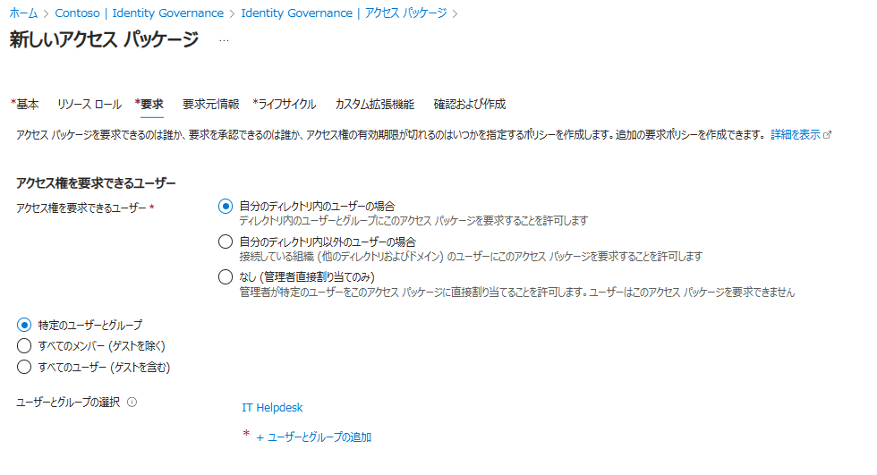

# Microsoft Entra ID Governance の新機能 - 米国政府テナントでのサポート開始とEntra ID ロールの割り当てサポート 

こんにちは！ Azure ID チームの小出です。

今回は、2024 年 10 月 29 日に米国の Microsoft Entra (Azure AD) Blog で Joseph Dadzie によって公開された [Manage Microsoft Entra ID role assignments with Microsoft Entra ID Governance](https://techcommunity.microsoft.com/blog/identity/manage-microsoft-entra-id-role-assignments-with-microsoft-entra-id-governance/4120307) と、 11 月 5 日に Kaitlin Murphy によって公開されました [Microsoft Entra ID Governance for government](https://techcommunity.microsoft.com/blog/identity/microsoft-entra-id-governance-for-government/3575578) を分かりやすく日本語におまとめしなおしたものになります。ご不明点などございましたらお気軽にサポートへお問い合わください。

---

## 米国政府向けテナントでの Microsoft Entra ID Governance サポートの開始

2024 年 11 月 1 日より、Microsoft Entra ID Governanceが、米国政府コミュニティクラウド（GCC）、GCC-High、および国防総省のクラウド環境において、連邦政府機関、州政府、地方政府、および政府請負業者向けに利用できるようになりました！Entra ID Governance は、2023 年 7 月 1 日に商用顧客向けに提供を開始した機能で、アクセス パッケージをはじめとするエンタイトルメント管理や、ライフサイクル ワークフローなどの機能が含まれています。この機能の開始後、強い要望があったため、今年初めに教育機関（EDU）とフロント ライン ワーカー (FLW) のお客様にも提供を拡大しました。そして今回新たに、Entra ID Governance 製品を米国政府機関のお客様もご利用いただけるようになりました。

Microsoft Entra ID Governance は、組織が「適切なユーザーが適切なタイミングで適切なアプリやリソースにアクセスできるように」支援する機能です。自分の会社でも使えそうだろうかと悩むお客様もいらっしゃるかと思いますが、たとえば海外では、Rijksmuseum (アムステルダム国立美術館) のような公共機関でも利用されています。

アムステルダム国立美術館は、フェルメールからゴッホまで、オランダの芸術と歴史の中でもっとも有名な作品が多く収蔵されている美術館ですが、ここでは研究や保存、美術館の清掃などに至るまで 1,000 人以上の人々を雇用しています。

アムステルダム国立美術館では、Excel シートや独自のデータベースを手作業で管理していたことで、「従業員が役割を変更したり、新しいシステムにアクセスしたりしようとしたときに、不整合や更新作業の遅延でエラーが起きやすい」もしくは「契約終了後のユーザーもシステムにアクセスできてしまっていた」といった課題がありました。しかし、現在は Entra ID Governance を使用して管理負担を軽減し、ユーザー体験が向上したことで、ユーザーのアクセス管理に費やす時間を減らすことができています。このお客様の事例の全文は英語とはなりますが [Microsoft Customer Story-The Rijksmuseum saves hours in identity management with Microsoft Entra ID Governance.](https://customers.microsoft.com/en-us/story/1820605676075142331-rijksmuseum-microsoft-teams-higher-education-en-netherlands) でご覧いただくことが可能です。 

商業、教育、フロント ライン ワーカーのお客様と同様に、Entra ID Governanceは、政府機関が要件に準拠し、Zero Trust の原則に従うことを支援します。KuppingerCole は最近、ID ガバナンスのシナリオの概要と Entra ID Governance のレビューを含むホワイト ペーパーを発行しました。

 次のステップとして、Microsoft Entra ID Governance  をご検討中のお客様には以下をお勧めします:

- https://aka.ms/AboutEntraIDGovernance で **機能について学ぶ**
- https://aka.ms/EntraIDGovGuides で管理の **流れを確認** する
- マイクロソフトの営業チームに連絡して **無料試用版** をセットアップする。
- **ライセンスを購入** する。政府機関のお客様向けの Entra ID Governance は、GCC、GCON (政府機関の請負業者)、GCC-High、および DoD クラウドでボリュームライセンスを通じてご利用いただけます。

## エンタイトルメント管理における Microsoft Entra ロール割り当ての開始

ユーザーが不要な権限を保持しないよう、特権 ID 管理 (PIM) の機能をすでに多くのお客様の環境でご利用いただいていると思います。PIM の機能を利用すると、割り当てられた最小特権ロールに必要な時だけ (ジャスト イン タイム - JIT) アクセスすることができ、必要なタイミングで、必要な時間だけ特権ロールを使用することができます。このアプローチでは、IT 管理者が持つ権限の数をできるだけ減らし、必要なユーザーが必要なタイミングのみ権限を利用できるようにすることで、組織内の攻撃対象領域を最小限に抑えています。

しかし、「必要な時だけ特権を使えるようにする」PIM の機能は便利である一方、すべての管理者がこのように一定期間のみ特権を利用したいわけではありません。組織内の一部の管理者は、特定のアプリケーションなどリソースを限定して、管理者ロールを長期間保持する必要が時にはあります。

このような場合、以前より Microsoft Entra ID Governance を使用して、エンタイトルメント管理のアクセス パッケージを通して管理することを案内してきました。たとえば以前に案内した [アクセス パッケージを利用した一括でのアクセス権の管理](https://jpazureid.github.io/blog/azure-active-directory/access-management-with-access-package/) のブログでは、アクセス パッケージ内のリソースとしてグループを追加し、そのグループに Microsoft Entra ロールを割り当てることで、間接的にロールの割り当てを管理できる点を案内しています。

今回のアップデートでは、以前のように「事前にロールを割り当てたグループをパッケージに追加する」ような操作を行わなくても、Microsoft Entra ロールを直接ユーザとグループに割り当てることができるようになりました！これにより、以下のことが可能になります: 
 
1. 特権 ID 管理 (PIM) の機能で特権ロールの適格性（資格のある割り当て）を設定し、不要なアクセスを減らすことで、セキュリティ侵害の影響を最小限に抑える。 
2. 定期的なアクセス レビューにより、適切なユーザーが適切なリソースと役割にアクセスできるようにする。 
3. セルフ サービスのアクセス要求プロセスを使用して、組織の成長に合わせてロールの割り当てを拡張する。 
4. ツールやアプリケーションの割り当てと、それらを使用するために必要な Microsoft Entra のロールを組み合わせることで、可視性を高め、管理を容易にすることで、ビジネスでの機能性を高める。
 
この機能は、次のようなシナリオで使用いただけます: 

- IT ヘルプデスク: IT サポートの業務をヘルプデスクの従業員に委任することで、管理者の疲労を軽減する。 
- アプリケーション管理: 機密性の高いアプリケーションへのアクセスを管理することで、規制へのコンプライアンスを確保する。 
- 運用: セキュリティ オペレーション センターで分析業務を行うメンバーにログの読み取り権限を付与し、監視用のツールにアクセスできるようにする。
 
アクセス パッケージ ポリシーにより Microsoft Entra ID ロールの割り当てを管理することで、リクエストから承認、ロールのプロビジョニングまで、ロールの割り当てライフサイクル全体を制御できます。  

ここからは、Microsoft Entra ID Governance を活用して、役割割り当てのライフサイクルを管理する方法について説明します。 
 
### シナリオ: 従業員が自らアクセス権を申請することで Microsoft Entra のロール割り当てを自動化
 
ある組織のサポート部門が新しく 50 人の IT ヘルプデスク スタッフを雇用して事業を拡大するとします。この場合、もし管理者だったらどのような操作が必要になるでしょうか。一般的には、ユーザーを 1 人ずつ作成し、それぞれのユーザーにロールを割り当てていくような流れを想像されるかと思いますが、各ユーザに Microsoft Entra のロールを手動で割り当てることは効率的ではなく、ID のアクセス管理 (IAM) チームが繰り返しこういった作業を手作業で行うと、コンプライアンスや監査要件を満たすことも難しくなります。

このような場合、エンタイトルメント管理のアクセス パッケージを使うと、この操作を合理的に行うことが可能となります。具体的には、テナント管理者は、必要なロールを含むアクセス パッケージを作成し、IT スタッフが My Access ポータルを介してアクセス権を申請できるようにします。IT スタッフによって申請されたパッケージ要求の承認作業は、ヘルプデスク部門のマネージャーに委任するように構成しておくようにします。IAM チームは、Microsoft Entra ID Governance ポリシーに加え、ユーザーによるセルフ サービス (ユーザーが自らサービスを申し込む) 機能を利用することで、こまごまとした作業に時間を取られることなく、組織のセキュリティ的な課題に集中することができます。 

なお、ヘルプデスク管理者のロールをアクティブな状態でパッケージに割り当てた場合、 IT スタッフにパッケージが割り当てられるとすぐにヘルプデスク管理者の特権が利用可能となってしまいます。本来、ヘルプデスク管理者のロールが必要なのは、パスワードのリセットなど一部の業務を行うときのみです。このような永続的な権限を制限するには、アクセス パッケージの作成時に、「資格のある割り当て」の設定でヘルプデスク管理者を構成し、必要なときにのみ特権 ID 管理（PIM）を通してロールをアクティブ化してもらうような運用にします。
 
以下の 3 つの手順で簡単に設定することができるので、手順を案内します。

1. アクセス パッケージを作成し、Microsoft Entra ロールである「Helpdesk Administrator」を「Eligible member」として、「Service Support Administrator」ロールを「Active member」として追加します。 

Eligible Member は、「資格のある割り当て」を示します。Active Member は「アクティブな割り当て」を示します。このため、このパッケージ構成の場合、ユーザーがパッケージを要求して割り当てが行われると、サービス サポート管理者は常に特権を利用でき、必要な時だけヘルプデスク管理者の特権も利用できるようなイメージになります。

 
2. 誰がこのパッケージを要求できるのかを「アクセス権を要求できるユーザー」を指定し、承認の設定を行います。

たとえば今回の場合、 IT ヘルプデスクの部門のユーザーが要求できるようなパッケージを作成したいので、社内 (自分のディレクトリ内) に所属しているだけではなく、 IT ヘルプデスクというグループに所属しているユーザーのみが要求できるように構成しました。

下に少しスクロールすると、承認の設定も表示されます。今回は、マネージャーに承認操作を行わせたいので、「承認者としてのマネージャー (Manager as Approver)」を選択します。必要に応じて、承認ステージを 2 や 3 に増やす、理由を要求する、何日以内に決定しないといけないかを指定する、ユーザーの代わりにマネージャーがパッケージを要求できるかを指定するなど様々な設定がありますので、ご要望やご要件に応じてカスタマイズも可能です。 

 
定期的なアクセス レビューを設定すると、アクセスが不要になった場合に役割の割り当てを削除することもできます。この設定は「ライフサイクル」タブの設定で可能ですので下記に案内します。

なお、「要求」から「ライフサイクル」のメニューまでには「要求元情報」というメニューもありますが、これはユーザーがパッケージを要求するときに質問を表示させ、回答してもらうようなことができる画面です。ユーザーから情報を収集したいといったご要望がある際に利用できます。
 
3. 「ライフ サイクル」 タブで、有効期限とアクセス レビューの必要性を設定します。レビューの頻度を選択し、誰がレビューを行うかを指定できます。 

これらのガバナンスの仕組みを適用することで、すべての IT 管理者に最小限の特権アクセスを保証し、不必要なアクセスや潜在的な悪用のリスクを低減することができます。この新機能をライフサイクル ワークフローなどの他のガバナンス機能と組み合わせることで、IT 管理者が組織を離れたり役割を変更したりしたときに、役割の割り当てが自動的に削除されるようにすることも可能です。これにより、組織はよりスムーズで安全な運用が可能になります。

ライフサイクル ワークフローの活用方法については、以前 [ライフサイクル ワークフローを利用した簡易人事システムの紹介](https://jpazureid.github.io/blog/azure-active-directory/lifecycle-workflow/) にて紹介いたしました。人事異動や新入社員対応でも活用できる機能となりますので、ぜひあわせてご覧ください。

すでに Microsoft Entra ID Governance ライセンスをお持ちのお客様はすぐにこの機能をご利用いただけます。もしライセンスをお持ちでないお客様は、無料試用版のライセンスで利用を開始いただくか、すでにお持ちの P1 / P2 ライセンスからアップグレードすることも可能です。ライセンスを購入する場合は、ライセンス パートナーからオンラインで購入するか、Microsoft 365 管理センターより直接ライセンスを購入ください。

