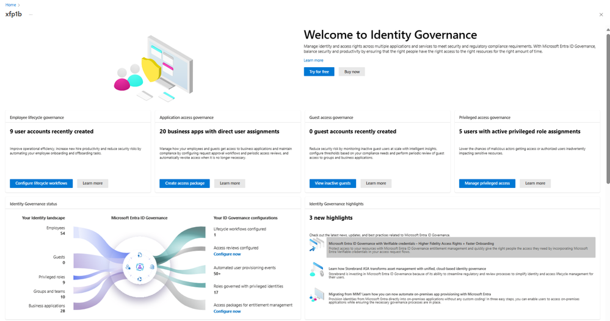

# Microsoft Entra ID Governance の新しいダッシュボードが近々公開されます

こんにちは、Azure Identity サポート チームの 高田 です。

本記事は、2023 年 7 月 19 日に米国の Azure Active Directory Identity Blog で公開された [New Microsoft Entra ID Governance Dashboard Experience Rolling Out Soon](https://techcommunity.microsoft.com/t5/microsoft-entra-azure-ad-blog/new-microsoft-entra-id-governance-dashboard-experience-rolling/ba-p/2466928) を意訳したものになります。ご不明点等ございましたらサポート チームまでお問い合わせください。

---

2023 年 6 月 7 日に発表しましたとおり、Microsoft Entra ID Governance は現在 **一般利用可能** となり、より効率的にアクセス管理行いたいとお考えの企業様に新しい機能を提供しています。もしあなたが組織の IT 計画を立案および実行するような立場の場合、適切な人々が適切なリソースを適切な時間だけアクセスできるようにするというのは、ビジネス上の目標でもあり、ご自身の重要な職務でもあろうと思います。また、ID のガバナンス – 誰がいつ何にアクセスし、その理由は何なのかを把握すること – はゼロ トラストにおいてその基礎となるものです。ID のガバナンスと管理 (IGA) を推進するビジネス上の目標が何であれ、ビジネスの利害関係者に分かりやすい形で IGA の状況を示すことが重要性となっています。お客様からもこの声を頂戴しており、弊社としてその声に是非お応えしたいと思っています。

そこで、新たな Microsoft Entra ID Governance のダッシュボードを作成しました。このダッシュボードは、情報をまとめて現在の ID ガバナンスの状態を一目で把握できるよう表示するとともに、IGA の様々な機能を起動して、コンプライアンスのレポートへ素早くアクセス出来るような機能を提供します。ID のガバナンスを実現するには長い道のりを要するため、お客様によりその進み具合は様々と思われます。

- まだ ID ガバナンスの取り組みを始めたばかりの場合は、まずダッシュボードを使用して IT 環境がどのような状況となっているかをご確認ください。テナント内のユーザーとゲストの数を特定し、業務アプリと特権ロールを把握ください。また、Entra ID Governance がどのような機能を提供しているかご覧いただき、必要なセキュリティとコンプライアンスに対応する実施計画を作成頂ければと思います。
- すでにガバナンス機能を展開し利用している場合は、ダッシュボードを使用して現在のガバナンスへの取り組みが全体のどの程度をカバーできているか把握し、実体と取り組みのギャップを確認ください。例えば、[エンタイトルメント管理](https://go.microsoft.com/fwlink/?linkid=2210375) を使用してユーザーへのアクセス権の付与を自動化しているかもしれませんが、定期的な [アクセス レビュー](https://go.microsoft.com/fwlink/?linkid=2211313) を設定していないということもあると思います。ダッシュボードのリンクを使用して、ID ガバナンスの状態をさらに改善ください。

今後、ID Governance ダッシュボードをさらに進化させて、セキュリティとコンプライアンスのニーズにより対応したユーザー体験を提供するとともに、セットアップや構成の必要性をなくして、さらに利用しやすくしていく予定です。

## Microsoft Entra ID Governance ダッシュボードの使用方法

ダッシュボードにアクセスするには、Microsoft Entra 管理センターにサインインし、"Identity Governance" の下の "Dashboard" ブレードを選択ください。

> [!NOTE]
> お使いのテナントではまだ機能が有効になっておらず、ブレードが存在しない場合がございます。

ダッシュボードは次のようなコンポーネントで構成されています。

- **一覧性に優れたカード**: これらのカードは、従業員、ゲスト、特権 ID、およびアプリケーションのアクセスのガバナンスの観点から、テナントで何が起きているかについての概要レベルの情報を提供します。カードのナビゲーション リンクをクリックすると、ID Governance のクイック スタート ガイドとチュートリアルにジャンプします。
- **ID Governance のステータス**: この画面は、従業員、ゲスト、業務アプリ、グループ、特権ロールの数という観点から ID の全体像を表示します。そして、これら従業員などの要素をよりよく管理するための各 Microsoft Entra ID Governance の機能を提示します。まだ機能を利用しておらず構成されていない場合は、ボタンを押してその機能の設定ブレードを開く事も可能です。
- **チュートリアル**: このセクションには、よく利用される ID Governance の使用例のチュートリアルが表示されます。
- **ハイライト**: このセクションでは、最新の ID Governance 機能について情報を得たり、他のお客様が ID Governance をどのように使用してセキュリティとコンプライアンスの状態を改善しているかを学んだすることが可能です。

この新しいダッシュボードについて詳しく知るためには、[Microsoft Entra ID Governance ダッシュボード](https://learn.microsoft.com/ja-jp/azure/active-directory/governance/governance-dashboard) の記事をご覧ください。

## 是非お試しください

これらの新機能をぜひ皆さんに試していただきたいと思っています！現在 Microsoft Entra ID Premium ライセンスをお持ちのお客様は、以下の 2 つのいずれかの方法で新しい機能をご利用いただけます:

1. https://aka.ms/EntraIDGovTrial から Microsoft Entra ID Governance のトライアルを開始する。
2. オンラインもしくはライセンス パートナーを通じてか、Microsoft の営業チームと連携している場合は直接 Microsoft から Microsoft Entra ID Governance にアップグレードする。

Joseph Dadzie  
Partner Director of Product Management  
LinkedIn: [@joedadzie](https://www.linkedin.com/in/joedadzie/)  
Twitter: [@joe_dadzie](https://twitter.com/joe_dadzie)
