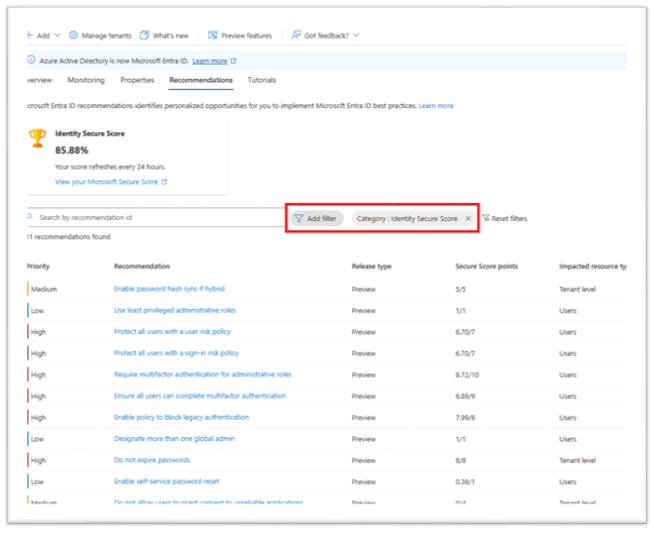
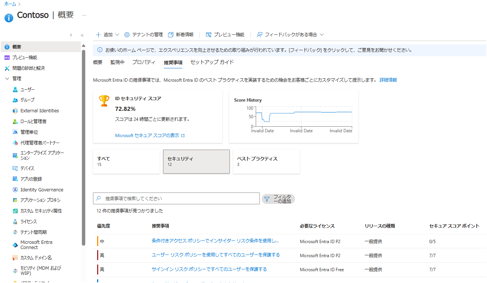
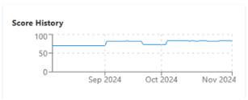
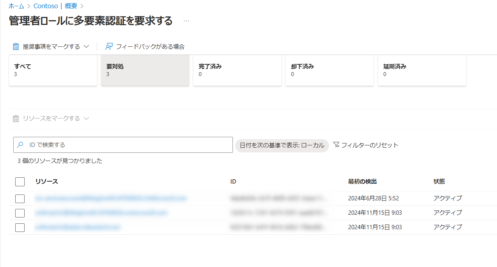

# 新しいセキュア スコアの推奨事項が一般公開されました！

こんにちは！ Azure ID チームの小出です。

本記事は、2025 年 1 月 23 日に米国の Microsoft Entra (Azure AD) Blog で公開されました [New Identity Secure Score recommendations in General Availability](https://techcommunity.microsoft.com/blog/microsoft-entra-blog/new-identity-secure-score-recommendations-in-general-availability/4369133) を分かりやすく日本語におまとめしなおした記事となります。ご不明点などございましたら、お気軽にサポート チームへお問い合わせください。

---

昨年、弊社は Transparency in Adoption (導入の透明性)に関する投資領域の中で、Microsoft Entra の推奨事項について投資を行う点を強調し、機能の公開に向けて開発を進めてきました。Microsoft Entra の「推奨事項 (レコメンデーション)」機能は、セキュリティを強化することと、それに加えて従業員の生産性を向上させるための信頼できるアドバイザーとしての役割を果たすことを目標としています。

この機能を利用すると、セキュリティに詳しいエンジニアやコンサルがいなくても、実用的な情報やベスト プラクティスを確認したり、リスクの特定や軽減のための情報を受け取ることが可能となりますので、組織のセキュリティ確保ならびに向上にお役立ていただけると存じます。新しい ID のセキュア スコアの推奨事項では、直近のスコアの変化が分かるグラフ表示や、詳細なユーザー情報を表示する機能が追加され、一般公開されました。現在は Microsoft Entra を利用されているすべてのお客様に利用いただけます。

## セキュア スコアの推奨事項の最新機能と詳細

推奨事項として表示される項目とその説明について案内します。[Microsoft Entra レコメンデーションとは](https://learn.microsoft.com/ja-jp/entra/identity/monitoring-health/overview-recommendations#recommendations-overview-table) の公開情報にも一覧や、通知の送付先となる管理者ロールなどの詳細をおまとめしておりますので、必要に応じてご覧ください。

### 管理者ロールに対して MFA を必須にする

管理者ロールは、一般ユーザーよりも高い特権を保有しています。これらのアカウントが侵害されてしまうと、様々な変更をテナントに加えることができてしまい、組織全体が危険にさらされますので、管理者ロールのアカウントには MFA を義務付けるとを推奨しています。もし攻撃者にパスワードが漏洩し、パスワードでの認証が突破されてしまった場合でも、 MFA を設定していれば事前に登録した電話番号や Authenticator などのアプリに 2 要素目の認証が行われるため、攻撃者はアカウントにアクセスするのが困難となります。

### すべてのユーザーが多要素認証を完了できるようにする

Microsoft Authenticator アプリ、パスキー、電話番号など、追加の認証方法を実装することで、1 つの要素（知っている、持っている、またはお客様自身）が侵害された場合でも、アカウントの乗っ取りを防ぐことが可能です。MFA を使用することで、ユーザーがアクセスできるデバイスとデータを保護することは極めて重要です。これらのデバイスやデータを効果的に保護するために、MFA を活用することを強くお勧めします。

### レガシー認証をブロックするポリシーを有効にする

今日、危険なサインイン試行のほとんどは、レガシー認証によるものです。Office 2010 などの古い Office クライアントは「先進認証」という最新の認証方式をサポートしておらず、IMAP、SMTP、POP3 などのレガシー プロトコルを使用しています。レガシー認証は MFA に対応していないため、お客様の環境で MFA ポリシーが構成されていても、悪意のある攻撃者はレガシー プロトコルを使うことでこれらの制御をバイパスすることができてしまいます。セキュリティ保護および向上のために MFA を登録することと併せて、レガシー認証をブロックするポリシーを有効にすることをお勧めします。 

### パスワードを有効期限切れにしない

多くのお客様のテナントで、組織のパスワード ポリシーを用い「90 日経過したらパスワードを有効期限切れにして変更してもらう」ような有効期限のポリシーを構成しているかと思います。しかしながら、定期的なパスワードのリセットが強制されると、パスワードの安全性が低下することが研究で分かっています。

たとえば、ユーザーが最初に推測されにくい十分な長さのパスワードを考え設定したとします。しかし、たとえば 90 日ごとにパスワードの有効期限が切れるようにしてしまうと、せっかく考えた強度のあるパスワードを変更することとなり、ユーザーは改めて新しいパスワードを覚えなおす必要が生じます。この場合、ユーザーはより弱いパスワードを選び、リセットのたびに少しずつ変える傾向があることが分かっています。たとえば分かりやすい文字列を利用したり、前回と少しだけ文字列を変えたパスワードを設定したりするようなことです。

ユーザーがパスワードを設定した場合、それは将来も現在と同様に強力であるべきです。このため、「特別な理由なしにパスワードを定期的に失効させない」ことを、弊社では公式な立場として推奨しています。クラウド ユーザーのみのテナントには、パスワードポリシーを有効期限なしに設定することをお勧めします。詳細は [パスワード ポリシーの推奨事項](https://learn.microsoft.com/ja-jp/microsoft-365/admin/misc/password-policy-recommendations?view=o365-worldwide&WT.mc_id=365AdminCSH_inproduct#password-expiration-requirements-for-users) をご覧ください。

### ユーザー リスク ポリシーを使用してすべてのユーザーを保護する

ユーザー リスク ポリシーをオンにすると、Microsoft Entra ID はユーザー アカウントが侵害された可能性があるかどうかを検出するようになります。ユーザー リスクに関する条件付きアクセスポリシーを構成することで、管理者は特定のユーザー リスク レベルに自動的に対応することができます。ユーザー リスクに対応する条件付きアクセスポリシーを活用し、ユーザを保護することをお勧めします。

### サインイン リスク ポリシーを使用してすべてのユーザーを保護する

サインイン リスク ポリシーをオンにすると、疑わしいサインインに対して MFA の要求が行われるようになります。サインイン リスク ポリシーを使用してサインイン リスクが生じた際に備え、ユーザーを保護することをお勧めします。

### パスワード ハッシュ同期を有効にする (ハイブリッド構成を使用している場合)

パスワード ハッシュ同期は、ハイブリッド ID を実現するために使用されるサインイン方法の 1 つです。Microsoft Entra Connect は、ユーザーのパスワード ハッシュをオンプレミスの Microsoft Entra Connect インスタンスからクラウドベースの Microsoft Entra Connect クラウド同期インスタンスに同期します。パスワード ハッシュ同期は、ユーザが管理する必要のあるパスワードの数を 1 つに減らすのに役立ちます。パスワード ハッシュ同期を有効にすると、漏えいした資格情報のレポートも可能になりますので、ハイブリッド構成を使用している場合は、パスワード ハッシュ同期を有効にすることをお勧めします。

### 信頼性の低いアプリケーションへの同意をユーザーに許可しない

悪意のあるアプリケーションがユーザーを騙して組織のデータへアクセスしてしまうリスクを低減するために、検証済みの発行者によって発行されたアプリケーションに対してのみ、ユーザーの同意を許可することをお勧めします。 

### 最小限の特権管理ロールを使用する

パスワード管理者や Exchange 管理者のような比較的特権が低いロールをユーザーに割り当てることで、グローバル管理者などの特権アカウントが侵害される可能性が低くなります。管理者がアカウントに割り当てられた最小限の特権で業務を遂行できるようにすることをお勧めします。

### 複数のグローバル管理者を指定する

複数のグローバル管理者を持つことで、アカウントがロックアウトされた場合や緊急的なアクセスが必要な際にも対応が可能です。必要であれば、チーム内の誰かが委任を受けてアクセスできる緊急アクセス用のアカウントを持つことが重要です。また、管理者同士が侵害の兆候を監視することも可能になります。緊急アクセス用に複数のグローバル管理者を指定することをお勧めします。

### セルフ サービス パスワード リセットを有効にする

Microsoft Entra ID のセルフ サービス パスワード リセットを利用すると、ユーザーは自分のパスワードをリセットするためにヘルプデスクに連絡する必要がなくなります。Microsoft Entra は禁止された文字列をパスワードで利用できないようにする機能も有しているため、この機能と組み合わせることで、推測されやすいパスワードが使用されるのを防ぐことが可能です。ユーザーのセルフ サービス パスワード リセットを有効にすることをお勧めします。

## 推奨事項の確認方法

セキュア スコアの推奨事項を確認するには、Microsoft Entra 管理センターで「Microsoft Entra ID 」 > 「概要」 > 「推奨事項」の順に移動します。推奨事項のタブで、「カテゴリ」のフィルターを利用し、「Identity Secure Score」を選択して絞り込みを行います。

または、概要ページの検索バーの上部にある「セキュリティ」のタイルを選択することも可能です。

## 新しい「推奨事項」の利点

新しいセキュア スコアの推奨事項の利点は以下のとおりです。

- セキュリティ態勢の改善: これらの推奨事項を実施することで、企業は、脅威にさらされるのを最小限に抑え、資産を保護し、お客様との信頼を維持するための貴重な知見を得ることができます。
- 実用的な知見: 各推奨事項には、セキュリティ上の懸念事項に対処するために何をすればよいのか、明確で実行可能な手順が示されています。
- 包括的にカバー:  推奨事項は幅広いセキュリティの側面をカバーしています。デジタル環境の安全性を確保するために全体的なアプローチが取れるようにします。

## 新機能の紹介

これらの推奨事項で利用できるようになった2つの新機能をご紹介します: 

**セキュア スコア トレンド チャート**: セキュア スコア トレンド チャートでは、セキュア スコアがどのように推移しているのかを確認することができます。たとえば以下の図では、おおよそ 70 点前後を推移していますが、10 月周辺に一度スコアが下がっていること、その後改善しスコアが上がっていることなどを一目で確認できます。

これらの傾向を監視することで、企業はセキュリティ対策の有効性を評価し、セキュリティ態勢をさらに強化するための意思決定を、データに基づいて行うことができます。セキュア スコアの履歴データには、[テナント セキュア スコア API](https://learn.microsoft.com/ja-jp/graph/api/recommendation-tenantsecurescores?view=graph-rest-beta&tabs=http) を使用して、コマンドからもアクセスできます。 

**ユーザーの詳細リスト**: この機能を利用すると、影響を受けるユーザーの包括的なリストを確認することができます。たとえば下記画面ショットでは、「管理者ロールに多要素認証を要求する」という推奨事項について、対処が必要なユーザーが 3 人表示されています。ユーザーの情報だけでなく、いつからこの推奨事項がアクティブになっているのか確認することなども可能です。各推奨事項ごとにこの画面が用意されておりますため、各推奨事項に対し、アクションが必要なユーザーをそれぞれ確認いただけます。

[影響を受けるリソース API](https://learn.microsoft.com/ja-jp/graph/api/impactedresource-get?view=graph-rest-beta&tabs=http) を使用して、影響を受けるリソースのリストにコマンドからアクセスすることもできます。
 

 ## 今後の更新予定

利用可能な推奨事項に関する最新情報は、[Microsoft Entra レコメンデーションとは](https://learn.microsoft.com/ja-jp/entra/identity/monitoring-health/overview-recommendations) をご覧ください。すでに様々な推奨機能が利用可能ですが、この機能の価値を高めるために、新しい推奨機能を引き続き導入してまいります。今後数ヶ月のうちに、Zero Trust フレームワークの実装を最適化するための Zero Trust の推奨事項や、製品の使用シナリオをガイドするとともに、Microsoft Entra Suite ライセンスの最も効果的な活用方法を提供する Microsoft Entra Suite の推奨事項も開始する予定です。今後のアップデートをお待ちください。
