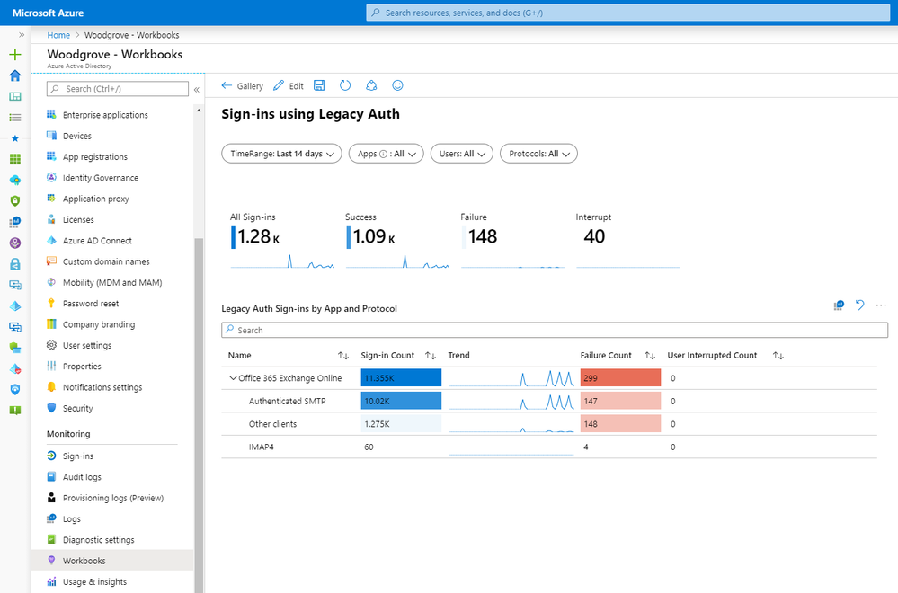
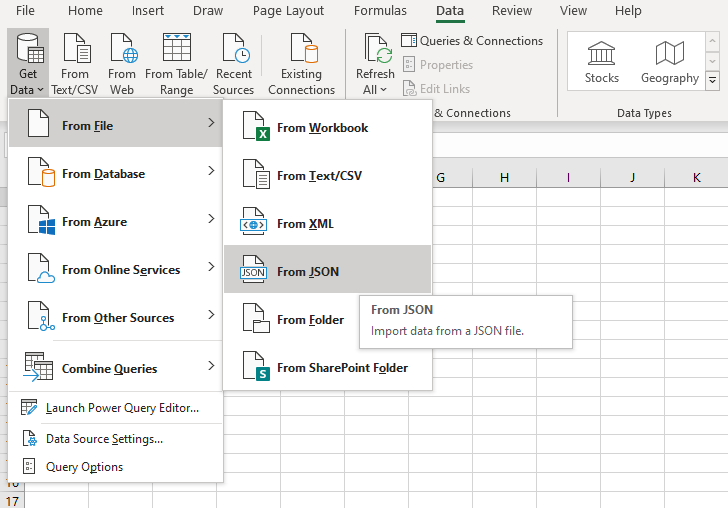
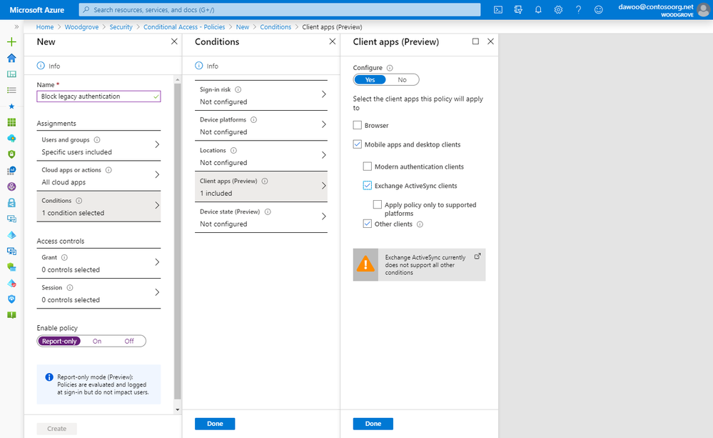

> 本記事は、 2020 年 3 月 12 日に Azure Active Directory Identity Blog に公開された記事 (New tools to block legacy authentication in your organization) を翻訳したものです。原文は [こちら](https://techcommunity.microsoft.com/t5/azure-active-directory-identity/new-tools-to-block-legacy-authentication-in-your-organization/ba-p/1225302) より参照ください。

> 新型コロナ ウィルス (COVID-19) の影響により、下記記事にあるレガシー認証の廃止は、2021 年下半期まで延期されました。詳しくは [Exchange チームのブログ記事](https://techcommunity.microsoft.com/t5/exchange-team-blog/basic-authentication-and-exchange-online-april-2020-update/ba-p/1275508) を参照ください。

# レガシー認証をブロックするための新しいツール

皆さん、こんにちは！

このブログ シリーズのをよくご覧いただく読者であれば、我々が繰り返し管理者に多要素認証 (MFA) を有効にするよう推奨してきたことをよくご存知だと思います。私が以前執筆した記事である [Your Pa$$word doesn't matter](your-password-doesnt-matter.md) では、パスワードが攻撃に対してどれだけ脆弱であるか、そして MFA を有効にすることでアカウントの乗っ取られる可能性をなぜ 99.9% 以上減らすことができるか紹介しました。

**MFA が効果を発揮するにはレガシー認証もブロックすることが重要です。** これは POP、SMTP、IMAP、MAPI　などのレガシー認証プロトコルは MFA を強制することができないため、組織を狙う攻撃者にとって都合のいい侵入口になってしまうからです。2020 年 10 月 13 日の廃止に先立ち、2019 年 9 月に Exchange Online は [レガシー認証の廃止を発表](https://support.microsoft.com/help/4521831/exchange-online-deprecating-basic-auth) しました。レガシー認証の影響や、マイクロソフトがいかにレガシー認証の廃止をアピールし実践してきたかについては、数週間前に RSA で行われた [Lee Walker と私の講演](https://www.youtube.com/watch?v=B_mhJO2qHlQ) をご覧ください。

Azure Active Directory (Azure AD) のトラフィックを分析した結果、レガシー認証に関して厳して事実が明らかになりました。

- パスワード スプレー攻撃 (使われやすいパスワードを大量のアカウントに試行する攻撃) の 99% 以上がレガシー認証プロトコルを使用したものである
- クレデンシャル・スタッフィング攻撃 (漏洩したアカウントとパスワードの組み合わせを他サイトでも再利用する攻撃) の 97% 以上がレガシー認証プロトコルを使用したものである
- レガシー認証を無効にしている組織の Azure AD アカウントでは、レガシー認証を有効にしている組織と比較して、アカウントの侵害が 67% 減少する

ユーザーのレガシー認証を無効にすることは、アイデンティティのセキュリティを考えるうえで必ずチェックするべき必須の項目です。このブログでは、Identity Protection チームの PM である Daniel Wood より、組織のセキュリティを確保するために必要な全ステップを解説してもらうとともに、Azure AD に実装した 3 つの変更点を紹介してもらいます。

いつものように、皆様のご意見をお待ちしております。Twitter ([@alex_t_weinert](http://twitter.com/alex_t_weinert) で私までお声かけください。

----

皆さん、こんにちは。

Identity Protection チームの PM のメンバーとして、組織内のレガシー認証をブロックするため、ステップ バイ ステップの支援をしたいと思います。まず最初に、我々のチームがリリースした 3 つの新機能を発表したいと思います。

1. サインイン ログが Azure ポータルですべてのテナントに 7 日間利用できるようになりました。
2. サインイン ログには、サインインに使用したユーザー エージェントが表示されるようになりました。

    

3. サインイン ログのクライアント アプリのフィルターに、従来の Exchange Online プロトコルがすべて含まれるようになりました。

    

組織内のレガシー認証を適切にブロックするには、適切なデータが必要です。私たちはお客様と協力し、お客様が必要とする知見が得られるよう、必要となるツールを構築しました。本日発表する変更により、組織でのレガシー認証の使用状況についてより多くの情報を提供することで、組織で体系的にレガシー認証の使用をやめ、組織を MFA で保護するメリットを最大限に享受できるようになります。

## ステップ 1: 組織内でのレガシー認証の使用状況を把握する

組織においてレガシー認証の使用状況を確認する際に最初に見るべき場所は、[Azure AD のサインイン ログのページ](https://docs.microsoft.com/azure/active-directory/reports-monitoring/concept-sign-ins) です。現在すべてにテナントにおいて最低 7 日間ログが確認できるようになっています。サインイン ログには、ユーザー、アプリケーション、クライアント アプリ、デバイス、現在のユーザー エージェントなど、豊富な情報が記載されています。クライアント アプリでフィルタリングすることで、先進認証とレガシー認証のサインインを識別することが可能です。ブラウザやモバイル アプリ、デスクトップ クライアントなどのクライアント アプリは先進認証を表し、IMAP、POP、MAPI などのその他のアプリはレガシー認証とみなされます。

大規模なお客様においては、レガシー認証の使用パターンを完全に把握するために、このデータをレポートに集約するか、クエリを使用してデータを分析する必要があると思います。これを行うには、Azure Monitor (Azure AD Workbooks または Log Analytics を使用) するか、Excel、Microsoft Graph API、または SIEM システムを使用するなど他にも多くの方法があります。

### Azure Monitor を使用した Azure AD ワークブックやログ アナリティクスでのレポートの集計

[Azure AD Workbooks](https://docs.microsoft.com/azure/active-directory/reports-monitoring/howto-use-azure-monitor-workbooks) と [Log Analytics](https://docs.microsoft.com/azure/azure-monitor/log-query/get-started-portal) を使用してリアルタイムにレポートを確認および集計するために、[Azure Monitor にサインイン ログを集約](https://docs.microsoft.com/azure/active-directory/reports-monitoring/howto-integrate-activity-logs-with-log-analytics) することをお勧めします。Azure Monitor を使用すると、保持期間を簡単に設定でき、保存されているデータ量に 1 日の上限を設定することもできます。

サインイン ログを Azure Monitor に統合したら、Azure AD のワークブック タブに移動し、新しい Sign-ins using Legacy Auth のワークブックを開きます。ここでは、組織で使用されているクライアント アプリに関する情報が表示されます。

[Kusto Query Language (KQL)](https://docs.microsoft.com/azure/kusto/query/) を使用すると、独自のクエリを記述して Azure Log Analytics を使用したカスタム レポートを作成可能です。Azure AD では、**ログ** をクリックするだけで、独自のクエリを記述することができます。

### サインイン ログを Excel に JSON または CSV 形式でダウンロードする

サインイン ログを JSON または CSV 形式でダウンロードするには、サインインのページ上部にある「ダウンロード」ボタンをクリックください。特定のクライアント アプリでサインイン ログをフィルタリングした場合、お客様が選択したフィルタに基づいてダウンロードが行われます。ユーザー エージェントを含むすべてのサインインの詳細を確認するために、マイクロソフトとしては JSON 形式でのダウンロードをお勧めします。CSV 形式では、サインイン ログの各行のトップレベルの情報のみが表示されます。

ダウンロードしたら、Get Data (データの取得) 関数を使って Excel で JSON ファイルをお開きください。

### Microsoft Graph API を使ってサインイン ログを取得する

25 万件以上のサインイン レコードをダウンロードする必要がある場合は、[Microsoft Graph の監査ログ API](https://docs.microsoft.com/graph/api/resources/azure-ad-auditlog-overview?view=graph-rest-1.0) をご利用いただけます。

## ステップ 2: レポート専用モードで条件付きアクセスポリシーを作成する

組織内でのレガシー認証の使用パターンを特定したら、レガシー認証をブロックしてみましょう。ほとんどの組織では、すべてのユーザーに対して直ちにレガシー認証をブロックすることは困難です。まずは、レガシー認証を使用していないユーザーのグループのみをブロックすることをお勧めします。最新の認証へのアップグレードを進めるとともにレガシー認証を無効にして行き、徐々にブロック対象のユーザーを広げていきます。

ユーザーに悪影響を与えずにレガシー認証をブロックした際の影響を見積もりたい場合、最も簡単な方法は、[条件付きアクセスのレポート専用モード](https://docs.microsoft.com/azure/active-directory/conditional-access/concept-conditional-access-report-only) を使用することです。レポート専用モードのポリシーはサインイン時に評価されますが、許可および拒否の制御は適用されないため、レガシー認証をブロックせずに誰がレガシー認証を使用しているかをリアルタイムで確認することが可能です。まず、組織内の全員に対してレガシー認証をブロックするレポート専用ポリシーを作成しましょう。条件付きアクセス ポリシーは既定ではレガシー認証クライアントには適用されないことから、ブラウザまたは先進認証クライアントではないクライアント アプリ (レガシー認証クライアント) を対象に設定してブロックする必要があることに注意ください。ポリシーを数日間利用して、組織内のレガシー認証の使用状況を十分反映したポリシー構成をご検討ください。

新しい [Conditional Access Insights](https://docs.microsoft.com/azure/active-directory/reports-monitoring/howto-use-azure-monitor-workbooks#conditional-access-insights) の機能を使用し、条件付きアクセス ポリシーのフィルタからポリシーを選択することで、ポリシーによってブロックされるユーザーの数を判断することもできます。このワークブックにアクセスするには (サインイン ログを Azure Monitor に統合した後)、ワークブックのブレードに移動し、Conditional Access Insights を選択ください。失敗などのタイルをクリックすると、ポリシーによってブロックされるユーザーでダッシュボードの内容を絞り込むことができます。レガシー認証をブロックする準備がまだと思われるユーザーがいたら、除外グループを作成しそのメンバーに追加ください。

## ステップ3：組織内のレガシー認証をブロックする

### Azure AD の条件付きアクセスを使用したレガシー認証のブロック

数日間レポート オンリー モードでポリシーを監視し、ポリシーの影響を理解できたら、レガシー認証のブロックを開始する準備が整ったと言えるでしょう。最も簡単な方法は、ポリシーの状態をレポートのみからオンに変更することです。または、まだ準備ができていないユーザーがおり、それらに対してレポート オンリー モードでレガシー認証をブロックした場合の影響を監視し続けたい場合は、レガシー認証をブロックする条件付きアクセスポリシーを別個に作成します。

### サービス サイドでのレガシー認証のブロック

条件付きアクセスに加えて、従来の認証をサービス側またはリソース側 (認証プラットフォーム側ではなく) でブロックすることも可能です。たとえば、Exchange Online では、ユーザーに対して POP3 または IMAP4 を無効にすることができます。ここで問題となるのは、レガシー認証と最新の認証が両方可能なプロトコル (EWS、MAPI など) を完全にブロックできないということです。この問題を解決するために、Exchange Online は認証ポリシーと呼ばれる機能をリリースしました。プロトコルの接続は、Azure AD または AD FS に対して資格情報をチェックする前に拒否されるため、認証前にポリシーが強制されます。

このブログ記事が、組織内のレガシー認証をブロックするために必要なすべての情報を提供できていれば幸いです。ご質問がある場合は、以下のコメント欄でこのブログ記事に返信するか、弊社チーム (intelligentaccesspm@microsoft.com) にメールを送る、もしくは Twitter で Alex (@alex_t_weinert) と私 (@daniel_e_wood) まで連絡ください。
