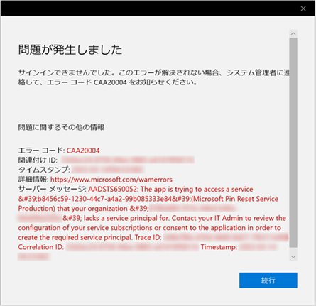

# 「破壊的 PIN リセット」と「非破壊的 PIN リセット」の違い

こんにちは、Azure & Identity サポート チームの長谷川です。

この記事では、Windows Hello for Business における「破壊的 PIN リセット」と「非破壊的 PIN リセット」の違いについて、公開情報を補足する形で説明します。基本的には、次の公開情報に記載のある通りですが、本記事でもう少しわかりやすい説明を目指します。「破壊的 PIN リセット」と「非破壊的 PIN リセット」の意味についても下記資料に説明がございますのでご覧ください。

[暗証番号 (PIN) のリセット](https://learn.microsoft.com/ja-jp/windows/security/identity-protection/hello-for-business/hello-feature-pin-reset?tabs=intune)

## PIN をリセットした後のユーザー体験に違いはあるか？

「破壊的 PIN リセット」と「非破壊的 PIN リセット」の運用中の動作としては、ハイブリッド Azure AD 参加デバイスにおいて PIN をリセットした場合、その後に Azure AD Connect (略称 AADC) による同期が必要かどうかが大きな違いです。

キー信頼の環境で「破壊的 PIN リセット」を実行した場合、PIN がリセットされた後に AADC を介して Azure AD から オンプレミスの AD ユーザーに対して msDS-KeyCredentialLink 属性への書き戻しが行われます。これが完了するまで、新しい PIN で Windows にサインインすることはできません。つまり、キー信頼の環境で「破壊的 PIN リセット」を実行した場合、新しい PIN を利用するためには AADC の同期 (既定で 30 分間隔) を待つ必要があります。

一方、「非破壊的 PIN リセット」ではオンプレミス AD ユーザーの msDS-KeyCredentialLink 属性の値が変更されません。このため、AADC の同期を待つことなく新しい PIN ですぐにサインインすることができます。このように、「破壊的 PIN リセット」と「非破壊的 PIN リセット」では、PIN リセット後の待ち時間に違いがあります。

## PIN のリセット手順に違いはあるか？

いいえ、PIN のリセット手順に違いはありません。「破壊的 PIN リセット」と「非破壊的 PIN リセット」は、どちらも同じ手順になります。これは、[Using PIN reset](https://learn.microsoft.com/en-us/windows/security/identity-protection/hello-for-business/hello-feature-pin-reset?tabs=intune#using-pin-reset) の公開情報にも記載があります。

> 英語: Destructive and non-destructive PIN reset use the same steps for initiating a PIN reset.  
> 日本語: 破壊的および非破壊的な PIN リセットでは、PIN リセットを開始するために同じ手順を使用します。

よって、[設定からの PIN のリセット](https://learn.microsoft.com/ja-jp/windows/security/identity-protection/hello-for-business/hello-feature-pin-reset?tabs=intune#reset-pin-from-settings) に従って次の手順で PIN をリセットした場合、「破壊的 PIN リセット」と「非破壊的 PIN リセット」のどちらになるかは構成 (後述) に依存します。

> 1. 別の資格情報を使用してWindows 10にサインインします。  
> 2. [設定] を開き、[アカウントの>サインイン オプション] を選択します。  
> 3. [PIN (Windows Hello)PIN を忘れた場合] > を選択し、指示に従います。
 
## 「破壊的 PIN リセット」と「非破壊的 PIN リセット」のどちらの動作になるか？

PIN 回復機能の有効/無効で、「破壊的 PIN リセット」と「非破壊的 PIN リセット」のどちらの動作になるかが変わります。
 
PIN 回復機能が有効/無効であるかの確認方法は、[PIN 回復ポリシーがデバイスに適用されていることを確認する](https://learn.microsoft.com/ja-jp/windows/security/identity-protection/hello-for-business/hello-feature-pin-reset?tabs=intune#confirm-that-pin-recovery-policy-is-enforced-on-the-devices) の公開情報にまとめられています。

> PIN リセット構成は、コマンド ラインから dsregcmd /status を実行することで表示できます。この状態は、CanReset 行項目としてユーザー状態セクションの出力の下にあります。CanReset が DestructiveOnly と報告された場合、破壊的 PIN リセットのみが有効になります。CanReset で DestructiveAndNonDestructive が報告された場合、非破壊 PIN リセットが有効になります。

## 次のようなエラー画面が表示された場合どうしたらよいか？

次の画像のような、エラーコード CAA20004 かつサーバー メッセージが AADSTS650052 で Microsoft Pin Reset Service Production のエラーが表示される場合があります。

この場合、[Azure AD テナントで Microsoft PIN リセット サービスを有効にする](https://learn.microsoft.com/ja-jp/windows/security/identity-protection/hello-for-business/hello-feature-pin-reset?tabs=intune#enable-the-microsoft-pin-reset-service-in-your-azure-ad-tenant) の公開情報に沿って "PIN リセット サービス" と "PIN リセット クライアント" という 2 つのサービスの登録作業を行うことでエラーが解消されるかご確認ください。

> PIN をリモートでリセットするには、Azure Active Directory テナントに次の 2 つのアプリケーションを登録する必要があります。  
> ・PIN リセット サービス  
> ・PIN リセット クライアント
 
上記の補足が PIN リセットの活用に役立つと嬉しく思います。上記以外で PIN のリセットに関して不明点がある場合は、是非弊社サポートまでお問い合わせください。
