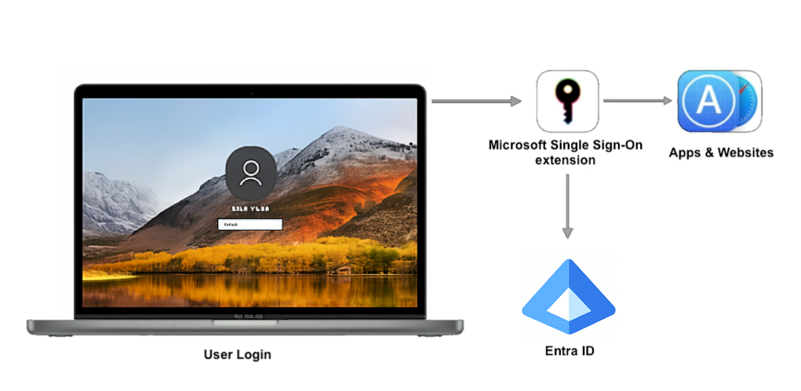

# 一般提供開始: Microsoft Entra ID による macOS 向けプラットフォーム SSO

こんにちは、Azure & Identity サポート チームの長谷川です。

本記事は、2025 年 8 月 13 日に米国の Microsoft Entra Blog で公開された [Now Generally Available: Platform SSO for macOS with Microsoft Entra ID](https://techcommunity.microsoft.com/blog/microsoft-entra-blog/now-generally-available-platform-sso-for-macos-with-microsoft-entra-id/4437424) を意訳したものになります。ご不明点はサポート チームまでお問い合わせください。

----

## macOS 向けプラットフォーム SSO は Microsoft Enterprise SSO プラグインを基盤としてより簡単で安全なサインインを実現

Microsoft は、macOS 向け [**プラットフォーム シングル サインオン**](https://learn.microsoft.com/ja-jp/entra/identity/devices/macos-psso) (プラットフォーム SSO) の **一般提供 (GA)** を発表しました。この機能は、Apple デバイスにおいて、統合された、安全で先進的なシングル サインオン体験を提供するものです。

## プラットフォーム SSO とは？

プラットフォーム SSO は、macOS に統合された高度な機能であり、[Microsoft Enterprise SSO プラグイン](https://learn.microsoft.com/ja-jp/entra/identity-platform/apple-sso-plugin) によってサポートされています。この機能により、ユーザーは **Microsoft Entra ID** の資格情報を使用して Mac で認証することができ、**アプリケーションやブラウザ間でシームレスなシングル サインオンを実現します**。これにより繰り返し表示される認証プロンプトが最小限に抑えられます。

## なぜこの機能が重要なのか

プラットフォーム SSO は、ハイブリッド ワークやゼロトラスト セキュリティの進化するニーズに対応するために設計されています。プラットフォーム SSO により、組織は次のことが可能になります。

- **UserSecureEnclaveKey** (プラットフォーム資格情報) または **スマート カード** の認証方法のいずれかを使用してプラットフォーム SSO を構成することで、**パスワードレス サインインが利用可能** になります。
- Secure Enclave に基づいた **UserSecureEnclaveKey** を使用すると、追加のハードウェア コストをかけずに **デバイスに紐づくパスキー** を活用できます。
- **ローカル アカウントとパスワードが同期されます** 。パスワード認証方式を設定すると、ユーザーは Microsoft Entra ID のパスワードを使用して macOS デバイスにサインインできます。これにより、Entra ID に接続されたアプリケーション間でシングル サインオンが可能になり、個別のローカルの資格情報を管理する必要がなくなります。プラットフォーム SSO により、Entra ID のパスワード更新とローカル アカウントのパスワードが同期されます。引き続きパスワード ベースの認証をご利用のお客様は、このオプションをご利用いただけます。
- ネイティブの macOS アプリと、Microsoft Edge、Safari、Firefox、Google Chrome などのサポートされているブラウザ間で **シームレスな SSO** を提供します。
- デバイス登録の流れが刷新され、Just-in-Time (JIT) のコンプライアンス設定がサポートされることで、**オンボーディングが簡素化** されます。

## 早期に導入した企業からは好意的な反応

2024 年 5 月のパブリック プレビュー以来、プラットフォーム SSO は、教育、医療、金融、テクノロジーといった様々な業界の多くの組織にて導入いただきました。これらのお客様は、オンボーディングの簡素化、ヘルプデスクへの問い合わせ件数の削減、ゼロ トラスト体制の強化のためにプラットフォーム SSO を活用しています。これらの皆様からのフィードバックは、一般提供に進むにあたり非常に重要なものとなりました。ユーザー体験の改善にご協力いただいたことに深く感謝いたします。

## パブリック プレビュー以降の新機能

パブリック プレビュー以降、お客様やパートナー様と緊密に連携し、プラットフォーム SSO のエクスペリエンスの向上に取り組んできました。今回の一般提供開始にあたり、いくつかの重要な改善点が導入されています。

- [**ハードウェアによる生体認証の強制適用**](https://learn.microsoft.com/ja-jp/entra/identity/devices/macos-psso#microsoft-platform-sso-usersecureenclavekeybiometricpolicy): Secure Enclave ベースのユーザー キーのサポートにより、より強力でフィッシング耐性の高い認証が可能になります。
- **テレメトリと診断機能の強化**: IT 管理者向けに可視性の向上とトラブル シューティング ツールの強化がなされました。
- きめ細やかな [**認証強度**](https://learn.microsoft.com/ja-jp/entra/identity/authentication/concept-authentication-strengths) の制御: セキュリティ体制に合わせて、より細かくポリシーを適用できるようになりました。
- [**新しい Microsoft Graph API**](https://learn.microsoft.com/ja-jp/graph/api/resources/platformcredentialauthenticationmethod?view=graph-rest-1.0): プラットフォーム認証方法の構成、参照、管理をプログラムから行うためのアクセス機能が提供されています。
- **サインイン ログの改善**。プラットフォーム資格情報を使用した認証イベントに関する詳細な分析情報が得られるようになりました。
- [**クラウド Kerberos のサポート**](https://learn.microsoft.com/ja-jp/entra/identity/devices/device-join-macos-platform-single-sign-on-kerberos-configuration): macOS デバイスから Azure ファイル共有にシームレスにアクセスできます。

## macOS のサインイン体験を刷新するには

プラットフォーム SSO を今すぐ導入して、ユーザーに安全でシームレスなサインイン アクセスを提供しましょう。

組織にプラットフォーム SSO を導入するには:

1. デバイスが **macOS 13 以降 (全機能のサポートには macOS 14 以降を推奨)** で動作し、**MDM (たとえば Intune など) に登録されていること** を確認ください。
2. 最新の [**Microsoft Intune ポータル サイト アプリ**](https://learn.microsoft.com/ja-jp/intune/intune-service/apps/apps-company-portal-macos)（v5.2504.0 以降）をインストールください。
3. 任意の MDM もしくは [Intune でプラットフォーム SSO ポリシー](https://learn.microsoft.com/ja-jp/intune/intune-service/configuration/platform-sso-macos) を構成ください。

詳細な手順については、[プラットフォーム SSO のドキュメント](https://learn.microsoft.com/ja-jp/entra/identity/devices/macos-psso) を参照ください。

## 今後の予定

今後も進化は続きます。今後のアップデートでは、JIT コンプライアンスの修復機能や、プラットフォーム資格情報の認証方法を管理するにあたり「セキュリティ情報」の画面を再設計するなど、プラットフォーム SSO に関する強力な機能が追加される予定です。macOS Tahoe 26 で新たに導入されたプラットフォーム SSO の機能についても、今後リリースされる Company Portal の中で評価や対応がなされる見込みです。どうぞご期待ください！

Justin Ploegert  
Principal Product Manager, Microsoft

Veena Soman  
Senior Software Engineer, Microsoft

