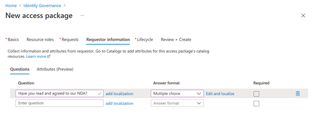
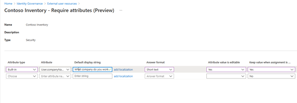
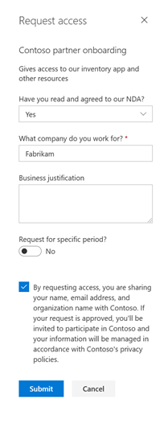

---
title: 新しいAzure AD エンタイトルメント管理機能でパートナー (外部ユーザー) との連携をより簡単に
date: 2021-09-12 9:00
tags:
  - Azure AD
  - US Identity Blog
---

# 新しいAzure AD エンタイトルメント管理機能でパートナー (外部ユーザー) との連携をより簡単に

こんにちは、Azure Identity サポート チームの 村上 です。

本記事は、2021 年 9 月 2 日に米国の Azure Active Directory Identity Blog で公開された [Onboard partners more easily with new Azure AD entitlement management features](https://techcommunity.microsoft.com/t5/azure-active-directory-identity/onboard-partners-more-easily-with-new-azure-ad-entitlement/ba-p/2466924) を意訳したものになります。ご不明点等ございましたらサポート チームまでお問い合わせください。

---

先日導入された Azure Active Directory の 2 つのエンタイトルメント管理機能（[カスタム質問](https://techcommunity.microsoft.com/t5/azure-active-directory-identity/onboard-partners-more-easily-with-new-azure-ad-entitlement/ba-p/2466924)と[属性収集](https://docs.microsoft.com/ja-jp/azure/active-directory/governance/entitlement-management-catalog-create#add-resources-to-a-catalog)）により、パートナー (外部ユーザー) を簡単かつ効率的に業務に参加させることができるようになりました。本日は新しい機能についてご紹介するとともに、パートナーの業務参加プロセスにどのように役立つかをお伝えします。これらの追加機能により、Azure AD の ID ガバナンスが強化され、一貫したプロセスと可視性を備えつつセキュリティと生産性を両立するよう促進します。

パートナーの業務参加プロセスでは、アクセス権の付与に加え、使用するアプリやリソースに合わせてアカウントを適切に設定するため、パートナーに関する情報を確認するプロセスが発生します。例えば、パートナーに特定の Teams へのアクセスを許可する際は、実際に許可を行う前に、承認者はパートナーにその Teams が適切かどうかを確認する必要があり、そのためにパートナーの組織内での役割を確認したいと考えると思います。また、パートナーが在庫管理アプリを使用する場合は、従業員と同じように location 属性の設定が必要な場合もあるかもしれません。

従来は、アカウント設定やアクセス権を付与する前に、情報を収集するためのカスタム フォームを作成していた企業もあるかと思います。フォームの構築には費用がかかる上に、運用するのも大変でした。そこで、以下のエンタイトルメント管理の新機能では、承認者やアプリに対して、パートナーの必要情報を自動的に収集することができるようになりました。

## カスタム質問の設定

[エンタイトルメント管理アクセス パッケージのカスタム質問機能](https://docs.microsoft.com/ja-jp/azure/active-directory/governance/entitlement-management-access-package-create#add-requestor-information-to-an-access-package)では、申請プロセスにおいて申請者が回答する必要のある質問を設定できます。この機能は一般公開されており、回答形式を自由記述や多肢選択式にしたり、異なる場所のパートナーに合わせて質問文をローカライズすることもできます。

(Azure Portal > Identity Governance > アクセス パッケージ > 新しいアクセス パッケージ > 要求元情報)

カスタム質問を設定すると、申請するパートナーは、申請プロセスの一部としてこれらの質問に回答します。この回答を確認したうえで、承認者はパートナーの申請を承認するかどうかを決定することができます。

## 既定の属性の指定

申請時に取得したパートナー情報を保存したい場合、既定の属性もしくはカスタム属性を指定して、申請者のユーザー オブジェクト自体に情報を保存することも可能です。この[属性収集機能](https://docs.microsoft.com/ja-jp/azure/active-directory/governance/entitlement-management-catalog-create#add-resources-to-a-catalog) は、このほどパブリック プレビューとして公開された機能で、例えば在庫管理アプリがユーザーの location 属性を使用する場合には、アプリが適切に機能するよう location 属性をユーザーオブジェクトに設定することが可能となります。この属性設定は、上記のカスタム質問設定と似ていますが、個々のアクセスパッケージではなく、カタログ内のリソース (この場合は在庫管理アプリ) に表示されます。

(Azure Portal > Identity Governance > カタログ > 該当のカタログを選択 > リソース > 属性が必要)

アクセス パッケージに、属性収集のために設定されたリソースが含まれている場合、申請したパートナー は、アクセス パッケージ自体に指定されたカスタムの質問に加えて、属性収集に設定した値を自動的に尋ねられます。提供された属性情報は承認者にも提示され、申請が承認されると、申請したパートナーのユーザー オブジェクトに書き込まれます。

申請者に関して複数の情報提供を要求とするシナリオは、パートナーやベンダーなど、リソースへのアクセスを要求する人物が外部ユーザーの場合によく見られますが、この機能はテナント内の従業員にも使用できます。 

## 是非機能をお試しください

すでにエンタイトルメント管理を利用している場合は、既存のアクセス パッケージに質問や必須属性を簡単に追加することができます。初めて利用する場合は、新しいアクセス パッケージを作成および設定することで、この機能を利用することができます。皆様のご意見をお待ちしております。コメントや Twitter でフィードバックをお寄せください。
