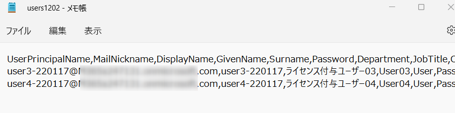
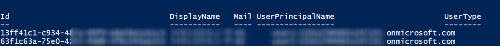
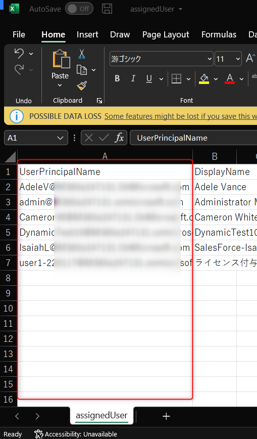
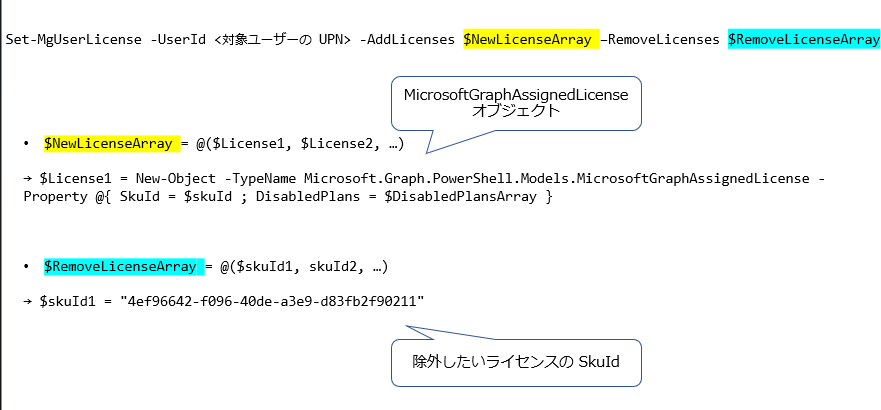

# Microsoft Graph PowerShell SDK を使用したライセンス管理操作の紹介 (一括設定編)

こんにちは、Azure Identity サポート チームの中井です。

MSOnline および Azure AD PowerShell モジュールにてライセンス割り当て操作が利用できなくなることに伴い、弊サポート チームでは以下ブログにて Microsoft Graph PowerShell を用いた代替操作方法をご紹介させていただきました。

[Microsoft Graph PowerShell SDK を使用したライセンス管理操作の紹介](https://jpazureid.github.io/blog/azure-active-directory/operating-license-with-microsoft-graph/)

上記事では主に単一のユーザーに対して、一部のサービス プランを無効にしてライセンスを割り当てるなど、様々なシナリオにおけるライセンス割り当て・削除のコマンド例を記載いたしました。

今回のブログでは、ご要望いただくことも多い、複数のユーザーに対しライセンスを一括で設定する手順について、ご紹介いたします。

**主に CSV ファイルを用いて、テナント内ユーザーに対するライセンス付与・削除操作となります。** 

なお Microsoft Graph PowerShell のインストールおよび、Connect-MgGraph によるテナント接続方法の詳細につきましては上記記事内の項目１, 2 をご覧ください。本記事では、以下の項目 2 のうち 「管理者の資格情報を使用する」方法にて、テナント接続を行うとします。

項目 1. [Microsoft Graph PowerShell のインストール](https://jpazureid.github.io/blog/azure-active-directory/operating-license-with-microsoft-graph/#idx1)
項目 2. [Connect-MgGraph による Azure AD へのサインイン](https://jpazureid.github.io/blog/azure-active-directory/operating-license-with-microsoft-graph/#idx2)

▼ 一部抜粋
事前に以下コマンドにて、テナントへの接続を行います。

```powershell
Connect-MgGraph -Scopes "Organization.Read.All","User.ReadWrite.All"
Import-Module -Name Microsoft.Graph.Users
```

## 目次

1. CSV ファイルを用いて一括で新規ユーザーを作成する (新規ユーザーへの割り当ての場合)
2. ライセンス割り当て対象の既存ユーザーを CSV ファイルにまとめる
3. ユーザーに割り当てるライセンス情報を作成する
4. CSV ファイルにまとめた既存ユーザーへライセンスを割り当てる

※ テナント上の既存ユーザーに対しライセンスを割り当てる場合は手順 2 へお進みください。

> [!IMPORTANT]  
> Microsoft Graph PowerShell にて新規ユーザー作成を行う New-MgUser コマンドでは、MSOnline PowerShell の `New-MsolUserLicense  -LicenseAssignment`のように、新規ユーザー作成と同時にライセンスを割り当てるオプションがありません。  
> したがって、新規ユーザーに対してライセンスの割り当てを行う場合は、事前にテナント上に対象のユーザーを作成しておき、Set-MgUser コマンドを用いて対象ユーザーに対しライセンスを割り当てを行います。

以下では、CSV ファイルを用いて、ライセンス割り当て対象のユーザーを一括で作成するサンプル スクリプトをご紹介します。ライセンス割り当てに限らず、PowerShell を用いてユーザーを作成したいシナリオでぜひお役立てください。

## 1. CSV ファイルを用いて一括で新規ユーザーを作成する (新規ユーザーへの割り当ての場合)

メモ帳を開き、以下のようにカンマ区切りで値を設定し、**CSV ファイル** として保存します。MailNickname 属性はユーザーのメール エイリアス値であり、必須項目となっています。

※エラーが発生するリスクを回避する為、1 つの CSV ファイルに最大で 1,000 アカウント前後とすることを推奨いたします。

▼ CSV ファイル（メモ帳）の作成例

```
UserPrincipalName,MailNickname,DisplayName,GivenName,Surname,Password,<その他属性>
user1@xxx.com,user1,User01,User,01,Pass1234,…
user2@xxx.com,user2,User02,User,02,Pass1234,…
```

▼ メモ帳での作成例



Office 365 の既定のパスワードは、一定のパスワード強度を満たしたものを設定する必要があります。一定の強度 (要件) を満たしていない場合にはパスワード設定は完了しません。パスワード要件に関する詳細は [Azure AD パスワード ポリシー](https://docs.microsoft.com/ja-jp/azure/active-directory/authentication/concept-sspr-policy#password-policies-that-only-apply-to-cloud-user-accounts) に関する公開情報もご参照ください。
 
▼ パスワードの設定要件例

- 8 文字以上の文字数である必要があります。
- 簡単に推測されたり、解読されない強力なパスワードを作成します。英字の大文字、小文字、数字、記号のうち、最低でも 3 つの種類を含める必要があります。
 
他に設定したい項目がある場合には、以下より CSV ファイルおよび 後述の コマンドレットの <その他属性> に追記ください。
 
- ユーザー名: UserPrincipalName
- 名: Surname
- 姓: GivenName
- 表示名: DisplayName
- 役職: JobTitle
- 部署: Department
- 事業所: OfficeLocation
- 事業所の電話: BusinessPhones
- 携帯電話: MobilePhone
- FAX 番号: FaxNumber
- 番地: StreetAddres
- 市区町村: City
- 都道府県: State
- 郵便番号: PostalCode
- 国/地域: Country
 
CSV ファイルの作成が完了しましたら、以下例のコマンドレットを実行し新規にユーザーを作成します。

```powershell
$path = "＜作成した CSV ファイル名を含んだ保存先のパス>"

Import-Csv -Path $path |ForEach-Object {New-MgUser -AccountEnabled -UsageLocation "JP" -UserPrincipalName $_.UserPrincipalName -DisplayName $_.DisplayName -MailNickname $_.MailNickname -PasswordProfile @{"Password"=$_.Password;ForceChangePasswordNextSignIn=$false}}
```

▼ 実行例

以下では、<その他属性> として「名」「姓」「部署」を追加しています。

```powershell
$path = "C:\temp\users.csv"

Import-Csv -Path $path |ForEach-Object {New-MgUser -AccountEnabled -UsageLocation "JP" -UserPrincipalName $_.UserPrincipalName-DisplayName $_.DisplayName -MailNickname $_.MailNickname -PasswordProfile @{"Password"=$_.Password;ForceChangePasswordNextSignIn=$false}`
-GivenName $_.GivenName -Surname $_.Surname -Department $_.Department
}
```

`ForceChangePasswordNextSignIn` は、初回サインイン時の挙動を指定するオプションです。`ForceChangePasswordNextSignIn = $true` を指定すると、ユーザーは初回サインイン時にパスワード変更が求められます。`ForceChangePasswordNextSignIn = $false` の場合、ユーザーにはパスワード変更が求められず、管理者が指定したパスワードを使い続けることができます。

▼ 実行結果例



## 2. ライセンス割り当て対象の既存ユーザーを CSV ファイルにまとめる

csv ファイルを使用してライセンスの一括割当および変更を行う場合は、下記例を参考に事前準備として既存ユーザーを CSV ファイルに一覧で出力ください。

なお形式は、以下のように 1 つの列に「UserPrincipalName」属性が含まれていれば手動で作成いただいて構いません。

※ 一行目には、ラベル "UserPrincipalName" を値として格納ください。



### 全ユーザーの UserPrincipalName の一覧を出力する

Get-MgUser コマンドを用いて、テナント内の全ユーザーを出力します。

```powershell
Get-MgUser -All | Select-Object UserPrincipalName | Export-Csv <出力先の csv ファイルパス> -Encoding UTF8 -NoTypeInformation
```

### 特定ライセンスが付与されているユーザーの UserPrincipalName の一覧を出力する

ユーザー属性の 1 つである `assingedLicenses` プロパティを用いてフィルタリングすることで、テナント内で特定ライセンスが付与されているユーザーを抽出することが可能です。事前に、下記ブログにて紹介しております `Get-MgSubscribedSku` コマンドにて、割り当てたいライセンスの [SkuId] をご確認ください。

ブログ該当箇所: [3. ライセンス情報の取得](https://jpazureid.github.io/blog/azure-active-directory/operating-license-with-microsoft-graph/#idx3)

```powershell
$skuId = "<ライセンスの skuId>"
# CSV ファイルの出力先を入力ください。
$path = "C:\temp\assignedUser.csv"

$users = Get-MgUser -Filter "assignedLicenses/any(s:s/skuId eq $skuId)" 
$users |select @{n="ObjectId"; e={$_.Id}}, @{n="UserPrincipalName"; e={$_.UserPrincipalName}}, @{n="DisplayName"; e={$_.DisplayName}} | Export-Csv -NoTypeInformation -Encoding UTF8 -Path $path
```

### 特定のライセンスに含まれるサービスが有効になっているユーザーだけを一覧で出力する

ユーザー属性の１つである `assignedPlans` プロパティを用いてフィルタリングすることで、テナント内で特定のサービス プランが付与されているユーザーを抽出することが可能です。事前に、下記ブログにて紹介しております `Get-MgSubscribedSku` コマンドにて、割り当てたいライセンスの中に含まれる各サービスの [ServicePlanId] をご確認ください。

ブログ該当箇所: [3. ライセンス情報の取得](https://jpazureid.github.io/blog/azure-active-directory/operating-license-with-microsoft-graph/#idx3)

```powershell
$servicePlanId = "<サービスプラン Id>"
# CSV ファイルの出力先を入力ください。
$path = "C:\temp\assignedUser.csv"

$users = Get-MgUser -Filter "assignedPlans/any(s:s/servicePlanId eq $servicePlanId and s/capabilityStatus eq 'Enabled')" -CountVariable CountVar -ConsistencyLevel eventual
$users |select @{n="ObjectId"; e={$_.Id}}, @{n="UserPrincipalName"; e={$_.UserPrincipalName}}, @{n="DisplayName"; e={$_.DisplayName}} | Export-Csv -NoTypeInformation -Encoding UTF8 -Path $path
```

※ 上記で紹介した`assignedLicense` と `assignedPlans` プロパティによるクエリ文については、Graph API に関する以下公開情報が参考情報とりますので、併せてお役立てください。

タイトル: [クエリ パラメーターを使用して応答をカスタマイズする](https://docs.microsoft.com/ja-jp/graph/query-parameters#filter-parameter)

## 3. ユーザーに割り当てるライセンス情報を作成する

いよいよライセンス付与に移る前に、本項目ではまずライセンス割り当ての考え方を説明します。

ライセンス割り当ておよび削除には全て、以下の `Set-MgUserLicense` コマンドを用います。作成したライセンス オプション (`$NewLicenseArray`) をユーザーに適用することで、現在のライセンスの内容から、作成したライセンス オプションの内容に変更します。

```powershell
Set-MgUserLicense -UserId <対象ユーザーの UPN> -AddLicenses @(<ライセンス オプション>) -RemoveLicenses @("<削除するライセンスの SkuId>")
```

`AddLicenses` パラメータに指定するライセンス オプションでは、**MicrosoftGraphAssignedLicense オブジェクト** を作成し、割り当てるライセンスの SkuId を配列として指定します。一方、`RemoveLicenses` パラメータには、削除するライセンスの **SkuId を文字列として** そのまま指定します。(必須オプションとなり、ライセンス付与のみを行う際には空の配列 @() を指定します。)

`AddLicenses` と `RemoveLicenses` パラメータで指定するオブジェクトの形式が異なるため、混乱を招くかもしれません。 図にまとめると以下のイメージです。



さて、`AddLicenses` パラメータに指定するライセンス オプションの形式は以下のようになります。

```powershell
$<ライセンスオプション名> = New-Object -TypeName Microsoft.Graph.PowerShell.Models.MicrosoftGraphAssignedLicense -Property @{SkuId = "<割り当てるライセンスの SkuId>"; DisabledPlans = @("<無効にするサービス プランの ServicePlanId>")}
```

例えば、利用したいサービス以外の一部のサービスを無効化したライセンス オプションは以下のようになります。

```powershell
$License1 = New-Object -TypeName Microsoft.Graph.PowerShell.Models.MicrosoftGraphAssignedLicense -Property @{SkuId = "c7df2760-2c81-4ef7-b578-5b5392b571df"; DisabledPlans = @("a23b959c-7ce8-4e57-9140-b90eb88a9e97", "7547a3fe-08ee-4ccb-b430-5077c5041653")}
```

上記実行例では Office 365 Enterprise E5 から、[Sway] と [Yammer Enterprise] の 2 つのサービスを無効にしています。

詳細なライセンス オプションのパターンは、下記のライセンス割り当てのシナリオそれぞれにおいてご紹介しておりますので、併せて参照ください。

ブログ該当箇所: [シナリオ 1: ユーザーにライセンスを割り当てる](https://jpazureid.github.io/blog/azure-active-directory/operating-license-with-microsoft-graph/#idx4)

## 4. CSV ファイルにまとめた既存ユーザーへライセンスを割り当てる

> [!NOTE]  
> まずは上述の手順 1 または 手順 2 にて、UserPrincipalName が列名として存在する CSV ファイルをご用意ください。  
> また、以後、csv ファイルのパスは変数 $path に格納しているものとします。  
> 例) $path = "C:\temp\assignedUser.csv"

### PowerShell を用いた一括割り当ての構文

さて、肝心の一括割り当て操作ですが、一括操作には以下の PowerShell コマンドレットの構文を用います。

```powershell
Import-Csv <csv ファイルのパス名> | ForEach-Object { 
    <各データに対するコマンドレット操作> }
```

`Import-Csv` コマンド にて読み込まれた CSV ファイル内の各行データの情報を、`ForEach-Object {}` へパイプ（`|`）することで順次実行します。パイプにより渡されたオブジェクトは `$_` で参照します。実際に、以下の複数の例を見ながら理解を深めていただけると幸いです。

### 初めてライセンスを割り当てる場合

対象ユーザーについて、これまでライセンスの割り当てがなく今回初めてライセンスを割り当てる場合は、事前に以下のコマンドレットで [所在地] を設定します。以下例では、所在地として日本「JP」を設定しています。

```powershell
Import-Csv $path | ForEach-Object { 
    Update-MgUser -UserId $_.UserPrincipalName -UsageLocation "JP" }
```

### ライセンスの割り当て

所在地を設定したら、項目 2 でお伝えの `Set-MgUserLicense` コマンドにてユーザーに対しライセンスを割り当てます。下記コマンド内のライセンス オプションでは、「3. ユーザーに割り当てるライセンス情報を作成する」で作成した `$License1` のような引数 (ライセンス オプション) を指定します。

```powershell
Import-Csv <csv ファイルのパス名> | ForEach-Object { Set-MgUserLicense -UserId $_.UserPrincipalName -AddLicenses @(<ライセンス オプション>) -RemoveLicenses @() }
```

▼ 実行例

```powershell
Import-Csv $path | ForEach-Object { Set-MgUserLicense -UserId $_.UserPrincipalName -AddLicenses @($License1) -RemoveLicenses @() }
```

新しいライセンス割り当てと同時に、割り当てられている既存のライセンスを削除する場合は、RemoveLicenses パラメーターに削除したいライセンスの SkuId を配列として指定します。これだけで新しいライセンス割り当てと同時に既存のライセンス削除が可能となります。

```powershell
Import-Csv $path | ForEach-Object { Set-MgUserLicense -UserId $_.UserPrincipalName -AddLicenses @(<ライセンス オプション>) -RemoveLicenses @("<削除するライセンスの SkuId>") }
```

配列には複数の要素を指定できるので、例えば複数のライセンスを割り当て、同時に複数の既存ライセンスを削除するには以下のように実行できます。

> [!WARNING]  
> 改めて、AddLicenses パラメータ $License1, $License2 には文字列ではなく、 項目 2 で作成したライセンス オプションのオブジェクトを指定しているかをご確認ください。  
> 実際にライセンス割り当てを実施いただく前に、お客様環境で少数のテスト ユーザーを用いて動作を検証くださいますようお願い申し上げます。  
> 適切でない構文によりライセンス付与には失敗した場合でも、RemoveLicenses 部分が正しい構文の場合には コマンドが実行され、指定したライセンスが削除されますのでご注意ください。

▼ 実行例

```powershell
Import-Csv $path | ForEach-Object { Set-MgUserLicense -UserId $_.UserPrincipalName  -AddLicenses @($License1, $License2) -RemoveLicenses @("b05e124f-c7cc-45a0-a6aa-8cf78c946968", "c7df2760-2c81-4ef7-b578-5b5392b571df") }
```

### 特定のライセンスを削除する場合

前回のライセンス管理操作のブログ記事 [シナリオ 2: ユーザーからライセンスを削除する](https://jpazureid.github.io/blog/azure-active-directory/operating-license-with-microsoft-graph/#idx5) で記載した内容の、一括処理版です。「PowerShell を用いた一括割り当ての構文」のとおり、`Import-Csv <csv ファイルのパス名> | ForEach-Object {}` のブラケット内に、単体ユーザーに対する処理を埋め込みします。

```powershell
Import-Csv $path | ForEach-Object {
    Set-MgUserLicense -UserId $_.UserPrincipalName -AddLicenses @() -RemoveLicenses @("<削除するライセンスの SkuId>") }
```

ライセンス割り当て方のシナリオは多く考えられ、ここでは全てを取り上げることはできませんが、前回の記事ならびに本記事が Microsoft Graph PowerShell を用いたライセンス割り当てスクリプト作成などの一助となれば幸いです。
