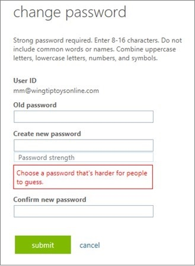

> 本記事は Technet Blog の更新停止に伴い https://blogs.technet.microsoft.com/jpazureid/2018/03/19/password-spray/ の内容を移行したものです。
> 元の記事の最新の更新情報については、本内容をご参照ください。

# Azure AD と AD FS のベスト プラクティス - パスワード スプレー攻撃の防御

こんにちは、Azure Identity サポートの宮林と高田です。

本記事は、米国時間 2018 年 3 月 5 日に公開された [Azure AD and ADFS best practices: Defending against password spray attacks](https://cloudblogs.microsoft.com/enterprisemobility/2018/03/05/azure-ad-and-adfs-best-practices-defending-against-password-spray-attacks/) の抄訳です。Azure AD と AD FS に関してパスワードスプレー攻撃を取り上げた情報がまとめられており、日本のサポート チームとして皆様にぜひ内容を共有したく日本語化しました。

----

皆さんこんにちは。
パスワードを用いたログインを採用している限り、第三者がそれを推測しようとすることは避けられません。このブログでは、最近非常に頻繁に行われるようになった **パスワード スプレー** と呼ばれる攻撃手法と、それに対する防衛のためのベスト プラクティスについて説明します。

パスワード スプレー攻撃では、攻撃者が多くの人が設定するような一般的なパスワードで、複数の異なるアカウントに対してログインを試行することで、パスワードで保護されたリソースにアクセスを試みます。 通常、これらは 1 つの組織や 1 つの認証基盤に留まることなく行われます。例えば、攻撃者は [Mailsniper](https://www.blackhillsinfosec.com/introducing-mailsniper-a-tool-for-searching-every-users-email-for-sensitive-data/) などの一般にも入手可能なツールを用いて、複数の組織の全てのユーザーを列挙し、それらのアカウントすべてに対して "P@$$w0rd" や "Password1" などのパスワードを試します。

攻撃のイメージとしては、以下のようなものが挙げられます。

|Target User    |Target Password  |
|---------------|-----------------|
|User1@org1.com |Password1        |
|User2@org1.com |Password1        |
|User1@org2.com |Password1        |
|User2@org2.com |Password1        |
|...            |...              |
|...            |...              |
|User1@org1.com |P@$$w0rd         |
|User2@org1.com |P@$$w0rd         |
|User1@org2.com |P@$$w0rd         |
|User2@org2.com |P@$$w0rd         |

この攻撃パターンは、個々のユーザーまたは企業から見ると、それぞれが別々のログイン失敗のように見えるため、ほとんどの検出手法 (例えばロックアウトなどの設定) をすり抜けてしまいます。

攻撃者にとっては数字を当てるナンバーズの宝くじのようなもので、攻撃者はよく当たりそうな最も一般的なパスワードをいくつも知っています。これらの最も一般的なパスワードを使用しているアカウントは全体の 0.5 〜 1.0% 程度ですが、1000 個ほどアカウントがあれば、数個は攻撃が成功するため十分効果的です。

攻撃者は、ログインが成功したアカウントを使用して電子メールからデータを取得し、連絡先情報を収集したり、フィッシングのリンクを送信したり、さらにパスワード スプレーの標的を広げようとします。 攻撃者は、最初の標的が誰であるかについては気にせず、最初の成功をきっかけにその後どれだけ攻撃を広げられるか試していきます。

幸いなことに、マイクロソフトではこの攻撃に対するツールを実装および公開済みです。さらに、近いうちに多くのツールがリリースされる予定です。 パスワード スプレー攻撃への対策のために現在および今後数ヶ月の間に何ができるのかについて以下をご覧ください。

## パスワードスプレー攻撃を困難にする４つの簡単なステップ

### Step 1: クラウド認証の利用

クラウド環境では、マイクロソフトが提供するシステムへのサインインが毎日何十億も行われています。 マイクロソフトのセキュリティ検出アルゴリズムにより、攻撃の検出とブロックを瞬時に行います。 これらはクラウドによるリアルタイム検出と保護システムによるもので、クラウド上で Azure AD 認証を行う場合（[パススルー認証](https://docs.microsoft.com/en-us/azure/active-directory/connect/active-directory-aadconnect-pass-through-authentication) を含む）にのみ使用できます。

#### スマート ロックアウト

クラウドでは、スマート ロックアウトを使用して、正当と思われるユーザーからのサインイン試行と攻撃者と思われるユーザーからのサインイン試行を区別します。正当なユーザーがアカウントを使用できるようにしながら、攻撃者をロックアウトすることができます。これにより、ユーザーへのサービス拒否が防止され、繰り返しのパスワードスプレー攻撃が阻止されます。 これは、Azure AD に対してのすべてのサインイン、 Microsoft アカウントを利用したすべてのサインインについてライセンスのレベルによらず対象とします。

Active Directory Federation Services (AD FS) をご利用のテナントでは、2018 年 3 月に、Windows Server 2016 の AD FS でスマート ロックアウトを利用可能となります。Windows Update による提供をお待ちください。

#### IP ロックアウト

IP ロックアウトは、数十億のサインインを分析して、マイクロソフトのシステムにアクセスを試みる各 IP アドレスからのトラフィックの性質を評価する仕組みです。分析により、IP ロックアウトは悪意を持って動作する IP アドレスを見つけ、そのサインインをリアルタイムでブロックします。

#### 攻撃のシミュレーション

[現在公開中のプレビュー機能](https://techcommunity.microsoft.com/t5/Security-Privacy-and-Compliance/Announcing-the-Public-Preview-of-Attack-Simulator-for-Office-365/ba-p/162412) ですが、Office 365 Threat Intelligence では攻撃シミュレーターの機能を利用いただけます。これにより、自らのシステムに対して攻撃のシミュ―レーションを行うことができます。その結果をもとにセキュリティ ポリシーを更新することや、パスワード スプレー攻撃のような脅威から組織を守るために適切なツールを社内に準備しておくこともできます。

今すぐに以下の点を検討ください。

1. クラウド認証を使用する (すでに利用中の場合は問題ありません)
2. AD FS などのハイブリッド シナリオを使用している場合は、2018 年 3 月のスマート ロックアウトのための AD FS アップグレードを検討する
3. [攻撃のシミュレーター](https://techcommunity.microsoft.com/t5/Security-Privacy-and-Compliance/Announcing-the-Public-Preview-of-Attack-Simulator-for-Office-365/ba-p/162412) を使用し、セキュリティの体制を評価し必要な対策を実施する

### Step 2: 多要素認証の使用

パスワードはアカウントにアクセスするための鍵となる情報であり攻撃者はパスワード スプレー攻撃を利用することで正しいパスワードを入手しようとします。これを止めるには、アカウント所有者と攻撃者を区別するためにパスワード以外のものを用意する必要があります。これを行う 3 つの方法は以下の通りです。

#### リスク ベースの多要素認証

Azure AD Identity Protection は、サインイン データを使用し、高度な機械学習と検出アルゴリズムを駆使して、システムに来るすべてのサインインのリスク スコアを算出します。 これにより、企業での Azure AD 利用者は Identity Protection にポリシーを作成して、ユーザーまたはセッションに対してリスクが検出された場合にのみ、ユーザーに追加での認証を促すことができます。これでユーザーの負担を軽減しつつも、攻撃者をブロックすることができます。[Azure AD Identity Protection の詳細はこちら](https://docs.microsoft.com/en-us/azure/active-directory/active-directory-identityprotection) をご覧ください。

#### 多要素認証の強制

さらにセキュリティを強化するため、Azure MFA を使用して、クラウド認証と AD FS の両方で、常にユーザーに対して多要素認証を要求することができます。 これにより、エンドユーザーは常にデバイスを携行し、多要素認証を頻繁に実行する必要がありますが、エンタープライズ環境で最も高いセキュリティが得られます。組織内のすべての管理者で MFA を有効にすることを推奨します。詳細については、[Azure 多要素認証の詳細](https://docs.microsoft.com/en-us/azure/multi-factor-authentication/multi-factor-authentication)、および [AD FS 用の Azure MFA の設定方法](https://docs.microsoft.com/en-us/windows-server/identity/ad-fs/operations/configure-ad-fs-and-azure-mfa) をご覧ください。

#### Azure MFA をプライマリな認証方法とする

AD FS 2016 では、[パスワードなしの認証として Azure MFA をプライマリ認証で使用](https://docs.microsoft.com/en-us/windows-server/identity/ad-fs/operations/configure-ad-fs-and-azure-mfa) できます。パスワードを使用しなければ、攻撃者は推測できなくなりますので、パスワード スプレーおよびパスワードの窃取攻撃を防ぐ優れた方法になります。また、様々なタイプのデバイスにも最適です。さらに、Azure MFA で OTP (One Time Password) を検証した後にのみ、パスワードを 2 番目の要素として使用できるようになりました。詳細は [第 2 の要素としてパスワードを使用する方法](https://github.com/Microsoft/adfsAuthAdapters) をご覧ください。

今すぐに以下の点を検討ください。

1. 組織内のすべての管理者、特にサブスクリプション所有者とテナント管理者に対して、常に多要素認証を有効にすることを強くお勧めします。まだの場合は今すぐに設定ください。
2. 一般のユーザーにとって最高のエクスペリエンスを得るため、Azure AD Premium P2 ライセンスで利用可能なリスクベースの多要素認証を検討する。
3. それ以外の場合は、クラウド認証と AD FS に Azure MFA を使用する。
4. AD FS では、Windows Server 2016 の AD FS にアップグレードし、特にすべてのエクストラネットアクセスに対して Azure MFA をプライマリ認証として使用する。

### Step 3: より安全なパスワードの使用

上記のすべての対策を行った場合でも、パスワード スプレー対策で重要なのは、すべてのユーザーが推測の難しいパスワードを使用することです。 ユーザーが作成したパスワードが推測困難かどうか、自分で判断することは容易ではありません。マイクロソフトでは、安全性の高いパスワードを作るため以下のようなツールを提供しています。

#### 禁止パスワード

Azure AD では、すべてのパスワードの変更とリセット時に禁止パスワードのチェックが行われます。 新しいパスワードが送信されると、パスワードに含めるべきではない単語のリストと曖昧さを考慮してマッチングされます (また、綴りを記号で置き換える leetspeak -> l33t-sp3@k のようなものもチェックされます)。マッチングされると拒否され、ユーザーは推測することが難しいパスワードにするよう求められます。 マイクロソフトでは最もよく攻撃されるパスワードのリストを作成し、頻繁に更新しています。

#### 禁止パスワードのカスタマイズ

禁止パスワードをより効果のあるものにするため、テナントで **禁止パスワードのリストをカスタマイズ** できるようにする予定です。管理者は、有名な社員や創業者、製品、場所、地域の名物など、組織で共有される言葉を選択し、ユーザーのパスワードへの使用を制限することができます。 このリストはマイクロソフトが用意している一覧に加えて強制されるので、どちらかを選択する必要はありません。 現在は限定プレビュー版ですが、今年中に公開予定です。

#### オンプレミス環境における禁止パスワード

今春、マイクロソフトはハイブリッドな **Azure AD - Active Directory 環境でエンタープライズ管理者が禁止パスワードの設定を行う** ためのツールをリリースします。 禁止されたパスワード リストは、クラウドからオンプレミス環境に同期され、エージェントがインストールされたすべてのドメイン コントローラーに適用されます。これにより、管理者は、ユーザーがクラウドもしくはオンプレミスのどちらでも自分のパスワードを変更する場所に関係なく、ユーザーのパスワードを推測困難にすることができます。 2018 年 2 月に限定プレビューが開始され、今年中に公開予定です。

#### パスワードに関するとらえ方を変える

良いパスワードとはどういうものかというこれまでの一般的な考え方の多くが実は間違っています。数学的に正しいことでも、実は予測しやすいユーザー行動を招くことがわかっています。例えば、ある文字種別をパスワードに要求したり、定期的なパスワードの変更を要求したりすると、特定のパスワード パターンが発生することがわかっています。詳細については、[パスワード ガイダンス ホワイト ペーパー](https://aka.ms/passwordguidance) をお読みください。PTA (Pass-Through Authentication) または AD FS で Active Directory を使用している場合は、[パスワード ポリシー](https://docs.microsoft.com/en-us/previous-versions/windows/it-pro/windows-server-2008-R2-and-2008/cc770842(v=ws.10)) を更新ください。クラウドのマネージド アカウントを使用している場合は、[パスワードを無期限に設定する](https://docs.microsoft.com/en-us/azure/active-directory/active-directory-passwords-policy) ことを検討ください。

今すぐに以下の点を検討ください。

1. 禁止パスワードツールがリリースされたら、ユーザーがより良いパスワードを作成できるように、オンプレミスの環境にインストールする。
2. パスワード ポリシーを確認し、[パスワードを無期限に設定](https://docs.microsoft.com/en-us/azure/active-directory/active-directory-passwords-policy) して、ユーザーが周期的なパターンを使用してパスワードを作成しないようにします。

### Step 4: AD FS と Active Directory についてのさらなる新機能

AD FS と Active Directory とのハイブリッド認証を使用している場合は、パスワード スプレー攻撃からご利用の環境を保護するためにとれる対策がさらにあります。

まず、AD FS 2.0 または Windows Server 2012 をご利用の組織では、できるだけ早く Windows Server 2016 の AD FS への移行を検討ください。最新バージョンは、外部ネットワークのロックアウト (Extranet lockout) など、より豊富な機能があり、より頻繁にアップデートが提供されます。なお、Windows Server 2012 R2 からであれば 2016 へのアップグレードは非常に簡単です。

#### 外部ネットワークからのレガシー認証のブロック

レガシー認証のプロトコルには多要素認証を強制する機能がないため、[外部ネットワークからレガシー認証でのアクセスをブロックする](https://docs.microsoft.com/en-us/azure/active-directory/active-directory-conditional-access-no-modern-authentication) のが最善の方法です。これにより、MFA を利用できないプロトコル上の穴をついてパスワード スプレー攻撃を仕掛けてくることを防ぐことができます。

#### AD FS Web アプリケーション プロキシでの Extranet Lockout 機能の有効化

AD FS Web アプリケーションプロキシで Extranet Lockout 機能を実行していない場合は、[可能な限り早く有効](https://technet.microsoft.com/en-us/windows-server-docs/identity/ad-fs/operations/configure-ad-fs-extranet-lockout) にして、今後発生する可能性のあるブルートフォース攻撃からユーザーを保護ください。

#### Azure AD Connect Health の展開
Azure AD Connect Health は、AD FS ログに記録された不正なユーザー名/パスワードによるログイン試行の IP アドレスを記録します。これにより様々なシナリオに関する追加情報を提供するとともに、サポートのお問い合わせを発行いただいた際にはサポート エンジニアに対して追加の知見を提供します。

展開するには、すべての AD FS サーバーに最新バージョンの [AD FS 用 Azure AD Connect Health Agent](https://go.microsoft.com/fwlink/?linkid=518973) をダウンロードします。AD FS サーバーは、[KB3134222](https://support.microsoft.com/en-us/help/3134787/ad-fs-logs-don-t-contain-client-ip-address-for-account-lockout-scenarios-in-windows-server-2012-r2) がインストールされた Windows Server 2012 R2 または Windows Server 2016 上で実行されている必要があります。

#### 非パスワード ベースの認証方法の採用

パスワードがなければ、パスワードは推測されません。次のような非パスワード ベースの認証方法が、AD FS および Web アプリケーション プロキシで使用できます。

1. 証明書ベースの認証により、ユーザー名/パスワードの認証で利用するエンドポイントをファイアウォールで完全にブロックすることができます。証明書ベースの認証についての詳細は、[AD FS での証明書ベース認証](https://docs.microsoft.com/en-us/windows-server/identity/ad-fs/operations/configure-user-certificate-authentication) で確認ください。
2. Azure の多要素認証は、上述のとおり、クラウド認証と AD FS 2012 R2 および 2016 の第二要素として使用できますが、パスワード スプレーの可能性を完全に排除するために AD FS 2016 の第一要素としても使用できます。 [AD FS を使用して Azure MFA を設定する方法についてはこちら](https://docs.microsoft.com/en-us/windows-server/identity/ad-fs/operations/configure-ad-fs-and-azure-mfa) をご覧ください。
3. Windows 10 のクライアント、Windows Server 2016 の AD FS で利用できる Windows Hello for Business は、ユーザーとデバイスの両方に紐付けられた強力な暗号化キーに基づいて、外部ネットワークも含めた完全な非パスワードベースの認証を可能にします。これは、Azure AD 参加および Hybrid Azure AD 参加している組織で管理されるデバイスに加え、設定アプリから「職場や学校のアカウントを追加」を介して登録したパーソナル デバイスでも利用できます。[Windows Hello for Business の詳細についてはこちら](https://docs.microsoft.com/en-us/azure/active-directory/active-directory-azureadjoin-passport) をご覧ください。

今すぐに以下の点を検討ください。

1. より迅速に製品の更新を得るため AD FS 2016 にアップグレードする。
2. [外部ネットワーク](https://docs.microsoft.com/en-us/azure/active-directory/active-directory-conditional-access-no-modern-authentication) からレガシー認証をブロックする。
3. すべての AD FS サーバーに Azure AD Connect Health をインストールする。
4. Azure MFA、証明書ベースの認証、Windows Hello for Business などパスワードを使用しないプライマリの認証方式の利用をする。

## おまけ: Microsoft アカウントの保護について

Microsoft アカウントをご利用の場合:

- あなたはすでに保護されています！ Microsoft アカウントでは、Smart Lockout、IP ロックアウト、リスクベースの 2 ステップ認証、禁止パスワードなどが有効です。
- ただし、2 分ほどお時間をとっていただき、Microsoft アカウントの[セキュリティ ページ](https://account.microsoft.com/security) に移動して、「セキュリティ情報を更新する」を選択し、リスクベースの 2 段階認証に使用するセキュリティ情報を確認ください。
- アカウントのセキュリティを最大限に高めるため、[こちら](https://account.live.com/proofs/Manage/additional) から常に 2 段階認証をオンにすることを検討ください。

## 最良の防衛策は... このブログの推奨事項に従うこと
パスワード スプレーは、インターネット上でパスワードを使用するすべてのサービスにとって深刻な脅威です。しかし、今回のブログの手順を実行することで、パスワードスプレーに対する最大限の対策を行えます。そして、多くの種類の攻撃が共通の特性を有しているため、今回説明した手法は他の脅威に対しても効果的です。お客様のセキュリティは常にマイクロソフトの最優先事項であり、パスワードスプレーなどあらゆるタイプの攻撃に対して、より新しく高度な防御策を開発するために絶えず尽力しています。 今回紹介した対策方法を利用し、インターネット上の攻撃者からサービスやシステムを守るため、新しい対処策を頻繁にチェックいただければと思います。

この情報がお役に立てば幸いです。いつものように、私たちは皆さんのご意見やご提案をお待ちしています。