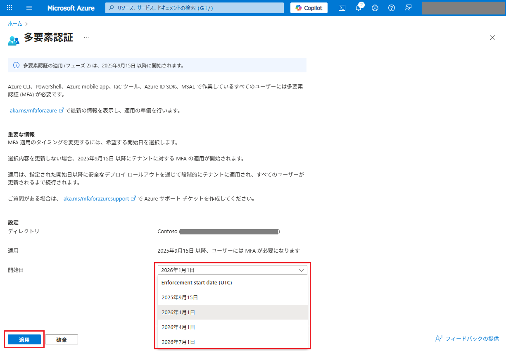
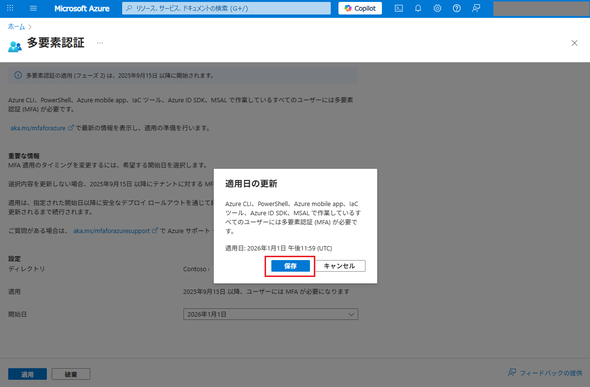
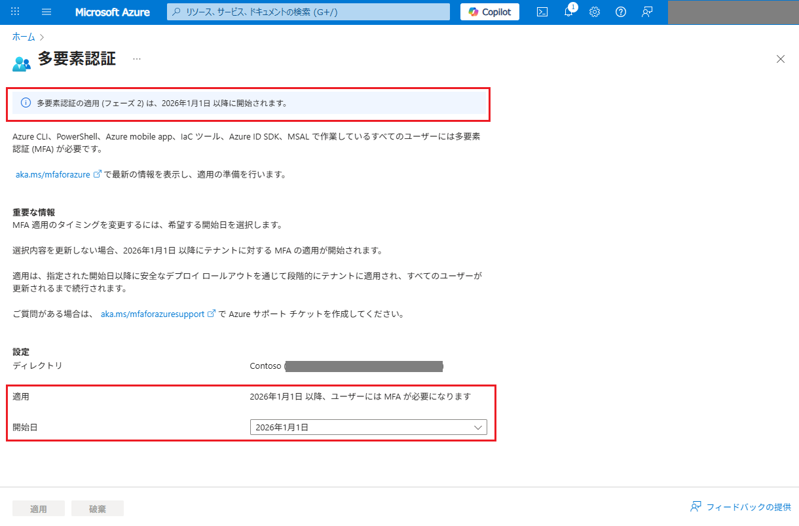

# MFA を義務付けるフェーズ 2 の開始

こんにちは、Azure Identity サポート チームの 五十嵐 です。

2025 年 10 月 1 日以降、Azure Command Line Interface (CLI)、Azure PowerShell、Infrastructure as Code (IaC) ツールなどを対象とした MFA 義務付けのフェーズ 2 が開始し、すべてのテナントに順次展開されることが予定されています。このフェーズ 2 について、既に多くのお問い合わせをいただいており、今回のブログではその概要と必要な対応、よくあるご質問について Q&A 形式でおまとめいたしました。既存のドキュメントではカバーされていない動作やご質問について今後も適宜内容を拡充していきますので、参考となりましたら幸いです。

これまで以下のブログで MFA 義務付けについて説明しております。フェーズ 1 を含めた概要につきましては以下のブログを参照ください。

 - [Microsoft は Azure ポータル (および Azure CLI 等) を利用するユーザーに MFA を義務付けます | (2024/05/24 公開)](https://jpazureid.github.io/blog/azure-active-directory/microsoft-will-require-mfa-for-all-azure-users/)
 - [Azure ポータル (および Azure CLI 等) の MFA 義務付けに関する更新情報 (2024/6/27) | (2024/07/01 公開)](https://jpazureid.github.io/blog/azure-active-directory/update-on-mfa-requirements-for-azure-sign-in/)
 - [MC862873 - Azure ポータル (および Azure CLI 等) の MFA 義務付けの延長申請について | (2024/08/21 公開)](https://jpazureid.github.io/blog/azure-active-directory/MC862873-azure-portal-mfaenforcement-update-grace-period/)

## フェーズ 2 の適用内容

2025 年 10 月 1 日より、Azure CLI、Azure PowerShell、Azure mobile app、IaC ツール、REST API エンドポイントにサインインして「作成」「更新」「削除」の操作を行うユーザー アカウントに対して、段階的に多要素認証 (MFA) の義務付けが開始されます。「読み取り」操作では MFA は義務付けされません。

フェーズ 2 の適用によって「作成」「更新」「削除」の操作を行う際に影響が生じる具体的なアプリケーションの例は以下のとおりです。Azure Resource Manager の REST API を利用 (読み取り以外) するアプリケーションのすべてで影響が生じるとご理解ください。

 - [Azure Command Line Interface (CLI)](https://learn.microsoft.com/ja-jp/cli/azure/)
 - [Azure PowerShell](https://learn.microsoft.com/ja-jp/powershell/azure/)
 - [Azure mobile app](https://learn.microsoft.com/ja-jp/azure/azure-portal/mobile-app/overview)
 - [Infrastructure as Code (IaC) ツール](https://learn.microsoft.com/ja-jp/devops/deliver/what-is-infrastructure-as-code)
 - [Azure SDK](https://learn.microsoft.com/ja-jp/azure/developer/intro/azure-developer-create-resources#azure-sdk-and-rest-apis)
 - Azure Resource Manager の REST API (読み取り以外) を実行するその他すべてのアプリケーション

今回の MFA 義務付けについては以下の公開情報で詳細を案内していますので、併せてご参照ください。

原文: [Planning for mandatory multifactor authentication for Azure and other admin portals](https://learn.microsoft.com/en-us/entra/identity/authentication/concept-mandatory-multifactor-authentication?tabs=dotnet)  
日本語: [Azure やその他の管理ポータルにおける多要素認証の義務化の計画](https://learn.microsoft.com/ja-jp/entra/identity/authentication/concept-mandatory-multifactor-authentication?tabs=dotnet)

## 必要な対応

上記の Azure CLI などを利用するユーザーにおいては、今後「作成」「更新」「削除」の操作を行う際に MFA が要求されます。この「操作を行う際に MFA が要求されます」というのは、事前に MFA を実施していない場合に操作がエラーとなるということを意味します。必要な対応としては、対象の操作を行う前のサインインの際に条件付きアクセス ポリシーなどを利用して MFA を実施するように構成しておくか、操作がエラーとなった際には明示的に MFA を実施して再度目的の操作を実行するというものになります。

また、そのほかの対応方法としては、ユーザー ID をスクリプトやその他のタスクによる自動化を実現する際に利用しないようにする、ということが考えられます。お客様によっては、スクリプトやその他のタスクによる自動化を実現するために、Microsoft Entra ID のユーザー ID をサービス アカウントとして利用されているかと存じます。このような場合にもこのフェーズ 2 の影響が及びます。フェーズ 2 の展開が完了し、MFA が義務付けされると、非対話的にサービスとして認証しているユーザー ID は、MFA の要求に対応できず、スクリプトやその他のタスクによる自動化が停止することになります。弊社ではこのような自動化を実行するためのサービス  アカウントとしてユーザー ID を利用することは、以前からおすすめしておりません。

スクリプトやその他のタスクによる自動化では、ユーザー ID ではなく、サービス プリンシパルやマネージド ID といった **ワークロード ID** の利用が推奨です。ユーザー ID から **ワークロード ID** に移行することで、今回の変更の影響を受けないようにするとともに弊社の推奨事項に沿った構成になりますので、ぜひご検討ください。フェーズ 2 の MFA の義務付けはユーザー ID にのみ適用され、ワークロード ID には適用されません。

上記の影響を受けるアプリケーションを利用しているユーザーや、スクリプトやその他のタスクによる自動化を実行するために Microsoft Entra ID のユーザー ID をサービス アカウントとして利用せざるを得ないお客様においては、それらのユーザー ID が利用できる MFA の方法をご準備ください。例えば、認証用の電話番号や Microsoft Authenticator アプリなどです。フェーズ 2 による MFA の義務付けが実施されると、MFA の方法が未登録のユーザーには MFA 方法の登録が要求されます。登録画面に沿ってご要望の MFA の方法を登録ください。

加えて以下の内容を参考に対応を実施ください。

## よくあるご質問

### Q. フェーズ 2 ではどのようなタイミングで MFA が求められますか？

A. フェーズ 2 では、ユーザー アカウントを使用した Azure のコントロール プレーンに対する「作成」「更新」「削除」の操作に関して、MFA を実施済みの状態で実行することが要求されます。フェーズ 2 ではコントロール プレーンに対する読み取り以外の操作で MFA が義務付けされることにより、特に Azure CLI、Azure PowerShell、Azure mobile app やその他 IaC ツール、Azure SDK など、Azure Resource Manager の REST API を実行するアプリケーションを利用する場合に MFA が必要となります。フェーズ 2 における制御では、「読み取り」の操作は MFA の義務付けの対象には含まれません。

また、ユーザー アカウントを使用して Azure CLI などにサインインを実行した時点で即時に MFA が求められるというものではありません。そのため、Azure CLI にサインインしてリソースの一覧を取得するのみであれば、MFA は求められません。Azure Resource Manager を実行する Azure CLI や Azure PowerShell などのアプリから、Azure リソースに対して「作成」「更新」「削除」の操作を行うタイミングで MFA 実施済みかどうか評価され、MFA を実行していない場合は要求がエラーで失敗します。

### Q. フェーズ 2 の制御によって操作がエラーとならないようにするためにはどうすればいいですか？

A. フェーズ 2 の適用後もサインインのタイミングでは MFA は求められません。エラーなく操作を完了したい場合、サインイン時に MFA を行うように設定するのが効果的です。テナントの管理者では以下の公開情報を参考に条件付きアクセス ポリシーを設定することで、Azure リソースを管理する際のサインインに MFA を要求することができます。

[条件付きアクセスを使用して Azure 管理の MFA を必須にする - Microsoft Entra ID | Microsoft Learn](https://learn.microsoft.com/ja-jp/entra/identity/conditional-access/policy-old-require-mfa-azure-mgmt)

Microsoft Entra ID P1 以上のライセンスのないテナントでは、セキュリティの既定値群を利用して、Azure リソースを管理する際のサインインに MFA を要求することができます。

[Microsoft Entra ID のセキュリティの既定値を構成する - Microsoft Entra | Microsoft Learn](https://learn.microsoft.com/ja-jp/entra/fundamentals/security-defaults)

また、Azure リソースを管理する際のサインインに MFA を要求するよう管理者が設定していない場合でも、Azure リソースを管理しようとしているユーザーが、サインイン時に明示的に MFA を実行するという方法も今回の変更を受けて用意されました。Azure CLI および Azure PowerShell の最新のバージョンでは、サインイン時に MFA を行うことをオプションとして指定することができるようになっています。管理者が MFA を義務付けしていない場合に、それぞれのモジュールで以下の形式でコマンドを実行することでサインインの操作時に MFA が求められます。

実行例 :

Azure CLI の場合

```
az login --tenant "tenantid-****-****-****-*******" --scope "https://management.core.windows.net//.default" --claims-challenge "eyJhY2Nlc3NfdG9rZW4iOnsiYWNycyI6eyJlc3NlbnRpYWwiOnRydWUsInZhbHVlcyI6WyJwMSJdfX19"
```

Azure PowerShell の場合

```
Connect-AzAccount -Tenant "tenantid-****-****-****-*******" -ClaimsChallenge “eyJhY2Nlc3NfdG9rZW4iOnsiYWNycyI6eyJlc3NlbnRpYWwiOnRydWUsInZhbHVlcyI6WyJwMSJdfX19"
```

ClaimsChallenge オプションの引数は以下で固定です。

```
“eyJhY2Nlc3NfdG9rZW4iOnsiYWNycyI6eyJlc3NlbnRpYWwiOnRydWUsInZhbHVlcyI6WyJwMSJdfX19"
```

利用可能なバージョンは Azure CLI 2.76 および Azure PowerShell 14.3 以降となります。上記の ClaimsChallenge オプションの文字列などは、Azure CLI や Azure PowerShell モジュールが必要に応じて画面にも表示しますので、ユーザーはエラー メッセージに従って操作することも可能です。

### Q. フェーズ 2 の制御によって操作がエラーとなった場合はどのようなエラーが表示されますか？

A. フェーズ 2 では、Azure Resource Manager を実行する Azure CLI や Azure PowerShell などのアプリから「作成」「更新」「削除」の操作を行うタイミングで MFA を実施済みの状態が求められます。MFA を実行していなかった場合は要求がエラーで失敗します。エラーが生じた際には以下のようなメッセージが表示されます。Azure CLI や Azure PowerShell モジュールを最新のバージョンに更新いただくと、以下のようによりわかりやすいメッセージが表示されますので、可能な限り最新のモジュールを利用いただくことをお勧めします。

Azure PowerShell 14.3 および Az.Accounts 5.2 の例:

```
PS C:\test > New-AzStorageAccount -ResourceGroupName MyResourceGroup -Name mystorageaccount -Location westus -SkuName Standard_GRS -MinimumTlsVersion TLS1_2
New-AzStorageAccount: Resource 'mystorageaccount' was disallowed by policy. Reasons: 'Sample Text: To resolve this error, set up MFA at aka.ms/setupMFA. If you set up MFA and are still receiving this error, reach out to your Entra administrator to restore your Azure security default.'. See error details for policy resource IDs.

Run the cmdlet below to authenticate interactively; additional parameters may be added as needed.

Connect-AzAccount -Tenant (Get-AzContext).Tenant.Id -ClaimsChallenge "eyJhY2Nlc3NfdG9rZW4iOnsiYWNycyI6eyJlc3NlbnRpYWwiOnRydWUsInZhbHVlcyI6WyJwMSJdfX19"
```
Azure CLI 2.76 の例:

```
PS C:\test> az storage account create -n mystorageaccount -g MyResourceGroup -l westus --sku Standard_LRS
Run the command below to authenticate interactively; additional arguments may be added as needed:
az logout
az login --tenant "f9800b67-61ea-4627-80e5-e7fc741e2497" --scope "https://management.core.windows.net//.default" --claims-challenge "eyJhY2Nlc3NfdG9rZW4iOnsiYWNycyI6eyJlc3NlbnRpYWwiOnRydWUsInZhbHVlcyI6WyJwMSJdfX19"
(RequestDisallowedByPolicy) Resource 'mystorageaccount' was disallowed by policy. Reasons: 'Sample Text: To resolve this error, set up MFA at aka.ms/setupMFA. If you set up MFA and are still receiving this error, reach out to your Entra administrator to restore your Azure security default.'. See error details for policy resource IDs.
Code: RequestDisallowedByPolicy
Message: Resource 'mystorageaccount' was disallowed by policy. Reasons: 'Sample Text: To resolve this error, set up MFA at aka.ms/setupMFA. If you set up MFA and are still receiving this error, reach out to your Entra administrator to restore your Azure security default.'. See error details for policy resource IDs.
Target: mystorageaccount
```

いずれの場合も、コマンドを実行して再認証するよう依頼するメッセージが表示されます。このようなメッセージが表示されたら、指示に従ってコマンドを実行し、MFA を完了ください。その後、要望する動作を実施することで操作が正常に完了します。

### Q. ワークロード ID とは何ですか？ユーザー ID とはどのように違うのですか？

A. ユーザー ID は、Azure Portal (https://portal.azure.com) > [Microsoft Entra ID] > [ユーザー] のブレードで表示される ID を指します。[ユーザー] ブレードに表示される ID は、人間の従業員に割り当てられる ID で、人間がブラウザーやアプリから利用することを意図して作られたものです。

一方で、ワークロード ID は、スクリプト、アプリケーション、サービス、コンテナーなど、システムに割り当てられる ID を指しています。ワークロード ID は、Azure Portal (https://portal.azure.com) > [Microsoft Entra ID] > [エンタープライズ アプリケーション] のブレードで表示されます。より具体的には "アプリケーション (サービス プリンシパル)" や "マネージド ID" というオブジェクトとして Entra ID に登録されます。

以下の弊社技術ブログにて、サービス プリンシパルおよびマネージド ID の概要やご利用方法などの詳細についてご紹介しておりますので、こちらの内容も併せてご参照ください。
 
[ワークロード ID を利用した Azure PowerShell モジュールにおける認証のご紹介](https://jpazureid.github.io/blog/azure-active-directory/credentials-for-psscripts/)

### Q. ユーザー ID からワークロード ID に変更する手順を教えてください。

A. ご参考までに Azure CLI、Azure PowerShell でサービス プリンシパルを利用して認証する方法をそれぞれ紹介します。

**Azure CLI**

Azure CLI をご利用いただいている場合に、具体的に必要な手順としては以下のチュートリアルが参考になります。サービス  プリンシパルを作成し、ユーザー アカウントと同じように Azure リソースへのアクセス許可を付与します。
 
Azure CLI で Azure サービス プリンシパルを作成する  
https://learn.microsoft.com/ja-jp/cli/azure/azure-cli-sp-tutorial-1?tabs=bash
 
順番にチュートリアルを進め、以下のチュートリアル 6 の部分で実際にサービスプ リンシパルを用いてサインインします。作成したサービス プリンシパルで az login を実施したのち、サービス プリンシパルに付与されたロールに基づいて Azure リソースを操作することが可能です。
 
サービス プリンシパルを使用してリソースを作成する  
https://learn.microsoft.com/ja-jp/cli/azure/azure-cli-sp-tutorial-6

サービスプリンシパルとしてサインインを行うためには、以下の形式でコマンドを実行します。

```
az login --service-principal \
         --username myServicePrincipalID \
         --password myServicePrincipalPassword \
         --tenant myOrganizationTenantID
```

**Azure PowerShell**

Azure PowerShell の場合に同様です。サービス プリンシパルを作成し、ユーザー ID と同じように Azure リソースへのアクセス許可を付与します。サービス プリンシパルの資格情報でサインインを実施し、そのサービス プリンシパルのロールの範囲内で Azure リソースを操作します。
 
Sign in using a service principal  
https://learn.microsoft.com/ja-jp/powershell/azure/create-azure-service-principal-azureps?view=azps-14.3.0#sign-in-using-a-service-principal

サービスプリンシパルとしてサインインを行うためには、以下の形式でコマンドを実行します。

```
# Use the application ID as the username, and the secret as password
$credentials = Get-Credential
Connect-AzAccount -ServicePrincipal -Credential $credentials -Tenant <tenant ID>
```

証明書ベースの認証では、証明書の拇印に基づいて以下の形式でサインインを行います。

```
Connect-AzAccount -ServicePrincipal -Tenant <TenantId> -CertificateThumbprint <Thumbprint> -ApplicationId <ApplicationId>
```

### Q. フェーズ 2 の適用開始日を延長することはできますか？どのような手順になりますか？

A. はい、フェーズ 2 の適用開始日の延長を申請いただけます。延長申請をおこなうためには、アカウントに **グローバル管理者** のロールと **Azure サブスクリプションに対する昇格されたアクセス権** の両方が必要です。グローバル管理者であっても、Azure サブスクリプションに対する権限の昇格を行わない場合は、延長を申請できません。


> [!NOTE]
> Azure サブスクリプションに対する権限の昇格は、グローバル管理者で Azure Portal (https://portal.azure.com) > [Microsoft Entra ID] > [管理] > [プロパティ] > [Azure リソースのアクセス管理] の項目で、"<アクセスしているユーザーの表示名> は、このテナント内のすべての Azure サブスクリプションおよび管理グループへのアクセスを管理できます。" のトグルを "はい" に選択して [保存] することで設定いただけます。


上記の権限を持つアカウントにて以下の URL にアクセスすることで、フェーズ 2 の延長申請画面を確認いただけます。

https://aka.ms/postponePhase2MFA

延長する際は、[ディレクトリ]、[適用]、[開始日] を確認ください。[開始日] の日付は 2025 年 9 月 15 日、2026 年 1 月 1 日、2026 年 4 月 1 日、2026 年 7 月 1 日のいずれかを選択することができます。



表示される画面の表記を確認のうえ、画面下部の [適用] を選択すると、[適用日の更新] というポップアップが表示されますので [保存] を選択します。



ページ上部のステータス、[適用]、[開始日] の表示が更新されていれば申請は完了です。



### Q. フェーズ 2 が適用された場合を想定してテストする方法はありますか？

A. 以下の公開情報の手順に従って、フェーズ 2 の適用がされた際の動作をテストすることが可能です。具体的な手順は以下の公開情報をご参照ください。

[チュートリアル: Azure Policy を使用して MFA を自己適用する - Azure Policy | Microsoft Learn](https://learn.microsoft.com/ja-jp/azure/governance/policy/tutorials/mfa-enforcement)

Azure Policy を作成後に追加の設定をしない場合、監査モードとして動作するため、実際の動作では要求はブロックされません。アクティビティ ログに監査イベントが記録されるのみです。要求がブロックされることを確認するためには、上記公開情報の手順 「ポリシー割り当てを強制に更新する」の設定を実施ください。

「ポリシー割り当てを強制に更新する」の設定において、公開情報に沿って 'Override Value' に指定する値はそれぞれ以下の通りです。

[Preview]: Users must authenticate with multi-factor authentication to delete resources の場合 : `DenyAction`  
[Preview]: Users must authenticate with multi-factor authentication to create or update resources の場合 : `Deny`
