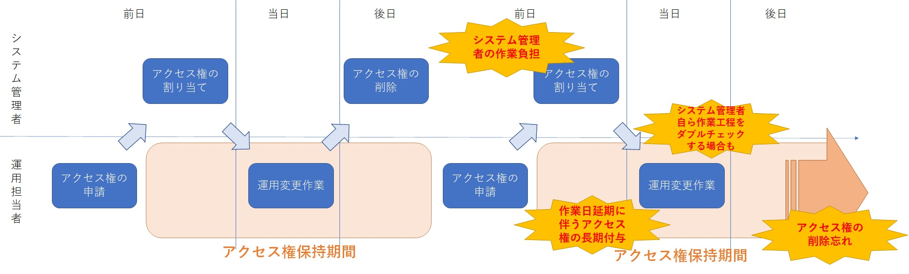
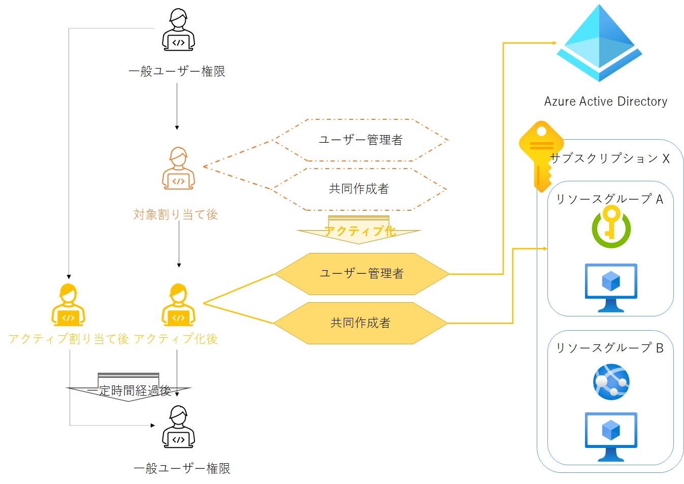
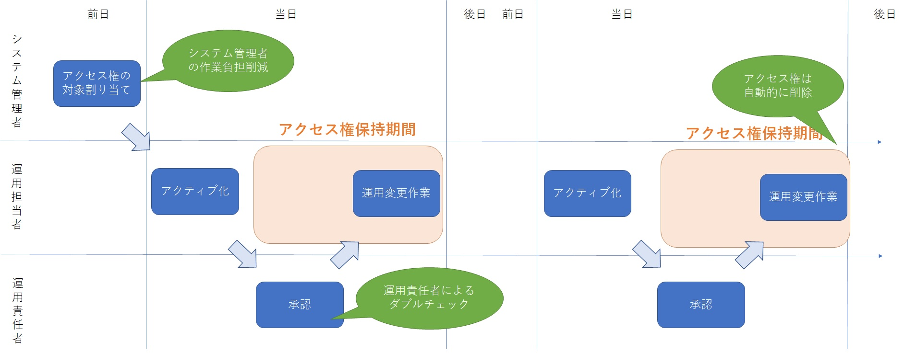
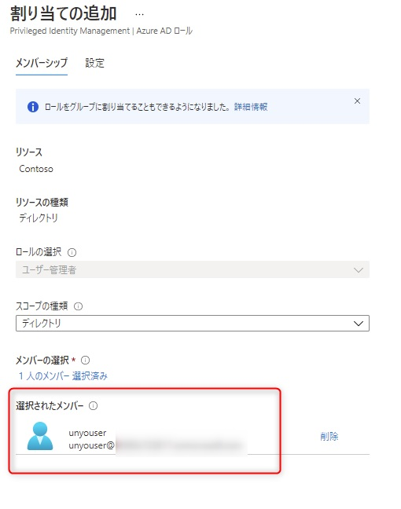
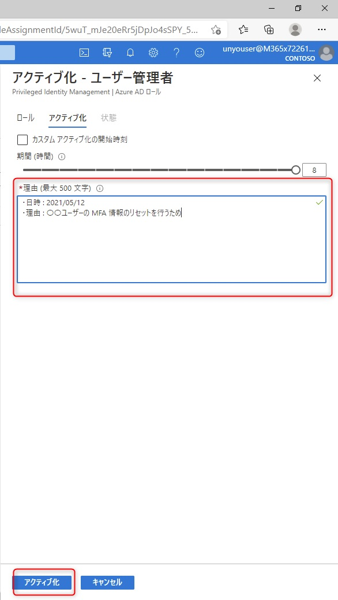
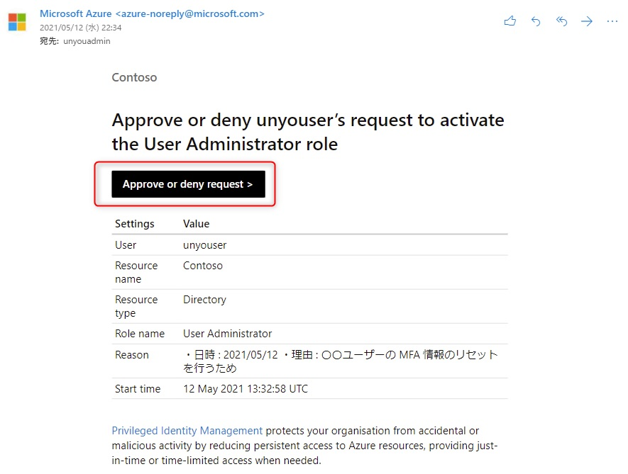

# はじめに

こんにちは、Azure & Identity サポート チームの福島です。

システムの管理者は、定常運用時における運用管理アカウントのアクセス権管理に悩まれていないでしょうか。

今回のブログでは、"最低限必要な権限" を ”最低限必要な人間” に ”最低限の期間” 付与することが出来る Previleged Identity Management (PIM) という機能についてご紹介します。

<!-- more -->

例えば、自社のシステムが Azure 上でリリースされた後も下記のようなトラブルが発生した時には運用管理アカウントで Azure ポータルにサインインしてシステム変更作業を行う必要があると思います。

```powershell
 1. 一般ユーザーが MFA 用に利用していたスマートフォンを紛失したため、該当アカウントの MFA 情報をリセットする必要がある

 2. Azure AD に登録したアプリケーションのシークレットの有効期限が切れるため、新しいシークレットを発行する必要がある
 
 3. 新しく発行したアプリケーションのシークレットをサブスクリプション X のリソースグループ A にある Key Vault に登録する必要がある
 
 4. 業務アプリケーションが稼働するサブスクリプション X のリソースグループ A にある Azure VM がハングアップしたので、Azure ポータルから強制的に再起動する必要がある
```
 
 それぞれの作業を行うには Azure 上で下記のようなアクセス権を運用管理アカウントに付与する必要があります。

```powershell
1. -> Azure AD ロールのユーザー管理者

2. -> Azure AD ロールのクラウドアプリケーション管理者

3.4. -> リソースグループ A の共同作成者
```

Azure 上ではアクセス権はロール (役割) として集約されており、ロールには大きく [Azure AD ロール](https://docs.microsoft.com/ja-jp/azure/active-directory/roles/permissions-reference) と [Azure リソースロール](https://docs.microsoft.com/ja-jp/azure/role-based-access-control/rbac-and-directory-admin-roles#azure-roles) があります。
前者は Azure Active Directory 上のアクセス権を示すのに対して、後者は Azure サブスクリプションに作成したリソース (VM や App Service など) に対するアクセス権を指します。
これらのロールは Azure テナント上で最上位の権限を持つグローバル管理者 (システム管理者) が、Azure ポータル上で運用管理アカウントに対してアクセス権として付与してあげれば何ら問題はありません。
しかし、セキュリティに厳格な会社では実際にアクセス権を付与するまでに様々なステップがあるものと思います。


```powershell
1. 運用担当者はシステム変更日時、システム変更内容、システム変更に必要なアクセス権 (ロール) をメールなどに記載してシステム管理者に申請します。

2. システム管理者はメールに記載されたシステム変更作業の日時や変更作業内容を精査して問題なければ指定されたアクセス権 (ロール) を運用管理アカウントに付与します。

3. 作業日当日、運用担当者はアクセス権 (ロール) を付与された運用管理アカウントを利用して Azure にサインインし、システム変更作業を行います。作業完了後はシステム管理者に報告を行います。

4. システム管理者はシステム変更作業の完了報告を確認し、問題がなければ運用アカウントに付与したアクセス権 (ロール) を削除します。
```

しかし、これらの作業ステップには図中に記載の通り様々な問題があります。

- 実際のシステム変更作業を行っていないシステム管理者にもかなりの作業負担がある。

- 前日にアクセス権の付与を行った後に、作業日当日まで時間が空いている場合は必要以上に長い期間運用管理アカウントに強力なアクセス権 (ロール) が付与された状態になる。

- 万が一、システム管理者が運用管理アカウントに付与したアクセス権 (ロール) を削除し忘れた場合、運用管理アカウントは永続的に強力なアクセス権を保持することになる。

上記の問題のうち、特に後半 2 つについては「セキュリティ」的な懸案事項になるかと思います。
万が一、運用管理アカウントに強力なアクセス権が付与されていた状態で運用管理アカウントの資格情報が漏洩し、悪意ある攻撃者によって企業の Azure テナントに不正に侵入されてしまった場合、攻撃者は運用管理アカウントに付与されたアクセス権 (ロール) を悪用して可能な限りの不正行為、資産の奪取を行うことが想定されます。

このようなリスク (攻撃者によるアカウントの乗っ取りが発生した時に、保持するアクセス権に応じてセキュリティ被害が拡大してしまうリスク) を最小限にするべく、アクセス権の管理は冒頭に記載の通り「最小権限の原則」に則り、"最低限必要な権限" を ”最低限必要な人間” に ”最低限の期間” 付与することが望ましいといえます。

# PIM を使った Just in Time のアクセス権

Azure では、上述した「最小権限の原則」に則り「セキュリティ」リスクを最小化する機能として Previleged Identity Management (PIM) が提供されています。

PIM を利用した場合、システム管理者は運用管理アカウントに対して`「対象割り当て」`と`「アクティブ割り当て」`という 2 つのロールアサインを行うことが可能です。

`「アクティブ割り当て」`は、PIM を利用しない場合と同様に特定のロールを割り当て時点で有効状態として割り当てることを指します。
一方で`「対象割り当て」`を行った場合、運用管理アカウントはそのままでは割り当てられたロールの権限を保有することは出来ません。
実際に割り当てられたロールのアクセス権を保有したい場合は、ロールの`アクティブ化`処理を行う必要があります。
また、`アクティブ化`処理を行う際には特定アカウントの`承認`を必須とすることも可能です。
加えて一度アクティブ化されたロールは既定の場合 8 時間のみ有効で、8 時間が経過した後は自動的にアクティブ化が解除されます。



これらの PIM の動作をシステム変更管理プロセスに組み込むと下記のように運用することが可能です。



```powershell
1. システム管理者はシステムの運用開始日に運用管理アカウントに特定ロールを「対象割り当て」でアサインします。

2. 運用担当者は運用変更作業が発生した日に「対象割り当て」を受けたロールのアクティブ化処理を行います。

3. 運用責任者 (運用担当者の上長など) は、運用担当者が行ったアクティブ化処理の承認処理を行います。

4. 承認を受けた運用担当者は実際のシステム変更作業を行います。

5. アクティブ化の有効期限 (既定で 8 時間) を迎えれば、自動的にアクティブ化されたロールが無効化されます。

6. 「対象割り当て」の期間は既定で 1 年間となっていますので、1 年間の間は必要に応じて何度もアクティブ化処理を行うことが可能です。
```

一見すると冒頭に記載したステップとあまり変わらないように見えますが、運用期間が長くなるほどそのメリットが見えてきます。

- システム管理者は運用開始日の「対象割り当て」作業のみを行い、以降のシステム変更を運用部門に完全に移管することが出来ます。

- 「対象割り当て」期間中、運用管理アカウントは実際のアクセス権を行使することは出来ません。万が一攻撃者にアカウントが乗っ取られた場合も攻撃者はロールのアクセス権を悪用することが出来ません。

- 実際にロールのアクセス権をアクティブ化して利用するためには、運用担当者以外のユーザー (上記例の場合、運用担当者の上長である運用責任者) によってアクティブ化の承認を行う必要があります。そのため、万が一運用管理アカウントが乗っ取られていた場合も承認処理によって水際対策を行うことが可能です。

- 承認によってアクティブ化されたロールは既定で 8 時間だけ有効です。有効時間が過ぎた場合アクティブ化されたロールは自動的に無効になり、運用管理アカウントのアクセス権は作業前の状態に戻ります。(アクセス権の削除忘れが発生することはありません。また、作業日当日に必要な時間帯だけロールが有効化される、まさに Just in Time のアクセス権となります。)

# PIM の参考画面

もっとイメージがつきやすいように実際に PIM を利用した画面をみてみましょう。

・システム管理者は事前に「ユーザー管理者」ロールの承認者として「運用管理責任者」を登録しておきます。


・その後、運用管理アカウントに対して「ユーザー管理者」ロールを`対象割り当て`でアサインします。




・運用管理アカウントは作業日の当日に、`対象割り当て`を受けたロールをアクティブ化します。




・運用管理責任者に自動的に承認要求のメールが届きますので、運用管理責任者はこれを承認します。




・運用管理アカウントのロールがアクティブ化されたので運用管理担当者はシステム変更作業を開始します。アクティブ化時間は既定で 8 時間となっていますので、8 時間以内に作業を完了します。


・8 時間後には自動的にアクティブ化されたロールが無効化されます。


# よくある質問と回答

> PIM を利用するのにライセンスが必要ですか？

はい。PIM を利用するためには、[Azure Active Directory P2 ライセンスが必要](https://docs.microsoft.com/ja-jp/azure/active-directory/privileged-identity-management/subscription-requirements)です。
追加のコストは掛かりますが、上述の通り長期的な目線で見ればシステム管理者の負担の軽減やセキュリティリスクの最小化を実現することができますので、是非ご検討いただければと思います。

> PIM を利用しないと Azure を安全に利用できないということですか？

いいえ。PIM はアカウントが乗っ取られた場合のセキュリティリスクを最小化する機能 (且つ運用負担を軽減する機能) ではありますが、アカウントの「認証」自体を強固にする機能ではありません。Azure では「認証」に多要素認証 (MFA) を用いていることでアカウント保護をより強固にすることが可能であり、Azure Active Direcotory では「セキュリティの既定値群」などを利用して既定の状態で強力なアカウント保護機能を提供しておりますので、PIM を利用しない場合も Azure Active Directory は強固なセキュリティ対策機能を保持しているとお考えいただいて問題ありません。

*PIM のアクティブ化時に多要素認証 (MFA) 済トークンを必須とすることは可能ですが、多要素認証 (MFA) 済のセッションが端末ごと悪意あるユーザーに奪取された場合にはそのままアクティブ化を実行されてしまいますので、必ず「承認」のプロセスで水際対策することを推奨します。また、多要素認証 (MFA) といった認証の強度を構成する設定は別途「条件付きアクセス」といった認証・認可を専任で設定する機能に一元化することが適しています。

*「最小権限の原則」については、PIM を利用しない状態でもシステム管理者が運用担当者と物理的に近くで働いており、最短時間でのアクセス権付与・ダブルチェック・アクセス権の削除を実施できるようであれば、いわば手動で「最小権限の原則」を実現することは可能です。しかし、これらの項目はシステム管理者の労力を多く伴うものであり、または運用ミスが発生する可能性もございますので、これらのタスクを自動化する PIM を是非ご活用いただければと存じます。

> ロール毎に承認者を設定することが出来ますか？

「ユーザー管理者」などの Azure AD ロールは Azure AD テナント上で一意のロールとなるため、Azure AD ロール 1 つに対して承認者を決定します。

(例 : 「ユーザー管理者」の承認者をリーダー A に設定し、「クラウドアプリケーション管理者」の承認者をリーダー B に設定します。)

一方で Azure AD リソースのロール (「共同作成者」など) は管理グループ、サブスクリプション、リソースグループ、リソース毎に用意されており、それぞれに別の承認者を設定することが可能です。

(例 : リソースグループ A の「共同作成者」の承認者をリーダー A に設定し、リソースグループ B の「共同作成者」の承認者をリーダー B に設定します。)

> 最低限の権限が良いということは Azure リソース毎、且つ運用操作毎にロールを定義しておいたほうが良いのでしょうか？(例 : ”Restart Virtual Machine” というアクションのみを許可したカスタムロールを作成し VM1 のみに付与できるようにする、など)

極端なことを言えば記載された方法も考えられます。しかし、カスタムロールを作成するコストと、複数リソースの複数操作が必要になったときに複数のカスタムロール毎に「対象割り当て」「アクティブ化」「承認」を行う運用コストが、それによって得られるセキュリティメリットと釣り合わないものと思います。そのため、上記の例では最低限の作業対象をリソースグループとし、操作権限の纏まりはビルトインの「共同作成者」としています。

*多くの会社では、チーム毎にリソースグループを用意し、そのリソースグループにチームが管理する対象の複数リソースを纏めていることから、リソースグループはロールの割り当て対象として最も適しているものと思います。

*アクセス権にはアクセスレベル (読み取り、書き込みなど) とアクセス範囲 (A リソースと B リソース含むなど) という考え方があります。(縦軸と横軸のイメージです。) 「共同作成者」は最上位のアクセスレベルを保有しますが、アクセス範囲が 1 リソースグループに限定されていることからも、運用レベルに合った ”最低限のアクセス権” と定義することができるものと思います。

> PIM によるロールのアクティブ化は監査できますか？

はい、PIM を利用したロールのアクティブ化は Azure AD の監査ログに情報が記録されます。参考情報としてアクティブ化の承認が行われた時は `Add member to role approval requested (PIM activation)` が記録され、自動的にアクティブ化が無効化された場合は `Remove member from role (PIM activation expired)` が記録されます。システム変更日の後日に作業履歴を確認する場合は、Azure AD の監査ログでこれらのログをご確認いただければと思います。

# 終わりに

いかがでしたでしょうか。PIM は Azure AD Premium P2 という追加のライセンスが必要になりますが、その分システム管理者が多くのメリットを教授できるものと思います。
本ブログが少しでもお役に立てれば幸甚ですので、是非 PIM の活用についてご検討ください。
