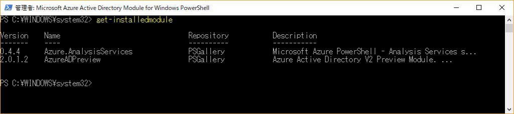

> 本記事は Technet Blog の更新停止に伴い https://blogs.technet.microsoft.com/jpazureid/2017/12/04/aad-powershell/ の内容を移行したものです。
> 元の記事の最新の更新情報については、本内容をご参照ください。

# Azure Active Directory の PowerShell モジュール

こんにちは、 Azure ID チームの三浦です。今回は Azure Active Directory (Azure AD) の PowerShell モジュールの種類、インストール方法についてご案内します。

Azure AD への操作は主に Azure ポータル、 Office 365 ポータル、 Graph API それに今回紹介します PowerShell からおこなうことができます。PowerShell モジュールについても複数ありますので、その種類をまず紹介します。

## Azure AD PowerShell の種類

Azure AD の PowerShell には次のようなものがあります。

### 1. MSOnline (Azure AD v1)

Office 365 をご利用いただいている方にとっては Office 365 のライセンスを割り当てるときにも利用しますので馴染み深いかもしれません。当初からあるもので、あとから紹介する Azure AD v2 と明示的に区別する際に Azure AD v1 モジュールとも呼びます。Connect-Msolservice のようにコマンドレットに ”Msol” という文字列が含まれています。現状でも Azure AD に対する PowerShell コマンドでよく使われています。

### 2. Azure AD for Graph (Azure AD v2)

当初は Azure AD は Office 365 の認証基盤という意味合いが大きかったのですが、 Azure AD に新しい機能が追加されることに伴い Azure AD  PowerShell の機能を拡張させていく必要がでてきました。その対応のために従来の MSOnline を拡張するのではなく、別途異なるモジュールを開発するというアプローチを取ることになり Azure AD for Graph (Azure AD v2 と言うほうが一般的なので以降は Azure AD v2 とします) というモジュールが作成されました。基本的には MSOnline で提供していた機能は Azure AD v2 でも提供されます。例えばユーザー作成をおこなうときに MSOnline モジュールでは [New-Msoluser](https://docs.microsoft.com/en-us/powershell/module/msonline/new-msoluser?view=azureadps-1.0) というコマンドを使いますが、Azure AD v2 では [New-AzureADUser](https://docs.microsoft.com/ja-jp/powershell/azure/active-directory/new-user-sample?view=azureadps-2.0) を利用します。基本的に MSOL コマンドレットの拡張は予定されていないため、新しい機能などは Azure AD v2 のみで提供されます。というわけで今後は基本的に Azure AD v2 コマンドをご利用くださいと案内したいところなのですが、、、完全に MSOL コマンドで提供していたものをカバーしているわけではないため、残念なのですが (大変申し訳ないのですが)、従来の MSOL コマンドも併用していく必要があります。

### 3. Azure AD for Graph preview (Azure AD v2 preview)

Azure AD v2 モジュールはかなり早いスピードで新しいコマンドが追加されています。なるべく早く新しいモジュールを提供できるようプレビュー版も用意しています。プレビュー版については実際の運用環境での利用は推奨していませんが、Public Preview 中の機能を利用するためにはプレビュー版を利用する必要があることが多くあります。また、 Azure AD v2 の通常版 = General Availability 版がすでにインストールされている環境で通常版とプレビュー版を併用することはできません。 Preview 版を利用したい場合には、先に通常版を Uninstall-Module コマンドでアンインストールしたうえでプレビュー版をインストールをします。

## インストール方法について

### 前提条件

MSOnline (Azure AD v1) と Azure AD v2 では前提となる .net Framework のバージョンが厳密には異なり、 MSOnline の場合には必ずしも必要にはならないのですが、古いものを利用していると問題が生じることがあるので、 Azure AD v1、 v2 を問わず、以下の前提条件を満たすようにしてください。なお、 Windows 10 / Windows Server 2016 は .NET Framework、 PowerShell の要件を既定で満たしていますので前提条件については考慮不要です。

- .NET Framework: バージョン 4.5.2 以降 (*1)
- PowerShell: バージョン 5.0 以降 (*1)
- OS: Windows 7 SP1 (*2)、 Windows Server 2008 R2 以降

> 1. .NET Framework および PowerShell のバージョンについては、厳密に言うとこれを満たしていなくても動作するバージョンもありますが、古いバージョンだと問題が生じることがあるため上記を満たすようにします。
> 2. クライアント OS で利用する場合には 32 bit 環境ではなく 64 bit 環境の必要があります。

.NET Framework と PowerShell のインストール方法、現在インストールされているバージョンの確認方法は次の通りです。

### .NET Framework

以下のサイトから .NET Framework 4.6 をインストールします。

Microsoft .NET Framework 4.6  
https://www.microsoft.com/ja-jp/download/details.aspx?id=48137

インストールを試みたときにすでにインストールされているという旨のメッセージが表示された場合にはすでにインストールされていますので不要です。実際にインストール ウィザードを実行していなくとも .NET Framework でどのバージョンがインストールされているかは、 PowerShell のウィンドウを開き、次のコマンドを実行することで確認できます。

```powershell
Get-ChildItem 'HKLM:\SOFTWARE\Microsoft\NET Framework Setup\NDP' -recurse | Get-ItemProperty -name Version,Release -EA 0 | Where { $_.PSChildName -match '^(?!S)\p{L}'} | Select PSChildName, Version, Release
```

以下の例では 4.7.02046 という新しいバージョンがインストールされていることが確認できます (4.7 のバージョンは OS によっては追加のモジュールのインストールが必要なのでここでは 4.6 の紹介にしていますが、もちろん 4.7 のインストールで構いません)。


### PowerShell モジュール

PowerShell のバージョンを 5.0 以上にするために Windows Management Framework (WMF) 5.1 を以下のサイトからダウンロードしてインストールします。

Windows Management Framework 5.1  
https://www.microsoft.com/en-us/download/details.aspx?id=54616

システムの PowerShell のバージョンは $psversiontable で確認できます。以下の例だと 5.1.15063.726 というバージョンがインストールされていることが確認できます。


### Azure AD PowerShell インストール方法
上記の前提条件を満たしたうえで、次の手順でインストールを実施します。

1. 管理者で PowerShell を起動します。
2. 下記のコマンドを実行し、モジュールをダウンロードし、インストールします。

    MSOnline (Azure AD v1):
    ```powershell
    Install-Module -Name MSOnline
    ```

    Azure AD for Graph (Azure AD v2):
    ```powershell
    Install-Module -Name AzureAD
    ```

    Azure AD for Graph preview (Azure AD v2 preview):

    ```powershell
    Install-Module -Name AzureADPreview
    ```

> Azure AD v2 と Azure AD v2 preview の両方を同じコンピューターにインストールできませんのでご注意ください。Azure AD Preview が必要にも関わらず Install-Module -Name AzureAD を実行してインストールした場合には、一度 Uninstall-Module -Name AzureAD を実行してアンインストールの上で Install-Module -Name AzureADPreview を実行します。

> NuGet プロバイダーが必要というメッセージが表示された場合には Y をクリックして進めます。信頼されていないレポジトリのメッセージが表示された場合にも Y をクリックして進めます。それぞれの次のようなメッセージが表示されます。

NuGet のメッセージ:

```powershell
NuGet provider is required to continue
PowerShellGet requires NuGet provider version '2.8.5.201' or newer to interact with NuGet-based repositories. The NuGet
provider must be available in 'C:\Program Files\PackageManagement\ProviderAssemblies' or
'C:\Users\taguiadmin\AppData\Local\PackageManagement\ProviderAssemblies'. You can also install the NuGet provider by
running 'Install-PackageProvider -Name NuGet -MinimumVersion 2.8.5.201 -Force'. Do you want PowerShellGet to install
and import the NuGet provider now?
[Y] Yes  [N] No  [S] Suspend  [?] Help (default is "Y"):
```

レポジトリのメッセージ:

```powershell
Untrusted repository
You are installing the modules from an untrusted repository. If you trust this repository, change its
InstallationPolicy value by running the Set-PSRepository cmdlet. Are you sure you want to install the modules from
'PSGallery'?
[Y] Yes  [A] Yes to All  [N] No  [L] No to All  [S] Suspend  [?] Help (default is "N"):
```

> 明示的にバージョン番号を指定する場合にはコマンドに -RequiredVersion 2.0.0.137 というように引数としてバージョン情報を追加します。

> MSOnline については以前は Connect サイトからインストールパッケージをダウンロードできましたが、サイトのリタイアに伴いダウンロード パッケージは提供されなくなりました。Install-Module コマンドを実行することでインストールします。

## 補足事項

<別端末で保存したファイルを利用したい場合>

何らかの理由で直接 Install-Module を実行してのインストールができないケースが稀にあります (ウイルス対策ソフトの影響等)。この場合には、他の端末で必要なモジュールを取得し、入手したファイルを元に Import-Module を実行する方法もあります (あまり多くの実績があるものではないため、基本は Install-Module での対応をお勧めします)。以下は Azure AD for Graph の例です。

1. 管理者として PowerShell を起動します。
2. 下記のコマンドレットを実行し、リポジトリ ファイル群をダウンロードします。

    ```powershell
    Save-Module -Name AzureAD -Path C:\temp\
    ```

> C:\temp\ は保存先フォルダーの指定となりますので、任意の存在するパス/フォルダーをご指定ください。

3. 指定したフォルダー配下の \AzureAD\<バージョン番号>\ フォルダー配下に、リポジトリ ファイル群が展開されたことを確認します。

4. 実際に Azure AD の PowerShell コマンドを利用したい端末の C:\Program Files\WindowsPowerShell\Modules フォルダーに 2 でダウンロードしたフォルダー (今回の例の場合 c:\temp 配下の AzureAD フォルダー) をコピーします。

5. C:\Program Files\WindowsPowerShell\Modules フォルダーに保存されたモジュールは PowerShell で自動的にロードされるため、そのまま実行ができるはずですが、コマンドがエラーになる場合には、以下を実行したうえで Connect-AzureAD  などを実行します。

    ```powershell
    Import-Module C:\Program Files\WindowsPowerShell\Modules\AzureAD\<バージョン番号>\AzureAD.psd1
    ```

<認証プロキシが存在する場合の注意事項>

インターネットにアクセスする際に認証が必要なプロキシが存在するようなネットワーク環境では、 PowerShell 起動時に以下のコマンドを実行し、認証が必要なプロキシを経由してアクセスができるようにします。

```powershell
$ProxyCredential = New-Object System.Net.NetworkCredential("ユーザー名","パスワード")
[System.Net.WebRequest]::DefaultWebProxy.Credentials = $ProxyCredential
```

<モジュールがインストールされているかの確認>

モジュールがインストールされているかは Get-InstalledModule コマンドで確認できます。



<モジュールのアンインストール方法>

Uninstall-Module コマンドでアンインストールができます。Azure AD v2 の通常版と Preview 版は併用できませんので、通常版を利用している環境で Preview 版を利用したい場合には管理者で PowerShell を起動し、 Preview 版をインストール前に次のコマンドで通常版のアンインストールが必要です。

```powershell
Uninstall-Module AzureAD
```

以上です。最後に参考資料をご紹介します。

## 参考資料
Azure Active Directory PowerShell for Graph  
https://docs.microsoft.com/ja-jp/powershell/azure/active-directory/install-adv2?view=azureadps-2.0
<!-- textlint-disable -->
Azure​AD (Azure AD v2 コマンド一覧)  
<!-- textlint-enable -->
https://docs.microsoft.com/en-us/powershell/azuread/v2/azureactivedirectory

AzureAD PowerShell's Profile (Azure AD PowerShell 最新版リスト。 V1、 V2、 V2Preview)  
https://www.powershellgallery.com/profiles/AzureADPowerShell/

## 変更履歴

- 2017/12/04: 公開しました。
- 2017/12/20: 前提条件について追記を行いました。
- 2018/01/31: Microsoft Connect のリタイアに伴い MSOnline モジュールのダウンロードができなくなったため追記しました。また、インストール時の手順として Save-Module は必要がありませんが、補足事項として別項を追加しました。
- 2018/02/08: Windows 10/2016 では前提条件を既定で満たしていることを追記しました。モジュールインストール時に表示される可能性があるメッセージを掲載しました。TLS 1.2 への対応などを考慮すると 4.6 のほうが望ましいため .NET Framework のダウンロードリンクを 4.6 のものに変更しました。
- 2018/05/10: モジュールがインストールされているかの確認方法とアンインストール コマンドを追記しました。
- 2018/07/13: Windows Management Framework 5.0 のリンクを 5.1 に変更しました。
- 2018/08/07: Save-Module で別端末でダウンロードしたモジュールを利用する際の手順を更新しました。
- 2018/10/17: Windows Management Framework (WMF) のサポート対象が 5.1 であることから .NET Framework の前提条件を WMF 5.1 インストールに必要となる 4.5.2 に変更しました。
- 2019/01/23: Azure AD v2 と Azure AD v2 preview が同時インストールできない注意書きをインストールの項目にも追記しました。