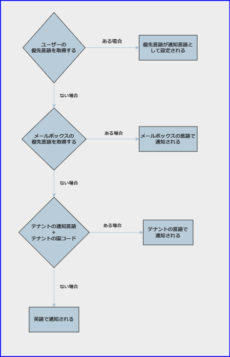
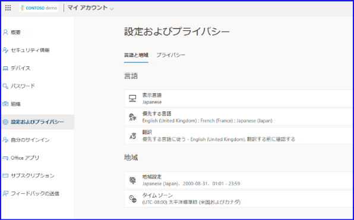
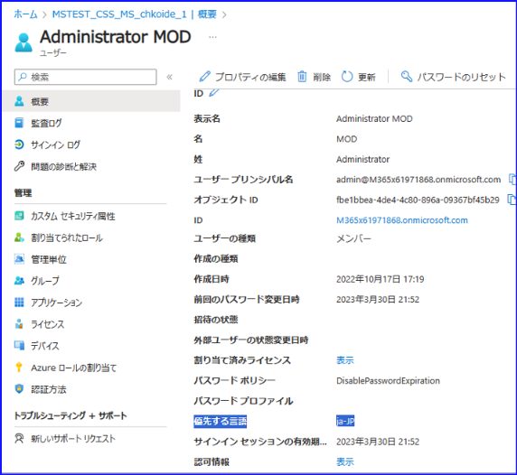
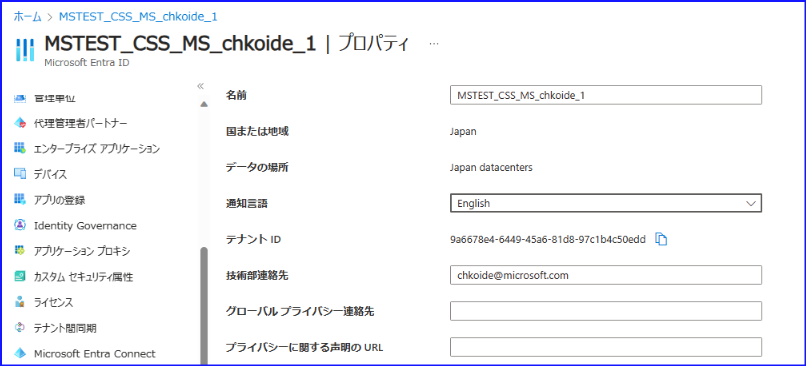

# 通知メールにおける優先言語が設定できるようになりました

こんにちは！ Azure ID チームの小出です。

本記事は、2023 年 10 月 17 日に公開された [Entra ID now enables you to receive emails in your preferred language.](https://techcommunity.microsoft.com/t5/microsoft-entra-azure-ad-blog/entra-id-now-enables-you-to-receive-emails-in-your-preferred/ba-p/3939717) の記事を日本語に分かりやすくおまとめしなおした記事となります。ご不明点などございましたら、お気軽にサポートまでお問い合わせをいただけますと幸いです。

----

PIM やアクセス レビューなど、主に Microsoft Entra ID P2 の機能には、ロールの割り当てやアクセス レビューの結果などにおいて多くの E メール通知が送付されます。この E メール通知の言語について、「日本語で受信したい」「英語で受信したが、日本語で受信したいもののどの設定で制御されているのか分からない」などのフィードバックやお問い合わせを多くいただいておりました。

今回、どの言語でメールを受信するかについて、新たな決定ロジックを追加しました。このロジックを使用したメール通知の言語決定は、特権 ID 管理 (PIM)、アクセス レビュー、およびエンタイトルメント管理で利用できます。

 

言語が決定されるまでの流れは下記のとおりです。

1. システムはまずユーザーの通知言語をチェックします。

	- Entra ID ユーザーは、myprofile.microsoft.com または myaccount.microsoft.com 経由で自身の言語設定を更新できます。更新する権限がない場合は、管理者が優先言語を更新します。
	- システムは、Entra ID ユーザーオブジェクトに優先言語が設定されているかどうかを確認し、指定されていればその言語を使用します。
	
my account の画面では、下記にて言語設定を行えます。

 

	
また、preferredLanguage 属性は、ユーザーのプロファイル画面にて確認できます。

 

	
2. ユーザーごとの言語設定がない場合、ユーザーが E メールボックスを持っていて、その E メールボックスに優先言語が設定されているかどうかをチェックします。両方のチェックが真であれば、システムは E メールボックス設定で設定された優先言語を使用します。これは E メールボックスを持つユーザーに対してのみ機能します。

Outlook on the web にて設定を開くと、言語を確認もしくは選択することができます。

 

3. 上記のいずれも設定されていない場合、システムはテナントの優先言語にテナントの国文字コード（例: fr-FR または ja-JP）を連結したものを使用します。
	・ テナントに優先言語が設定されていて、国コードがない場合、システムはテナントの優先言語を使用して、ローカライズされたテンプレートから、渡されたものに最も近い利用可能なロケールを探します。例えば、fr-CA が見つからない場合、フォールバック先の言語は fr-FR です。 

たとえば下記の場合、通知言語は英語になっておりますので、 通知言語としては en、テナントとしての国は JP となります。しかし、 en-JP というコードはないため、 en- にて利用できる国として en-US にフォールバックし、通知は英語で受信される仕組みとなります。

 

	
	
4. 上記がすべてない場合、システムは既定で en-us になります。

以上のようなロジックで制御がなされますので、設定により画面左のように英語で受信したり、右のようにスペイン語で受信したりと、言語を制御することができます。

 

さらに、新規ゲストが MyAccess でアクセス パッケージをリクエストした際は、リクエスト時のブラウザの言語に基づいて、希望する言語が記憶されます。これにより、新規ゲストは、自身が理解できる言語で Eメールを受信することができます。

現在、このロジックは上記の機能でのみ利用可能ですが、今後さらに多くの機能でこのロジックが利用できるようになる予定ですので、PIM やエンタイトルメント管理を現在利用されていないお客様も、今後のアップデートをお待ちください。
