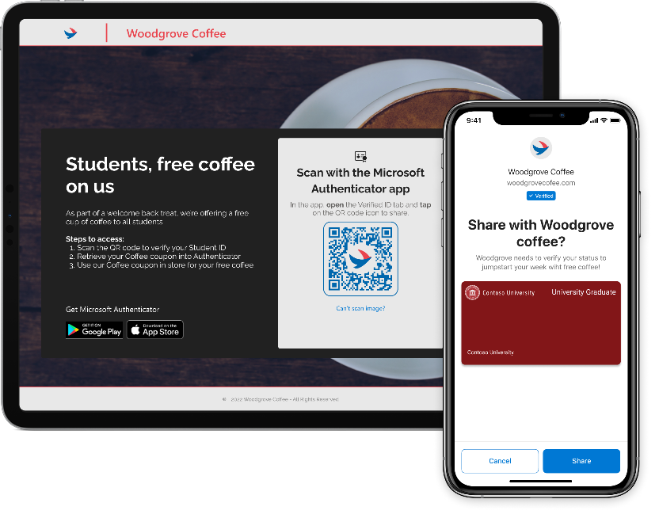

# Entra Verified ID による Verified Coupons ( 認証クーポン ) のプレビュー

こんにちは、Azure Identity サポート チームの 三輪 です。 

本記事は、2022 年 09 月 15 日に米国の Azure Active Directory Identity Blog で公開された[Preview for verified coupons with Entra Verified ID - Microsoft Tech Community](https://techcommunity.microsoft.com/t5/microsoft-entra-azure-ad-blog/preview-for-verified-coupons-with-entra-verified-id/ba-p/3627342) を意訳したものになります。ご不明点等ございましたらサポート チームまでお問い合わせください。

---

こんにちは。 
 
Entra Verified ID が一般公開（GA）されてから 30 日余りが経ちました。この夏、弊社にインターンとして参加している Emilia Borisova が開発した最新のアップデート: Verified Coupons (使用例 : 限定イベントのチケットなど) をご紹介します。  
 
Ankur Patel  
Head of Product, Microsoft Entra Verified ID 

---

Decentralized Identity チームでインターンをしている Emilia Borisova と申します。インターン期間中に私が設計および開発した機能がプレビューとして利用できるようになりましたのでお知らせしたいと思います。この機能は、1 日、1 ユーザー、1 資格情報ごとに、Verified ID の提示回数に制限を設定するための機能です。このようなアプローチは、旅行、医療、小売など様々なシーンで、割引やチケットの検証機能や、差別化された体験への扉を開くと考えています。  

## 使用例：Verified IDでコーヒー1杯を無料にする 

学生の皆さんの一週間のスタートを応援するため、Woodgrove Cofee では、毎週月曜日にコーヒー 1 杯を無料で提供するようなシナリオが考えられます。レジで学生証を提示すると、毎週 1 杯のコーヒーが無料になります。Woodgrove Coffee は、追加でコーヒーを購入しようとする学生向けに、来週も来るように通知することができます。クーポンと同じように直感的に使えるこの機能は、Verified ID の定義を広げ、その無限の可能性をさらに際立たせています。 

## どのように機能するか

開発者は [Entra Verified ID APIs](https://learn.microsoft.com/ja-jp/azure/active-directory/verifiable-credentials/get-started-request-api?tabs=http) を使用して、特定の資格情報を提示できる回数をプログラムによって指定することができます。下の画像は、1 回しか使用できない Verified ID に対して、フィールド "maxAllowedPresentationsCount (最大提示可能回数)" を 1 に設定したリクエストの例です。このように、1 つのプロパティ値を変更するだけで、シームレスに利用でき、提示回数制限の変更にも柔軟に対応することができます。また、顧客に最適なオファーを提供するため、アプリ側で提示回数の値をプログラム的に設定することができます。 

この機能をお試しになりたい方は、[こちら](https://forms.office.com/pages/responsepage.aspx?id=v4j5cvGGr0GRqy180BHbR-d_8gHWMzVMqsi_IPVB0vlUQllOVjNUTFZMRktNWFRYOFZGTEZKMTBBUy4u) から参加を申請ください。

## ご意見をお待ちしています

皆様からのご意見を楽しみにしております。これからも Twitter (@AzureAD) および [Azure Feedback Forum](https://feedback.azure.com/d365community/forum/22920db1-ad25-ec11-b6e6-000d3a4f0789) よりフィードバックを頂けますと幸いです。Microsoft Entra Verified ID のドキュメントは [こちら](https://learn.microsoft.com/ja-jp/azure/active-directory/verifiable-credentials/) です。

[Emilia Borisova](https://www.linkedin.com/in/emilia-borisova/)  
Software Engineering Intern  
Microsoft Identity Division
