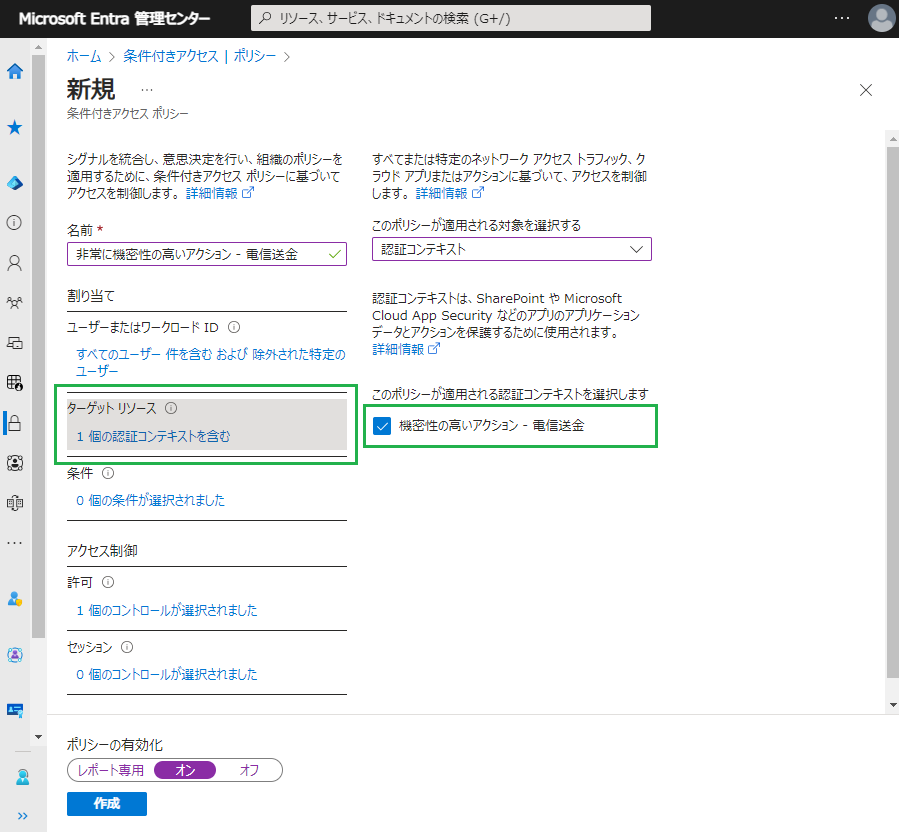
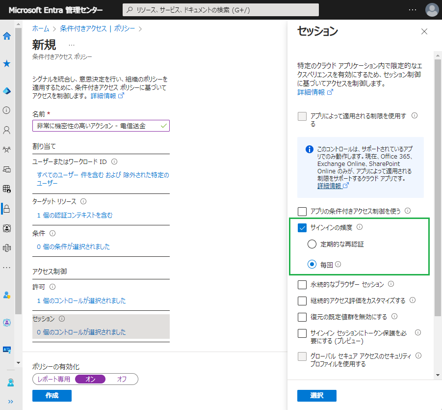

# パブリック プレビュー: 条件付きアクセスにより、機密性の高いアプリやリスクの高いアクションでユーザーに再認証を促す

こんにちは、Azure Identity サポート チームの 五十嵐 です。

本記事は、2024 年 2 月 26 日に米国の Microsoft Entra (Azure AD) Blog で公開された Prompt users for reauthentication on sensitive apps and high-risk actions with Conditional Access の抄訳です。ご不明点等ございましたらサポート チームまでお問い合わせください。

---

皆さん、こんにちは！

本日、**条件付きアクセスにおける再認証ポリシー** において使用できるようになった追加機能を発表できることを嬉しく思います。再認証ポリシーにより、重要なアプリケーションへのアクセスや機密性の高い操作を実行する前に、ユーザーに再度、対話的に認証を求めることができます。条件付きアクセス セッション制御であるサインインの頻度と組み合わせることで、リスクのあるユーザーやサインイン、または Intune 登録に対して再認証を要求できます。本日のパブリック プレビューにより、**条件付きアクセスで保護されているすべてのリソースに対して再認証を要求できるようになりました。**

この機能の詳細について、Microsoft Entra のプリンシパル プロダクト マネージャーである Inbar Cizer Kobrinsky を招き、シナリオと構成についてお話しいただきます。

Alex Weinert

--

皆さん、こんにちは！

今回は、条件付きアクセスの「サインイン頻度 - 毎回」セッション制御に追加されたパブリック プレビュー機能について、詳しくお伝えしたいと思います。

最新の認証を使用したシングル サインオン (SSO) は、生産性とセキュリティを高める秘訣の一つです。SSO によりユーザーがアプリケーションに個別の資格情報でサインインすることなく、スムーズにアクセスできるようになるため、生産性が向上します。SSO はまた、資格情報の再利用のリスクを減らし、ゼロ トラスト展開の制御やログ記録における中心点となるため、セキュリティも強化されます。

しかし、リソースにアクセスする前に、対話型認証のようにユーザーの入力が必要な状況もあります。このような状況の 1 つがトークンの窃取です。トークン窃取攻撃は、ユーザーが多要素認証 (MFA) を突破しているかどうかに限らず、攻撃者がユーザーに発行されたトークンを奪い取り、再利用することで発生します。窃取したトークンで認証要件が満たされてしまうため、攻撃者は盗んだトークンを使用して組織リソースへのアクセスを許可されてしまいます。リスク ベースの再認証ポリシーを用いると、攻撃者はシステムへのアクセスを再度得るために、トークンを新たに侵害する必要が生じますので、これによりトークンの窃取によるリスクを低減することができます。

次に、ユーザに再認証を求める例としては他にも以下のようなものがあります:

- VPN への接続など、リスクの高いリソースにアクセスする。
- 特権 ID 管理 (PIM) で特権ロールをアクティブにする。
- 人事アプリケーションでの個人情報の変更など、アプリケーション内で何らかの操作を実行する。
- Intune への登録や資格情報の更新などの重要なアクションを行う。
- リスクのあるサインイン - 上記の例のようなシナリオでもトークン盗難のリスクを低減および軽減できます。

以上のような最新のアップデートにより、**条件付きアクセスで保護されたアプリケーションまたは認証コンテキストに対して、対話型の再認証を要求するポリシーを作成できるようになりました。**

以下の例では、送金処理などの非常に機密性の高い操作に対する再認証ポリシーを作成しています。開発者が別途アプリケーションに統合した [認証コンテキスト](https://learn.microsoft.com/ja-jp/entra/identity-platform/developer-guide-conditional-access-authentication-context) を使用している例です。ユーザーがアプリケーションから送金する前に、この認証コンテキストをターゲットとする条件付きアクセス ポリシーを満たす必要があります。

この認証コンテキストの条件付きアクセス ポリシーは、フィッシング耐性のある認証 (認証強度を使用) と「サインインの頻度 - 毎回」を要求します。ユーザーが次に送金処理を行おうとするときには、フィッシング耐性のある MFA で再認証することが要求されます。

詳細については、[サインインの頻度 - 毎回](https://learn.microsoft.com/ja-jp/entra/identity/conditional-access/concept-session-lifetime#require-reauthentication-every-time) に関する公開情報をご覧ください。

ぜひご意見をお聞かせください！

Inbar
