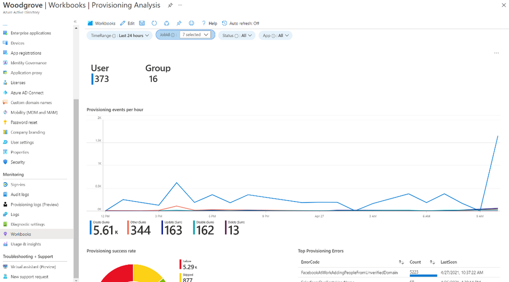

# ユーザー ストアとして SQL を使用したアプリへのユーザー プロビジョニング、複雑な変換式の簡単な構築、などなど

こんにちは、Azure Identity サポート チームの 村上 です。

本記事は、2021 年 7 月 1 日に米国の Azure Active Directory Identity Blog で公開された [Provision users into apps using SQL as a user store, more easily build complex expressions, and more](https://techcommunity.microsoft.com/t5/azure-active-directory-identity/provision-users-into-apps-using-sql-as-a-user-store-more-easily/ba-p/2464364) を意訳したものになります。ご不明点等ございましたらサポート チームまでお問い合わせください。

----

皆さん、こんにちは。

今回は、ユーザーのライフ サイクルやディレクトリ管理のニーズに応えた、最新の Active Azure Directory プロビジョニング機能をいくつかご紹介します。

## Azure AD からオンプレミス・アプリケーションへのユーザー・プロビジョニングを自動化する

Azure AD は、オンプレミス アプリケーションへのプロビジョニングをサポートするようになりました。また、プレビュー版を用意していますので、お試しいただき、是非とも弊社へフィードバックをお送りください。

本機能を使用するためには、Azure AD Premium P1 または P2 テナントと、データ ストアとして SQL を使用する、もしくは SCIM をサポートするオンプレミス アプリケーションが必要です。プレビューへの招待状は、[こちら](https://aka.ms/onpremprovisioningpublicpreviewaccess) から申請できます。また、数ヶ月以内に、LDAP ディレクトリ (AD DS を除く) へのユーザーのプロビジョニングのサポートを追加する予定ですので、その後は招待の申請は不要とする予定です。

既に Microsoft Identity Manager (MIM) を導入したことのあるお客様は、MIM を全面的に展開することなく、既存のコネクタや構成を再利用することができます。また、新しいアプリケーションを構築しているお客様は、当社の [SCIM リファレンス コード](https://aka.ms/scimreferencecode) を使用して SCIM エンドポイントを立ち上げ、オンプレミスでもクラウドでもアプリケーションにユーザーを簡単にプロビジョニングすることができます。

## 事前に構築されたユーザー プロビジョニング コネクタでより多くのアプリに対応

Azure AD サービスは、200 以上のプロビジョニング コネクタをサポートするようになりました！続々と増えるアプリケーションの一覧は [こちら](https://docs.microsoft.com/azure/active-directory/saas-apps/tutorial-list) でご確認ください。 お探しのアプリケーションがない場合は、アプリケーション ベンダーに対して [SCIM](https://aka.ms/scimoverview) 標準をサポートし、Azure AD アプリケーション ギャラリーに [登録](https://docs.microsoft.com/azure/active-directory/develop/v2-howto-app-gallery-listing#step-6---submit-your-app) するよう依頼してください。私たちは ISV と協力して、迅速にオンボード化します。

## Microsoft 365 管理センターの新しいアプリ統合ウィザード

より多くの管理者がサード パーティのアプリを Azure AD に接続できるよう、Microsoft 365 管理センターに新しいアプリ統合ウィザードを搭載しました。 アプリ統合ウィザードは、管理者がシングル サインオンを設定する際に、ガイド付きで設定を使うことができ、簡単に [アプリ ギャラリー](https://docs.microsoft.com/en-us/azure/active-directory/saas-apps/tutorial-list) のアプリを Azure AD に接続することができます。アプリケーションのシングル サインオンの設定が完了しましたら、あらかじめ用意されている数百のプロビジョニング コネクタを使用して、ユーザーのプロビジョニングを自動化することができます。

## プロビジョニング ログの一般提供を開始

UI、API、または CSV としてデータをエクスポートすることで、[プロビジョニング ログ](https://docs.microsoft.com/azure/active-directory/reports-monitoring/concept-provisioning-logs) を使用して、プロビジョニング展開を監視およびトラブル シューティングすることができます。また、[Azure Monitor Integration](https://docs.microsoft.com/azure/active-directory/app-provisioning/application-provisioning-log-analytics) を使用して、データにカスタム ダッシュボード、アラート、およびクエリを構築することもできます。

## 式の構築とテストを簡素化

Azure AD のプロビジョニング サービスでは、対象のシステムにデータをエクスポートする前に、データを変換することができます。データの変換に使う式の構築とテストを簡易にするために式ビルダーを構築し、現在パブリックプ レビューとして提供しています。 詳細は [こちら](https://docs.microsoft.com/en-us/azure/active-directory/cloud-sync/how-to-expression-builder) をご覧ください。また、式の作成に関する一般的なガイダンスについては、[こちら](https://docs.microsoft.com/en-us/azure/active-directory/cloud-sync/reference-expressions) をご覧ください。

## 海外赴任、ギグ ワーカー、AD ドメインをまたぐマネージャーに対応した HR システムからのプロビジョニングのアップデート

- 大規模な多国籍企業では、従業員が一時的に海外の拠点で働き、赴任終了後に本拠地に戻ることがあります。通常、人事部はこの海外勤務に対応した新しいユーザー プロファイルを作成します。このようなケースに対応するために、[Workday](https://docs.microsoft.com/en-us/azure/active-directory/app-provisioning/workday-integration-reference#retrieving-international-job-assignments-and-secondary-job-details) および [Success Factors](https://docs.microsoft.com/en-us/azure/active-directory/app-provisioning/sap-successfactors-integration-reference#handling-global-assignment-scenario) とのユーザー プロビジョニング統合をアップデートし、海外勤務データの検索をサポートしました。
- 近年のギグ エコノミー (短期、臨時や単発での仕事を受注する働き方やその経済形態) では、正社員が臨時従業員に変わったり、もしくはその逆になるシナリオが増加しています。このような場合、Workday を導入することで、以前の雇用記録を無効にし、以前の従業員 ID を保持したまま新しい雇用記録を作成することができます。従来では、正社員と臨時従業員、それぞれの Workday プロビジョニング ジョブを作成する必要がありました。最新の Workday 統合の [アップデート](https://docs.microsoft.com/azure/active-directory/app-provisioning/workday-integration-reference#support-for-worker-conversions) により、このシナリオを円滑に処理できるようになり、Workday 雇用記録を利用して、 ID の所有権を引き継ぐことができるようになりました。
- HR プロビジョニングを複数のオンプレミス Active Directory (AD) ドメインと統合している場合、ユーザーとマネージャーが別の AD ドメインに所属しているというケースがあります。このようなドメインをまたいだマネージャーの参照が、最新のアップデートで可能となりました。また、複数のドメインにまたがる UPN/sAMAccountName の値の重複を検索することもできます。詳しくは、[クラウド HR 計画ガイド](https://docs.microsoft.com/azure/active-directory/app-provisioning/plan-cloud-hr-provision#design-hr-provisioning-app-deployment-topology) をご覧ください。

## Azure AD Connect sync の最新版を公開

最新版では、以下の機能が追加されています。

- [選択的なパスワード ハッシュの同期](https://docs.microsoft.com/en-us/azure/active-directory/hybrid/how-to-connect-selective-password-hash-synchronization) をサポート。
- Azure AD Connect の同期構成のトラブルシューティングに役立つ、[単一オブジェクトの同期コマンドレット](https://docs.microsoft.com/en-us/azure/active-directory/hybrid/how-to-connect-single-object-sync)。
- [V2 エンド ポイント](https://docs.microsoft.com/azure/active-directory/hybrid/how-to-connect-sync-endpoint-api-v2) をデフォルトに変更し、パフォーマンスの向上と、50,000 人以上のメンバーを持つグループの同期が可能に。
- 新しい組み込みロールであるハイブリッド ID 管理者を、サービスの構成を担当する管理者に使用可能に。

## Azure AD Connect クラウド同期のエージェントを更新

エージェントのバージョン #1.1.359 から、Azure AD Connect のクラウド同期の管理者は、 gMSA コマンドレットを使用して、gMSA 権限を詳細なレベルで設定およびリセットできるようになりました。また、グループのスコープ フィルターを使用して同期できるメンバーの上限が、50,000 人になりました。不具合の修正を含むエージェント アップデートの詳細については、[バージョン履歴](https://docs.microsoft.com/en-us/azure/active-directory/cloud-sync/reference-version-history) をご確認ください。

いつものように、コメントや Twitter（[@AzureAD](http://twitter.com/azuread)）で皆様のご意見やご感想をお聞かせください。
