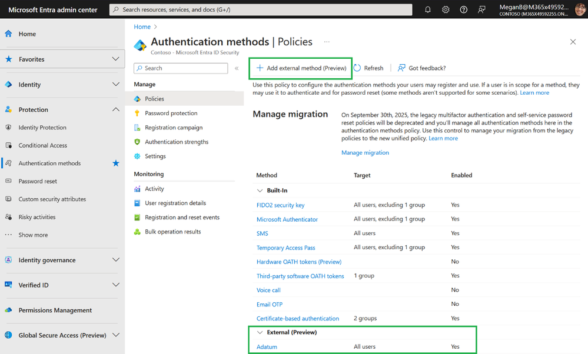
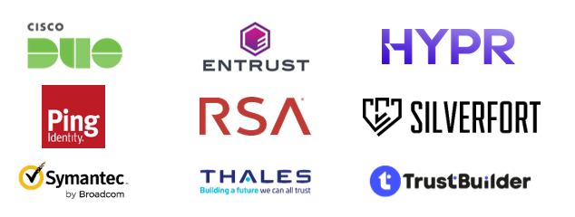

# パブリック プレビュー: Microsoft Entra ID における外部の認証方法

こんにちは、Azure Identity サポート チームの 高田 です。

本記事は、2024 年 5 月 2 日に米国の Microsoft Entra (Azure AD) Blog で公開された [Public preview: External authentication methods in Microsoft Entra ID](https://techcommunity.microsoft.com/t5/microsoft-entra-blog/public-preview-external-authentication-methods-in-microsoft/ba-p/4078808) の抄訳です。ご不明点等ございましたらサポート チームまでお問い合わせください。

----

皆さんこんにちは。

本日は、Microsoft Entra ID の外部の認証方法の **パブリック プレビュー** が 5 月上旬にリリースされる予定であることをお知らせします。この機能により、Entra ID でお好みの多要素認証 (MFA) ソリューションを使用できるようになります。

MFA の展開は、ユーザー ID を保護するための最も重要なステップです。[Microsoft Research の MFA 有効性に関する研究](https://www.microsoft.com/en-us/research/publication/how-effective-is-multifactor-authentication-at-deterring-cyberattacks/) によると、MFA の使用により侵害のリスクが 99.2％ 以上削減されたとされています！一部の組織ではすでに MFA を展開しており、Entra ID でその MFA ソリューションを活用したいと考えています。この外部の認証方法の機能により、組織は Entra ID の MFA 要件を満たすために任意の MFA ソリューションを活用できます。

[カスタム コントロール](https://learn.microsoft.com/ja-jp/entra/identity/conditional-access/controls) の機能をご存じのお客様もいると思います。外部の認証方法は [カスタム コントロール](https://techcommunity.microsoft.com/t5/microsoft-entra-blog/upcoming-changes-to-custom-controls/ba-p/1144696) を置き換えるもので、カスタム コントロールよりもいくつかの点で利点があります。例えば以下が挙げられます。

1. 外部の認証方法の統合 - 業界標準を使用しオープンなモデルをサポートします。
2. 外部の認証方法は Entra の他の認証方法と同じように管理できます。
3. 外部の認証方法は Entra ID の幅広いユースケース (PIM の有効化など) でサポートされます。

この新しい機能について、Microsoft Entra ID のプロダクトマネージャーである Greg Kinasewitz を招待し、詳しく説明してもらいます。

いつものように、ご意見をお聞かせください。ありがとうございます！

Nitika Gupta  
Group Product Manager

----

皆さんこんにちは。

Gret と申します。外部の認証方法の主要な機能と、MFA パートナーの対応状況についてご紹介いたします。

条件付きアクセスや ID Protection など　Entra ID の豊富な機能を活用しながら、別の MFA ソリューションを使用したいという声をいくつかお聞ききしておりしました。Active Directory Federation Services (AD FS) を別の MFA ソリューションと共に使用しているお客様からは、特に AD FS から Entra ID への移行を希望する声をいただいておりました。条件付きアクセスのカスタム コントロールのプレビューを使用している組織からは、より多くの機能もつソリューションが必要だというフィードバックもありました。外部の認証方法の機能により、ユーザーは Entra ID の MFA 要件を満たす一環として外部プロバイダーで認証することが可能になり、これらのニーズを満たせるようになります。

## 外部の認証方法とはどういうものでどのように使うものなのか？

外部の認証方法は、条件付きアクセス ポリシー、PIM ロールのアクティベーション、ID Protection リスクベースのポリシー、および Microsoft Intune デバイス登録からの MFA 要件を満たすために使用できます。これらは Entra ID 認証方法ポリシーの一部として作成および管理されます。これにより、ビルトインの認証方法と同じ、一貫性のある管理体験が得られます。Entra 管理センターの認証方法の管理画面で、新しい「Add external method (Preview)」ボタンを使用して外部の認証方法を追加できます。

ユーザーが、MFA を満たすために認証方法を選択する際に、外部の認証方法が既定の認証方法と併せて表示されます。

詳細については、[公開資料](https://learn.microsoft.com/ja-jp/entra/identity/authentication/how-to-authentication-external-method-manage) をご覧ください。

## どのようなプロバイダーで外部の認証方法を利用できますか？

リリース時点では、外部の認証方法の統合は、以下の ID プロバイダーで利用可能となる予定です。利用の詳細については、各 ID プロバイダーにお問い合わせください:

さらに、外部の認証方法は標準に基づいたのオープンなモデルであるため、現在統合が行われているプロバイダーに加えて、統合を希望する認証プロバイダーはどのようなものであっても、[統合ドキュメント](https://aka.ms/EAM-Integration-Docs) に従って統合を行うことが可能です。

ユーザーのセキュリティを強化するため、外部の認証方法を皆様が利用し始めることを心待ちにしており、ぜひ皆さんのフィードバックをお聞きしたいです。

これらの統合について詳しく知りたい場合は、来週の RSA カンファレンスで Microsoft のブースをお訪ねください。また、Microsoft Intelligent Security Association (MISA) が主催する RSA カンファレンスのセッションでは、Duo が外部の認証方法の統合について紹介予定です。

外部の認証方法について詳しく知りたい場合や、デモを見てディスカッションに参加したい場合は、[5 月 15 日のウェビナー](https://aka.ms/EAM/Register) に登録ください。
