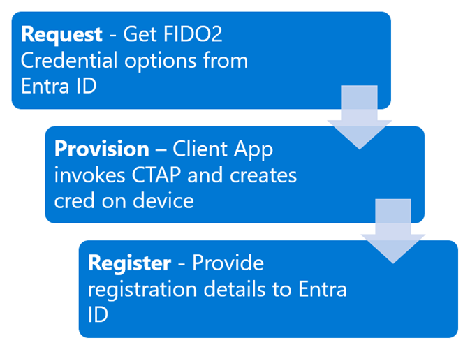
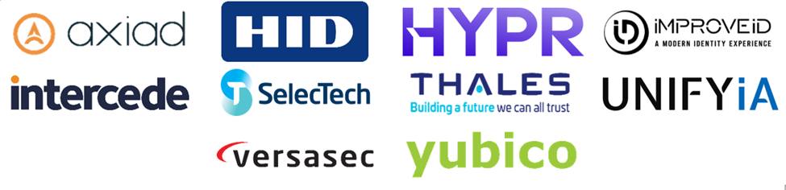

こんにちは、Azure Identity サポート チームの 高田 です。

本記事は、2024 年 8 月 7 日に米国の Microsoft Entra (Azure AD) Blog で公開された [Public preview: Microsoft Entra ID FIDO2 provisioning APIs](https://techcommunity.microsoft.com/t5/microsoft-entra-blog/public-preview-microsoft-entra-id-fido2-provisioning-apis/ba-p/4062699) の抄訳です。ご不明点等ございましたらサポート チームまでお問い合わせください。

----

# パブリック プレビュー: Microsoft Entra ID FIDO2 のプロビジョニング API

本日は、**ユーザーに代わり管理者が FIDO2 セキュリティ キー (パスキー) のプロビジョニング** を行い従業員をオンボードする新しい方法を発表いたします。 

お客様は、フィッシングに対抗する手段としてパスキーを活用いただいておりますが、セキュリティ キーの登録をユーザー自身で行う必要があるという点に懸念を示すお客様もございました。本日 Microsoft は、組織がユーザーに代わってこのプロビジョニングを実施できるようにし、初日から安全でシームレスな認証を提供できるようにする、新しい [Microsoft Entra ID FIDO2 プロビジョニング API](https://aka.ms/passkeyprovision) を発表いたします。

お客様は、これまでどおり既定の構成でセキュリティ キーをユーザーに展開したり、ユーザーが独自のセキュリティ キーを持ち込んで自身で登録したりすることを引き続きご利用いただけますが、この API を使用すると、キーをユーザー用に事前にプロビジョニングできるため、ユーザーはより簡単にキーを使い始めることが可能となります。 

フィッシング耐性のある認証を採用することは非常に重要であり、攻撃者は MFA が有効化されたユーザーを攻撃の対象とするため、AitM (Adversary-in-the-Middle) フィッシング攻撃やソーシャル エンジニアリング攻撃を続けています。パスキー、証明書ベースの認証 (CBA)、Windows Hello for Business など、フィッシング耐性のある認証方法は、これらの攻撃からユーザーを保護するための最良の方法です。

フィッシング耐性のある認証は、大統領令 14028 の重要な要件でもあり、すべての政府の職員、請負業者、パートナーにフィッシング耐性のある認証を義務付けています。連邦政府のほとんどのお客様は、コンプライアンスを達成するために既存のスマートカード システムを使用していますが、パスキーは、安全にサインインするためにより良い方法を模索しているお客様に対し、安全な認証手段を提供します。本日の管理者によるプロビジョニングのリリースにより、ユーザーのオンボーディング プロセスが簡素化されます。

[Microsoft Entra ID FIDO2 プロビジョニング API](https://aka.ms/passkeyprovision) を使用すると、組織は独自の管理者用プロビジョニング クライアントを開発したり、この API を統合した多くの資格情報管理システム (CMS) のプロバイダーと提携したりが可能です。 

Microsoft Entra のシニア プロダクト マネージャーである Tim Larson より、フィッシング耐性のある多要素認証 (MFA) への移行に有効なこの新機能について説明いたします。

Alex Weinert 

---
 
みなさんこんにちは。

Microsoft Entra のプロダクト マネジメント チームの Tim と申します。Entra ID の新しいパスキー (FIDO2) のプロビジョニング機能をご紹介できることを嬉しく思います。

5 月に、[Microsoft Entra ID でのパスキーのサポートを広げ](https://jpazureid.github.io/blog/azure-active-directory/public-preview-expanding-passkey-support-in-microsoft-entra-id/)、Microsoft Authenticator でのデバイスに紐づくパスキーのサポートについてお話しました。パスキーに関してより多くの機能を提供するという取り組みの一環として、[パスキー (FIDO2) の資格情報 API を強化](https://aka.ms/passkeyprovision) し、ユーザーのセキュリティ キーのオンボーディングをより便利にしました。

## 具体的な動作

[パスキー (FIDO2) の資格情報 API](https://aka.ms/passkeyprovision) の機能強化により、Entra ID に WebAuthn の作成オプションを要求し、返されたデータを使用してユーザーに代わってパスキーの資格情報を作成および登録できるようになりました。 

このプロセスをわかりやすくしますと、ユーザーに代わってセキュリティ キーを登録するには主に 3 つの手順が必要です。

1. **ユーザー用に creationOptions オプションを要求する**: Entra ID は、クライアントがパスキー (FIDO2) の資格情報をプロビジョニングするために必要なデータを返します。これには、ユーザー情報、証明書利用者、資格情報ポリシーの要件、アルゴリズムなどの情報が含まれます。
2. **creationOptions を使用してパスキー (FIDO2) の資格情報をプロビジョニングする**: creationOptions を使用して、Client to Authenticator Protocol (CTAP) をサポートするクライアントまたはスクリプトを使用して、資格情報をプロビジョニングします。この手順では、セキュリティ キーを挿入し、PIN を設定する必要があります。
3. **プロビジョニングされた資格情報を Entra ID に登録する**: プロビジョニング プロセスからの出力を利用して、対象となるユーザーのパスキー (FIDO2) の資格情報を登録するために必要なデータを Entra ID に提供します。

## 独自のアプリを構築するか CMS ベンダーの製品を使用する

上記のツールを提供することに加え、Microsoft は CMS 分野の主要ベンダー 10 社と協力して、新しい FIDO2 プロビジョニング API をこれらベンダーと統合するべく取り組んでいました。これらのベンダーは、新しい API をテストし、十分な知識を持っていますので、お客様が独自に統合を進めることが難しい場合は、これらのベンダーがプロビジョニングを支援可能です。

このパートナーシップは、お客様に安全で相互運用可能なエコシステムを提供するという当社のコミットメントを表すものです。これらのベンダーは、さまざまな CMS ソリューションを提供しており、それぞれが独自の知見と専門知識を有しています。これらベンダーが関わることで、API が堅牢で汎用性が高く、実運用に耐えるものであるということが確認できました。 

パブリック プレビューの開始にあたり、これらのベンダーがサポートを約束し、API を各プラットフォームに統合したことをうれしく思います。このコラボレーションは、セキュリティ環境を強化するだけでなく、さまざまな業界でのシームレスな採用への道を開きます。

## 次のステップ

このパブリック プレビューは、パスキーへの取り組みの 1 ステップであり、今後さらにパスキー (FIDO2) のプロビジョニング機能を提供すべく準備を進めています。Entra 管理センターにプロビジョニング機能を組み込んで、ヘルプ デスクやその他の管理者がユーザーの FIDO2 セキュリティ キーを直接プロビジョニングできるようになることもご期待ください。

ここで説明するすべての詳細については、[組織でのパスキー (FIDO2) を有効にする方法](https://aka.ms/passkeyenablement) に加え、[Microsoft Graph API のドキュメント](https://aka.ms/passkeyprovision) を確認ください。また、ご希望の CMS プロバイダーに連絡して、Microsoft Entra ID FIDO2 プロビジョニング API との統合についても詳細をご確認ください。

Tim Larson
