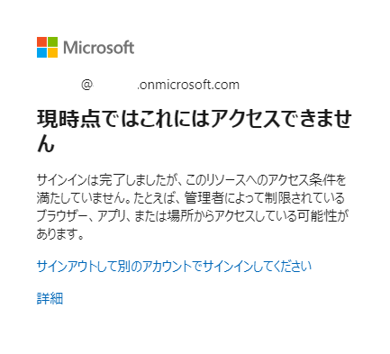
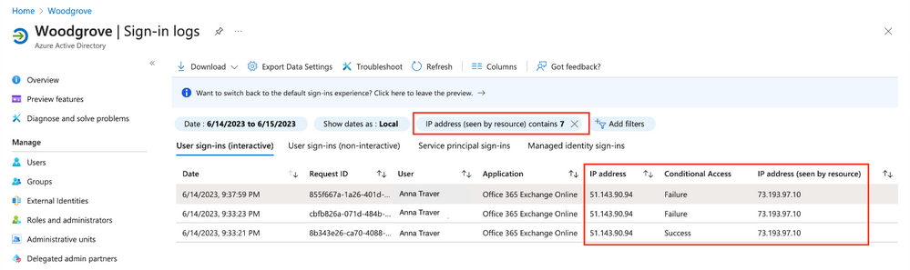

# パブリック プレビュー: 継続的アクセス評価における場所に基づくポリシーの厳密な適用

こんにちは、Azure Identity サポート チームの 五十嵐 です。

本記事は、2023 年 7 月 28 日に米国の Azure Active Directory Identity Blog で公開された [Public Preview: Strictly Enforce Location Policies with Continuous Access Evaluation](https://techcommunity.microsoft.com/t5/microsoft-entra-azure-ad-blog/public-preview-strictly-enforce-location-policies-with/ba-p/3773133) を意訳したものになります。ご不明点等ございましたらサポート チームまでお問い合わせください。

---

先日の Microsoft Secure イベントでは、継続的アクセス評価 (CAE) により場所に基づくポリシーを厳格に適用し、IP アドレスの場所を使用したポリシーに違反するトークンを迅速に無効化する条件付きアクセスの新機能をいち早くご紹介しました。本日、この機能のパブリック プレビューを発表できることを嬉しく思います。

これまでは、アクセストークンが盗まれた場合、攻撃者は条件付きアクセス ポリシーで許可された場所の範囲外であるかどうかに関係なく、トークンが更新されるまでの間、そのトークンを悪用することができました。場所に基づくポリシーと CAE を厳格に適用できるようになったことで、Exchange Online、SharePoint、Teams、Microsoft Graph などの CAE に対応するアプリケーションは、アプリケーション側でネットワーク変更イベントを検出して、ほぼリアルタイムでトークンを失効させることができるようになりました。これにより、盗まれたトークンが信頼されたネットワーク外で再生されることを防ぐことが可能となります。

CAE の「場所ポリシーを厳密に適用する」ポリシーがトリガーされ、クライアントのリソースへのアクセスがブロックされた場合、以下のような画面が表示され、そのクライアントはブロックされます。

## この機能の有効化方法

### 「場所ポリシーを厳密に適用する」を有効にする。

CA で「場所ポリシーを厳密に適用する」を有効にする前に、ユーザーが Microsoft Entra ID とリソース プロバイダーにアクセスする際のすべての IP アドレスが IP ベースのネームド ロケーション ポリシーに含まれていることをご確認ください。ネームドロケーションへの登録が漏れている場合、ユーザーを誤ってブロックする可能性があります。CAE Workbook またはサインイン ログを使用して、どの IP アドレスが CAE リソース プロバイダーから参照されているかを調べることができます。 

### CAE Workbook:

### サインイン ログ:

"IP アドレス" の列で、"IP アドレス" の箇所が "Azure AD から見える IP アドレス" を指しており、"リソースから見える IP アドレス" とは異なることにご注目ください。

「場所ポリシーを厳密に適用する」の設定をテストいただく際は、CAE のリソース プロバイダー観点で未許可となっている IP を持つユーザーがブロックされることがないよう、リソースから見える IP "IP address (seen by resource)" のフィルターを利用することを検討ください。

場所に基づくポリシーの厳密な適用機能は、より良いセッション管理に向けた第一歩です。この機能を有効にする際には、CAE Workbook とサインイン ログを活用して、ユーザーが Microsoft Entra ID とリソース プロバイダーにアクセスする際の安全で信頼できる IP アドレスを設定に含めるよう慎重に検討し、意図しないブロックが発生しないようにご注意ください。

Alex Weinert ([@Alex](https://techcommunity.microsoft.com/t5/user/viewprofilepage/user-id/15847)_T_Weinert)   
VP Director of Identity Security, Microsoft
