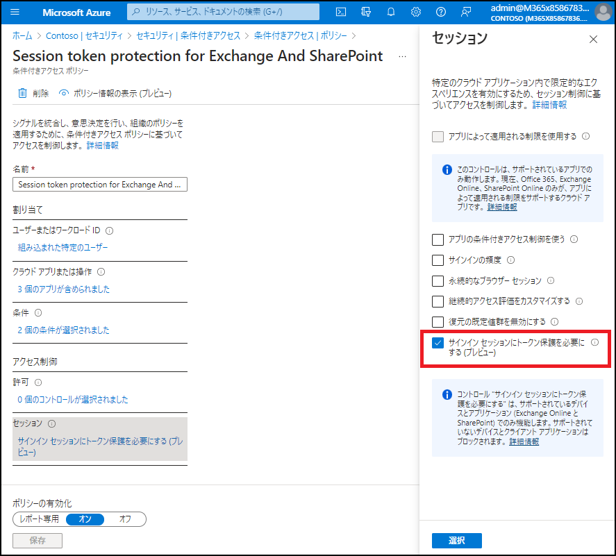
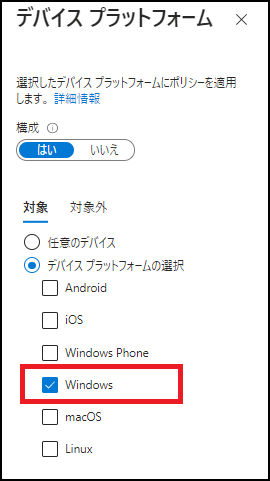
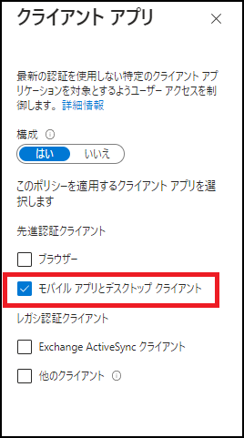

# パブリック プレビュー: サインイン セッションのトークン保護

こんにちは、Azure Identity サポート チームの 五十嵐 です。

本記事は、2023 年 5 月 10 日に米国の Azure Active Directory Identity Blog で公開された [Public Preview: Token Protection for Sign-In Sessions](https://techcommunity.microsoft.com/t5/microsoft-entra-azure-ad-blog/public-preview-token-protection-for-sign-in-sessions/ba-p/3815756) を意訳したものになります。ご不明点等ございましたらサポート チームまでお問い合わせください。

---

先日の [Microsoft Secure のイベント](https://secure.microsoft.com/en-US/sessions/6ab7d30b-6322-483e-a3f3-34856e51bb15?source=sessions) で、サインイン セッションのためのトークン保護という新機能を発表しました。本機能は、トークンの盗難やリプレイ攻撃の対策として開発された Microsoft Entra の一連の機能の第一弾となります。

ご存知のように、トークンの盗難を伴う攻撃はますます頻発しています。この問題に対処するため、私たちマイクロソフトは、Azure AD の条件付きアクセスを使用して重要なリソースをよりよく保護できるようにするための包括的な投資を行っています。

弊社のソリューションは、トークンの盗難に対抗する従来のアプローチよりも優れたセキュリティ特性を提供することを目的としています。これには、ユーザー デバイス上でトークンを盗むマルウェアによる攻撃や悪意のある内部攻撃者からの防御が含まれます。さらに、当社のソリューションでは、条件付きアクセスを使用してポリシーの適用をきめ細かく制御することも可能です。

トークンの保護は、トークンが意図したデバイス上でのみ使用できることを保証します。条件付きアクセス ポリシーを適用する場合、リソースへのアクセスを許可するトークンが、ユーザーが最初にサインインしたデバイスから提示されることを保証する必要があります。これにより、重要なユーザーやデータをトークンの盗難を伴う侵害から最大限保護することができます。

この機能の最初のプレビューでは、Windows ネイティブ クライアントから盗まれたリフレッシュ トークンが使用された場合でも、Exchange メールボックスや SharePoint サイトなどの Office 365 リソースを不正アクセスから保護することが可能となります。リフレッシュ トークンは、他の種類のトークンよりも有効期間が長く、スコープが広い傾向があるため、攻撃者としても窃取する価値が高いものとなります。このため、まずリフレッシュ トークンを保護の対象としています。今後のリリースでは、この保護をより多くのアプリケーションやデータ、他のクライアント プラットフォーム、他の種類のトークンに拡大する予定です。

これを有効にする方法について、簡単に説明します。

## サインイン セッションに対するトークン保護の条件付きアクセスの実施 (プレビュー)

条件付きアクセスのセッション制御で "サインイン セッションにトークン保護を必要にする" を選択すると、ポリシーの範囲内で定義されたリソースにアクセスするためのセッションが、所有権の証明 (proof-of-possession) を使用することで、ユーザーがサインインしたデバイスに紐づけられます。所有権の証明では、クライアントがデバイス上の秘密鍵にアクセスできることを証明する必要があります。リフレッシュ トークンがユーザーのデバイスから盗まれ、攻撃者が管理するデバイスにコピーされた状況で、攻撃者がそのリフレッシュ トークンを使用してアクセスを試みた場合、所有権の証明は達成できず、ポリシーによってアクセスがブロックされます。

以下が今回の初回プレビューに特化した設定上の注意点です: まず、サポートされるリソースは、Exchange と SharePoint です。Teams のサポートは近日中に、その他のサービスも近日中に追加される予定です。

Azure AD に登録された Windows 10 または 11 のデバイスで、現在はネイティブのデスクトップ アプリケーションのみがサポートされています。Web アプリや他のクライアント プラットフォームからの正当なアクセスをブロックしないようにするには、[条件] > [デバイス プラットフォーム] タブで "Windows" だけを選択し、[条件] > [クライアント アプリ] タブで "ブラウザー" を選択せずに "モバイル アプリとデスクトップ クライアント" のみを選択する必要があります。

他のポリシーと同様に、特定のユーザーまたはグループにスコープを設定し、管理者がテナントにアクセスできなくならないように特定のアカウントを除外することも忘れないようにしてください。ポリシーの導入を計画する前に、[ドキュメント](https://learn.microsoft.com/ja-jp/azure/active-directory/conditional-access/concept-token-protection) をよく読むこともお勧めします。アクセスが正当なものであることを確認するため、ポリシーはユーザーが所有権の証明のステップを実行できるよう準拠した OS とアプリのバージョンを使用していることを確認します。ポリシーをオンにする前に、ポリシーの影響を評価するため、条件付きアクセスのレポート専用モードを使用することを強くお勧めします。また、所有権の証明によるトークンの保護はゼロ トラストの多層防御の戦略の一部でしかないため、加えてデバイス管理と準拠、クラウドベースのフィッシング耐性のある認証の使用などを併せて使用することも忘れないようご注意ください。

トークン保護のロードマップにある今後のリリースは以下のとおりです: 

- リソースとアクセス シナリオの追加
- Web アプリケーションの追加 (MSAL.js を使用する Web アプリケーションの多層防御機能の向上)
- サインイン セッションのトークンの保護 (Mac、iOS、Android、Linux クライアントにおけるリフレッシュ トークンの盗難シナリオに対応)
- アプリのセッション トークンの保護 (アクセス トークンの盗難とリプレイ攻撃を制限)

今後これらについてさらに詳しくお伝えすることを楽しみにしています。詳しくは、今後のブログ記事をご覧ください。
