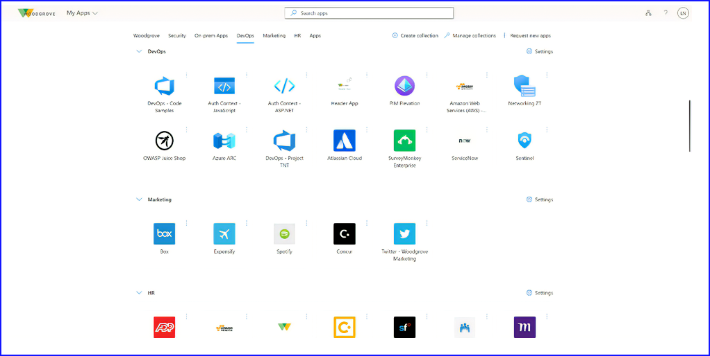
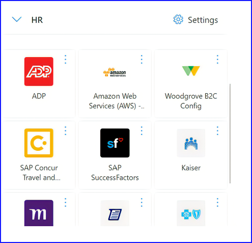
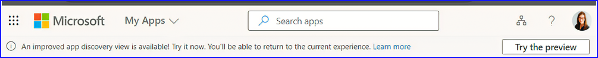

Microsoft Entra のエンド ツー エンドの機能を拡張し続けている私たちは、強力なアイデンティティとアクセス管理の実装が、組織とそのすべての人々の生産性を向上させるはずだと固く信じています。安全なアクセスは、ユーザーにとって、可能な限り摩擦のないものでなければなりません。

お客様のようなお客様からのフィードバックにより、私たちは [My Apps ポータル](https://myapps.microsoft.com/) に大幅な機能強化を提供しています。今週、パブリックプレビューを開始し、すべての Azure Active Directory (Azure AD) ユーザーが [myapps.microsoft.com](https://myapps.microsoft.com/) で利用できます。

 
## 日常業務のスタート地点
My Appsは、必要なアプリケーションに迅速かつ安全にアクセスできるようにします。ユーザーは、自分がアクセスできるアプリケーションを発見して起動できるため、このポータルは、あらゆるタスクの出発点となることでしょう。 

## より使いやすくなりました 
新しいビューは、より使いやすく、レスポンシブで、アクセスしやすくなっています。同じスペースにより多くのアプリが表示され、コレクション（アプリのグループ）間を移動するために、クリックする代わりにスクロールすることができます。特に複数のコレクションを使用する場合、大型モニターからモバイル デバイスまで、より適切に拡大縮小されます。これらにより、My Apps がマウス、タッチ スクリーン、スクリーン リーダー、キーボードのいずれのナビゲーションで使用されている場合でも、ユーザーがアプリケーションを見つけて起動するのがより簡単かつ迅速になります。

さらに、各コレクションは個別に折りたたむことができ、ナビゲーションが容易になります。また、関連する設定ボタンがあり、コレクションの非表示など、関連するアクションを簡単に見つけることができます。

## パブリック プレビューを今すぐ体験 
ユーザーは、ヘッダーの「Try the preview」ボタンを選択することでプレビューに参加でき、「Return to previous view」ボタンを選択することで以前のビューに戻ることができます。なお、今回のプレビューでは、ドラッグ＆ドロップは使用できませんが、一般公開までに追加される予定です。

改善された [My Apps](https://myapps.microsoft.com/) の体験を今すぐお試しいただき、主要なステーク ホルダーやユーザーと共有してください。

## 念のため、My Appsにサイトを追加する手順 
My Apps では、ユーザーが Web サイトへのリンクを作成できるようになったため、関連するすべてのアプリとサイトにアクセスできるようになりました。Azure AD とまだ統合されていない Web サイトを頻繁に訪問する場合、簡単なリンクを作成することで追加することができます。サイトを作成するには、「サイトの追加」をクリックし、名前と URL を入力します。

