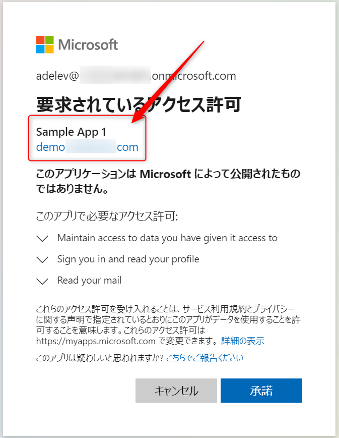
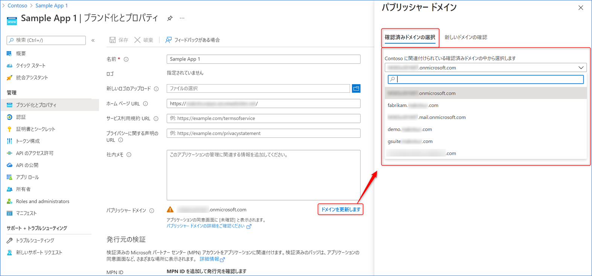
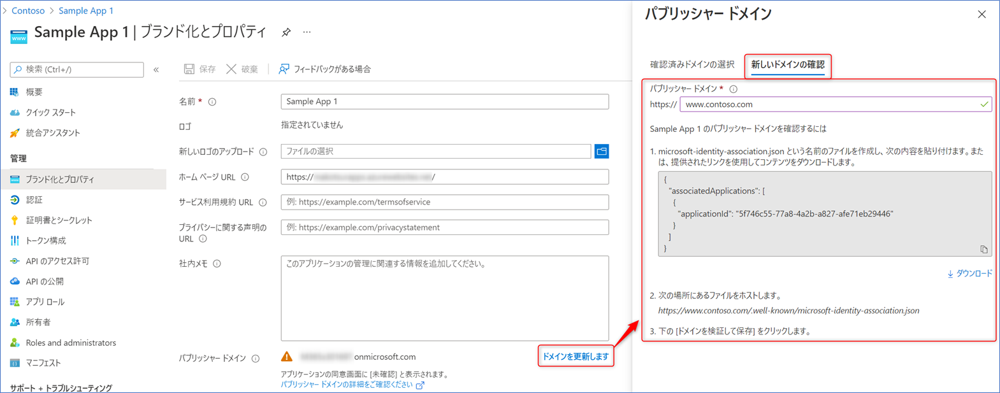
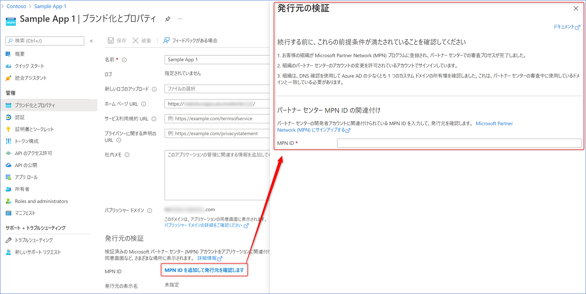
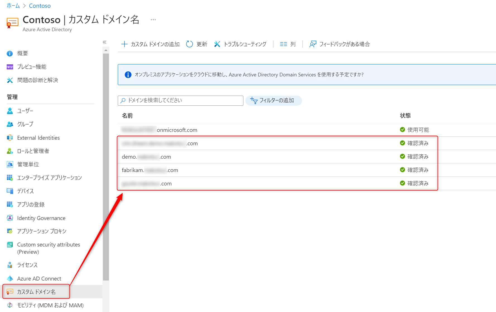

# パブリッシャー ドメイン (発行元ドメイン) と発行者確認

こんにちは、Azure & Identity サポート チームの鶴巻です。

今回はしばしばお問い合わせをいただく「パブリッシャー ドメイン (発行元ドメイン)」と「発行者確認」についてまとめます。 
なお、今回の記事は、アプリケーションを普段利用する人ではなく、Azure AD と連携するアプリケーションを開発している人向けとなります。 

## パブリッシャー ドメイン (発行元ドメイン) とは

アプリケーションと Azure AD を連携し、ユーザーが初めてアプリケーションにアクセスすると Azure AD 認証時に以下のような画面が表示される場合があります。



ここで表示されている "demo.〇〇〇.com" と表示されている部分がパブリッシャー ドメイン (発行元ドメイン) を表しています。 

この情報は、ユーザーがサインインしようとしているアプリケーションがどのような組織によって開発されたものであるかを示しています。ユーザーはこの情報を確認することで、信頼された組織が発行したアプリケーションかどうかを判断することが可能となります。弊社ではこのパブリッシャー ドメイン (発行元ドメイン) をどのように設定すればよいのかというお問い合わせをよくいただいていることから、以下でその詳細をおまとめいたします。

弊社ドキュメントの [発行者の確認](https://docs.microsoft.com/ja-jp/azure/active-directory/develop/publisher-verification-overview) にも詳細が記載されています。お時間あるときにご一読ください。

## パブリッシャー ドメインの登録に必要なこと

パブリッシャー ドメインの登録には大きく分けると以下の二つのステップがあります。

1. パブリッシャー ドメインを構成する
1. 発行者確認を行う

このうち、"発行者確認" においてよく問題となるケースが生じます。本資料では、これまでにお問い合わせいただいた実績を踏まえ、問題なく構成いただけた報告例をもとに発行者確認に必要な手順や情報を紹介します。

## パブリッシャー ドメインを構成する

パブリッシャー ドメインの構成は発行者確認と比べ比較的容易です。詳細は以下の資料に記載がございますが、押さえていただきたい点を後述します。 

[アプリケーションの発行元ドメインを構成する](https://docs.microsoft.com/ja-jp/azure/active-directory/develop/howto-configure-publisher-domain)

パブリッシャー ドメインは、以下のいずれかの方法で構成が可能です。どちらかの方法でドメインの検証ができれば問題ありませんので、アプリケーションを登録する対象テナントの環境に合わせてご選択ください。 

### 方法 1. 検証済みのドメインから選択する

設定対象テナントのカスタム ドメインに、検証済みドメインとしてあらかじめ登録しておくことで、以下のように選択肢に表示されるようになります。



カスタム ドメインの追加方法については [Azure Active Directory ポータルを使用してカスタム ドメイン名を追加する](https://docs.microsoft.com/ja-jp/azure/active-directory/fundamentals/add-custom-domain) をご参照ください。

### 方法 2. JSON ファイルを用意する

[新しいドメインの確認] を選択した際に表示される手順に従って構成します。 



まず、以下のような内容の JSON ファイルを事前に用意します。{YOUR-APP-ID-HERE} は、パブリッシャー ドメインを構成しているアプリケーションのアプリケーション ID に置き換えます。 

```JSON
{
   "associatedApplications": [
        {
            "applicationId": "{YOUR-APP-ID-HERE}"
        }
    ]
 }
```

> [!NOTE]
> パブリッシャー ドメインを構成するアプリケーションが複数ある場合は、{ "applicationId": "{YOUR-APP-ID-HERE}" } のブロックを必要な数分 "," で区切って定義します。 

次に、作成した JSON ファイルを、以下のようなパスでアクセスできるよう Web サーバー上に配置します。{YOUR-DOMAIN-HERE} は、[パブリッシャー ドメイン] 欄に入力したドメインに置き換えます。 

> https://{YOUR-DOMAIN-HERE}.com/.well-known/microsoft-identity-association.json

## 発行者確認を行う

発行者確認を行うには、[MPN ID を追加して発行元を確認します] をクリックして表示される画面にも表示されているとおり、事前に満たしておくべき条件がいくつかあります。以下にその条件をまとめます。



1. 大前提として [Microsoft Partner Network プログラム](https://docs.microsoft.com/ja-jp/partner-center/mpn-create-a-partner-center-account) に登録し審査が完了している。
2. パートナー グローバル アドレス (PGA) の連絡先メール アドレスのドメインが、アプリケーションを登録するテナントに、検証済みカスタム ドメインとして登録されている。



> [!NOTE]
> たとえば、admin＠contoso.com というメール アドレスが PGA の連絡先メール アドレスである場合、"contoso.com" ドメインが、アプリケーションを登録するテナントの検証済みカスタム ドメインに登録されている必要があります

> [!NOTE]
> 検証済みカスタム ドメインはサブドメインも許容されます。たとえば、admin＠contoso.com というメール アドレスが PGA の連絡先メール アドレスである場合、"sub.contoso.com" ドメインが、アプリケーションを登録するテナントの検証済みカスタム ドメインに登録されていれば問題ありません。"contoso.com" を検証済みカスタム ドメインとして構成いただく必要はありません。

3. アプリケーションが登録されている対象テナントが Microsoft Partner Network テナント管理の一覧に含まれている

発行者確認を行う前に、上記を満たしているかどうか事前にご確認をお願いします。実際に発行者確認を行う場合には、さらに以下の条件をすべて満たす必要があります。

1. 検証を実施するアカウントが Azure ポータルへ多要素認証を利用してサインインしている
2. 検証を実施するアカウントに以下の権限が割り当てられている
   - Azure AD で、アプリケーション管理者、クラウド アプリケーション管理者、グローバル管理者のいずれかの Azure AD ロールが割り当てられている
   - パートナー センターで、MPN 管理者、アカウント管理者のいずれかのロールが割り当てられている (Azure AD でグローバル管理者が割り当てられている場合は不要)

上記の内容の詳細は [アプリを発行者確認済みとしてマークする](https://docs.microsoft.com/ja-jp/azure/active-directory/develop/mark-app-as-publisher-verified) に記載があります。こちらもご一読ください。

## よくある質問

以下の点と併せて [発行者の確認に関するトラブルシューティング](https://docs.microsoft.com/ja-jp/azure/active-directory/develop/troubleshoot-publisher-verification) もご覧ください。 

### ゲスト ユーザーで作業を実施できますか

これまでにゲスト ユーザーで実施できた実績はありません。上記のとおり「アプリケーションが登録されている対象テナントが Microsoft Partner Network テナント管理の一覧に含まれている必要があります」と説明していますが、サインインに使用しているユーザー アカウントのテナントも同様に含まれている必要があります。ゲスト ユーザーのテナントが管理外のテナントである場合やマイクロソフト アカウントである場合、一覧に追加することができないことが想定されますため、アプリケーションを登録する組織内のユーザーで実施いただくことをおすすめいたします。 

もしうまく登録／構成ができない場合には、上記の確認ポイントをすべてクリアできているかどうかご確認いただき、そのうえで弊社サポートまでお問い合わせいただければうれしいです。

では、また今度！
