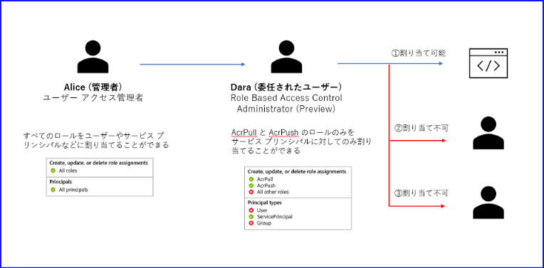
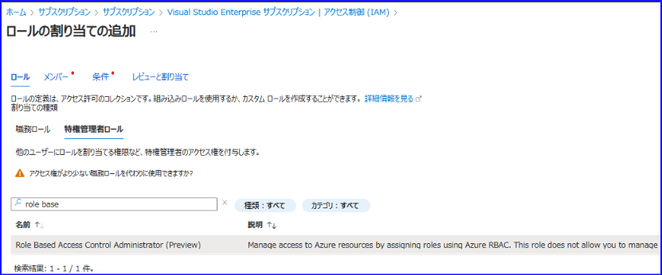
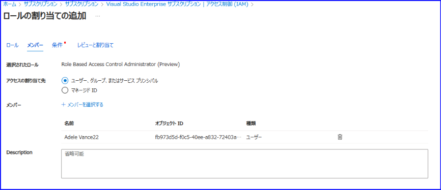
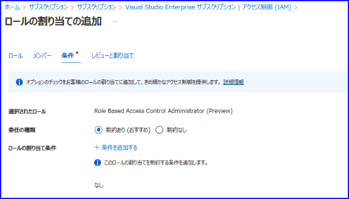
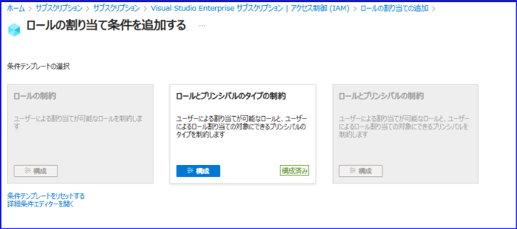
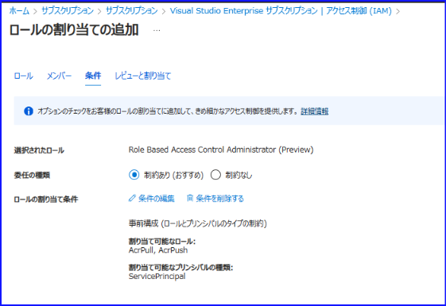
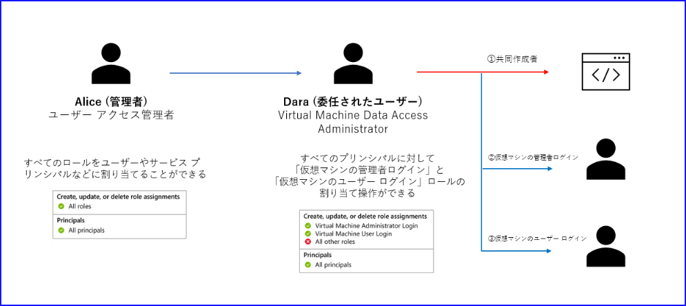
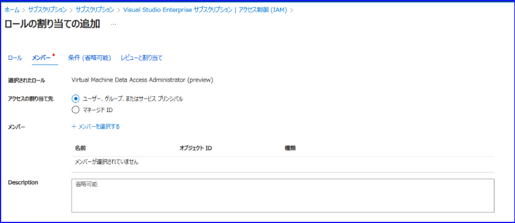
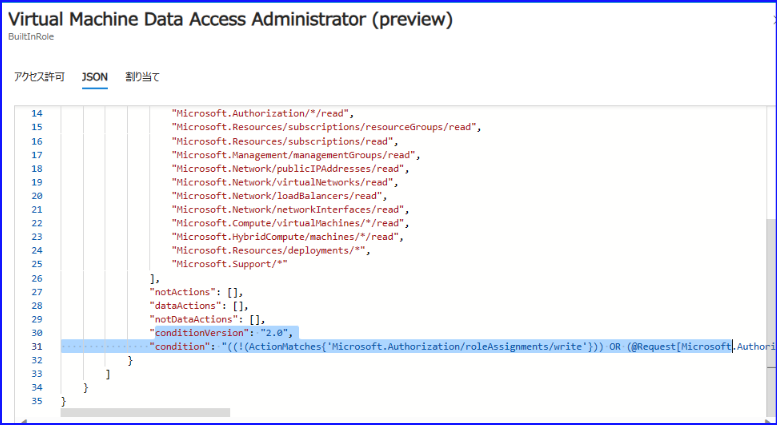

#  条件を利用した Azure RBAC のロール割り当て

こんにちは！ Azure ID チームの小出です。

本記事は、2023 年 10 月 25 日に公開された [Delegate Azure role assignment management using conditions](https://techcommunity.microsoft.com/t5/microsoft-entra-azure-ad-blog/delegate-azure-role-assignment-management-using-conditions/ba-p/3954216) をもとに、日本語に分かりやすくおまとめした記事となります。ご不明点などございましたら、お気軽にサポートまでお問い合わせください。

---

今回、 Azure ロールを割り当てる時に条件を指定する機能がパブリック プレビューとして公開されました。

これまでは、他の人にロールを割り当て可能な権限を委譲する際は、所有者もしくはユーザー アクセス管理者のロールを割り当てる必要がありました。具体的には、例えばこの記事を読んでいらっしゃる皆様がサブスクリプションの所有者を持っていると仮定して、社内の開発者から「開発で利用したいのでサブスクリプションのロールを他の人に割り当てる権限が欲しい」という要望をいただいたとします。このとき、これまでサブスクリプションの所有者として社内の開発者にできることとしては、「開発者に、所有者もしくはユーザー アクセス管理者を付与する」という操作でした。

しかし、開発者に所有者もしくはユーザー アクセス管理者を付与をしてしまうと、開発者が以下のようなこともできてしまいます。これは開発者に付与するには大きすぎる権限です。

- 所有者となった場合、サブスクリプションを削除したり、開発に関係のないリソースを変更したりできる
- いずれのロールの場合も、自身に追加でロールを割り当てて権限を昇格することができる

一方で、開発者から依頼があったときだけロールを付与する形にすると、スムーズな開発を妨げたり、承認フローで余計な時間がかかったりということとなります。

今回のパブリック プレビューでは、特定の条件を指定してロールの割り当てを作成する権限を付与できるようになりました。具体的には以下の 2 つの方法がありますので、それぞれ案内します。 

- 条件を利用して制約されたロールを割り当てる
- 条件を組み込んだ新しい組み込みロールを作成する

## 条件を使用してロールの割り当て管理を委任する方法

この方法は、アクセス許可を委任するユーザーに対し、ロールが利用できる条件を細かく指定するものです。例えば、以下の Alice という管理者は、ユーザー アクセス管理者を持っていますので、誰に対してもロールを割り当てられます。今回、Dara というユーザーに、ロール割り当て操作を委任することにしましたが、Alice が持っているユーザー アクセス管理者ロールのように、誰にでも自由にロールを割り当てられる構成にはしたくありません。

この時に今回の「条件を利用した Azure RBAC のロール割り当て」が活用できます。今回 Alice は Dara に対し、以下の条件を付けて「Role Based Access Control Administrator (Preview)」というロールを付与しました。

- AcrPull と AcrPush ロールは付与してもよいが、その他のロールは他のユーザーに付与できない
- ユーザーやグループに対してはロールを付与できないが、サービス プリンシパルになら付与できる

すると、Dara は ① のようにサービス プリンシパルに対して、 AcrPull や AcrPush のロールを付与することができます。一方、② や ③ では、ユーザーに対してロールを付与しようとしているため、条件に合わず割り当てができません。

Role Based Access Control Administrator (Preview) の付与方法は下記のとおりです。この操作を行うのは上記画面例ですと Alice になります。

1. サブスクリプション - アクセス制御（IAM） - 役割の画面を開き、ロール名を検索します。ポータルが日本語の場合でも、現時点ではロール名は英語のため、英語で検索ください。下記のように、ロールが表示されていることを確認します。

    

2. 上記画面の [追加] - [ロールの割り当ての追加] をクリックし、割り当ての追加画面を開きます。
3. 下記の画面が表示されるので、 [特権管理者ロール] のメニューを選択のうえロール名を検索し、クリックします。

    

4. このロールを割り当てたいユーザー（上記画面例ですと Dara にあたるユーザー）を指定します。

    

5. 次の画面に進み、委任の種類が "制約あり (おすすめ)" となっていることを確認します。さらに、その下にある「条件を追加する」をクリックします。

    

6. 下記の画面が表示されるので、追加したい条件によって選択します。今回は、ロールとプリンシパルのタイプを指定したいので、真ん中を指定します。

    

7. 右側に下記のような画面が表示されるので、許可してもよいロールやプリンシパルを指定します。

    

8. 選択が完了すると、下記のように「構成済み」となる点を確認します。

    

9. 下記画面にて最終確認を行い、ロールの割り当てを実施すれば完了です。

    

##  条件を組み込んだ新しい組み込みロールを使用してロールの割り当て管理を委任する方法

この方法は、新しく利用できるようになった組み込みロールを使う方法です。具体的には、Virtual Machine Data Access Administrator (preview) というロールや、Key Vault Data Access Administrator (preview) というロールが利用できるようになりました。こちらのロールを利用することで、関連するロールのみをユーザーに割り当てることができるようになります。

具体的に以下の図のとおりに説明いたしますと、Virtual Machine Data Access Administrator (preview) が割り当てられたユーザー Dara は、② や ③ のように、仮想マシンの管理者ログイン ロールや、仮想マシンのユーザー ログイン ロールを付与することができます。一方、① のように仮想マシンのアクセスに関連のないロールについては付与できないため、① の割り当ては失敗します。

割り当て方法は通常のロール割り当てと同様で、ロール割り当て画面で上記 2 つのロールのいずれかを指定する形になります。

ロールを割り当てるユーザー（上記例ですと Dara にあたるユーザー）を指定してロールを割り当てます。

もし、割り当て可能なプリンシパルを制限したい場合は、先の例と同様に条件を指定することも可能です。

条件を使用した場合は、下記のように構成済みと表示されているかを確認し、割り当てを完了します。

Data Access Administrator という文字列が含まれているロールには、既定で条件が組み込まれています。下記のように、ロールのアクセス許可を確認する画面で JSON タブを開き、condition と記載されている部分を確認すれば条件を確認可能です。

今後、一般的なシナリオを想定して、条件を組み込んだロールを追加していく予定です。簡単なロールの割り当てでリソースの管理ができるようになりますので、今後のアップデートをお待ちください。詳細につきましては、 [条件 (プレビュー) を使用して Azure ロールの割り当てを委任する例](https://learn.microsoft.com/ja-jp/azure/role-based-access-control/delegate-role-assignments-examples?tabs=template) の公開情報も参考となりますと幸いです。

本機能に関するフィードバックにつきましては、下記画面の右上にございます「フィードバック」から承っております。お客様のご意見・ご要望をお待ちいたしております。

