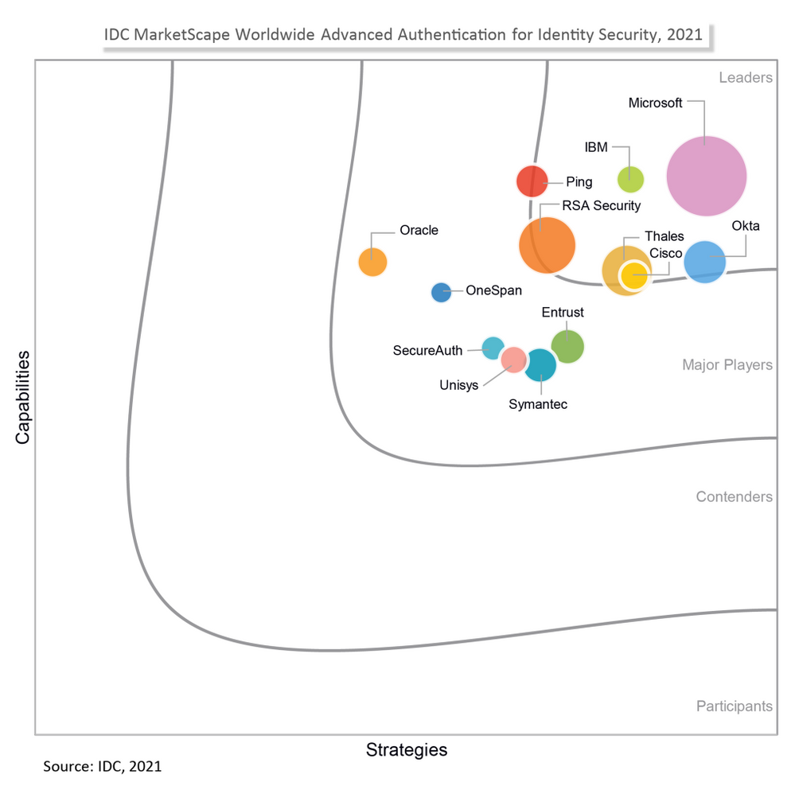

# Microsoft が IDC MarketScape により世界的かつ先進的な認証のリーダーとして認められました

こんにちは、Azure Identity サポート チームの中井です。

本記事は、2021 年 10 月 7 日に米国の Azure Active Directory Identity Blog で公開された [Microsoft recognized by the IDC MarketScape as a Leader in Worldwide Advanced Authentication for AAD](https://techcommunity.microsoft.com/t5/azure-active-directory-identity/microsoft-recognized-by-the-idc-marketscape-as-a-leader-in/ba-p/2464411) を意訳したものになります。ご不明点等ございましたらサポート チームまでお問い合わせください。

なお、IDC のレポートからの抜粋部分については、IDC より許可を得て翻訳しました。

------

Microsoft は、IDC MarketScape：Worldwide Advanced Authentication for Identity Security 2021 Vendor Assessment (doc #US46178720、2021 年 7 月) レポートにて、リーダー (先進的なベンダー) として選出されました。

IDC MarketScape では、企業の ID セキュリティ機能と戦略を分析しており、Microsoft はリーダーとして認められた 7 社のうちの 1 社と認定されました。詳細は [レポートの抜粋](https://idcdocserv.com/US46178720e_Microsoft) をご覧ください。

注意: 図や付随する言語を加工、編集することは禁止されています。本文書を他の言語に翻訳する場合や、本文書を第三者に提供 (再頒布) する場合は、別途 IDC との契約が必要です。

IDC MarketScape のベンダー分析モデルは、特定の市場において ICT サプライヤーが他社と比較してどれほど市場に適切に対応しているか概要を提供することを目的としています。調査方法は、質的基準と量的基準の両方に基づいた厳密な採点手法を採用しており、その結果を特定の市場における各ベンダーのポジションとして 1 つのグラフで表しています。Capabilities (縦軸) のスコアは、ベンダーの製品、市場投入、短期的なビジネスの実行力を評価しています。Strategy (横軸) スコアは、3 ～ 5 年のタイムフレームでのベンターの戦略と顧客要求との整合性を評価しています。ベンダーの市場シェアは、円の大きさで表されています。

出典: "IDC MarketScape: Worldwide Advanced Authentication for Identity Security 2021 Vendor Assessment", By: Jay Bretzmann、2021 年 7 月、IDC # US46178720

レポートの中で、サイバー  セキュリティ リサーチのプログラムディレクターであるジェイ・ブレッツマン氏は次のように述べています: "Microsoft Active Directory と Microsoft Azure Active Directory は、他の全ディレクトリ サービス プロバイダーを合わせたものよりも大きな ID ストアになっています。Microsoft の ID エコシステムは拡大を続けており、Windows 環境だけでなく非 Windows 環境においてもほとんどのユースケースに対応できる高度な認証機能を提供しています"。レポートではさらに、Azure Active Directory の Identity Protection、条件付きアクセス、継続的なアクセス評価、検証可能な資格情報 (verifiable credentials) の機能もハイライトとして挙げています。

Microsoft は、ID に基づくセキュリティに最優先で取り組んでいます。そのため、当社の取り組みが IDC MarketScape で評価されたことを非常に光栄に思います。私たちは、製品の開発や新しいソリューションの革新を行う際に、セキュリティの原則を重要視しています。IDC MarketScape で評価されたことは、お客様に ID に基づくセキュリティと快適なユーザー体験を提供するという当社のビジョンを証明するものだと考えています。

IDC MarketScape のガイダンスは、以下のように Microsoft のセキュリティ原則とも一致しています。

- **多要素認証 (MFA) の有効化**: レポートでは次のように述べられています: "IDC では、IT の調達側は、今年のセキュリティ ソフトウェア予算に MFA ソリューションを含めるべきと考えています。これは必ず実施すべきセキュリティの対応です。MFA は事実上 SaaS として提供されており、企業や組織にとって利用が推奨されるセキュリティ対策です"。
- **パスワードレス化**: レポートでは以下のように述べられています: "2021 年もしくは恐らく 2022 年以降になるかも知れませんが、パスワードレスのソリューションが、利用形態により広くユーザーに活用されるようになる日はそう遠くはありません。テクノロジーの調達者として、パスワードレスの導入は先延ばしにすべきでしょうか？IDC としてはそれは推奨しません。現在のパスワードレスの恩恵はデメリットを上回るものだからです。企業がパスワードのない未来を見据えることを願っています。"
- **条件付きアクセス ポリシーの利用**: IT 部門は、ユーザーがあるリソースにアクセスするために特定の条件を満たすことを要求する if-then ステートメントを設定することができます。
- **Identity Protection の適用**: 継続的なアクセス評価では、アカウントの無効化やパスワードのリセット、管理者によるユーザーの失効などの変更があった場合に、Exchange や Microsoft Teams へのアクティブなユーザー セッションをリアルタイムに終了させることが可能です。
 
本レポートではまた、業界の動向やセキュリティ侵害の主な原因を調査し、セキュリティ ソリューションの選定に関する推奨事項を提案しています。

詳細につきましては、[レポートの抜粋](https://idcdocserv.com/US46178720e_Microsoft) をご覧ください。

IDC MarketScape のベンダー評価に Microsoft が選ばれたことは、企業のセキュリティを高めるための直近の取り組みが業界で評価された最も新しい例といえます。より詳細については Microsoft のセキュリティに対する [先進的な取り組みの評価](https://www.microsoft.com/ja-jp/security/business/security-leaders-gartner-magic-quadrant) をご覧ください。

また、Azure AD でセキュリティ対策を強化するためにできることについては、[ID 基盤をセキュリティ保護する 5 つのステップ](https://docs.microsoft.com/ja-jp/azure/security/fundamentals/steps-secure-identity) をご覧ください。
