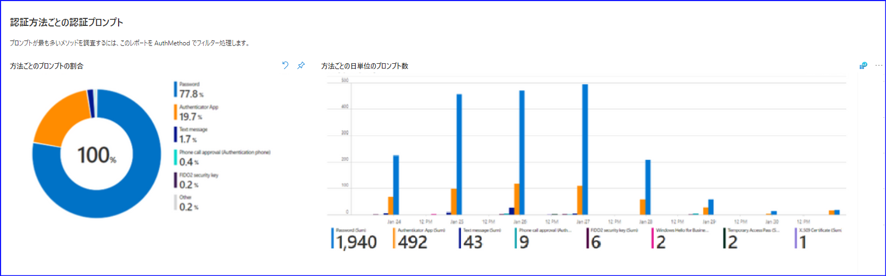
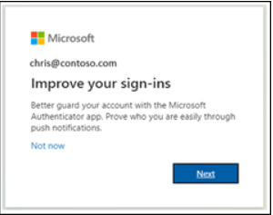
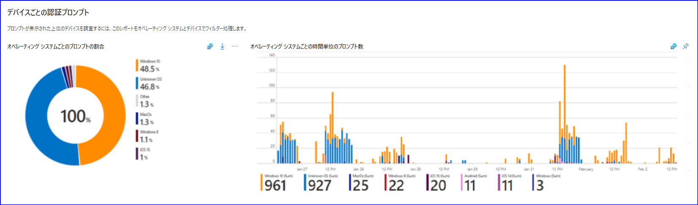
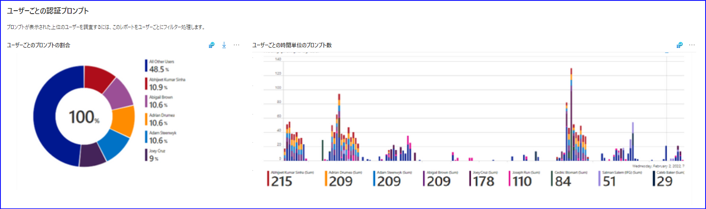
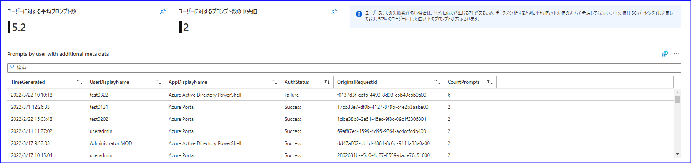
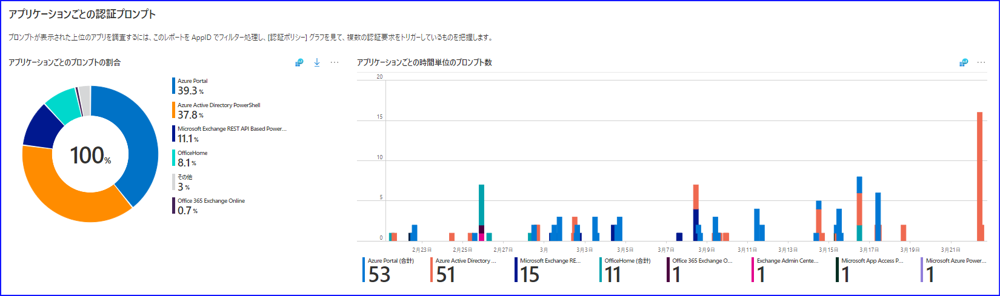
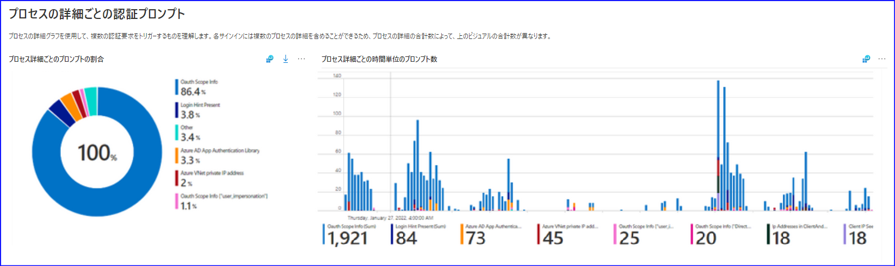
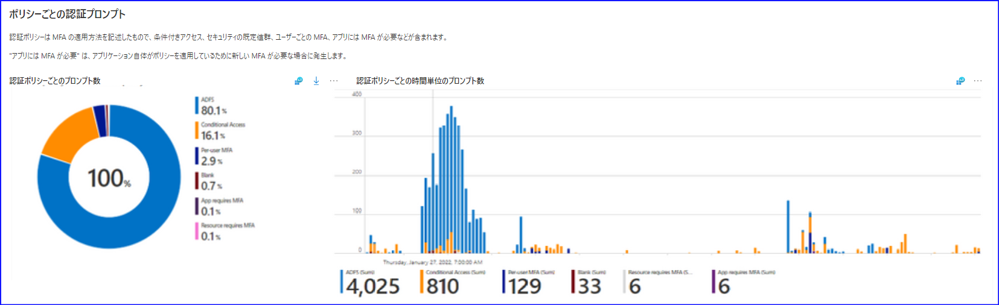
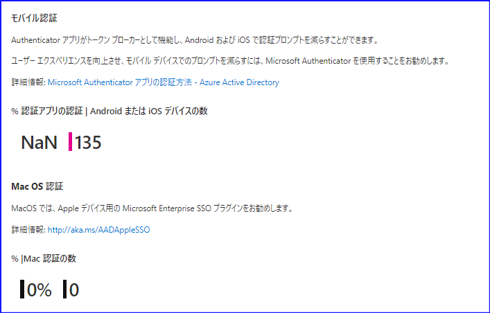
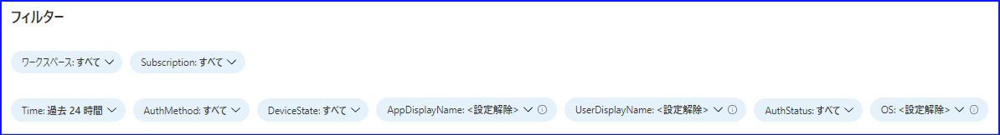

# 認証プロンプト分析ワークブックを使用して余分なプロンプトを削減する

こんにちは、 Azure Identity サポート チームの小出です。

本記事は、 2022 年 3 月 3 日に米国の Azure Active Directory Identity Blog で公開された [Reducing Extra Prompts with the Authentication Prompt Analysis Workbook](https://techcommunity.microsoft.com/t5/azure-active-directory-identity/reducing-extra-prompts-with-the-authentication-prompt-analysis/ba-p/2810647) を意訳したものになります。ご不明点などございましたら、サポート チームまでお問い合わせください。

---

最新の Azure AD ワークブック「認証プロンプトの分析」をご紹介します！これまでのワークブックについての情報は、[Azure Active Directory レポートに Azure Monitor ブックを使用する方法](https://docs.microsoft.com/ja-jp/azure/active-directory/reports-monitoring/howto-use-azure-monitor-workbooks) でご覧いただけます。もし Log Analytics を使用するようにログをまだセットアップしていない場合は、チュートリアルの [チュートリアル: Log Analytics ワークスペースを構成する](https://docs.microsoft.com/ja-jp/azure/active-directory/reports-monitoring/tutorial-log-analytics-wizard) を利用いただけます。その後、さらにこの新しいワークブックを読んで、利用可能なさまざまなデータセットについて学ぶとともに、余分なプロンプトを減らしてエンドユーザー体験を向上させる方法について知見を得ていただけたらと思います。
 
Inbar と Corissa より詳細を説明いたします。
 
----
 
こんにちは、Inbar Cizer Kobrinsky です！今回は、Corissa Koopmans と一緒に、最新の Azure AD ワークブック **「認証プロンプト分析」** を紹介します。このワークブックで利用できるさまざまなデータセットを紹介し、余分なプロンプトを減らすことによって、エンド ユーザー体験を向上させる方法について、いくつか知見を紹介いたします。

## 余分なプロンプトに着目する理由

ワークブックの詳細に入る前に、お客様の環境でサイバー攻撃をシミュレートしたお客様事例を紹介したいと思います。まず、簡単なパスワード スプレー攻撃を行い、組織において脆弱で簡単に推測できるパスワードをすべて探し出しました。そして、これらのユーザーに MFA のプロンプトを大量に要求し、ユーザーがどのように反応するかを確認しました。念のため、この会社では経営陣の承認を得てこれらの対応を実施しておりますので心配は無用です。

驚いたことに、このような予期せぬプロンプトが表示されたことを報告したユーザーは皆無でした。さらに悪いことに、多くのユーザーが、自分が MFA を開始したわけではないのに、それをよく理解せず、MFA プロンプトを盲目的に承認していたのです。あるユーザーは、嫌気がさしたのか Authenticator アプリを完全にアンインストールしてしまいました。

サイバー攻撃のシミュレーション以外に、ユーザーに過剰なプロンプトが表示される場合としては、アプリケーションの設定ミスや過度に多くの認証プロンプトを表示するポリシーが原因と考えられます。過剰にプロンプトを表示するとユーザーの生産性に影響を与えますし、しばしばユーザーが自分では開始しなかった MFA プロンプトを承認してしまうことにつながります。誤解のなきよう、MFA は非常に重要なものです！MFA を求めるべきかどうかという話をしているのではなく、どの程度の頻度でユーザーに MFA を求めるべきかという話をしているのです。

それでは、新しいワークブックとそれを使ってテナント内のプロンプトを分析する方法について説明していきたいと思います。例となるお客様環境を見ながら説明していきます。
 
### 認証方法

まずお客様の環境で、どのような種類の認証が、どのようなデバイスから行われているかを把握することから始めましょう。このためには、最初のデータのグラフである「認証方法別の認証プロンプト」を見ることになります。

まずは、組織内のユーザーがどのような認証方法を使用しているか、その利用状況は思っていたとおりかどうかという点をご確認ください。この例のお客様は、プロンプトを減らし、エンドユーザー体験を向上させるために、認証の二要素目として Authenticator アプリを使用するようにユーザーを促しています。Authenticator アプリを使用することで、どのようにモバイル デバイスのプロンプトを減らすことができるかについては、PRT に関するこの [詳細な記事](https://docs.microsoft.com/ja-jp/azure/active-directory/devices/concept-primary-refresh-token) をお読みください。  

ヒント: 電話ベースの方法から Authenticator アプリにユーザーを移行させるには、Microsoft Authenticator をセットアップするようユーザーを誘導ください。
詳細情報: [https://aka.ms/nudge](https://docs.microsoft.com/ja-jp/azure/active-directory/authentication/how-to-mfa-registration-campaign)

MFA プロンプトを減らすもう一つの方法は、[Hello for Business](https://docs.microsoft.com/ja-jp/windows/security/identity-protection/hello-for-business/hello-overview) や FIDO2 など、サインイン時に [パスワードレスの認証方式](https://docs.microsoft.com/ja-jp/azure/active-directory/authentication/concept-authentication-passwordless) に移行することです。ユーザーがテナントでどのような認証方法を登録しているかを確認するには、[Authentication Methods insights ダッシュボード](https://docs.microsoft.com/ja-jp/azure/active-directory/authentication/howto-authentication-methods-activity) を使用ください。実体が想定と異なる状態であれば、このダッシュボードをベースにさらに調査するのがおすすめです。

### デバイス

次の 2 つのグラフは、環境で使用されているデバイスに焦点を当てたものです。最初の図は、1 時間に何件の認証がどの OS から行われているかを示しています。ワークステーションや携帯電話で不要なプロンプトが表示されていないかどうか、どこから手を付ければユーザー体験を最も改善できるか判断するのに役立つはずです。また、古い OS のデバイス (前回のアップグレードで見落してしまったもの) があるかどうかを確認するのにも良い方法です。

これらのデータから、1 時間あたりのプロンプトのほとんどは、携帯電話ではなくワークステーションから発生していることがわかります。また、いくつかの Windows 8 マシンが、企業向け Windows 10 ビルドに正しくアップグレードされていないようです。この点も対応する必要があります。携帯電話からの認証が多かった場合、先に述べたように、Authenticator アプリを使用することでこれらのプロンプトを削減することが可能です。しかし、この例では Windows ワークステーションに着目しますので、次の図に移りましょう。

「デバイスの状態ごとの認証プロンプト」の画面では、Azure AD 参加デバイス、ハイブリッド Azure AD Join デバイス、Azure AD 登録デバイス、または Azure AD にとって不明な (管理されていない) デバイスがそれぞれどれだけのプロンプトに関連しているか表示されます。

上のグラフでは、プロンプトの大部分は管理されていないデバイスによるものであることがわかります。[Azure AD Join と Hybrid Azure AD Join](https://docs.microsoft.com/ja-jp/azure/active-directory/devices/hybrid-azuread-join-plan) を実装することで、デバイスが Azure AD Primary Refresh Token (PRT) を持つようになるため、お客様は追加の MFA プロンプトを劇的に削減することができます。これは、Authenticator アプリがモバイルでプロンプトを減らすことができるのと同じです。 

全体的な認証のビューと、デバイス観点で認証体験の状況を確認する方法は以上となります。次に、「ユーザーごとの認証プロンプト」のデータより、ユーザー観点で情報を見てみましょう。
 
### ユーザー

他のビューと同様に、このユーザー ビューでは、期間内に行われたプロンプトがユーザーの観点から表示されます。見てわかるように、これらの数字の一部は予想どおりです。しかし、予想以上に多くのプロンプトが求められているユーザーが数名いるため、さらに調査を行う必要があります。 

少し下にスクロールすると、プロンプトが最も多かったユーザーの概要と、アプリケーションやタイムスタンプ、リクエスト ID など、トラブルシューティングのための追加情報が表示されます。 参考として、全ユーザーのプロンプト数の平均値と中央値も表示されます。このリストの上位ユーザーは、ユーザー体験が良くない可能性が高い状況です。これは通常、何かが間違って設定されているか、またはアカウントが攻撃を受けていることが原因です。いずれにせよ、調査が必要であり、対策を講じる必要があります。  

### アプリケーション 

アプリケーションの設定が間違っていると、認証に失敗し続け、最終的にプロンプトの数が非常に多くなることがあります。 このことを念頭に置いて、プロンプトの割合が異常に高いアプリケーションに注目ください。多くのお客様にとって、最も使用しているアプリケーションはビジネス生産性アプリケーションでしょう。想定と異なるものがあれば、調査の必要があります。  

### 認証プロセスの詳細

サインインごとに、OAUTH のスコープ、認証ライブラリの種類、IP アドレス、レガシー TLS の有無、CAE (継続的アクセス評価) など、認証プロセスの詳細が記載されています。また、1 つのサインインに複数のプロセスが含まれる場合があることにも注意が必要です。
 

このデータは、TLS 1.0/1.1 および 3DES が廃止された際に、レガシー TLS のトラブルシューティングや環境内の検索に役立つはずです。詳しく知りたい方は [Azure AD TLS 1.1 および 1.0 の非推奨の環境で TLS 1.2 のサポートを有効にする](https://docs.microsoft.com/ja-jp/troubleshoot/azure/active-directory/enable-support-tls-environment?tabs=azure-monitor&WT.mc_id=Portal-fx) をご確認ください。
 
### 認証ポリシー

Azure AD には、ユーザーに MFA を要求できる複数のポリシーがあります。例えば、条件付きアクセス、ユーザーごとの MFA、セキュリティの既定値群からユーザーに MFA の実行を要求することができます。ユーザーが MFA を要求されるあまり知られていない方法としては、アクセスのためにアプリが MFA を要求する場合です (ID プロバイダーではなく、Relying party によって強制される)。例えば、ユーザーがセキュリティ情報を更新しに行く場合、毎回 MFA が要求されます。以下のグラフは、テナントでユーザーに MFA を強制する想定外のポリシーがあるかどうかを確認するのに役立ちます。

### 推薦事項とワークブックのヒント 

最後に、ユーザー体験を向上させ、プロンプトを減らすための 4 つの方法を以下に示します。例えば、Authenticator アプリ以外の方法を使用しているモバイル デバイスの認証プロンプトを特定することが可能です。

ワークブックの最後のヒントとして、ワークブックの最上部よりフィルタリングをより細かく設定することができます。認証要求の多い特定のユーザーをフィルタリングしたり、サインインに失敗したアプリケーションのみを表示したりすることで、新たな発見を得て、引き続き解決に取り組むことができます。 

詳しくは、[再認証プロンプトを最適化し、Azure AD Multi-Factor Authentication のセッションの有効期間について理解する](https://docs.microsoft.com/ja-jp/azure/active-directory/authentication/concepts-azure-multi-factor-authentication-prompts-session-lifetime) をお読みになることをお勧めします。
 
このワークブックにより貴重な洞察が得られたり、貴社の組織でプロンプトを削減するのに役立てられたりすれば幸いです。このワークブックに関するご意見、ご感想がありましたら、この [簡単なアンケート](https://forms.office.com/pages/responsepage.aspx?id=v4j5cvGGr0GRqy180BHbR-Fe8yfx1zBKhEr1JlI5HMlUNUc4M1BEM0I5SThDWVM3QldESVhZU09TWC4u) にお答えください。  
