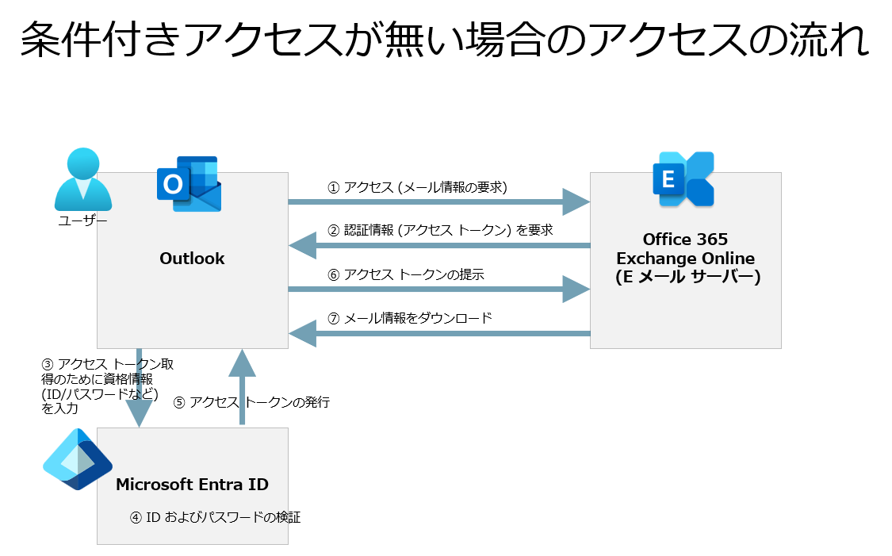

# 改めて知る Microsoft Entra 条件付きアクセス

こんにちは、Azure & Identity サポート チームの長谷川です。

Microsoft Entra 条件付きアクセスは、Microsoft Entra ID が提供する主要機能であり、非常に多くのお客様にご利用いただいています。一方で、条件付きアクセスについて誤解されている方が意外と多いと感じており、弊社サポートにはこの誤解により生じる問題や質問が多く寄せられます。

そこで本記事では、条件付きアクセスとはどういったものであるか、またどのようなコンセプトで提供されているかをイメージできるような情報をお届けします。後半では簡単なシナリオをベースに条件付きアクセスの動作を説明していきますので、本記事が条件付きアクセスへの理解の助けとなればうれしく思います。

## 条件付きアクセスとはどんな機能か

条件付きアクセスを一言でいうと、Microsoft 365 のサービスや Salesforce など、クラウド上で提供されているサービスへのアクセスを制御する機能です。条件付きアクセスはサインインを条件付きで許可するという機能であり、明示的に許可するという機能はありません。つまり、「条件に合ったサインインに対してポリシーを適用し、制御を適用する」という仕組みであり、ポリシーの条件に合わないものについては、ポリシーが適用されません。このためそのような条件に合わないサインインに対しては制御が適用されず、結果としてアクセスが許可されるということになります。一例をあげると、「多要素認証を要求する」という制御は、言い換えれば「多要素認証の要求に応えられなければサインインをブロックする」という制御に相当します。

## 条件付きアクセスのよくある利用例 (シナリオ)

条件付きアクセスのよくある利用例 (シナリオ) を以下にいくつか紹介します。

### ID およびパスワードの認証だけでなく多要素認証でユーザーを保護する

ユーザーの資格情報 (ID/パスワードなど) が攻撃者により推測されたり外部に流出したりすると、それを入手した攻撃者は流出した資格情報を使用して Microsoft 365 などにサインインすることができます。これによりアカウントの乗っ取りが成功し、そのユーザーしか知りえない情報が漏洩したり、アカウントが悪用されたりします。

条件付きアクセスを利用している場合、Microsoft 365 や Salesforce などクラウド上のサービスへのアクセス時に、ID およびパスワードといった資格情報に加えて多要素認証を要求することができます。これにより、電話番号を用いた認証や Microsoft Authenticator を用いた認証、さらにはハードウェア トークンを用いた追加認証などパスワード以外の認証要素 (多要素認証) を求めることができるようになります。こうなることで、仮に ID およびパスワードが攻撃者の手に渡っても、多要素認証を突破できない場合は、条件付きアクセスが Microsoft 365 へのアクセスをブロックしてくれます。つまり、ID およびパスワードが窃取されただけではサインインできなくなるため、セキュリティの強化につながります。この多要素認証の要求が、条件付きアクセスのもっとも一般的な利用シナリオです。

### 社外など特定の場所からのアクセスに制限を掛ける

重要な機密情報へのアクセスは、多要素認証を要求するだけでなく、そのユーザーが社内ネットワークにいる場合のみアクセスさせたいというご要望もあると思います。多要素認証だけでなく、このような場所の制御も条件付きアクセスで実現が可能です。例えば、社内ネットワークの出口となるパブリック IP アドレスを Microsoft Entra ID に登録しておけば、その IP アドレスが送信元のアクセスだけを条件付きアクセスでブロックしないように構成できます。これにより、ユーザーが特定のネットワークからのみアクセスできる構成を取ることが可能です。このように場所によるアクセス制御も条件付きアクセスでよく利用されています。

> [!TIP]
> 社外からのアクセスの場合は多要素認証を要求し、社内ネットワークからのアクセスの場合は多要素認証を要求しないというように、社内からのアクセスの場合は制限を緩めるような構成を取る例をよく見受けられます。しかしながら、このような構成はお勧めできません。というのも、攻撃者が社内ネットワークへの侵入に成功してしまうと、多要素認証が強制されず攻撃者がより行動しやすい状況となるためです。このため、多要素認証は最低限の保護として場所を選ばず強制することをお勧めします。

> [!NOTE]
> IP アドレスを利用した制御と聞くと、ファイアウォール製品のようなトラフィック制御をイメージされる方もいるかと思いますが、これは誤りです。条件付きアクセスはトラフィック自体は制御しません。

### 会社に登録されたデバイスからのみ Microsoft 365 へのアクセスを許可する

お使いの Windows PC やモバイル デバイスを Microsoft Entra ID に登録および参加させることで組織で管理している扱いにして利用することが可能です。加えて、Intune などのモバイル デバイス管理サービスを組み合わせるとデバイスに対してポリシーを適用することもできます。条件付きアクセスでは、このようにして会社の管理下にあるデバイスのみアクセスを許可するなどの構成も可能です。

### 危険な状態にあるユーザーに対して多要素認証を要求してパスワードリセットを行わせる

Microsoft Entra には ID Protection という機能があり、ユーザーのパスワードの漏洩や、普段利用していない外国からのアクセス、短時間の間にあり得ない距離を移動してサインインが行われるなどの異常を検知して、アラートを上げることができます。条件付きアクセスではこのアラートを利用して、サービスへのアクセスを動的にブロックしたり、サインインに多要素認証を求めたうえでアカウントのパスワード リセットを要求したりということが可能です。

## 条件付きアクセスの制御が具体的に適用される対象

これまで、条件付きアクセスは Microsoft 365 のサービスや Salesforce など、クラウド上で提供されているサービスへのアクセスを制御する機能であると繰り返し述べてきました。この「クラウド上で提供されているサービスへのアクセスを制御する」というのが重要なポイントであり、条件付きアクセスの制御はこの「クラウド上で提供されているサービスへのアクセス」に適用されます。

例えば 「条件付きアクセスでデスクトップ上の Outlook アプリを開けないようにしたい」 という要望は、条件付きアクセスでは完全に実現することができません。これは、このご要望では保護する対象 (制御の対象) がデスクトップ上の Outlook アプリであり、上述の 「クラウド上で提供されているサービスへのアクセス」 ではないためです。

とはいえこの説明ではイメージがわきにくいと思いますので、簡単ですが条件付きアクセスの制御についてユーザーが Outlook で E メール データを閲覧するシナリオを例に説明します。ユーザーが Outlook で E メールやカレンダーを閲覧しようとする場合、ダウンロード済みのデータを除いて Outlook 上には新着 E メールなどはありません。このためユーザーは Outlook を利用して E メール サーバーにアクセスし、新着 E メールやカレンダー情報を取得します。Office 365 ではこの E メール サーバーに該当するクラウド上のサービスが Office 365 Exchange Online です。

条件付きアクセスの用語としては、Outlook をクライアント アプリと呼び、Office 365 Exchange Online のことをターゲット リソース (単にリソースとも) と呼びます。リソースとはクラウド上にあるデータの保管場所のようなものをイメージいただくと良いと思います。

### 条件付きアクセスが無い場合のアクセスの流れ

1. ユーザーが E メールを閲覧しようとして、デスクトップ上の Outlook を開きます。
2. Outlook はそのユーザーの E メールデータをクラウド上 (Exchange Online) から取得する必要があるため、Exchange Online にアクセスします。
3. Exchange Online は、E メールデータを提供するためには Microsoft Entra ID に認証する必要があると応答し、Outlook がユーザーに対して (画面上に) Microsoft Entra ID のサインイン画面を表示します。
4. ユーザーは、サインイン画面に自身の資格情報を入力します。
5. ユーザーの入力した資格情報が正しければ、Microsoft Entra ID は Outlook に対してアクセス トークンと呼ばれるものを発行します。
6. Outlook はそのアクセス トークンを Office 365 Exchange Online に提示することで E メールのデータをダウンロードします。
7. Outlook は取得したデータを画面に表示します。

### 条件付きアクセスがある場合のアクセスの流れ

ここでは例として、Office 365 へのアクセスに対して多要素認証を要求するポリシーを構成している場合を考えます。

1. ユーザーが E メールを閲覧しようとして、デスクトップ上の Outlook を開きます。 
2. Outlook はそのユーザーの E メールデータをクラウド上 (Exchange Online) から取得する必要があるため、Exchange Online にアクセスします。
3. Exchange Online は、E メールデータを提供するためには Microsoft Entra ID に認証する必要があると応答し、Outlook がユーザーに対して (画面上に) Microsoft Entra ID のサインイン画面を表示します。
4. ユーザーは、サインイン画面に自身の資格情報を入力します。 
5. ユーザーの入力した資格情報が正しければ、Microsoft Entra ID は条件付きアクセス ポリシーを確認し、Exchange Online へのアクセスに適用されるポリシーがあるかを確認します。
6. Exchange Online は Office 365 の一部であるため、多要素認証を要求するポリシーがみつかります。
7. この結果として、Microsoft Entra ID からユーザーに対して多要素認証が要求されます。
8. 多要素認証に応えられない場合は処理を中断し、アクセス トークンは Outlook に発行されません。多要素認証に応えられればサインイン成功と判断し、Outlook に対してアクセス トークンを発行します。
9. Outlook はそのアクセス トークンを Office 365 Exchange Online に提示することで E メールのデータをダウンロードします。 
10. Outlook は取得したデータを画面に表示します。 

上述の流れのように、条件付きアクセスの処理の中では、クライアント アプリ (Outlook) ではなく、そのクライアント アプリがアクセスしようとしている先のクラウド上のサービス (Exchange Online) を意識することが重要です。

裏を返すと、条件付きアクセスを用いて、既に Outlook にダウンロードされた E メール データへのアクセスを制御するということはできません。Outlook にはオフライン アクセスという機能があり、インターネットに接続されていない環境でも、ダウンロード済みの E メールやカレンダーを閲覧可能です。「条件付きアクセスでデスクトップの Outlook アプリを開けないようにしたい」という要望を条件付きアクセスで完全に実現することができないのはこのためです。

なお、クラウド上のサービスである Exchange Online を対象にした条件付きアクセス ポリシーを構成すれば、どのクライアント アプリからのアクセスであっても、そのポリシーが適用されます。Outlook からのアクセスであっても、Teams からであっても、自作の E メール アプリからであっても、Exchange Online (E メールやカレンダー) へのアクセスにはその条件付きアクセス ポリシーが適用されます。これも、条件付きアクセスは、クライアント アプリ (Outlook や Teams) ではなく、そのクライアント アプリがアクセスしようとしている先のクラウド上のサービス (Exchange Online) へのアクセスを制御する機能であるとご理解いただければ納得しやすいかと思います。

## 条件付きアクセスの適用のされ方とポリシーの構成に対する考え方

条件付きアクセスは上述のように様々なアクセス制御を構成できますが、具体的にポリシーを構成する際は、以下のような点を考慮することをお勧めします。

- 条件付きアクセスでは、ポリシーを設定しない (既定の状態の) 場合、すべてのアクセスが許可されます (資格情報以外の制御がかかりません)。
- 条件付きアクセスではアクセスのブロックや MFA の要求のようにアクセスに制限を掛けることはことはできますが、許可を設定する概念がありません。  
- 条件付きアクセスには、ファイアウォールのルールのように、どのポリシーにも当てはまらないものを最終的に既定でブロックするようなポリシーはなく、構成もできません。 
- 条件付きアクセスではポリシーの適用順序 (優先順位) を構成することはできません。
- 複数の条件付きアクセス ポリシーに合致する場合、それらが組み合わされて最も厳しい制御が適用されます。

以上から、ファイアウォールのルール作成のようなイメージで条件付きアクセス ポリシーの作成を行うことはできません。

条件付きアクセス ポリシーを構成する際は、社員の方々 (実際の人間) の「会社のビル」や「会社のビル内の特定のフロア」への入退出の管理をイメージいただくと良いと思います。例えば、ある人が会社のビルに入る場合、入り口のゲートに社員証をかざしたり、守衛の方に社員証を見せるなどすると思います。会社のビルにアクセスする際には基本的にすべての人がこのような最低限の認証を行うはずです。皆が社員証を提示して入館したら、ビル内を基本的に自由に移動できますが、個人情報を扱うフロアに入るには追加の認証 (暗証番号など) が必要となる場合や、機密情報を扱う部屋には数名の限られた人のみ入室できるという場合もあるはずです。社員証を紛失したと報告してきた社員については、既存の社員証を廃止して再度本人確認する必要も生じます。

上記のような例に基づくと以下のような条件付きアクセス ポリシーが導き出されます。

- ポリシー 1: すべてのユーザーに資格情報と多要素認証を要求する (ビルへの入館に社員証を呈示することに相当)
- ポリシー 2: 重要なサービスへのアクセスにはより強度の高い多要素認証を要求 もしくは 会社が管理するデバイスを要求する (個人情報を扱うフロアに入るには追加の認証が必要に相当)
- ポリシー 3: 特定のサービスへのアクセスはすべての人をブロックする (一部のユーザーのみブロックから除外する) (数名の限られた人のみ入室できるに相当)
- ポリシー 4: リスク (資格情報の漏洩) が生じたユーザーにはパスワード リセットを強制する (社員証を紛失した際に相当)

以上のように、まず広く全員をカバーするポリシーを作り、それに加えて、アクセス先の各リソースやシナリオごとに追加の認証や条件を設けるというのがお勧めするポリシーの構成です。会社のビルへの入館やその後の社員の移動、リスクの発生など現実世界の人の動きをイメージいただくとよいと思います。Microsoft Entra という製品名は Entrance (入り口) を模していることもあり、このようなサービスへの入り口とお考えいただければ幸いです。

## おわりに

条件付きアクセスがどのような機能であるかを簡単に説明しました。こちらを参考のうえ、条件付きアクセスをさらに活用いただければと思います。製品動作に関する正式な見解や回答については、お客様環境などを十分に把握したうえでサポート部門より提供しますので、ぜひ弊社サポート サービスをご利用ください。

本記事と併せて以下の記事も是非ご参照ください。

- [Azure AD の条件付きアクセスに関する Q&A](../azure-active-directory/qanda-conditional-access.md)
- [詳説！Azure AD 条件付きアクセス - 設計のやり方編](https://github.com/yusukekodama/PMActivities/blob/master/Webinar/Schedule.md#season-3-2019%E5%B9%B4-3%E6%9C%88---6%E6%9C%88%E5%AE%9F%E6%96%BD)
