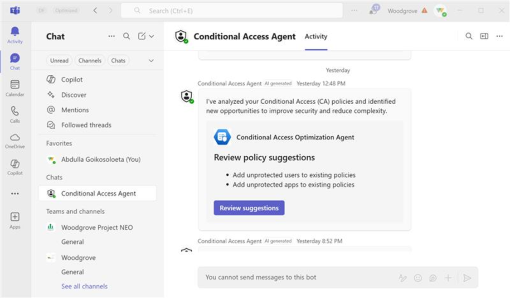
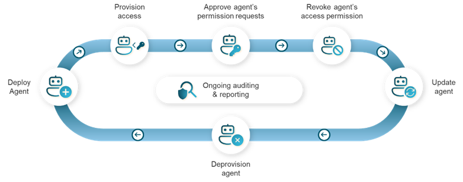
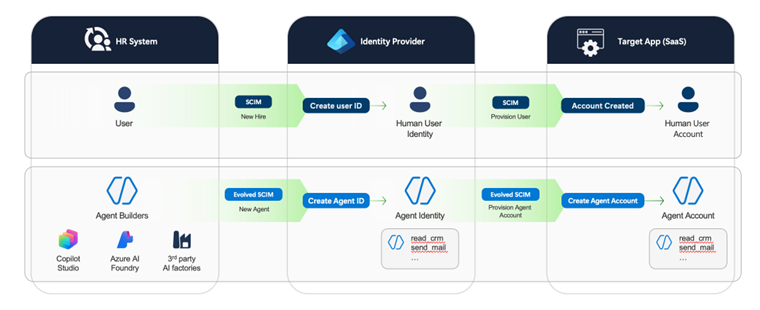

# AI の大波に乗る: エージェント時代に向けた Microsoft Entra の進化

こんにちは、Azure Identity サポート チームの 五十嵐 です。

本記事は、2025 年 11 月 11 日に米国の Microsoft Entra (Azure AD) Blog で公開された [Riding the AI Wave: How Microsoft Entra is Evolving for the Agentic Era](https://techcommunity.microsoft.com/blog/microsoft-entra-blog/riding-the-ai-wave-how-microsoft-entra-is-evolving-for-the-agentic-era/4460536) の抄訳です。ご不明点等ございましたらサポート チームまでお問い合わせください。

----

このブログは、2025 年 10 月に開催された [The Experts Conference](https://www.quest.com/the-experts-conference/) での私の基調講演をもとにしています。

私は Microsoft に入社して 34 年目になります。入社当時は飲酒できないほど若く、白髪もなかったことを思うと、信じられません。約 15 年前、私の電話が鳴った日のことを今でも覚えています。当時は、誰からの着信かを表示する小さな液晶画面付きの固定電話を実際に手に取って応答していました。ディスプレイにはこう表示されました: "Satya N." ―― なんと！

「やあ、Alex」と彼は言いました。「ID を担当するチームのディレクターという新しいロールがあるんだけど、君がぴったりだと思うんだ。」

まず、Satya Nadella が直接電話してきたことに驚きました。次に思ったのは、「本当に？僕に ID の仕事を？」ということです。しかし、その後 2 時間、彼は ID が Microsoft のエンタープライズ戦略の基盤であり、クラウドへの移行を推進するために助けが必要なんだと説明してくれました。

3 週間後、私はこれまでで最高といえる仕事を始めることになりました。オンプレミスの Active Directory をクラウドに移行し、Azure Active Directory として進化させ、さらに Microsoft Entra という完全な ID およびアクセス管理ソリューションへと発展させる仕事です。その旅は本当に素晴らしいものでしたが、ID の仕組み自体は根本的には変わっていません。

そして今、はるかに大きなイノベーションの波が始まっています。

## AI という大波

1 年前、上司の [Joy Chik](https://www.linkedin.com/in/joy-chik/) にこう言われました。「AI に注力して、来たるべき未来に備える方法を考えてほしい」と。

それ以来、私は AI ツールを試し、自分のエージェントを作り、戦略をまとめ、世界中の顧客、業界アナリスト、AI 専門家と話をしてきました。だからこそ、次の波は、人間の働き方や経済の仕組みを、産業革命、電気革命、インターネット革命、モバイル革命と同じように根本から変えると確信しています。

約 1 万 2 千年前、人類は植物や動物を家畜化し、狩猟採集から農耕へと移行しました。その次の大きな波では、複雑な社会を築き、政府を作りました。産業革命と石炭、蒸気、そして最終的には電気による力で、大規模な工場や都市を建設できるようになりました。電気による革命の前は、ほとんどの人が暗くなると眠りについていました。今では皆、夜遅くまでテレビを見ながらデバイスを上に下にとスワイプしています。

現在、私たちはインターネットとモバイル革命の真っただ中にいます。これは大きな変化でしたが、AI はそれをはるかに超えるイノベーションの波となろうとしています。

## AI エージェント導入の現実

多くのお客様も同じように感じているようです。[KPMG の調査](https://view.ceros.com/kpmg-design/kpmg-genai-study/p/1) によると、大企業の 42 ％ が現在、AI エージェントを実際に活用しており、これはわずか 6 か月前の 11 ％ から急増しています (※)。まだ始まったばかりです。

※ KPMG AI Quarterly Pulse Survey | Q3 2025. September 2025. n= 130 U.S.-based C-suite and business leaders representing organizations with annual revenue of $1 billion or more.

[Microsoft 365](https://adoption.microsoft.com/ja-jp/ai-agents/agents-in-microsoft-365/) や [Security Copilot](https://learn.microsoft.com/ja-jp/copilot/security/agents-overview) プラットフォーム、さらに [Workday](https://www.workday.com/ja-jp/artificial-intelligence/ai-agents.html) や [ServiceNow](https://www.servicenow.com/jp/products/ai-agents.html) といったパートナーを通じて、ビジネスに役立つ優れたエージェントがすでに利用可能です。

IDC の予測では、2028 年までに先進国の大企業で 13 億もの AI エージェントが稼働する見込みです (※)。実際の例として、Microsoft ではすでに開発、セキュリティ、リサーチ、分析の分野でエージェントを活用しています。私の見立てでは、人間の従業員よりもエージェントの数が多くなるのは時間の問題です。私の予想では 2 年以内に、Microsoft テナントで 100 万以上の AI エージェントが稼働しているでしょう。

しかも、エージェントは大量に存在するだけでなく、短命です。数週間稼働した後に停止されるため、大規模なスケールでエージェントの生成と消滅に対応できる仕組みが必要です。

※ IDC Info Snapshot, 1.3 Billion AI Agents by 2028, May 2025

## エージェントとは具体的に何か？

ここで少し立ち止まり、Microsoft で「エージェント」をどう捉えているかを説明します。

エージェントとは、役割を指示する一連の指示を持つ [LLM (大規模言語モデル)](https://learn.microsoft.com/ja-jp/training/modules/introduction-large-language-models/) であり、それを支えるコードによってさまざまな組み換えやガードレール (逸脱の防止機能) が提供され、結果の検証も行われます。しかし、エージェントを特別な存在にするのは次の 2 つの要素です。

  1. **ドメイン知識**: ビジネスや特定のプロセス、技術分野について理解しており、理想的には学習と改善を可能にする記憶機能を備えています。
  2. **アクションの実行能力**: MS Graph や Azure リソース、その他のシステムへの API 呼び出しを行い、アクションを実行し、その入力やデータを呼び出し元に返すことができます。

そして、実行能力があるからこそ、エージェントには適切なアクセス制御が必要です。私の主張は、すべてのエージェントに ID が必要だということです。

こう考えてみてください。自動車メーカーが VIN (車体番号) 番号なしで車を出荷することはありません。Microsoft が提供するすべてのエージェントには、組み込みのエージェント ID が付与され、追跡、アクセス制御、ライフサイクル管理が可能になります。

## 条件付きアクセス ポリシーを最適化するエージェント

私が特に注目しているエージェントのひとつが、Microsoft Entra の [条件付きアクセスの最適化エージェント](https://learn.microsoft.com/ja-jp/entra/security-copilot/conditional-access-agent-optimization) です。このエージェントは、条件付きアクセス ポリシーを精査し、その内容やセキュリティ上の抜け穴を把握できるよう支援し、さらにポリシーを最新の状態に保ちます。

このエージェントを活用することで、お客様は平均して月に 26 件ものポリシーの抜け穴を発見しています。これらは見過ごされるか、悪意ある攻撃に悪用される可能性があるものです。また、このエージェントを利用している顧客の 73 ％ が、その推奨事項に基づいてセキュリティ体制を大幅に改善しています (※)。

※ James Bono, Beibe Cheng, and Joaquin Lozano, Randomized Controlled Trials for Conditional Access Optimization Agent, October 2025, Microsoft Corporation.

これは単に ChatGPT を API に接続したものではありません。私のチームやお客様対応チームが、効果的な条件付きアクセス ポリシーを構築する中で得た知識とノウハウを詰め込んだ、目的特化型のエージェントです。このエージェントは、テナントとすべての条件付きアクセス ポリシーを継続的に分析し、ポリシーの重複を検出し、保護されていないユーザーやアプリケーションを見つけ、ワンクリックでギャップを修正するのを支援します。また、除外設定されていないブレークグラス アカウントや、除外が多すぎるポリシーなど、リスクのある構成も特定できます。

さらに、このエージェントは提案されたポリシー更新のために ServiceNow にチケットを作成し、変更管理の要件に準拠するように動作することも可能です。段階的なロールアウト計画を設計し、ユーザーへの影響を最小限に抑えながらポリシーを徐々に有効化することも可能です。パイロット モードでは新しいポリシーを展開することもできます。そして継続的に新しいユーザーやアプリをチェックし、ポリシーで適切に保護されていることを確認します。

🎯 Alex の 2025 年 10 月 14 日の投稿を参照ください: [The Conditional Access Optimization Agent keeps getting better—and making your life easier](https://techcommunity.microsoft.com/blog/microsoft-entra-blog/the-conditional-access-optimization-agent-keeps-getting-better%E2%80%94and-making-your-l/4460535)

条件付きアクセスの最適化エージェントを、ゼロ トラストのコンサルタント兼アドバイザーへと進化させるような存在だとお考えください。[セキュリティ体制を強化しながら、時間とコストを節約できるのです](https://tei.forrester.com/go/Microsoft/EntraSuite/?lang=en-us)。今後、Microsoft や業界全体から、より深い専門知識と分析を迅速かつ便利に提供するエージェントがさらに登場するでしょう。

Joy Chik は、11 月 18 日火曜日の Microsoft Ignite の [Microsoft Entra: What's New in Secure Access on the AI Frontier](https://ignite.microsoft.com/en-US/sessions/BRK243) セッションで、Microsoft Entra におけるエージェントの新機能を発表します。

## スケーラビリティのある管理体制: ペットではなく家畜の群れ

アクセス権のモデルに加えて、もう一つの大きな課題は、エージェントを大規模に管理することです。ここで、これまで使っていた「船と波」の比喩は一旦やめて、より現実的な陸上のたとえ話で考えてみましょう。**AI エージェントはペットではなく家畜のようなものと言えます**。ペットの世話をしたりご飯をあげたりするには時間がかかると思いますが、エージェントの世界ではそのような時間はありません。大量のエージェントが次々と生成され、消えていく中では、広大な "牧場" に広がる多様な群れを統制するように、ライフサイクルを自動化して大規模に管理する必要があります。

次のような戦略が必要になります:

- エージェントの展開および追跡する方法
- 誰がその責任を持つのかを把握する方法
- エージェントのアクセス権をプロビジョニングし承認する方法
- 継続的なアクセス レビューの実施
- 権限を自動的に取り消す仕組み
- 実行中のエージェントのバージョンを証明する方法
- 不要になったエージェントをデプロビジョニングする方法

ガバナンスやライフサイクル管理に穴があると、特にアクセス レビューで全員が圧倒されることになります。そこで、私たちはこの課題に取り組み、エージェントの ID ガバナンス戦略のためのフレームワークを構築しています。

## エージェントのセキュア アクセス: Microsoft Entra Agent ID

まもなく、エージェントをエンタープライズ レベルの ID として管理、保護、ガバナンスできるようになります。

Microsoft BUILD で、[AI エージェントを Microsoft Entra に統合すること](https://jpazureid.github.io/blog/azure-active-directory/announcing-microsoft-entra-agent-id-secure-and-manage-your-ai-agents/) を発表しました。私たちの目標はシンプルです。従業員 ID に適用している保護と制御を、AI エージェントにも提供することです。Microsoft Entra では、エージェントを新しい ID タイプとして追加し、アクセス管理、セキュリティ、ID ガバナンスの機能を開発しています。これらのエージェント ID は、Foundry、Copilot Studio、Security Copilot、そしてサードパーティ プラットフォームなど、エージェント作成に使うツールにあらかじめ構成されます。

詳細は、Ignite のセッション [Secure access for AI agents with Microsoft Entra](https://ignite.microsoft.com/en-US/sessions/BRK265) で紹介しますので、ぜひご参加ください。

## エージェント時代に向けた標準の進化

Microsoft Entra は、幅広いパートナーやアプリケーションのエコシステムを支えています。私たちは業界全体で協力し、すべてのエージェント型 ID システムとの統合を可能にし、セキュリティ リスクを低減し、専門家、学術機関、標準化団体で合意したベスト プラクティスに沿った共通標準を採用できるよう取り組んでいます。

そのために、OAuth 2.0 標準グループで次の重要な変更に取り組んでいます:

- エージェントを一流のアクターとして表現する (クライアントでもユーザーでもなく、新しい概念)
- エージェントが独立した権限を持てるようにする
- エージェントの行動を追跡可能にする (ログに "Alex の代理として動作するエージェント" ではなく "エージェントが動作" と表示)
- エージェントに対するきめ細かな権限、検出、委任を可能にする

これらの [OAuth への提案](https://jpazureid.github.io/blog/azure-active-directory/the-future-of-ai-agents%E2%80%94and-why-oauth-must-evolve/) により、エージェントが自分自身の代理として、ユーザーの代理として、または別のエージェントの代理として動作していることを識別できるようになります。

さらに、全体的な連鎖についても考えています。下流のエージェントが必要な権限をどのように発見し要求するのか、これらの機能は MCP に組み込まれ、エージェント間プロトコルを実現します。

また、エージェントに広範なクラウド全体ではなく、特定のフォルダーなどのリソースへのきめ細かなアクセスを付与する方法にも取り組んでいます。エージェントに必要なアクセス権だけを与えるというゼロ トラストの原則を守ることは、リスクを減らす優れた方法です。

## SCIM 標準の拡張: エージェントのライフサイクル管理

OAuth の取り組みに加えて、エージェント対応を可能にするため、[オープンな SCIM 標準への一連の変更](https://techcommunity.microsoft.com/blog/microsoft-entra-blog/beyond-oauth-why-scim-must-evolve-for-the-ai-agent-revolution/4433036) を提案しています。

現在の SCIM の仕組みでは、HR システムからユーザーを Entra に登録し、Entra でユーザーのレコードを作成し、その後ガバナンス システムを通じて他のアプリにユーザーがプロビジョニングされます。

エージェントにも同じ仕組みが必要です。あらゆるエージェント ビルダー (エージェントを作成する仕組み) は、SCIM を使ってエージェントのレコードを Entra に登録できる必要があります。そして Entra は、そのエージェント レコードを取得し、すべての SaaS アプリに対して正しく構成できるようにするという流れです。

これこそが、エージェントに関する優れたガバナンスと自動化を実現する正しい方法だと考えています。エージェントを登録するのは簡単ですが、継続的に管理するのははるかに難しい。そのため、SCIM の更新が必要なのです。

## 今すぐやるべきこと

まず、AI エージェントを使って色々と実験してみることをお勧めします。そして、自社にとってどのように役立つかを確認ください。[Microsoft Entra エージェント](https://learn.microsoft.com/ja-jp/entra/security-copilot/entra-agents) を試すか、[Copilot Studio](https://learn.microsoft.com/ja-jp/microsoft-copilot-studio/) で独自のエージェントを構築してみましょう。様々なことができてきっと驚くはずです。私のプロダクト管理チームでは、以前は 3 ～ 4 週間かかっていた作業が、エージェントを使うことで 2 ～ 3 日で完了するようになりました。まずはパイロット導入の [計画を立てることをお勧めします](https://www.microsoft.com/en-us/microsoft-copilot/blog/copilot-studio/how-to-deploy-transformational-enterprise-wide-agents-microsoft-as-customer-zero/)。

次に、エージェントの分類 (タクソノミー) を検討ください。先ほど説明した 3 種類のエージェントから始めるのがお勧めです。どんなエージェントを構築するか？どのようなデータが必要か？アクセスをどうガバナンスし、高い権限が必要なデータを信頼できるエージェントだけが扱えるようにするか？など、構築、管理、ガバナンスを検討する際に [役立つリソース](https://adoption.microsoft.com/ja-jp/ai-agents/copilot-studio/) が Copilot Studio チームから提供されています。

最後に、Ignite のライブ配信を視聴ください。11 月 18 日の Microsoft Ignite 2025 で開催される [Secure Access for AI Agents with Microsoft Entra](https://ignite.microsoft.com/en-US/sessions/BRK265) セッションに参加ください。ここで仕組みについて詳しく解説する予定です。

弊社は、皆さんのため、そして皆さんと共に、この難しい課題に取り組んでいます。Microsoft Entra の AI エージェント対応は、企業で AI エージェントを安全に活用するための優れたツールを提供します。Satya が BUILD で言ったとおりです: 私たちの目標はシンプルです ―― 従業員 ID に適用している保護と制御を、AI エージェントにも提供することなのです。

エージェントの波が押し寄せています。波に乗るか、波にのまれるか ―― 選ぶのは私たちです。

**さぁ、波に乗っていきましょう！**

Alex
