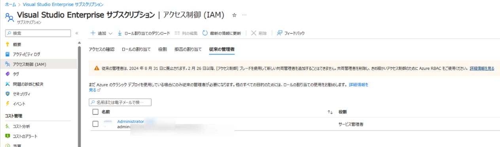
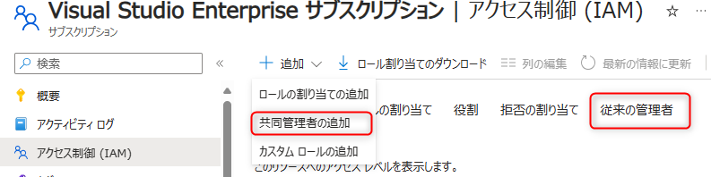
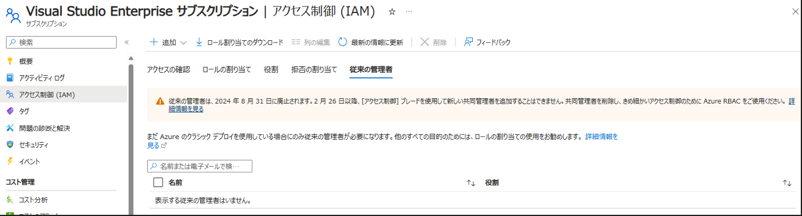
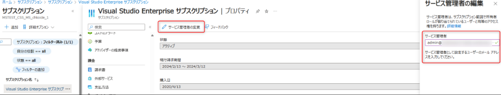

こんにちは！ Azure ID チームの小出です。

2024/3/12 にかけて、RM64-FSZ の通知や「Action required: Transition from Azure classic administrator roles to RBAC roles 」の件名にて、従来の管理者ロールの廃止についてメール通知が行われ、この廃止に関する内容について多くのお問い合わせをいただいております。

そこで今回は、本廃止に関する概要と対応について、よくある質問形式でおまとめして紹介します。

> [!IMPORTANT]
>
> 本情報は 2024/3/14 時点の情報を基に執筆しております。最新情報は Azure ポータル上の RM64-FSZ の通知や新たなアナウンスも合わせてご確認ください。本記事でも追加情報があり次第、順次追記いたします。

## 廃止の概要と実施いただきたいこと

この件名のメールは、 Azure クラシック リソースの廃止に伴い、2024/8/31 に Azure の「従来の管理者ロール」が廃止され、 RBAC への移行が必要となる点についてご案内しています。
また、 4/3 以降は Azure ポータルから新たに共同管理者（廃止予定のロール）を追加することができなくなる点を追加でご案内しています。
 
今回の通知内容（従来の管理者の廃止）に関して、お客様側に確認いただきたい点は「共同管理者やサービス管理者など、従来の管理者を利用しているユーザーがいるかどうか」という点です。
RBAC のアクセス制御画面より、「従来の管理者」タブを確認することで、現時点で従来の管理者ロールを保有しているユーザー一覧が表示されますので、まずは下記画面にて登録状況をご確認くださいませ。

 
なお、もしこちらの画面にサービス管理者や共同管理者を持つユーザーが表示されている場合、 8/31 以降は利用ができなくなります。
サービス管理者や共同管理者は、 Azure RBAC の「所有者」と同等のアクセス権を保有していますので、
もし従来の管理者を利用している場合には、 8/31 の期日より前に余裕をもって適切なユーザーに RBAC の所有者割り当てを追加してください。
RBAC 割り当て手順につきましては、[公開情報](https://learn.microsoft.com/ja-jp/azure/role-based-access-control/quickstart-assign-role-user-portal#grant-access) にてご案内しておりますので、併せてご確認ください。

## よくある質問

**Q. 「従来の管理者」とは何ですか？**

A. [こちら](https://learn.microsoft.com/ja-jp/azure/role-based-access-control/rbac-and-directory-admin-roles#classic-subscription-administrator-roles) に記載されている、アカウント管理者・サービス管理者・共同管理者の 3 つです。後述のクラシック リソースを管理するために使われていたロールです。
アカウント管理者とサービス管理者は、アカウントごと・サブスクリプションごとに 1 人登録されており、サブスクリプションのプロパティ画面から確認できます。

**Q. 今回廃止対象となるロールはどれですか？**

A. サービス管理者と共同管理者については、通知内にて RBAC へ移行するよう案内されておりますため、この 2 つのロールについては対処が必要です。

**Q. 4/3 以降共同管理者を追加できなくなるとは具体的にどういうことですか？**

A. 共同管理者は、サブスクリプションごとに最大 200 名まで追加することができます。このため、RBAC の追加と同様に、「共同管理者の追加」ボタンから追加することができますが、廃止に先立ち、4/3 以降はこの画面から割り当てを追加することができなくなります。

**Q. [公開情報](https://learn.microsoft.com/ja-jp/azure/role-based-access-control/classic-administrators) には共同管理者に関する記載のみのように見えますが、サービス管理者についても対応が必要ですか？**

A. はい、本通知では、サービス管理者についても RBAC への移行が必要です。
廃止後もサブスクリプションへのアクセスができるよう、共同管理者と同様に「RBAC の所有者ロールを追加する」操作を実施してください。

**Q. 共同管理者については削除すればよいと分かりましたが、サービス管理者も削除する必要はありますか？**

A. サービス管理者単体では、8/31 以降サブスクリプションの管理ができなくなるため、上記の通り「RBAC の所有者ロールを割り当てる」操作を実施してください。削除については任意ですが、必要に応じて共同管理者と同様に削除することをご検討ください。

なお、共同管理者と同様に削除可能な動作を確認していますので、技術的にサービス管理者の削除は可能ですが、サブスクリプションが孤立（誰も操作できなくなる）状態にならないよう、すべての操作が可能な所有者ロールを持つユーザーがいる状態で適宜サービス管理者の削除を実施ください。手順の詳細は [こちらの公開情報](https://learn.microsoft.com/ja-jp/azure/role-based-access-control/classic-administrators) も併せてご確認ください。

**Q. サービス管理者と共同管理者はどこから削除できますか？**

A. Azure サブスクリプションの [アクセス制御（IAM）] （RBAC を付与するときの画面）を開き、「従来の管理者」タブから確認できます。ユーザーが表示されている場合は、削除したいユーザーにチェックを入れて画面上部の「削除」をクリックします。

**Q. サービス管理者を削除したら、プロパティ画面で「サービス管理者：利用できません」と表示されるようになりました。また、「従来の管理者」メニューにも表示されなくなりました。しかし、確認したところまだクラシック リソースを管理する必要があったので元に戻したいです。どうしたらいいですか？**

A. アカウント管理者に登録されているユーザーであれば、 4/3 まではサービス管理者を指定することができます。アカウント管理者でサインインのうえ、下記「サービス管理者の変更」ボタンからサービス管理者を再度指定してください。 4/3 以降は追加ができないため、ご注意ください。

**Q. 所有者ロールは特権が高いので割り当てたくありません。どうすればいいですか。**

A. サブスクリプションに誰もアクセスできなくなってしまうことを防ぐため、すべての操作が可能な所有者ロールを数名割り当てることを強くお勧めします。それ以外のユーザーについては、必ずしも所有者ロールでなくても、ユーザーに実施させたい操作を元に必要なロールを割り当てれば問題ありません。

念のため、ロールを変更した後ユーザーが操作したい内容が問題なく実行できるか事前に確認のうえで RBAC への切り替えをご実施ください。詳細は[こちらの公開情報](https://learn.microsoft.com/ja-jp/azure/role-based-access-control/classic-administrators) も併せてご確認ください。

