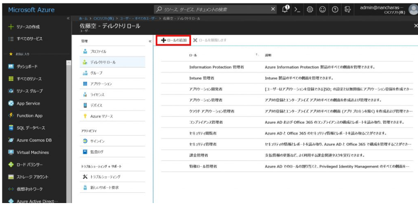
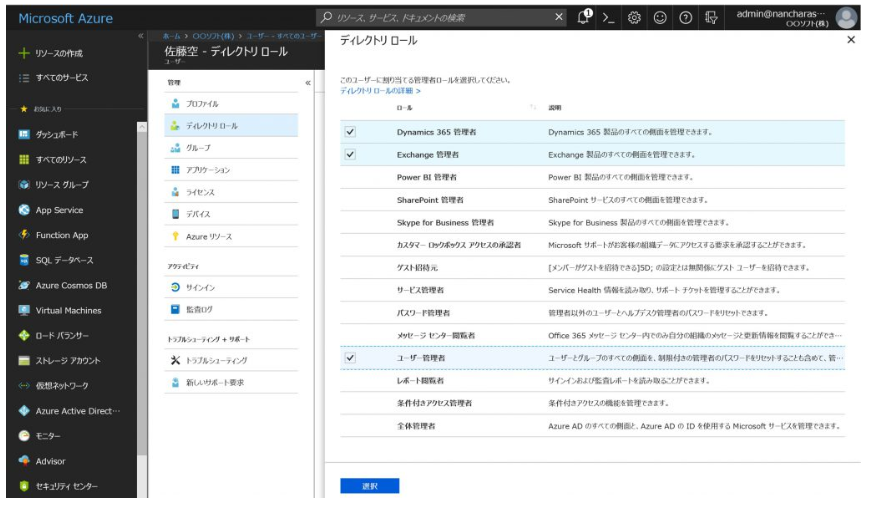
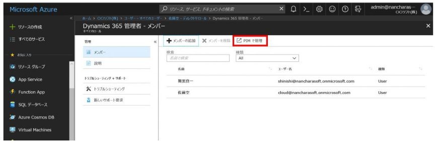
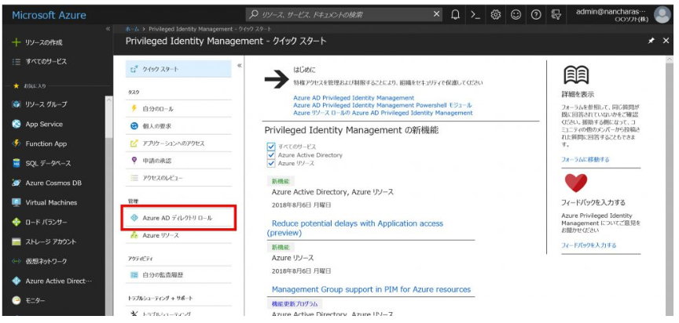

> 本記事は Technet Blog の更新停止に伴い https://blogs.technet.microsoft.com/jpazureid/2018/08/23/roles-and-administrators/ の内容を移行したものです。
> 元の記事の最新の更新情報については、本内容をご参照ください。

# Azure AD におけるロール管理の新しい方法

こんにちは、Azure & Identity サポート チームの栗井です。

本記事は、2018 年 7 月末に公開された A new way to manage roles and administrators in Azure AD を元にしています。
これまで、 Azure AD の全体管理者などのロールを割り当てられているユーザー一覧を取得することができなかったのですが、最近の更新により、簡単に確認できるようになりました。
元記事を参考に、ユーザーへのディレクトリロールの新しい割り当て・管理方法について、画面キャプチャを含めてご紹介します。

ユーザの役割の確認や管理者権限の割り当てを、これまでより簡単におこなうことができます。

以下が、新しい機能の特徴です。

- ビルトイン (既定) のディレクトリロールの一覧と、それぞれの詳細を確認可能
- 役割の管理や設定がより簡単に
- 関連ドキュメントへのリンク追加

言い換えますと 「全体管理者は何人いるのか？」「このユーザーに割り当てられているのは何の役割か？」がすぐ分かるようになりました。

概要画面から、新機能「ロールと管理者」がご利用できます

## 概要

ビルトイン ディレクトリ ロールの一覧とそれぞれの簡単な説明は 「ロールと管理者」をクリックすることで確認できます。これも最近追加されました Azure AD と連携するアプリケーションの管理を目的とした新しいロールも含まれます。

現在サインインして操作を実施しているユーザー自身に何かしらのロールが割り当てられている場合、画面上部に表示されます。「ロール」をクリックすると、自身に割り当てられているロールと、それぞれの概要の一覧を確認できます。

図: 「ロールと管理者」下の、各ロールと説明の一覧

また、ロールの行をクリックすると、そのロールに割り当てられているユーザーの一覧が確認できます。

  
図: ロールに割り当てられているユーザー (メンバー) 一覧

各ロールによりどのようなことができるのかという質問をよく頂きますが、それぞれのロールに何の権限があるのか、その詳細を一覧でみられるようになりました。同じ画面で、関連記事のリンクも見ることができます。ロールを最大限有効に使うためにぜひご活用ください。
画像に示すように、ブレードの「説明」をクリックするとこの画面が見られます。もしくはロールの一覧画面から、各行の右側にある「・・・」をクリックをすることでも、同じ画面に辿り着くことができます。

あるロールに割り当てられているユーザの一覧に加えて、その逆引きである「あるユーザーに割り当てられているロールの一覧」を見ることができるようになりました。同じ画面から、ユーザーに新たなロールを追加することができます。
詳細は [Assigning administrator roles in Azure Active Directory](https://docs.microsoft.com/en-us/azure/active-directory/users-groups-roles/directory-assign-admin-roles)をご参照ください (英語ドキュメント)。

  
図: ユーザーに割り当てられているロールの一覧と「ロールの追加」ボタン

一人のユーザーに複数の特権ロール (privileged roles) を割り当てることも可能です。既に割り当てられているものは表示されません。

  
図: 割り当て可能なロールの一覧

## Azure AD PIM での更新

より細やかな権限管理は Azure AD Privileged Identity Management (PIM) で可能です。 Azure AD PIM の管理ブレードにも「ロールと管理者」へのリンクがあります。

  
図: Privileged Identity Management 画面から「ロールと管理者」へのリンク

もし組織で PIM を有効にしていなくても、「PIM で管理」をクリックすれば、管理者保護のために PIM をどのように活用できるか確認できます。無料のトライアルもご利用可能です。

「PIM」で管理から、Privileged Identity Management の情報が閲覧できます。

上記内容が少しでも参考となりますと幸いです。製品動作に関する正式な見解や回答については、お客様環境などを十分に把握したうえでサポート部門より提供させていただきますので、ぜひ弊社サポート サービスをご利用ください。

※本情報の内容（添付文書、リンク先などを含む）は、作成日時点でのものであり、予告なく変更される場合があります。
