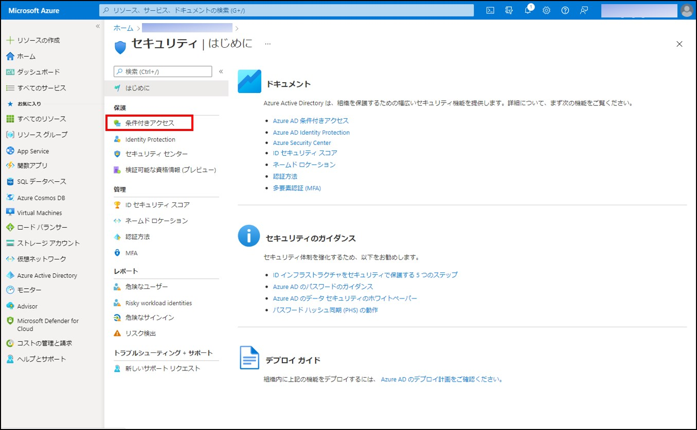
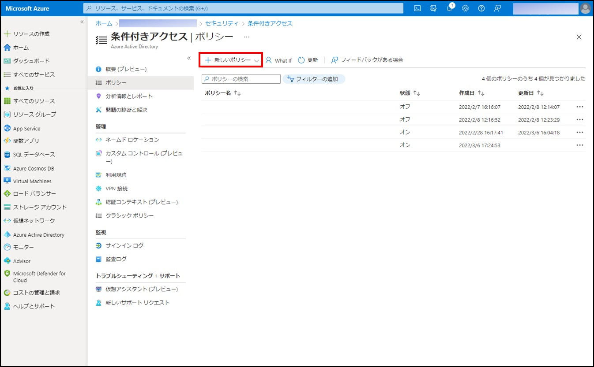
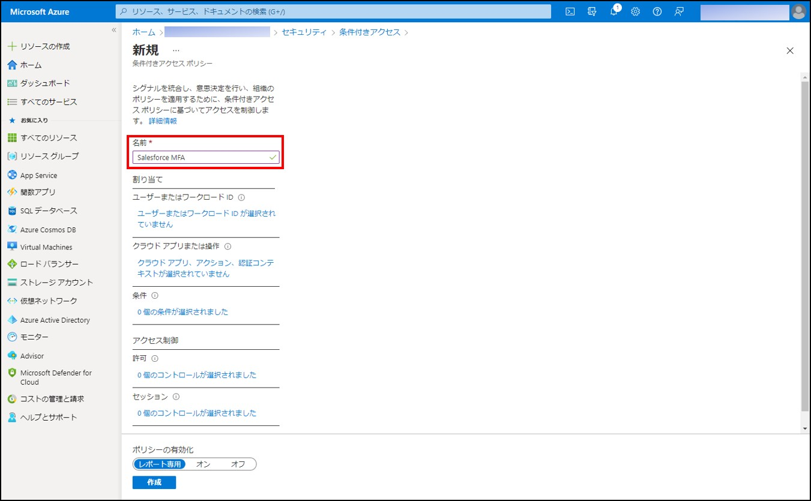
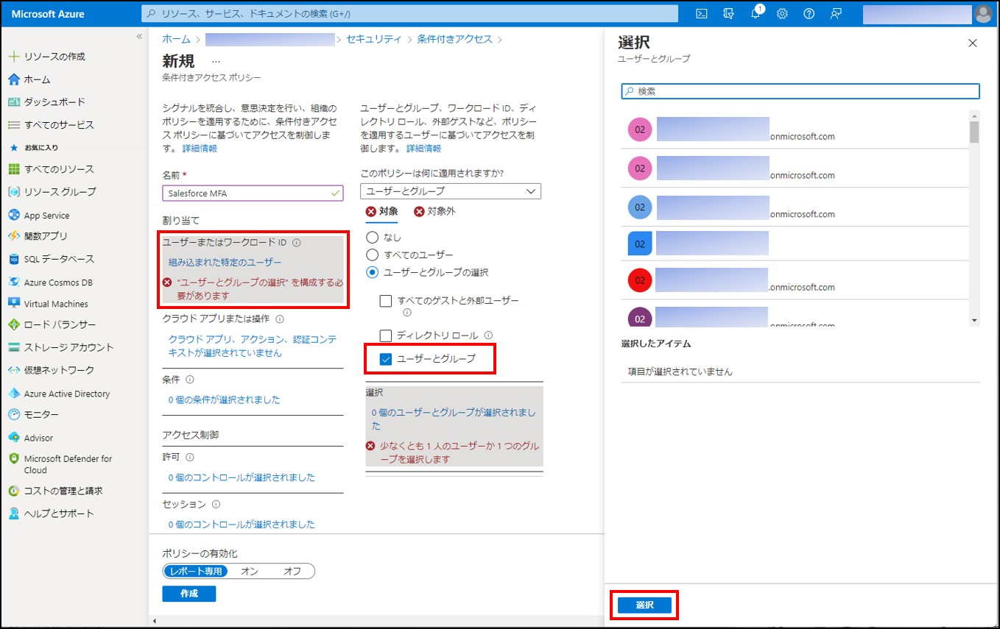
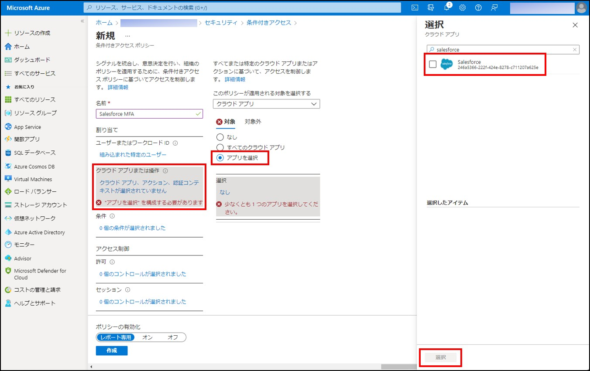
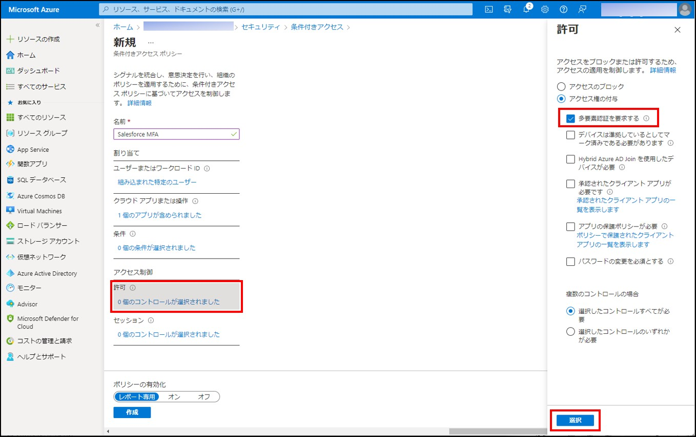
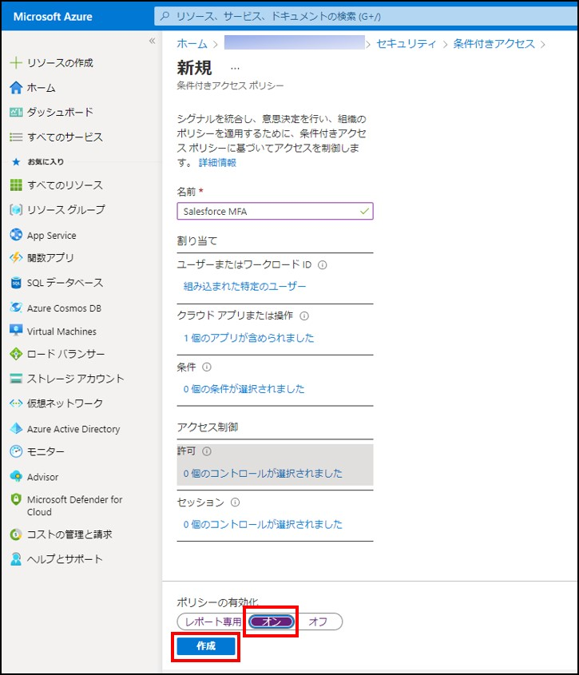
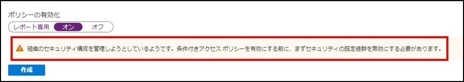
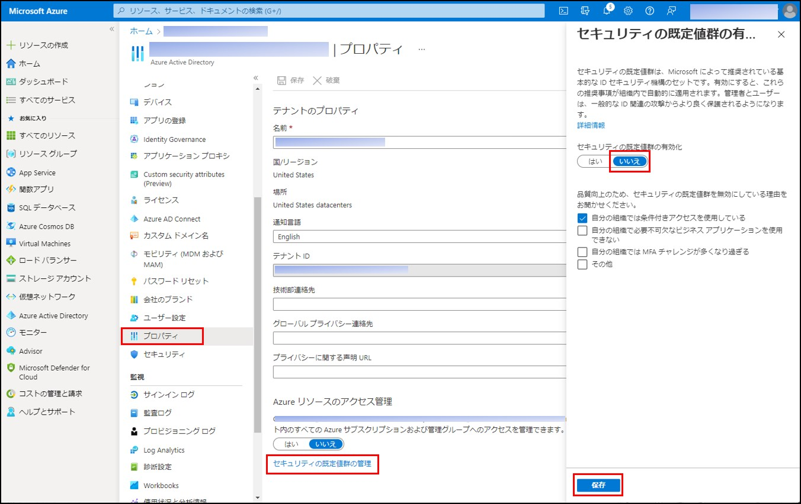

# Salesforce で多要素認証が必須に - Azure AD 側での対応

こんにちは、Azure Identity サポート チームの 村上 です。

本記事は、2022 年 3 月 21 日に米国の Azure Active Directory Identity Blog で公開された [Salesforce now enforcing multi-factor authentication—Azure AD has you covered](https://techcommunity.microsoft.com/t5/azure-active-directory-identity/salesforce-now-enforcing-multi-factor-authentication-azure-ad/ba-p/2810644) を意訳したものになります。ご不明点等ございましたらサポート チームまでお問い合わせください。

---

Salesforce が、Salesforce 製品へのアクセスに多要素認証 (MFA) の有効化を要求していることを受け、Azure Active Directory がどのようにこの要件へ対応できるかを紹介したいと思います。ハイブリッド ワークを実施している組織では、従業員がさまざまなアプリケーションを使用して仕事を行うため、Salesforce などのアプリケーションへのアクセスを確実に保護することが非常に重要です。  

Salesforce の新しい要件を満たし、Salesforce 製品へのアクセスを確実に保護する方法について、ID アライアンス チームのプリンシパル プログラム マネージャーである Jonathon Lyon が説明します。

----

ハイブリッド ワークへの移行が進むにつれて、ファイアウォールやサイロ化、パスワードといった旧来のセキュリティ パラダイムが多くの組織を脆弱な状態にしています。攻撃者は、常にチャンスを探っており、企業ネットワークに侵入する最も早い方法の 1 つが ID であることに気づいています。ダークウェブ (闇サイト) には盗まれた認証情報が大量に出回っており、ID の窃取 (アカウントの乗っ取りやビジネス メールの漏洩など) は、ID 攻撃の最も一般的な形態となっています。最近のセキュリティ分析では、「ID は依然としてネットワークへのアクセスを行う際のカギとなる要素である。ID に対する攻撃や ID を使った攻撃が 2022 年に増加することは、間違いなく確実である」と言われています。 

あらゆる分野において、先進的な企業は、ボーダーレスなデジタル領域において脅威を迅速に検知し対応するためには、[ゼロ トラスト](https://www.microsoft.com/ja-jp/security/business/zero-trust/) セキュリティが最良のアプローチであることを認識しています。[Salesforce](https://security.salesforce.com/mfa) では、ゼロ トラストを念頭に置き、2022 年 2 月 1 日より、すべてのお客様が Salesforce 製品にアクセスする際に [多要素認証 (MFA)](https://www.microsoft.com/ja-jp/security/business/identity-access-management/mfa-multi-factor-authentication) を有効にすることを義務付けると発表しています。[すべての人にセキュリティを提供する](https://www.microsoft.com/security/blog/2021/03/02/4-ways-microsoft-is-delivering-security-for-all-in-a-zero-trust-world/) というマイクロソフトのミッションの一環として、Salesforce のお客様が [Microsoft Azure Active Directory (Azure AD)](https://azure.microsoft.com/ja-jp/services/active-directory/) を使用して、MFA とシングル サインオン (SSO) を簡単に実現できるよう支援したいと思っています。

# パスワードの問題点 

15 万人以上の顧客と 2,000 億ドルを超える時価総額である Salesforce はセキュリティにおいて妥協が許されません。大手クラウド企業はもとよりいかなる企業においても、従業員の選んだ数桁の数字や文字に頼って企業全体を守るのはリスクが大きすぎるのです。[パスワードは簡単にハッキングされます](https://jpazureid.github.io/blog/azure-active-directory/your-password-doesnt-matter/)。[米 JBS 社に対するランサムウェア攻撃](https://www.foodbusinessnews.net/articles/20118-oversight-committee-finds-minor-security-lapses-behind-jbs-cyberattack) は、まさにこのような脆弱なパスワードで放置された管理者アカウントによって引き起こされ、最終的に 1,100 万ドルの損失となりました。この種の「ブルートフォース」攻撃は、2021 年 6 月に [671% 増加](https://securityintelligence.com/news/credential-phishing-brute-force-attacks-increased-2021/) しました。実際、Azure AD は 2021 年 1 月から 12 月の間に、盗んだパスワードでのブルートフォース攻撃にて企業の顧客アカウントを乗っ取ろうとする試みを [256 億回以上検知](https://www.microsoft.com/security/blog/2022/02/03/cyber-signals-defending-against-cyber-threats-with-the-latest-research-insights-and-trends/) し、ブロックしています。

マイクロソフトは、2021 年に [パスワードレス サインインを一般的に商用利用可能](https://techcommunity.microsoft.com/t5/azure-active-directory-identity/passwordless-authentication-is-now-generally-available/ba-p/1994700) にすることで、パスワードを利用しない方法を提供しました。つまり、マイクロソフトの顧客はアカウントからパスワードを完全に削除し、代わりに以下を使用してサインインすることができるようになったのです:

- [Microsoft Authenticator アプリ](https://www.microsoft.com/ja-jp/security/mobile-authenticator-app): このアプリにより iOS や Android の携帯電話を、パスワードなしの強力な資格情報として利用できます。ユーザーは、携帯電話に通知が届き、画面に表示された番号と照合することであらゆるプラットフォームやブラウザにサインインすることができます。生体認証 (指や顔) または PIN を使用して確認することも可能です。最近のアップデートにより、[企業アカウントの追加や管理がより簡単](https://jpazureid.github.io/blog/azure-active-directory/microsoft-authenticator-app/?msclkid=af50f21cabb011ec950d24738a07b742) になりました。
- [Windows Hello for Business](https://docs.microsoft.com/ja-jp/windows/security/identity-protection/hello-for-business/hello-overview): 生体認証と PIN をユーザーの端末に直接結びつけて使用するため、所有者以外のアクセスを防ぐことができます。公開鍵基盤 (PKI) の統合と SSO のサポートにより、Windows Hello for Business を使用することでオンプレミスおよびクラウドの両方で企業リソースにシームレスにアクセスできるようになります。
- [FIDO2 セキュリティ キー](https://docs.microsoft.com/ja-jp/azure/active-directory/authentication/howto-authentication-passwordless-security-key): クラウドまたはオンプレミスのリソース、およびサポートされているブラウザに対して SSO を提供します。FIDO2 セキュリティ キーは、携帯電話を第二要素として使用することに抵抗がある企業にとって最適なオプションです。

# Azure AD を使用した多要素認証の実装 

MFA は、[ID 関連の攻撃を 99.9% 防ぐ](https://www.microsoft.com/security/blog/2019/08/20/one-simple-action-you-can-take-to-prevent-99-9-percent-of-account-attacks/) ことが証明されています。それにも関わらず、2021 年末までに MFA を導入済みの Azure AD のお客様はわずか 22% に過ぎません。MFA のきっかけとなる [条件付きアクセス](https://docs.microsoft.com/ja-jp/azure/active-directory/conditional-access/overview) は、ID を中心とした制御の中核として Azure AD に直接組み込まれており、様々な情報をまとめることで組織のポリシーを即時に適用します。

Microsoft のお客様は Azure AD を使用して、生体認証、Authenticator アプリ、SMS テキスト、通話、ワンタイム パスコードなど、数ある認証方法の中から選択し、Salesforce やその他のアプリケーションの認証を行うことができます。(**注:** [音声とテキストは最も安全性が低い](https://techcommunity.microsoft.com/t5/azure-active-directory-identity/it-s-time-to-hang-up-on-phone-transports-for-authentication/ba-p/1751752) ため、Salesforce では SMS や電話による認証は許可されていません)。Azure AD と Salesforce を統合して SSO と MFA を実現すると、以下のようなことが可能になります:

- Salesforce にどのユーザーがアクセス可能かを Azure AD で制御
- Azure AD アカウントを使用してユーザーが自動的に Salesforce にサインインできるように構成
- 両方のアカウントを、[Microsoft Azure ポータル](https://azure.microsoft.com/ja-jp/features/azure-portal/) で一元管理
- Salesforce アプリケーションに MFA を適用する条件付きアクセス ルールを作成

Azure AD で MFA を有効にする方法の詳細については、[チュートリアル](https://docs.microsoft.com/ja-jp/azure/active-directory/authentication/tutorial-enable-azure-mfa) を参照ください。

# Salesforce の多要素認証 - 設定手順 

Salesforce は要件となる期限 (日付は製品によって異なります) を迎えると、同社の [実施ロードマップ](https://help.salesforce.com/s/articleView?language=en_US&type=1&id=000362737) に従って、管理者が MFA を無効にするためのコントロールを削除することによって要件の実施を開始します。現時点で Salesforce は、この新しい要件を契約上のみで実施しています。つまり、MFA を有効にしないお客様は契約を更新することができなくなります。技術的な強制はその後に行われる可能性があります。

新しい要件を満たすために、Salesforce のお客様は以下のいずれかを行う必要があります。

- Salesforce の画面から MFA を有効にする、もしくは... 
- Salesforce 製品へのアクセスには、[SSO](https://www.microsoft.com/ja-jp/security/business/identity-access-management/single-sign-on) を使用する。Azure AD は、Salesforce やその他多くのアプリケーションへユーザーを自動的に認証できます (以下の「Salesforce で MFA を有効にするクイック手順」を参照ください)。

また、お客様は [Salesforce MFA 要件チェッカー](https://security.salesforce.com/mfa-requirement-check) を使用して、実装が要件を満たしていることを確認することもできます。併せて、[Azure AD で利用可能な認証および検証方法](https://docs.microsoft.com/ja-jp/azure/active-directory/authentication/concept-authentication-methods) についてもご確認ください。 

以下では、Salesforce ユーザーに MFA を適用する条件付きアクセス ポリシーの作成手順をご紹介します。

1. テナントの **グローバル管理者** として **Azure ポータル** にサインインします。
2. **Azure Active Directory** を選択し、**管理** 配下の **セキュリティ** を選択します。
3. **条件付きアクセス** を選択します。
 

4. **新しいポリシー** をクリックし、**新規ポリシーの作成** を選択します。
 

5. **ポリシーの名前を入力** します。

6. **割り当て** 配下の、**ユーザーまたはワークロード ID** を選択します。
7. **ユーザーとグループ** を選択します。次に Salesforce を使用するユーザ、またはユーザのグループを選択します。必要なユーザーまたはグループを選択したら、**選択** をクリックします。

8. **クラウド アプリまたは操作** を選択します。
9. **アプリを選択** を選択し、Salesforce を検索します。**選択** をクリックします。(必要に応じて条件を指定することもできますが、この例では条件のままにしておきます)。

10. **アクセス制御** で **許可** を選択します。
11. **アクセス権の付与** を選択し、**多要素認証を要求する** オプションにチェックを入れます。そして、**選択**をクリックします。

最後のステップは、ポリシーを有効にすることです。

12. **ポリシーの有効化** を **レポート専用** から **オン** に変更します。次に、**作成** をクリックします。

このルールが有効になると、選択したすべてのユーザーが Salesforce にサインインする際に MFA を使用するようになります。

**注**: 初めて条件付きアクセス ポリシーを作成する場合、次のようなメッセージが表示されることがあります。

以下の手順で、セキュリティの既定値群を無効にします。

1. セキュリティ管理者、条件付きアクセス管理者、またはグローバル管理者として、**Azure ポータル** にサインインします。
2. **Azure Active Directory** > **プロパティ** を参照します。
3. **セキュリティ既定値群の管理** を選択します。
4. **セキュリティ既定値群の有効化** を **いいえ** に設定します。
5. **保存** を選択します。

# すべてのアプリケーションにシームレスにサインイン

Azure AD は MFA を提供するだけではなく、すべてのユーザーが場所やデバイスを問わず、以下を含めて安全かつシームレスにアクセスできるようにします:

- 一元化されたユーザー ポータルによりアプリ展開作業を単純化
- Identity Protection と条件付きアクセスによる、リスク ベースのアクセス ポリシーの強力な適用
- 自動化されたプロビジョニング ワーク フローとセルフ サービス ツールによる IT コストの削減 

Azure AD は、**Adobe、AWS、Dropbox、SAP Concur、ServiceNow** など、広く利用されている他のアプリケーションとの統合を容易に実現します。[Azure Active Directory のシングル サインオン](https://azure.microsoft.com/ja-jp/services/active-directory/sso/#overview) により、**Salesforce** をはじめとする多くのエンタープライズ　アプリケーションでシンプルかつ安全な MFA を実現し、信頼性と拡張性の高い ID  サービスにアクセスが可能となります。

ご参考: [Security Week Cyber Insights 2022: Identity](https://www.securityweek.com/cyber-insights-2022-identity)
