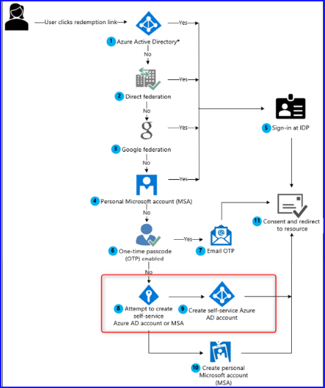
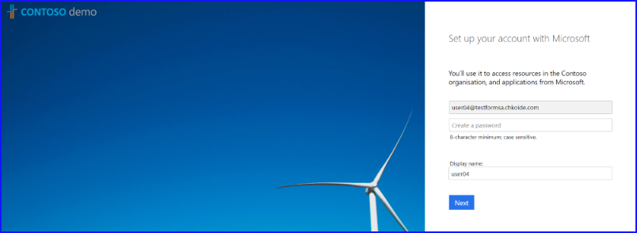
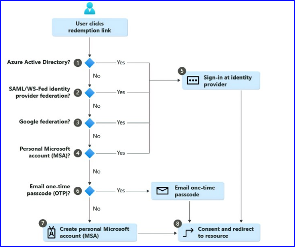
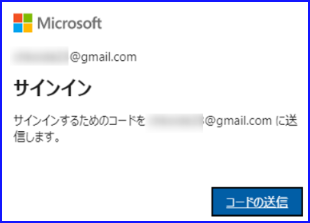
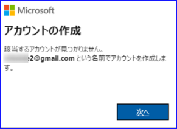

こんにちは、 Azure ID チームの小出です。

本記事は、2022/9/2 の [Say goodbye to unmanaged Azure AD accounts for B2B collaboration](https://techcommunity.microsoft.com/t5/microsoft-entra-azure-ad-blog/say-goodbye-to-unmanaged-azure-ad-accounts-for-b2b-collaboration/ba-p/3094111) の記事の抄訳を元に Azure AD B2B コラボレーションの動作変更と、対処策についてお知らせします。


## 変更内容の概要
Azure Active Directory (Azure AD) において、B2B コラボレーション用の非管理 (バイラル) アカウントが廃止されました。
B2B コラボレーション用の非管理（バイラル）アカウントは、「いつのまにか自動で作成されている」「削除すると、ゲストがリソース テナントにアクセスできなくなる」など、管理や運用が難しいという課題を抱えていました。また、「アカウントを誰が作成したのか分からない」「消していいのか」など、弊社サポートでもお問い合わせをいただいていました。

以前 [2021 年 10 月に予定されるゲスト ユーザー招待時の動作変更について](https://jpazureid.github.io/blog/azure-active-directory/announcement-of-otp/) の弊社ブログでは、非管理アカウントがサポートされなくなる旨と、代替案として OTP の仕様についてご案内しておりました。今回の変更では、サポートされなくなった非管理アカウントが、今後の動作としても新しく作成されなくなりました。

なお、以前に招待され、非管理型の Azure AD アカウントとして引き換えされたアカウントは、引き続き機能します。 

## 以前の動作

具体的には、以前の承諾フローにて、⑧ から ⑨ に遷移することがなくなりました。




⑧ から ⑨ に遷移した時には、以下のような Set up your account with Microsoft というメッセージとパスワードの設定画面が表示されていましたが、
今回の変更によりこの画面からアカウントが自動作成されることがなくなりました。





## 現在の動作
現在の新しい承諾フローは、下記のようになります。 ⑥ のフローで OTP が無効な場合、 個人用 Microsoft アカウントを作成するよう求められます。
承諾フローの数が減り、よりシンプルで分かりやすい形になりました。 



以前のブログにて、 OTP の機能を有効化することをご案内しております。

⑥ のフローで Yes に遷移した場合、下記のような画面に遷移します。パスワードを入力する画面が一度もない場合は、 OTP のフローに入ったと判断できます。



OTP が無効なシナリオで ⑦ に遷移した場合には、下記のように Microsoft アカウント作成画面が表示されます。



Microsoft アカウントには、パスワードを設定する必要があるため、 [次へ] をクリックしたときにパスワード入力画面が表示されるのが特徴です。


## 既存の非管理アカウントのクリーンアップ方法
上記変更により、今後非管理アカウントは新しく作成されなくなりましたが、テナントにすでに登録されている非管理（バイラル）アカウントは、そのまま残ってしまいます。
そのため、「組織に非管理（バイラル）アカウントがあるか」を確認し、「今後どのような対応をとるか」を検討いただくことをお勧めいたします。

確認と棚卸を進めていただく方法として、以下 2 種類の方法を提供しています。

- MSIdentity Tools PowerShell Module  を使用して、 PowerShell コマンドで管理・棚卸を行う
- 下記の[サンプル アプリケーション](https://github.com/Azure-Samples/Remove-Unmanaged-Guests)を利用する


今回はコマンドやアプリになじみがないお客さまでも実施できるよう、コマンドで簡単に非管理アカウントを抽出・管理する方法について案内します。

詳細は、[アンマネージド Azure Active Directory アカウントをクリーンアップする](https://learn.microsoft.com/ja-jp/azure/active-directory/enterprise-users/clean-up-unmanaged-azure-ad-accounts) の公開情報も併せてご覧ください。

### 事前準備
下記に記載の手順を利用するためには、MSIdentityTools PowerShell モジュールが必要です。
まずは以下のコマンドを使用して、モジュールをインストールします。

注意点は、 PowerShell を管理者特権で開く必要がある点です。 PowerShell を開いたときに、左上に「管理者」と表示されていれば問題ありません。

```
Install-Module MSIdentityTools
Install-Module Microsoft.Graph
```

モジュールがインストールできたら、 Azure AD に接続します。接続には Connect-MgGraph コマンドを使用します。

```
Connect-MgGraph --Scope User.Readwrite.All
```

サインイン画面が表示されたら、ユーザー名とパスワードを入力してサインインします。Welcome To Microsoft Graph!   のメッセージが表示されたら、サインインは完了です。

次に、テナントに非管理（バイラル）アカウントがあるか確認します。下記のコマンドを実行します。

```
Get-MsIdUnmanagedExternalUser
```

このコマンドでは、非管理（バイラル）アカウントの外部ユーザーを取得しています。
ユーザー名など、もし何も応答が返されなければ、組織に非管理（バイラル）アカウントはないため、この先の対処策を実行する必要はありません。

もしユーザーが表示された場合には、非管理（バイラル）アカウントに対し、下記いずれかの対処を行うことをお勧めいたします。

- ゲストの招待状況をリセットする
- アカウントを削除する

招待をリセットすると、ユーザーは再度招待を承諾する必要があります。招待されたユーザーが組織アカウントなのか、個人アカウントなのかなどは、管理者が招待したタイミングではなく、ユーザーが承諾したタイミングで決まるため、招待状況をリセットすると、改めて上記画像に記載のフローが適用されます。

改めて招待を承諾する際には、現在のフローが適用されるため、非管理（バイラル）アカウントとして承諾することはできません。組織アカウント、 Microsoft アカウントのほか、 OTP のユーザーとして招待を承諾することができます。

アカウントの削除については、非管理（バイラル）アカウントがもう必要ない場合にご選択ください。もし該当のゲストが引き続きテナントにアクセスしたい場合は、改めて管理者が招待を行い、ユーザーが承諾を行う必要があります。

対応方針が決まったら、下記いずれかのコマンドを実行して、リセットもしくはアカウントを削除します。

- リセットする場合
```
Get-MsIdUnmanagedExternalUser | Reset-MsIdExternalUser
```


- 削除する場合
```
Get-MsIdUnmanagedExternalUser | Remove-MgUser
```

最後に、 下記のコマンドを実行して接続を終了すれば完了です。

```
Disconnect-MgGraph
```
