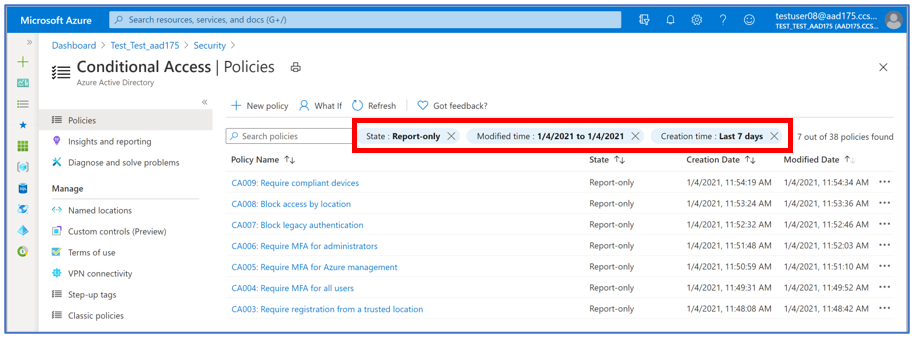

本記事は、 2021 年 2 月 1 日に Azure Active Directory Identity Blog に公開された記事 (Search, Sort, and Filter for Conditional Access is now in public preview!) の抄訳です。原文は [こちら](https://techcommunity.microsoft.com/t5/azure-active-directory-identity/search-sort-and-filter-for-conditional-access-is-now-in-public/ba-p/1994699) より参照ください。

----

# 条件付きアクセスの 検索 / 並び替え / 絞り込み 機能がパブリック プレビューとなりました !

Azure ポータル上で Azure AD  条件付きアクセス ポリシーを検索、並び替え、絞り込みする機能がパブリック プレビューとなりました。これは Azure AD のフィードバック フォーラムで最もリクエストされていたものの 1 つであり、ポリシーの管理が一段と楽になります。この機能は 2021 年 2 月 1 日から全テナントに順次展開され、数週間後には全テナントで利用できるようになる予定です。
 
 

## 検索 (Search)

条件付きアクセス ポリシーの一覧ページに検索バーが追加され、特定のポリシーをすばやく簡単に名前から見つけることができるようになりました。検索では、ポリシー名のリストに対して、「～から始まる (starts-with)」と部分文字列検索が自動的に実行されます。部分文字列検索は、全単語、部分単語に対して実行され、特殊文字のサポートが含まれています。検索は大文字小文字を区別しません。
例えば、「Devices」を検索すると、「Devices」をポリシー名に含む「compliant devices」と「managed devices」の両方のポリシーが検索結果として表示されます。

 

## 並び替え (Sort)
ポリシーのリストを、ポリシー名、状態、作成日、および更新日で並べ替えることができます。各列の見出しの右側にある矢印を使用して、昇順または降順でリストを並べ替えることができます。

 

## 絞り込み (Filter)
検索やソートだけでなく、状態、作成時刻、変更時刻でポリシーリストを絞り込みすることもできます。

 

最後に、ポリシーの一覧ページでポリシー数を表示するように改善しました。これにより、設定したポリシーの総数を確認できるようになりました。また、検索または絞り込みを適用した場合、全ポリシー数のうちいくつのポリシーが該当したかを確認いただけます。

 

世界中で、過去 30 日間で 18,000 を超えるポリシーが作成されました。条件付きアクセスの検索、並び替え、絞り込み機能を活用し、多くのポリシーの中から目的のポリシーを見つけていただければ幸いです。
 
これまでの数々のフィードバックを提供いただいたことに Azure  AD チームを代表してお礼申し上げます。Azure AD 条件付きアクセスの管理エクスペリエンスを弊社が改善できるよう引き続きフィードバックの共有にご協力いただけますと幸いです。

いつものように、[Azure フォーラム](https://feedback.azure.com/forums/169401-azure-active-directory) や Twitter @AzureAD を通じて、この機能に関する質問やフィードバックを共有いただければと思います。