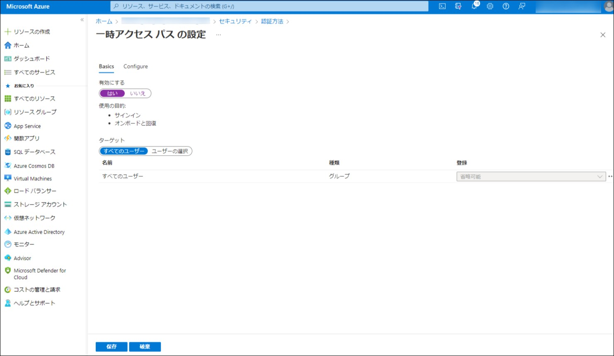
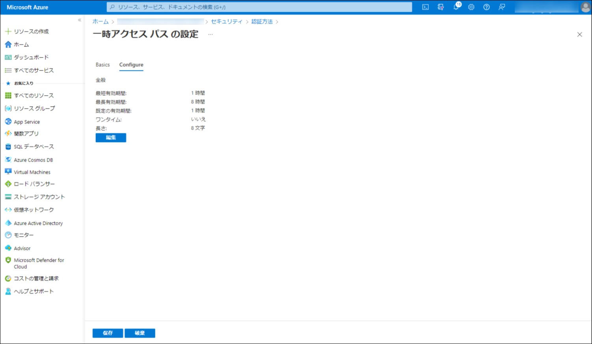
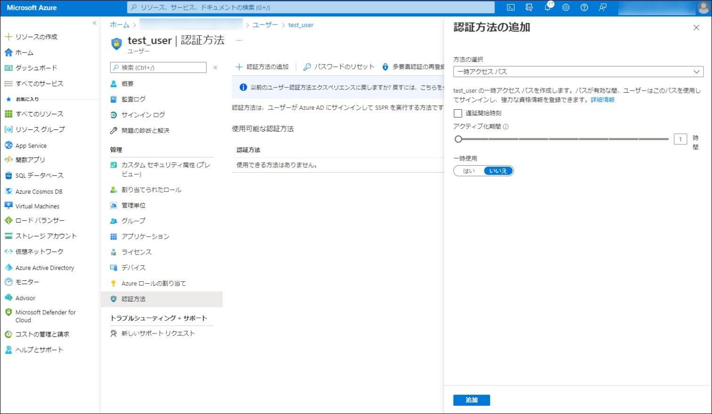
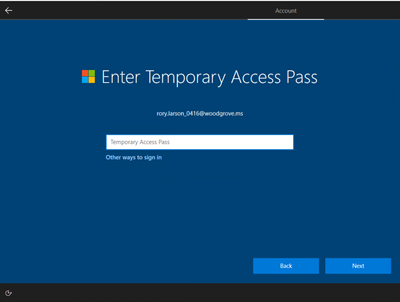

---
title: 一時アクセス パスによるセキュアな認証方式の展開
date: 2022-07-15 10:00
tags:
  - Azure AD
  - US Identity Blog
---

# 一時アクセス パスによるセキュアな認証方式の展開

こんにちは、Azure Identity サポート チームの 村上 です。

本記事は、2022 年 6 月 22 日に米国の Azure Active Directory Identity Blog で公開された [Secure authentication method provisioning with Temporary Access Pass](https://techcommunity.microsoft.com/t5/microsoft-entra-azure-ad-blog/secure-authentication-method-provisioning-with-temporary-access/ba-p/3290631) を意訳したものになります。ご不明点等ございましたらサポート チームまでお問い合わせください。

---

皆さん、こんにちは。

本日は、一時アクセス パス (Temporary Access Pass、以下 TAP) が一般提供となりましたことをお知らせします。TAP のパブリック プレビューを [発表](https://techcommunity.microsoft.com/t5/microsoft-entra-azure-ad-blog/temporary-access-pass-is-now-in-public-preview/ba-p/1994702) して以来、マイクロソフトでは数多くの取り組みを進めていました。

**弊社ではパスワードレスでのサインインに MS Authenticator を使用しています。社員がリソースにアクセスするにはパスワードレスのみを許可しています。
登録は TAP を用いて行われ、従来のようにパスワードをユーザーに渡す必要がなくなりました..." - EU のグローバル玩具メーカー**

このリリースを担当したプロダクト マネージャーの一人である Tim Larson に、これらのアップデートの概要、TAP を使用したパスワードレスのアカウント登録、そしてリカバリのシナリオについて解説してもらいます。Tim のブログはいかをご覧ください。

Alex Simons（Twitter: [@alex_a_simons](https://twitter.com/Alex_A_Simons)) 

マイクロソフト アイデンティティ部門  
コーポレート バイスプレジデント、プロダクト マネジメント  

---

皆さん、こんにちは。

以下では、TAP に関する変更と改善、そしてパスワードレスを始めるために TAP をどのように活用できるかを紹介します。

## TAP とは？

TAP は時間制限付きパスコードで、ユーザーがパスワードレスの認証方法を登録し、パスワードを使用せずともアカウントへのアクセスを回復するために使用できるものです。また、TAP を使用して Windows デバイスを設定することができます。ユーザーが直接自分のデバイスを設定したり、[Windows AutoPilot](https://docs.microsoft.com/ja-jp/mem/autopilot/windows-autopilot) を使用してデバイスを [Azure AD に参加](https://docs.microsoft.com/ja-jp/azure/active-directory/devices/concept-azure-ad-join) させたり、[Windows Hello for Business](https://docs.microsoft.com/ja-jp/windows/security/identity-protection/hello-for-business/hello-overview) の設定において、TAP を使用したりることも可能です。

## 管理者体験 

認証方法ポリシーで、組織向けに TAP を設定および構成することができます。例えば、TAP の割り当てを特定のユーザーやグループに限定したり、短期間の使用に限定したり、また、1 回限りの使用に設定したりすることができます。

ポリシーによって認証方法が有効になると、特権認証管理者または認証管理者は、ユーザーの認証方法ブレードにアクセスするか、API でアクセスすることによって、そのユーザーに TAP を作成することができます。また、管理者が既存の TAP を上書きする機能も追加されました。以前に作成した TAP をユーザーが忘れたり紛失したりした場合、同じ手順で TAP をユーザーのアカウントに追加するだけで、古い TAP が削除されます。

## エンド ユーザー体験

ユーザーが有効な TAP を取得すると、[Authenticator アプリから直接パスワードなしの電話サインイン](https://support.microsoft.com/ja-jp/account-billing/%E8%81%B7%E5%A0%B4%E3%81%BE%E3%81%9F%E3%81%AF%E5%AD%A6%E6%A0%A1%E3%82%A2%E3%82%AB%E3%82%A6%E3%83%B3%E3%83%88%E3%82%92microsoft-authenticator-%E3%82%A2%E3%83%97%E3%83%AA%E3%81%AB%E8%BF%BD%E5%8A%A0%E3%81%99%E3%82%8B-43a73ab5-b4e8-446d-9e54-2a4cb8e4e93c) や、[マイセキュリティ情報ページ](https://aka.ms/mysecurityinfo) から FIDO2 キーの追加、さらには Azure AD 参加および Hybrid Azure AD 参加端末での Windows Hello for Business セットアップなど、サインインやセキュリティ情報の登録に使用することができます。MFA が必要なシナリオでは、TAP を追加要素として使用することもできます。

## 詳細について 

TAP の設定方法については、こちらの [ドキュメント](https://docs.microsoft.com/ja-jp/azure/active-directory/authentication/howto-authentication-temporary-access-pass) をご覧ください。

新入社員のオンボーディング体験は、組織ごとに異なる場合があります。TAP は Microsoft Graph API を通して利用できるため、既存のアプリケーションや [人事主導のプロビジョニング](https://docs.microsoft.com/ja-jp/azure/active-directory/app-provisioning/what-is-hr-driven-provisioning) プロセスに組み込むことができます。ニーズに合わせて TAP を構成するためのポリシー API については、[こちら](https://docs.microsoft.com/ja-jp/graph/api/resources/temporaryaccesspassauthenticationmethodconfiguration?view=graph-rest-1.0) をご覧ください。

## 皆様のご意見をお聞かせください 

TAP があなたのパスワードレスの導入に役立つことを願っています。お試しいただき、質問やフィードバックをお寄せください。

Tim Larson ([@tim_c_larson](https://twitter.com/tim_c_larson))  
マイクロソフト アイデンティティ部門  
シニア プロダクト マネージャー

