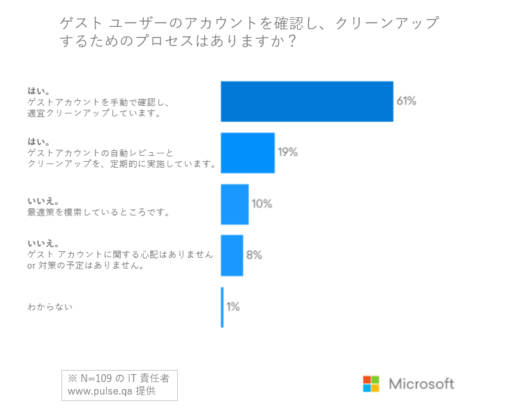

# Azure AD ゲスト アクセス レビューを活用したゲスト ユーザーとの安全なコラボレーション

こんにちは、Azure Identity サポート チームの栗井です。

本記事は、2021 年 6 月 23 日に米国の Azure Active Directory Identity Blog で公開された [Securely collaborate with guests using Azure AD guest access reviews](https://techcommunity.microsoft.com/t5/azure-active-directory-identity/securely-collaborate-with-guests-using-azure-ad-guest-access/ba-p/2466940) を意訳し、補足情報を追加したものになります。ご不明点等ございましたらサポート チームまでお問い合わせください。

----

日々の業務の中で、顧客やパートナー、ベンダーと共同作業 (コラボレーション) をする機会は、沢山ありますよね。現代では、業務において多くのアプリケーションやソフトウェア、デバイスが活用されています。組織外のユーザー (以下、ゲスト ユーザー) とのコラボレーションにおいても、ゲスト ユーザーを自社のアプリに招待したり、自社のリソースへのアクセスを許可したりする必要が出てくるでしょう。このようなゲスト ユーザーのデジタル ID は、扱いを間違えればセキュリティ リスクにつながる可能性も否めません。

マイクロソフトの調査によると、IT 管理担当者の 40% 以上が、セキュリティ態勢を改善するためのデジタル ID 管理の最適策を求めていると回答しています。

これら IT における意思決定者は、会社内のリソースへのアクセスが分散することによりセキュリティ侵害のリスクが高まっていることを最大の懸念として挙げています。この問題は企業が通勤とテレワークを組み合わせたハイブリッドな業務環境が導入されたり、外部ユーザーとの安全なコラボレーションが要求されたりする中で一層大きな課題となっています。IT 管理者にはそれらの利用状況を測る方法もなく、次のような問いにも答えることができない状況にあります:

- ユーザーはどのような情報にアクセスしているのか？
- どの程度の期間、それらの情報は共有してアクセスされているのか？
- ユーザー アカウントはまだ有効なのか？
- ユーザーに与えられたアクセス権が失効する危険はないか？

## 自動のレビュー機能を用いてゲストによるアクセスを管理する

アンケート回答者の 70％ 以上が、**ゲスト アカウントを管理するプロセスがない、または手動で管理している** と回答しています。手動での管理は、カスタム スクリプトやミドルウェアに依存していることが多いため、ヒューマン エラーが発生する可能性が高く、セキュリティ リスクの増大につながります。また、IT 管理者は、会社のリソースにアクセスをするすべての外部ユーザーを、余すことなく把握することはできません。ゲスト ユーザーのデジタル ID とアクセスの管理に最も適した人物は、IT 管理者ではなく、その事業部のマネージャーです。

Azure Active Directory Identity Governance は、組織の境界を越えた安全なコラボレーションを可能にします。お客様は、**直感的なインターフェースを通じて、定期的な自動アクセス レビュー** を設定することができます。これによりゲスト ユーザーには過不足のないリソースおよび時間の範囲内でのアクセスが確保されます。

ゲスト ユーザーが機密データへのアクセスを必要としなくなったら、企業は自動的にユーザーのアクセス権限を取り消すことができます。事業部の担当者やマネージャーが Azure AD を利用していない場合、ゲスト ユーザーは自身でグループのメンバーシップを確認しアクセス権限の要否を確認することもできます。

## ゲスト ユーザーのアクセスを自動で管理しましょう

機密データへのゲスト アクセスのプロビジョニングとデプロビジョニングを自動化することで、従来の管理方法 (カスタム スクリプトやミドルウェア) は不要になり、手動プロセスに伴うエラーを削減することができます。さらに、SaaS アプリケーションへのゲストのアクセスを自動的にプロビジョニングおよびデプロビジョニングすることで、組織が事前に許可した範囲内でのみゲストをアプリにアクセスさせられるようになります。つまり、IT 管理者がその都度アクセスの許可を判断する手間はなくなります。

大規模な組織においては、ゲスト ユーザーのアクセスを管理するための最適役は、IT 管理者よりも現場を知る事業部のマネージャーである場合が多いでしょう。Azure AD のガバナンス機能を用いることで、**外部ユーザーがどのレベルの機密データにアクセス可能かというアクセス権の管理を、その判断に最も適した事業部のマネージャーに委任できるようになる** のです。IT 管理者以外の人間に管理を委任することで、本当に適した人間が部門の機密データへのアクセスを管理していることを確認できます。この委任によって、IT ヘルプ デスクの負担が軽減され、IT のスタッフはその他の戦略的な取り組みに専念できるようになります。

Azure AD Identity Governance のお客様からは、以下のような評価をいただいています。

> "Azure Active Directory のゲスト アクセス レビューにより、適切なレベルの管理を行いながら、スピード感をもって外部とのコラボレーションできるようになり、セキュリティ部門や法務、データ プライバシー担当者の負担が軽減しました。" by Avanade 様

規制の厳しい業界や、政府機関などと連携しているお客様の場合は、アクセス権に関する管理の有効性を定期的に監査担当者に提示する必要があるでしょう。ゲスト ユーザー用の Azure AD アクセス レビューを活用することで、組織が適切な管理と制御を行っていることを監査担当者に証明しやすくなります。Azure AD 上でわずかな構成手順を経るだけで **シンプルなインターフェースによって、すべてのアクセス レビューを一元的に表示** することができます。これにより IT 管理者は、マルチクラウド、マルチデバイス、様々なアプリケーションごとに、ユーザーのリソースごとのアクセス可否を確認することができます。

Azure AD アクセス レビューの概要については、[公開情報](https://docs.microsoft.com/ja-jp/azure/active-directory/governance/manage-guest-access-with-access-reviews) と [YouTube 解説](https://www.youtube.com/watch?v=3D2_YW2DwQ8) をぜひご覧ください。Azure AD Identity Governance の詳細については、[当社ウェブサイト](https://www.microsoft.com/ja-jp/security/business/identity-access-management/identity-governance
) もご覧ください。

## 参考情報

- 関連投稿 (英語): [Access Reviews for guests in all Teams and Microsoft 365 Groups is now in public preview](https://techcommunity.microsoft.com/t5/azure-active-directory-identity/access-reviews-for-guests-in-all-teams-and-microsoft-365-groups/ba-p/1994697)
- 当社ウェブサイト: [Azure AD でのアイデンティティ ガバナンス](https://www.microsoft.com/ja-jp/security/business/identity-access-management/identity-governance)
- 公開情報: [Azure AD のアクセス レビューによるゲスト アクセスの管理](https://docs.microsoft.com/ja-jp/azure/active-directory/governance/manage-guest-access-with-access-reviews)
- YouTube 解説 (英語): [Review guest user access across all Microsoft 365 groups and Microsoft Teams](https://www.youtube.com/watch?v=3D2_YW2DwQ8&feature=emb_imp_woyt)
