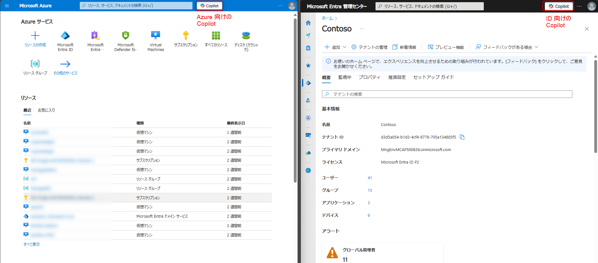

# Security Copilot が Microsoft Entra で利用できるようになりました！

こんにちは！ Azure ID チームの小出です。今回は、2024 年 11 月 19  日に米国の Microsoft Entra (Azure AD) Blog で Sarah Scott によって公開された [Security Copilot is now embedded in Microsoft Entra](https://techcommunity.microsoft.com/blog/identity/security-copilot-is-now-embedded-in-microsoft-entra/4289387) を抄訳し、サポートチームにて補足したものになります。

Copilot は現在 Teams や Outlook など様々なサービスに組み込まれ、どんどん簡単に利用できるようになっています。たとえば Copilot を PowerPoint で使ってプレゼンテーションを共同作成したり、 Excel ファイルの分析を行うなども可能です。ただ、 ID 管理の観点では Copilot はこれまで利用できる機能がなく、「Entra 管理センターでも Copilot の機能を活用したい」と思われていた方もいらっしゃるかと思います。今回、 Entra 管理センターにも Copilot の機能が組み込まれ、トラブル シューティングなどに活用できるようになりました！ぜひ下記で利用方法や役立つシナリオをご覧ください！ご不明点などございましたら遠慮なくサポートへお問い合わください。

---

## Microsoft Entra の Security Copilot を体感しよう— AI 駆動の ID およびアクセス管理のパブリック プレビューが開始されました！

本日、Microsoft Entra 管理センターにおける Microsoft Security Copilot のパブリック プレビューを [発表](https://aka.ms/CopilotforSecurityGA) しました。この統合により、2024 年 4 月にスタンドアロン版の Security Copilot で[一般提供された](https://techcommunity.microsoft.com/t5/microsoft-entra-blog/microsoft-entra-adds-identity-skills-to-copilot-for-security/ba-p/4081857) すべての ID スキル (具体的にはユーザーの詳細、グループの詳細、サインイン ログ、監査ログ) と、管理者やセキュリティ アナリストが直接 Microsoft Entra 管理センターで使用できる新しい ID 関連の機能が提供されるようになりました。また、ID 関連のリスク調査をよりよく行えるようにする新しいスキルも追加しました。12 月には、さらに範囲を広げ、Security Copilot と Microsoft Entra のスタンドアロンのバージョンと管理センターに組み込まれたバージョンの両方に App Risk Management 専用のスキルを追加する予定です。これらの機能により、ID 管理者とセキュリティ アナリストは、Microsoft Entra に登録されたアプリケーションとワークロード ID に影響を与えるリスクをより適切に特定、理解、修復できるようになります。

Security Copilot が Microsoft Entra に組み込まれたことで、ID 管理者は、AI を用いた自然言語によるまとめ (ID にまつわる背景情報や知見をまとめたもの) を得つつセキュリティ インシデントに対応することができ、ID の侵害に対してより一層の備えが可能となります。また、Copilot は管理センターに組み込まれれているため、管理センターから離れることなく、ID 関連のリスクやサインインの問題の解決などのトラブル シューティング作業を迅速に行うことが可能です。 

## Security Copilot の価値を Microsoft Entra に拡大 - ID およびアクセス管理のための AI

パブリック プレビューでは、最初の Copilot スキルは ID のセキュリティとアクセスのトラブル シューティングに重点を置いており、これにより ID およびアクセス管理タスクの時間短縮と精度向上を目標としています。これは、ID とネットワーク アクセスの様々な課題 (ネットワーク アクセス、先進のアクセス制御、さらにその先を含む) に対応する、より包括的な生成 AI ソリューションをお届けするという弊社の目標に向けたほんの始まりにすぎません。ID とアクセスのシナリオで使用される生成 AI はまだ登場したばかりですが、急速に進化していることも事実であり、製品としての成功はお客様とのよりよいコラボレーションにかかっています。パブリック プレビューにいち早く参加することで、製品の成長に合わせて、お客様も主要なシナリオへの対応やスキルの改善に参画可能です。弊社はお客様と共に、今日のニーズに応えるとともに、今後の課題を先取りするソリューションを構築していきたいと考えています。

プレビューを早期にお使いのお客様から見えてきたその価値は目を見張るものがあります。[Security Copilot IT Admin Efficiency Study](https://aka.ms/SecurityCopilotITAdminResearch) によると、Entra 管理センターに組み込まれた Security Copilot を使用して、IT 管理者がアクセス失敗のトラブルシューティングを行うと、より短時間かつ正確にその対応を完了でき、さらに今後も業務で Copilot を使用したいと考える人が圧倒的に多いことがわかりました。結果は以下のとおりです:

- Copilot の利用者はサインインのトラブルシューティングにかかる時間が 46.11% 短縮されました。
- Copilot を使用すると、サインインのトラブルシューティングに関連する作業の精度が 46.8%向上しました。
- また最も重要な点として、回答者の 95% が Copilot を使用することで作業の質が向上したと言い、96.7% が今後もこれらの作業で Copilot を使用したいと回答しました。  

## Microsoft Entra 管理センターでの Copilot の動作例

弊社では ID 管理者の皆様の普段の業務フローにおいて Security Copilot を活用できるということが重要であると考えているため、Microsoft Entra 管理センターで直接 Copilot を利用できるようにしました。ナビゲーション バーにある Copilot ボタンをクリックすることで Security Copilot にアクセスできます。 

Copilot が支援できるタスクがどういったものかをまず最初に理解しやすくするため、Copilot のチャットのパネルを初めて開いたときにスターター プロンプトというものを表示するようにしました。これはクリックするだけで実行できるプロンプトです。スターター プロンプトの一覧から選択するか、サインインログのトラブルシューティングや ID 関連のリスクの調査などの質問を Copilot に行うことが可能です。例えば「テナント内のリスク高のユーザーを表示してください」、「[ユーザー名] に MFA が要求されたのはなぜですか」、「[ユーザー名] の直近のサインインに適用された条件付きアクセス ポリシーはどれですか」などの質問が挙げられます。最後に、チャットの会話の流れに基づいて、より内容を深堀していくようなプロンプトも提案されますので、問題をさらに調査することが可能です。以下の画像もご覧ください。

なお、Azure ポータルと Microsoft Entra 管理センターの両方に「Copilot」のボタンがありますが、 Azure ポータル上のボタンは Azure 向けの Copilot です。
今回のブログで紹介している Entra 向けの Copilot とは異なるため、 Entra 向けの Copilot を利用したい場合は、 Microsoft Entra 管理センターから Copilot にアクセスください。

## Microsoft Entra に組み込まれた Security Copilot を使用してあらゆるリソースへのあらゆる ID のアクセスを保護する 

ID 管理者、セキュリティ アナリスト、ネットワーク セキュリティ管理者はすべて、組織全体のアクセスを保護し、ID を管理するという目標を共有しています。当社は、これらの管理者が抱える職責を果たすにあたり直接的なサポートができるよう Security Copilot のスキル開発を進めており、注力している点としては以下が挙げられます。

- アクセスの管理および保護
- ID に関連する問題と運用のトラブルシューティング
- ID ライフサイクルのワークフローの最適化
- ID とネットワーク アクセスに関するセキュリティ ポリシーの計画と展開 
 
これらの重点分野を中心に機能と機能を構成することで、Security Copilot と Microsoft Entra をご利用のお客様に対し、AI に基づく知見、自動化、推奨事項を提供し、お客様がより多くのことを実現できるようにしたいと思っています。これは具体的には、業務フローの効率化や、ID とリソースの保護など上記重点項目に関連する特定の業務をより早く、かつ正確に完了させるということです。

パブリック プレビューでは、以下の 2 つの重要なシナリオにおいて ID 管理者とセキュリティ アナリストを支援するスキルを提供いたします: 

- Microsoft Entra の Security Copilot を使用してアクセスのガバナンスとポリシーの適用を管理
- Microsoft Entra の Security Copilot を使用してアクセス失敗をトラブルシューティング
 

## Microsoft Entra の Security Copilot を使用してアクセスのガバナンスとポリシーの適用を管理 

お客様の企業規模が成長し、ID に関連するリスクがより複雑になるにつれ様々な課題が生じますが、この解決を支援するというのが本スキルの目標です。攻撃の量と巧妙さが増すにつれ、アクセス ガバナンスとポリシーの強制を適切に行うことが非常に重要になっています。

[4 月の発表](https://techcommunity.microsoft.com/t5/microsoft-entra-blog/microsoft-entra-adds-identity-skills-to-copilot-for-security/ba-p/4081857)では、高リスクと判定されたユーザーを管理者が迅速に特定し解決するというシナリオについて解説しました。管理者は、Copilot が自動生成したまとめをもとに、ユーザーのリスク状態について分析情報を即座に得るとともに、実施すべき推奨事項も Copilot から得ることでセキュリティ インシデントを解消して問題を解決するということが可能です。

さらに、管理者が自由にプロンプトでの対話を通じてリスクの高いユーザーをより詳細に調査できる新機能を導入しました。これによりリスク レベルの上昇やリスクの高いサインインなどに関してさらなる知見が得られます。リスクのあるアプリケーションや未使用のアプリケーション、特定のアプリケーションに付与されたアクセス許可などの調査については、12 月にスタンドアロンと組み込み版の両方で追加される予定です。 

## Microsoft Entra の Security Copilot を使用した、重要な瞬間のアクセス障害のトラブルシューティング 

ID 管理者は、セキュリティと効率性、ユーザーの生産性のバランスを取りながら、アクセス侵害にも対応するという責務を抱えており、ID に関するリスクが増すにつれ ID 管理者の負荷も増すばかりです。これに対応するため、管理者は Copilot を使用してサインインログのトラブルシューティング作業を自動化し、Microsoft Entra 内のユーザーやグループの詳細、サインインログ、監査ログ、および診断ログに関する実用的な知見をもとに具体的な対応項目を得るということが可能です。これらの機能により、管理者は重要な情報を迅速に収集し、トラブルシューティングをより早く行うことで、運用の効率化を実現できます。

サインインの失敗や条件付きアクセスの競合、ロールとアクセス許可の変更など、アクセスに関する問題が発生した場合、管理者は管理センターで Security Copilot を使用することでその原因を特定できます。Copilotを使用すると、認証方法からアカウントの状態まで、ユーザーの詳細を数秒で収集できるため、ユーザーの資格情報または構成に問題があるかどうかを迅速に判断できます。同様に、グループの詳細を使用して、アクセスに影響する可能性のあるグループのメンバー情報や所有者を簡単に確認できます。

サインイン ログの調査については、Copilot に特定のユーザーの最近のアクティビティや失敗した試みをピンポイントで要約するよう促すことができ、ブロックされたサインインや特定の IP アドレスに関連する潜在的なセキュリティ上の問題など、アクセス失敗の原因を簡単に診断できます。アクセス許可の変更や監査ログで異常が検出された場合などより複雑なシナリオの場合は、Security Copilot に事象の切り分けを依頼するとともに、その異常がどのようなものかの説明も即座に行わせることができます。これには、所有者の変更やアクセス権の追加による特権の昇格など、潜在的な攻撃の特定も含まれ、設定の不備によりセキュリティ リスクが拡大するのを防げます。

最後に、診断ログの機能により、Security Copilot がポリシーの健全性を評価し、構成とログ収集が正しく設定されていることを確認することも可能です。これにより、組織が脆弱な状態とならないよう先んじて構成の不備を特定可能です。

## Microsoft Security Copilot の導入方法

Security Copilot は、従量課金の柔軟な価格設定であるため、すぐに使い始めることができ、お客様のニーズと予算に応じて利用を拡大するということも可能です。ます。Security Copilot はすでにどのお客様でも購入が可能であるものの、Microsoft Entra 管理センターでの利用は **パブリック プレビュー** 中となります。このブログで取り上げたほとんどのシナリオは現在パブリック プレビューで利用可能であり、弊社ではプレビュー期間中もこれらのシナリオをサポートするスキルについて、その品質と範囲を強化していく予定です。改めまして、すでに Microsoft Entra をお使いの皆様がこのプレビューに参加し、Microsoft Entra の Security Copilot がより一層皆様のお役に立てるようぜひフィードバックをお寄せください。

Security Copilot を用いることで、セキュリティおよび IT 部門が AI を活用し、さらにそのスキルセットを強化できるということが実証されています。これは、お客様の組織がビジネス上の目標を達成するために生成 AI を安全に活用できることを示す大きなマイルストーンであります。お客様ならびにパートナー様が目指している、あらゆる場所から、あらゆる ID で、あらゆるリソースに安全にアクセスするというゴールに向け、弊社も皆様と共に歩んでまいる所存です。

Security Copilot の導入方法については[こちらの資料](https://learn.microsoft.com/en-us/copilot/security/get-started-security-copilot)をご覧ください。また、貴社の営業担当者にもお問い合わせいただき、そのメリットについてご確認ください。

Sarah Scott

Principal Manager, Product Management
