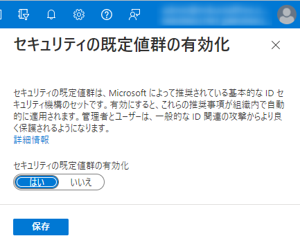

# 2022 年 6 月末から「セキュリティの既定値群」の有効化が促されます (対象 : 一部のテナント)

こんにちは。Azure & Identity サポート チームの栗井です。

先日 2022 年 5 月 22 日に、グローバルの Azure Active Directory Identity Blog にて、下記記事が公開されました。
- [Raising the Baseline Security for all Organizations in the World](https://techcommunity.microsoft.com/t5/azure-active-directory-identity/raising-the-baseline-security-for-all-organizations-in-the-world/ba-p/3299048)

上記の記事でアナウンスされた Azure Active Directory の新しい変更点について、本ブログ記事にて日本語で情報をおまとめいたしました。
なお分かりやすく読んでいただけるよう、英語記事の直訳ではなく、記事の構成など大幅に変更しております。

## この記事の要点は ?
**2019 年 10 月 22 日より前に作成された一部の Azure AD テナントにおいて、「セキュリティの既定値群」の有効化を促すポップアップが表示されるようになります。実施時期の目安は 2022 年 6 月末頃を予定しています。**
  
- 影響を受ける可能性があるテナント
  - 2019 年 10 月以前に作成された Azure AD テナントのうち、下記に該当するテナント
      - 現在「条件付きアクセス ポリシー」を利用していないテナント
      - 現在「セキュリティの既定値群」を利用していない、かつ過去にも利用が無いテナント 
      - レガシ認証の利用が無い (トラフィックが検出されていない) テナント 

## 前提 1 : そもそも「セキュリティの既定値群 (セキュリティ デフォルト)」とはどんな機能？
セキュリティの既定値群とは、2019 年 10 月にリリースされた、無料でご利用いただけるセキュリティ機能です。

この機能を有効化することで、下記のセキュリティ機能が一括で有効化されます。

1. すべてのユーザーに対して、Azure AD Multi-Factor Authentication への登録を必須にします。
2. 管理者に多要素認証の実行を要求します。
3. 必要に応じてユーザーに多要素認証の実行を要求します。
4. レガシ認証プロトコルをブロックします。
5. Azure portal へのアクセスなどの特権が必要な作業を保護します。

- 引用元 : [Azure AD のセキュリティの既定値群](https://docs.microsoft.com/ja-jp/azure/active-directory/fundamentals/concept-fundamentals-security-defaults)

機能の詳細については引用元の公開情報をご覧ください。

## 前提 2 : 自分のテナントでは、セキュリティの既定値群が有効化されている ?
セキュリティの既定値群の現在の設定値は、Azure ポータルの下記画面にて確認いただくことができます。

1. 管理者ユーザーで Azure ポータル (https://portal.azure.com) にアクセスします。
2. Azure Active Directory > プロパティ に進みます。
   - 直通リンク : https://portal.azure.com/#blade/Microsoft_AAD_IAM/ActiveDirectoryMenuBlade/Properties
3. [セキュリティの既定値群の有効化] を押下いただくと、下記画面が表示されます。[はい / いいえ] によって現在の設定値がご確認いただけます。
   
   

なお 2019 年 10 月 22 日以降に作成された Azure AD テナントでは、<任意の名前>.onmicrosoft.com テナントを作成いただいた時点で、セキュリティの既定値群が有効化されている場合が大半です。

## 本題 : 2019 年 10 月以前に作成された一部のテナントでは、管理者に対して「セキュリティの既定値群」の有効化を促すポップアップが表示されるようになる予定です。
既に多くのお客様環境において「セキュリティの既定値群」や「条件付きアクセス ポリシー」を利用した MFA をご活用いただいております。
しかしいずれも無効化されているテナントの場合、セキュリティ観点では安全な状態とは言えません。このようなテナントを対象に、**2022 年の 6 月末を目安に、セキュリティの既定値群の有効化を促すポップアップが表示される予定**です。

### セキュリティの既定値群の有効化ポップアップが表示されるまでのステップ
1. セキュリティの既定値群のポップアップ表示の対象テナントには、まずグローバル管理者宛に、メールによる通知が送信される予定です。

2. そして 6 月下旬頃から、グローバル管理者によるサインイン時に、下記のようなプロンプトが表示されるようになります。
   

3. 上記プロンプトで "Enable Security Defaults" を選択いただくと、即時にセキュリティの既定値群が有効化されます。
4. 上記プロンプトで "Ask Later" を選択いただくと、14 日後に再度、同様のポップアップが表示されます。その際には、セキュリティの規定値群を引き続き "無効" のままご利用いただくオプションも、選択肢として表示される見込みです。

## 補足 1 : セキュリティの既定値群を有効化すると、具体的にどうなるの？
セキュリティの既定値群の機能については、前述の項目「前提 1 : そもそも「セキュリティの既定値群 (セキュリティ デフォルト)」とはどんな機能？」の通りですが、ユーザー / 管理者目線で発生する具体的な差異について、補足いたします。

### 1. すべてのユーザー : Azure MFA への登録が必須になります。   
MFA の方法を一切登録していないユーザーに対して、登録が要求されます。具体的には、サインイン時に下記画面が表示され、Microsoft Authenticator のアプリによる MFA の登録が要求されます。

- Azure AD Premium などのライセンスをお持ちのテナントでは、SMS や音声通話による MFA も選択いただけます。無償テナントで一般ユーザーがご利用いただける方法は Microsoft Authenticator のみです。
- 管理者ユーザーは 2 つの MFA の方法の登録が必要です。Microsoft Authenticator に加えて、SMS の番号の登録も要求されます。

### 2. すべてのユーザー : レガシ認証がブロックされます。
一般的にレガシ認証と呼ばれる、古いプロトコルによる認証がすべてブロックされます。
レガシ認証には Exchange ActiveSync、POP、IMAP、SMTP、MAPI over HTTP などが含まれます。

レガシ認証のみ対応しているメールクライアント アプリ等をご利用頂いている場合、レガシ認証のブロックによる影響が懸念されます。

### 3. 管理者ユーザー : 全てのサインイン時に MFA が要求されます。
前述の通り、すべてのユーザーに対して MFA の登録が有効化されます。

そして管理者ユーザーについては、サインインの度に毎回、登録した方法による MFA が要求される動作になります。

管理者ではない一般ユーザーについては、サインインの度に毎回 MFA が要求される動作にはなりません。Azure AD 側がユーザーの不審な操作を検知した際や、ユーザーが Azure ポータルや Azure CLI などの高い権限を持つアプリケーションにアクセスする際など、"必要に応じて" MFA が要求されるようになります。

## 補足 2 : 上記変更に至った経緯
そもそもなぜ、セキュリティの既定値群の自動有効化 実施に至ったのか？その経緯と背景については、冒頭に記載の「Raising the Baseline Security for all Organizations in the World」にてご紹介しております。以下はその抄訳です。

世界中のお客様にご利用いただいている Azure AD においては、日々何全件もの不審なサインインやアカウント攻撃が発生しています。しかし残念ながら現状は、その防御率は 100% ではありません。

もし不審なアクセスを防ぐことができずアカウントが侵害されると、お客様の業務影響や情報漏洩などに直結しうる大問題であることは、言うまでもありません。

少しでもこのような事態を回避するために、Azure AD の各種設定を活用して、セキュリティ性を高めることは重要です。中でも最も大事なのは、**MFA を有効化すること、そしてレガシ認証を無効化してモダン認証 (先進認証) に完全移行すること**です。

事実、弊社で報告を受けたアカウントの侵害事例のうち 99.9% 以上に対して、MFA が有効化されていませんでした。

MFA が有効化されていない場合、パスワードのみでサインインができてしまうということです。パスワードのみによるアカウントの保護は昨今においては非常に脆弱で、パスワード スプレー攻撃やパスワード リスト型攻撃、フィッシングといった脅威における格好のターゲットになります。レガシ認証も同様の理由 (= パスワードのみの認証) で、攻撃者にとってはとても都合のいいセキュリティ ホールです。

ただし残念ながら、全ての組織において IT セキュリティ専門のチームが存在している状況ではありません。そのため MFA という存在自体を知らなかったり、知っていても導入するきっかけが無い場合もあるかと存じます。

そのような状況を改善するために、2019 年 10 月以降に作成された Azure AD テナントに対しては、既定で「セキュリティの規定値群」の設定が有効化されています。この機能は 3000 万以上の組織にてご活用いただいています。これらの組織では、全体の Azure AD 利用者に比べ、80% ものアカウント侵害を防いでいる実績があります。

しかし 2019 年 10 月より前に作成された Azure AD テナントでは、「セキュリティの規定値群」は有効化されておりません。そのため、別途条件付きアクセス ポリシー等の他の機能によってセキュリティ性を高めていただいている場合を除き、前述した「パスワードのみの認証」によるリスクに晒されている現状を懸念して、今回の「セキュリティの規定値群の自動有効化」のロールアウトを決定いたしました。

「セキュリティの規定値群」は組織のセキュリティ性を担保いただくにあたって優秀な機能ですが、無料のオプションであるため、カスタマイズ性が低いことがデメリットです。
Azure AD Premium のライセンスによってご利用いただける「条件付きアクセス」の機能であれば、アクセス パターンやユーザーに応じた制御をよりきめ細かく構成できますので、必要に応じて導入をご検討いただけますと幸いです。

ご不明な点がございましたら弊社サポートまでお気軽にお問い合わせください。上記内容が少しでも皆様の参考となりますと幸いです。

## 関連リンクまとめ

### 記事内で引用・ご紹介した公開情報 (再掲)
- [Raising the Baseline Security for all Organizations in the World (英語記事) | Microsoft Tech Community](https://techcommunity.microsoft.com/t5/azure-active-directory-identity/raising-the-baseline-security-for-all-organizations-in-the-world/ba-p/3299048)
- [Azure AD のセキュリティの既定値群 | Microsoft Docs](https://docs.microsoft.com/ja-jp/azure/active-directory/fundamentals/concept-fundamentals-security-defaults)

### Azure AD MFA についてもっと知りたい方へ
- [Azure AD Multi-Factor Authentication | Microsoft Docs](https://docs.microsoft.com/ja-jp/azure/active-directory/authentication/concept-mfa-howitworks)
  
  Azure AD MFA の動作の仕組みについてご紹介しています。
- [Azure MFA 導入パターンを網羅的にご紹介！ | Japan Azure Identity Support Blog](https://jpazureid.github.io/blog/azure-active-directory/MFA_configuration_scenarios/)
  
  Azure AD MFA を有効化いただける各種機能を、セキュリティの規定値群や条件付きアクセスを含め、ご紹介しております。

### 条件付きアクセスについてもっと知りたい方へ
- [条件付きアクセスとは | Microsoft Docs](https://docs.microsoft.com/ja-jp/azure/active-directory/conditional-access/overview)
  
  条件付きアクセスの概要をご紹介しております。
- [3-2: 詳説！Azure AD 条件付きアクセス - 動作の仕組みを理解する編 | youtube.com](https://www.youtube.com/watch?v=CTdQnnm9s_k)
  
  Azure AD 開発チームがお届けするウェビナーです。条件付きアクセスの動作の仕組みをご紹介しております。
