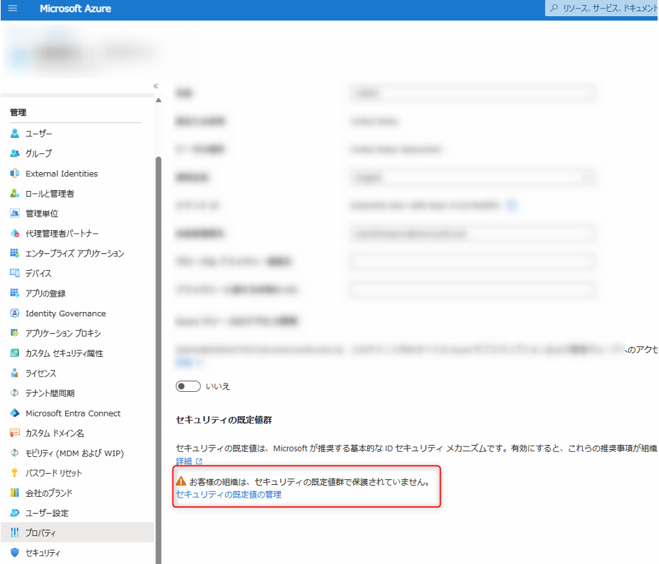
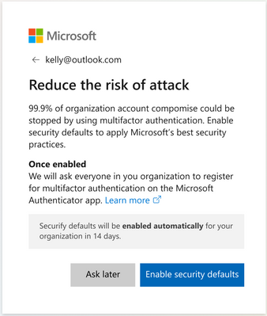
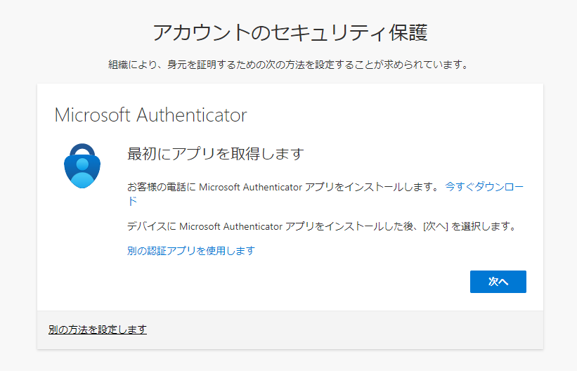

# 2022 年 6 月末から「セキュリティの既定値群」の有効化が促されます (対象 : 一部のテナント)

> [!NOTE]
> 2022 年 6 月 13 日更新: 有効にすることを促すポップアップが表示される頻度、14 日後にセキュリティの既定値が有効化されることについて情報を修正しました。
> 2022 年 6 月 15 日更新: 影響を受ける可能性があるテナントに関しての情報を更新しました。
> 2022 年 9 月  1 日更新: "ユーザーごとの Azure AD Multi-Factor を利用している" テナントも対象となるように方針が変更されたため情報を更新しました。 
> 2022 年 11 月 9 日更新: テナントの作成日による影響の有無について情報を修正しました。
> 2023 年 11 月 15 日更新: 影響を受ける可能性があるテナントに関しての情報を更新しました。
> 2023 年 12 月 20 日更新: 影響を受ける可能性があるテナント、画像例および用語に関しての情報を更新しました。

こんにちは。Azure & Identity サポート チームの栗井です。
先日 2022 年 5 月 22 日に、グローバルの Microsoft Entra Blog にて、下記記事が公開されました。
- [Raising the Baseline Security for all Organizations in the World](https://techcommunity.microsoft.com/t5/azure-active-directory-identity/raising-the-baseline-security-for-all-organizations-in-the-world/ba-p/3299048)
上記の記事でアナウンスされた Microsoft Entra ID の新しい変更点について、本ブログ記事にて日本語で情報をおまとめいたしました。分かりやすく読んでいただけるよう、英語記事の直訳ではなく、記事の構成など大幅に変更しております。

## この記事の要点は ?
以下のすべての条件を満たしているテナントは影響を受ける可能性があります。

- 「条件付きアクセス ポリシー」を利用していない
- Microsoft Entra ID Premium (単体または Microsoft 365 E3 や EMS E3 等 Microsoft Entra ID Premium を含む) ライセンスを 1 つも持たない
- レガシ認証の利用が無い (トラフィックが検出されていない) 

上記の条件を 1 つでも満たしていないテナントには影響ありません。お客様テナントのセキュリティを高めるため、上記に該当する場合、「セキュリティの既定値群」の有効化が繰り返し促される場合があります。

## 前提 1: 「セキュリティの既定値群 (セキュリティ デフォルト)」とはどんな機能？
セキュリティの既定値群とは、2019 年 10 月にリリースされた、無料で利用できる Microsoft Entra ID のセキュリティ機能です。この機能を有効にすることで、下記のセキュリティ機能が一括で有効になります。
1. すべてのユーザーに対して、多要素認証への登録を必須にします。
2. 管理者に多要素認証の実行を要求します。
3. 必要に応じてユーザーに多要素認証を要求します。
4. レガシ認証プロトコルをブロックします。
5. Azure portal などへのアクセスに多要素認証を要求します。
機能の詳細については [Microsoft Entra ID のセキュリティの既定値群](https://docs.microsoft.com/ja-jp/azure/active-directory/fundamentals/concept-fundamentals-security-defaults) の公開情報をご覧ください。

## 前提 2: 自分のテナントでは、セキュリティの既定値群が有効化されている？
セキュリティの既定値群の現在の設定値は、Azure ポータルの下記画面にて確認できます。
1. 管理者ユーザーで Azure ポータル (https://portal.azure.com) にアクセスします。
2. [Microsoft Entra ID]  > プロパティ に進みます (直通リンク: https://portal.azure.com/#blade/Microsoft_AAD_IAM/ActiveDirectoryMenuBlade/Properties)
3. [セキュリティの既定値群] の箇所で、現在の設定値を確認できます。 

   セキュリティの既定値群が無効な例

   

   セキュリティの既定値群が有効な例

   

なお 2019 年 10 月 22 日以降に作成された Microsoft Entra テナントでは、テナントを作成した時点で、セキュリティの既定値群が既定で有効に設定されています。

 

## 本題: 上記の「この記事の要点は？」の節にある条件を満たすテナントでは管理者に対して「セキュリティの既定値群」の有効化を促すポップアップが表示されるようになる予定です。
既に多くのお客様環境において「セキュリティの既定値群」や「条件付きアクセス ポリシー」を利用した MFA をご活用いただいております。しかしいずれも有効になっていないテナントの場合、セキュリティ観点では安全な状態とは言えません。このようなテナントを対象に、**2022 年の 6 月末を目安に、セキュリティの既定値群の有効化を促し、その後設定を有効にする予定**です。

### セキュリティの既定値群の有効化ポップアップが表示されるまでのステップ
1. セキュリティの既定値群のポップアップ表示の対象テナントには、まずグローバル管理者宛へのメール、ならびに Microsoft 365 管理センターのメッセージ センターでの通知が行われる予定です。
2. そして 6 月下旬頃から、グローバル管理者によるサインイン時に、下記のようなプロンプトが表示されるようになります。

   

3. 上記プロンプトで "Enable Security Defaults" を選択いただくと、即時にセキュリティの既定値群が有効にされます。
4. 上記プロンプトで "Ask Later" を選択いただくと、2 日間上記通知は表示されなくなりますが、2 日後に再度表示されます (再度 Ask later が可能)。合計 14 日間 Ask later で先延ばしが可能です。

### ポップアップが表示された場合どうなるか
- 後述する 「再無効化」 の対処をしない場合、14 日経過したタイミングで 「セキュリティの既定値群」 が自動的に有効になる予定です。(一部のテナントに対しては、自動的に有効にするのではなく、ポップアップでの選択肢としても引き続き無効としたままとするものを用意する予定ですが、無効のままとしたい場合には、再無効化の作業を事前に実施しておくことが確実です。)
- 「セキュリティの既定値群」 を無効にしておく必要がある場合、 「セキュリティの既定値群」を一度有効にし、有効にした後で再度無効にすることで、「セキュリティの既定値群」の有効化を促すポップアップは表示されなくなり、また、セキュリティの既定群の自動的な有効化も避けることができます。(この手法を本ブログでは **「再無効化」** と呼称しています)
- 再無効化において、一度有効にしてから無効に再度変更するまでに特に間隔を空ける必要はありません。
- 基本的にポップアップが表示されてから無効化を実施してください。お客様テナントのセキュリティを高めるため、「セキュリティの既定値群」の有効化が繰り返し促される場合があります。この場合は、ポップアップが表示されたのちに再度、再無効化を実施ください。 

### 再無効化の実施方法
1. Azure portal に、セキュリティ管理者、条件付きアクセス管理者、または全体管理者としてサインインします。
2. [Microsoft Entra ID] > [プロパティ] の順に移動します。
3. [セキュリティの既定値群の管理] をクリックします。
4. [セキュリティの既定値群] のドロップダウンリストで [有効] を選択します。
5. [保存] をクリックします。
6. [セキュリティの既定値群] のドロップダウンリストで [無効] に選択し、[無効にする理由] で任意の理由を選択します。
7. [保存] をクリックします。
8. [セキュリティの既定値群の無効化] のポップアップでは [無効化] をクリックします。

 

## 補足 1: セキュリティの既定値群を有効化すると具体的にどうなるの？
セキュリティの既定値群の機能については、前述の項目「前提 1 : そもそも「セキュリティの既定値群 (セキュリティ デフォルト)」とはどんな機能？」の通りですが、ユーザー / 管理者目線で発生する具体的な差異について、補足します。
### 1. すべてのユーザー: Azure MFA への登録が必須になります。 
MFA の方法を一切登録していない一般ユーザーの場合、Microsoft Authenticator のアプリによる MFA の登録が要求されます。以下は登録要求の画面の一例です。

管理者ユーザーは MFA の方法として 2 つの登録が必要です。Microsoft Authenticator に加えて、電話番号の登録も要求されます。
### 2. すべてのユーザー: レガシ認証がブロックされます。
一般的にレガシ認証と呼ばれる、古いプロトコルによる認証がすべてブロックされます。レガシ認証には Exchange ActiveSync、POP、IMAP、SMTP、MAPI over HTTP などが含まれます。
レガシ認証のみ対応しているメールクライアント アプリ等を利用している場合、レガシ認証のブロックにより接続ができないなどの影響が生じる恐れがあります。
### 3. 管理者ユーザー: 全てのサインイン時に MFA が要求されます。
すべてのユーザーに対して MFA の登録が必要となるほか、管理者ユーザーについては、サインインの度に毎回、登録した方法による MFA が要求される動作になります。管理者ではない一般ユーザーについては、サインインの度に毎回 MFA が要求される動作にはなりません。一般ユーザーの不審な操作を検知した際や、ユーザーが Azure ポータルや Azure CLI などの特権を必要とするアプリケーションにアクセスする際などに Microsoft Entra ID が判断し、"必要に応じて" MFA が要求されるようになります。
## 補足 2: 上記変更に至った経緯
そもそもなぜ、セキュリティの既定値群の有効を進めるような施策が実施されるのに至ったのか？その経緯と背景については、冒頭に記載の「Raising the Baseline Security for all Organizations in the World」にてご紹介しております。以下はその抄訳です。
世界中のお客様にご利用いただいている Microsoft Entra ID においては、日々何全件もの不審なサインインやアカウント攻撃が発生しています。しかし残念ながら現状は、その防御率は 100% ではありません。もし不審なアクセスを防ぐことができずアカウントが侵害されると、お客様の業務影響や情報漏洩などに直結しうる大問題であることは、言うまでもありません。少しでもこのような事態を回避するために、Microsoft Entra ID の各種設定を活用して、セキュリティ性を高めることは重要です。中でも最も大事なのは、**MFA を有効化すること、そしてレガシ認証を無効化してモダン認証 (先進認証) に完全移行すること** です。
事実、弊社で報告を受けたアカウントの侵害事例のうち 99.9% 以上に対して、MFA が有効化されていませんでした。MFA が有効化されていない場合、パスワードのみでサインインができてしまうということです。パスワードのみによるアカウントの保護は昨今においては非常に脆弱で、パスワード スプレー攻撃やパスワード リスト型攻撃、フィッシングといった脅威における格好のターゲットになります。レガシ認証も同様の理由 (= パスワードのみの認証) で、攻撃者にとってはとても都合のいいセキュリティ ホールです。ただし残念ながら、全ての組織において IT セキュリティ専門のチームが存在している状況ではありません。そのため MFA という存在自体を知らなかったり、知っていても導入するきっかけが無い場合もあるかと存じます。そのような状況を改善するために、2019 年 10 月以降に作成された Microsoft Entra テナントに対しては、既定で「セキュリティの既定値群」の設定が有効にされています。この機能は 3000 万以上の組織にてご活用いただいています。これらの組織では、全体の Microsoft Entra ID 利用者に比べ、80% ものアカウント侵害を防いでいる実績があります。
しかし 2019 年 10 月より前に作成された Microsoft Entra テナントでは、「セキュリティの既定値群」は管理者が明示的に設定を変更しない限りは、有効にされておりません。そのため、別途条件付きアクセス ポリシー等の他の機能によってセキュリティ性を高めていただいている場合を除き、前述した「パスワードのみの認証」によるリスクに晒されている現状を懸念して、セキュリティの既定値群の有効に向けた施策を決定しました。
「セキュリティの既定値群」は組織のセキュリティ性を担保いただくにあたって優秀な機能ですが、無料のオプションであるため、カスタマイズ性が低いです。Microsoft Entra ID Premium のライセンスによってご利用いただける「条件付きアクセス」の機能であれば、アクセス パターンやユーザーに応じた制御をよりきめ細かく構成できますので、必要に応じて導入をご検討いただけますと幸いです。
ご不明な点がございましたら弊社サポートまでお気軽にお問い合わせください。上記内容が少しでも皆様の参考となりますと幸いです。

## FAQ
***
Q1. ポップアップは英語以外でも表示されますか？
A1. はい、日本語など各国の言語に翻訳されます。
***
## 関連リンクまとめ
記事内で引用・ご紹介した公開情報 (再掲):
- [Raising the Baseline Security for all Organizations in the World (英語記事) | Microsoft Tech Community](https://techcommunity.microsoft.com/t5/azure-active-directory-identity/raising-the-baseline-security-for-all-organizations-in-the-world/ba-p/3299048)
- [Microsoft Entra ID のセキュリティの既定値群 | Microsoft Docs](https://docs.microsoft.com/ja-jp/azure/active-directory/fundamentals/concept-fundamentals-security-defaults)
Microsoft Entra MFA についてもっと知りたい方へ:
- [Microsoft Entra Multi-Factor Authentication | Microsoft Docs](https://docs.microsoft.com/ja-jp/azure/active-directory/authentication/concept-mfa-howitworks): Microsoft Entra MFA の動作の仕組みについてご紹介しています。
- [Azure MFA 導入パターンを網羅的にご紹介！ | Japan Azure Identity Support Blog](https://jpazureid.github.io/blog/azure-active-directory/MFA_configuration_scenarios/): Microsoft Entra MFA を有効化いただける各種機能を、セキュリティの規定値群や条件付きアクセスを含め、ご紹介しております。
条件付きアクセスについてもっと知りたい方へ:
- [条件付きアクセスとは | Microsoft Docs](https://docs.microsoft.com/ja-jp/azure/active-directory/conditional-access/overview): 条件付きアクセスの概要をご紹介しております。
- [3-2: 詳説！Azure AD 条件付きアクセス - 動作の仕組みを理解する編 | youtube.com](https://www.youtube.com/watch?v=CTdQnnm9s_k): Microsoft Entra 開発チームがお届けするウェビナーです。条件付きアクセスの動作の仕組みをご紹介しております。
