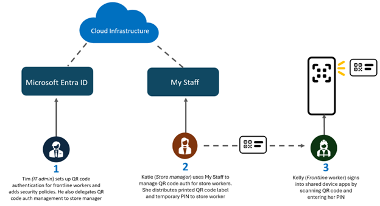
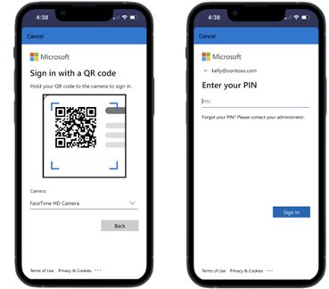

# QR コード認証でフロントライン ワーカーのサインイン体験をシンプルに

## 長いユーザー名とパスワードを使わずとも QR コードをスキャンして PIN を打ちこむことで共有デバイスに簡単にサインイン

皆様こんにちは。

この度、[Microsoft Entra ID での QR コード認証](https://learn.microsoft.com/entra/identity/authentication/concept-authentication-qr-code) のパブリック プレビューを発表します。この新機能は、フロントライン ワーカー (第一線で働く従業員) のサインインをより素早く簡単にすることを目的としています。

フロントライン ワーカーは、長らくより簡単にサインインする方法を待ち望んでました。これまで主に課題だったのは、共有デバイスでのアプリへのサインインが煩雑であることです。今回発表いたしますソリューションは、次のような 2 つの重要なニーズに対応するものです。

- 共有の業務デバイスから、仕事に欠かせない重要なアプリケーションへ迅速にアクセスする
- ユーザー名やパスワードを必要とせずシンプルで安全に認証する

Microsoft Entra ID の QR コード認証を使うと、ユーザー名やパスワードを覚える必要なく、共有デバイスでのアプリへのサインインがより早く完了し、なおかつ安全になります。フロントライン ワーカーは、提供された一意の QR コードをスキャンし、個人用の PIN を入力してサインインします。特定のデバイスにプロビジョニングするなどのことは不要なため、共有デバイスを使用する組織にとっては画期的な新機能です。

## QR コード認証でフロントライン ワーカーのサインインをより簡単に

ここでは、QR コード認証でフロントライン ワーカーのサインインが簡便となることで、従業員の生産性に良い影響が生じた一例をあげます。 

Contoso Industries 社は、ヨーロッパ全域に店舗を持つ小売企業で、各店舗には最大 20 人のフロントライン ワーカーがいます。それらの従業員は、日常業務として在庫の検索や更新、請求処理などのために共有モバイル デバイス (iPad、Android、iOS) を使用しています。現在、各ユーザーは共有デバイスにユーザー名とパスワードを使用してサインインするため、時間も手間もかかります。シフトが始まると共有デバイス毎に繰り返し認証する必要も生じます。 

Contoso 社は、これらのユーザーのために QR コード認証を設定することで、この問題に対処することにしました。Contoso 社はまず 1 つの店舗で QR コード認証を導入し、他の店舗にも拡張する予定です。Contoso 社のこの取り組みについて、いくつかのステップに分けて紹介いたします。

### 1. QR コード認証方法の設定

Contoso 社の IT 管理者は、店舗のフロントライン ワーカーの 1 人に QR コード認証を有効にすることから始めます。次に、その店舗のフロントライン ワーカー用に QR コードと仮の PIN を生成します。さらに、Microsoft Entra 条件付きアクセスポリシーを構成して、QR コード認証を使用する際には店舗内の準拠済みデバイスからのみ社内リソースへのアクセスできるよう制限します。 

最後に、既存の従業員および新しい従業員の QR コード認証の管理を [My Staff](https://learn.microsoft.com/entra/identity/role-based-access-control/my-staff-configure) を介してこの店舗のマネージャーである Katie に委任します。Katie は QR コードをシールに印刷します。このシールは後ほど従業員の入館証に貼り付けられます。 

詳細は [QR コード認証の有効化方法の詳細](https://learn.microsoft.com/en-us/entra/identity/authentication/how-to-authentication-qr-code) をご覧ください。 

### 2. QR コード認証方法でサイン インする

フロントライン ワーカーの Kelly は、マネージャーから QR コードのシールと仮の PIN を受け取ります。彼女は入館証の裏にそのシールを貼り、QR コードをスキャンして、Teams にサインインする際に QR コード認証用の新しい PIN を設定します。これで Kelly は店舗内の共有デバイスで簡単にサインインできるようになりました。 

## お客様やパートナーの声

この機能の開発では多くのお客様にご協力いただきました。以下にその一部の声をお知らせいたします。 

> 受入テストを通じて、QR コード+ PIN サイン インは、高いセキュリティ基準を維持しつつ、共有モバイル デバイスを使用するフロントライン ワーカーのサインイン操作をよりシンプルにする大きな可能性を秘めていると感じました。今後は Android の Managed Home Screen アプリでこれを実装し、ユーザーの効率とセキュリティを向上させていきたいと思います。
>
> **David ESPIN, C&A**

> Entra ID の新しい QR コードの認証方法を用いることで、モバイル デバイスでのエンド ユーザーの認証フローがとても簡素化されました。Entra の共有デバイス モードと組み合わせることで、フロントライン ワーカーはパスワードが不要になり、より素早く業務アプリを使用できるようになりました。QR コード認証は安全でユーザー フレンドリーな認証方法という点で、弊社の非常に重要なニーズを満たすものであり、フロントライン ワーカーはより効率的かつ安全に業務の遂行が可能となりました。
> 
> **Janic Verboon, baseVISION AG**

Microsoft Entra の活用方法や今後の改善点について、皆様からのフィードバックをお待ちしております。Microsoft Entra フォーラムを通じて、または X で @MSFTsecurity をタグしてフィードバックを共有ください！

Robin Goldstein  
Partner, Director of Product Management, Microsoft Identity