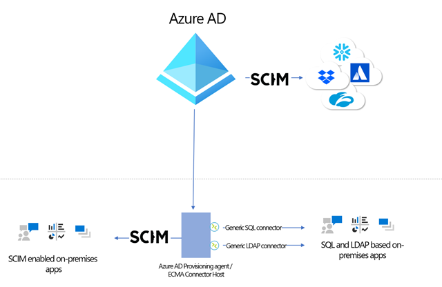
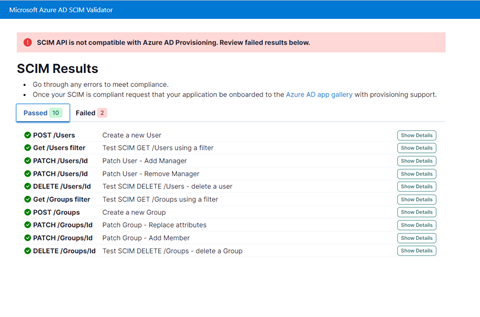

# Azure AD の新機能により ID プロビジョニングをよりシンプルに

こんにちは、Azure Identity サポート チームの中井です。

本記事は、2021 年 12 月 13 日に米国の Azure Active Directory Identity Blog で公開された [Simplify your identity provisioning with these new Azure AD capabilities](https://techcommunity.microsoft.com/t5/azure-active-directory-identity/simplify-your-identity-provisioning-with-these-new-azure-ad/ba-p/2466922) を意訳したものになります。ご不明点等ございましたらサポート チームまでお問い合わせください。

----

リモートワークの発展と導入が進む中、強固な ID とガバナンスの制御が ITの拡張性と柔軟なユーザー体験にとって重要です。本日、このようなご要望に対応するために、[Azure Active Directory](https://docs.microsoft.com/ja-jp/azure/active-directory/) (Azure AD) の新機能とベスト プラクティスをご紹介します。これらのアップデートにより、Azure AD Connect クラウド同期を構成している状況でのクラウドからのパスワード ライトバックの実行、オンプレミス アプリケーションへのプロビジョニング、SCIM プロビジョニング エンドポイントの検証などが可能になります。

## オンプレミスとクラウドを問わずパスワードのリセットが可能に

パスワード ライトバックにより、オンプレミスから同期しているユーザーがクラウド上でパスワードの変更を開始すると、ユーザーのオンプレミス [Active Directory Domain Services (AD DS)](https://docs.microsoft.com/ja-jp/azure/active-directory-domain-services/overview) 環境にリアルタイムにパスワードが書き戻されます。これにより、ユーザーは複数のパスワードの管理に悩まされることなく、クラウドとオンプレミスのアプリケーションをシームレスに行き来することができます。また、パスワードがどこで更新されても、クラウドとオンプレミスの間で同期状態を維持することが可能です。

現在パブリック プレビュー中の [Azure AD Connect クラウド同期のパスワード ライトバック](https://docs.microsoft.com/ja-jp/azure/active-directory/authentication/tutorial-enable-cloud-sync-sspr-writeback) を用いることで、従来の Azure AD Connect からは到達できないドメインに存在するユーザーをパスワード ライトバックの対象とすることが可能となります。組織は、複数のネットワーク的に分断されたドメインから単一の Azure AD テナントにユーザーを同期し、Azure AD からこれらのユーザーのパスワードをリセットすることができます。

## クラウドおよびオンプレミスのアプリケーションへのプロビジョニングをよりシンプルに

Microsoft Ignite において、[SCIM](https://docs.microsoft.com/ja-jp/azure/active-directory/app-provisioning/on-premises-scim-provisioning)、[SQL](https://docs.microsoft.com/ja-jp/azure/active-directory/app-provisioning/tutorial-ecma-sql-connector)、[LDAP](https://docs.microsoft.com/ja-jp/azure/active-directory/app-provisioning/on-premises-ldap-connector-configure) をサポートするオンプレミスアプリケーションへのプロビジョニングに関し、Azure AD でパブリック プレビューが利用可能となったことを [発表](https://jpazureid.github.io/blog/azure-active-directory/identity-at-ignite-strengthen-resilience-with-identity/) しました。お客様は、[monday.com](https://docs.microsoft.com/ja-jp/azure/active-directory/saas-apps/mondaycom-provisioning-tutorial)、[Miro](https://docs.microsoft.com/ja-jp/azure/active-directory/saas-apps/miro-provisioning-tutorial)、[Asana](https://docs.microsoft.com/ja-jp/azure/active-directory/saas-apps/asana-provisioning-tutorial) などの人気のある SaaS アプリケーションと同じ方法で、オンプレミス アプリケーションへのプロビジョニングを管理することが可能です。さらにこの発表に加えて、今回、OpenLDAP などのサードパーティの LDAP ディレクトリにユーザーをプロビジョニングする機能を追加いたしました。

## SCIM 規格に準拠したプロビジョニング エンドポイントの構築とテストをよりシンプルに

SCIM 検証ツールが限定でプレビュー開始となりました。これにより、パートナーや顧客は、エンドポイントが Azure AD SCIM クライアントと互換性があるかどうかを検証でき、Azure AD アプリケーション ギャラリーへの登録に要する時間を短縮することができます。[手順](https://docs.microsoft.com/ja-jp/azure/active-directory/app-provisioning/use-scim-to-provision-users-and-groups) に従い新しいアプリケーションの構築が完了しましたら、こちらの [リンク](https://forms.office.com/pages/responsepage.aspx?id=v4j5cvGGr0GRqy180BHbR7dZme7gPidCseyJdx2X-31UNUlLU05EVTg0MjBKNU1CV1ZDVkJZU0pVWC4u) よりプレビューへの招待をリクエストできます。

## Azure AD Connect 同期を最新バージョンへアップグレードして今後に備える

Azure AD Connect 同期のレガシー バージョン (v1.x) は、SQL Server 2012 や ADAL などのコンポーネントに依存していますが、これらは来年に廃止される予定です。そのため、すべてのお客様は同期処理のサポートが中断されないよう、[Azure AD Connect sync v2.0](https://docs.microsoft.com/ja-jp/azure/active-directory/hybrid/reference-connect-version-history) へアップグレードいただくか、[Azure AD Connect クラウド同期](https://docs.microsoft.com/ja-jp/azure/active-directory/cloud-sync/what-is-cloud-sync) への切り替えをご検討いただく必要がございます。Azure AD Connect 同期 v1.x のバージョンは、2022 年 8 月 30 日をもちまして廃止されます。

IT に関する計画の予測が容易となるよう、弊社では Azure AD Connect 同期のバージョンについて一貫した廃止サイクルを確立しています。今後は、新バージョンがリリースされてから 18 カ月後に各バージョンを廃止する予定です。

## プロビジョニング ロジックに日付の比較を使用する

[属性マッピング](https://docs.microsoft.com/ja-jp/azure/active-directory/app-provisioning/functions-for-customizing-application-data) を用いることにより、対象のシステムに書き込む前にデータを制御および変換することができます。皆様からのフィードバックに基づき、新しい組み込み日付関数 [Now()](https://docs.microsoft.com/ja-jp/azure/active-directory/app-provisioning/functions-for-customizing-application-data#now), [DateAdd()](https://docs.microsoft.com/ja-jp/azure/active-directory/app-provisioning/functions-for-customizing-application-data#dateadd), [DateDiff()](https://docs.microsoft.com/ja-jp/azure/active-directory/app-provisioning/functions-for-customizing-application-data#datediff) を追加し、日付を比較したり、日付時刻の値に基づくきめ細かい属性プロビジョニングを定義できるようにいたしました。ユーザーのプロビジョニング フローの他の関数とネストしたり組み合わせることで、以下のようなシナリオを実装できます。

- ユーザー タイプに基づいて、SaaS アプリケーションまたはオンプレミス アプリケーションのユーザー アカウントの有効期限を、 現在のプロビジョニング時刻から "X" 日後に設定する。
- 現在の日付と人事的な採用日の間隔の差を求め、それをアカウントの有効化/データフロー ロジックの決定に使用する。

いつも通り、皆様のご意見をお聞かせください。コメントをお寄せいただくか、[aka.ms/AzureADFeedback](https://feedback.azure.com/d365community) までお気軽にご連絡ください。
