# Entra ID 初学者向けシリーズ第 1 弾 - 条件付きアクセス 入門

こんにちは、Azure Identity サポート チームの 夏木 です。

この度、Microsoft Entra サポート チームより、最近 Entra の利用を始めたお客様を対象に初学者向けのブログ シリーズを開始することといたしました。本記事は、その Entra ID 初学者向けシリーズの第 1 弾「条件付きアクセス 入門」です。

**本記事の対象者**

- Microsoft Entra 条件付きアクセスの基本を理解したい方
- よくあるお問い合わせの事例を通じて実践的な知識を得たい方
- Microsoft Entra  のサインインログの基本的な分析方法を知りたい方

**記事概要**

本記事では、Microsoft Entra 条件付きアクセスを初めて学習/導入する方を対象に、基礎的な概念や設定方法を分かりやすく解説します。また、現場でよくある質問や課題を例に、具体的な対応策も紹介します。最後に、サインインログの読み解き方についても簡単に解説します。IT 管理者の方々にとって日々の運用に役立ちましたら嬉しいです！

---

## 条件付きアクセスの基本

### 条件付きアクセスとは

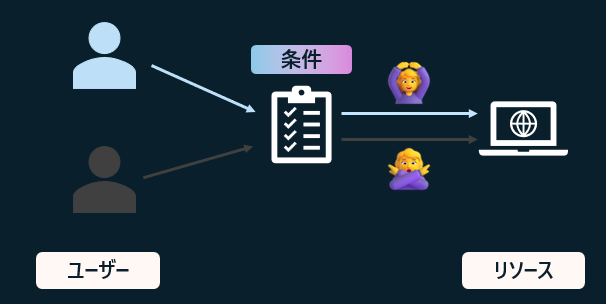

条件付きアクセスは、ユーザーが Entra ID と連携したリソースにアクセスする際に、特定の条件に基づいてポリシーを適用し、リソースへのアクセスを制御する仕組みです。これにより、必要なユーザーだけが適切な状況でリソースにアクセスできるようになりセキュリティを高めることが可能です。条件付きアクセス ポリシーが適用されるのは、ユーザーが Entra ID にサインインした後、Entra ID がクラウド上のリソースに対して各種のトークンを発行する直前となります。

条件付きアクセスの流れ:

1. ユーザーが特定のリソース (Web アプリや Web API) にアクセスを試みます。
2. 特定のリソース (Web アプリや Web API) が Entra ID で認証してくるようユーザーに要求し、ユーザーは Entra ID に誘導されます。
3. Entra ID によりサインインが求められます。
4. ユーザーが ID/PW などを入力しサインインが成功すると、アクセス要求が条件付きアクセス ポリシーによって評価されます。
    - ポリシーの適用条件に合致しなかった場合 → ポリシーは適用されずアクセスが許可されます 🙆‍♀️ 
    - ポリシーの適用条件に合致し、制御を満たした場合 → アクセスが許可されます 🙆‍♀️
    - ポリシーの適用条件に合致したが、制御を満たさない場合 → アクセスが拒否されます 🙅‍♀️

ポリシーの適用条件や制御に具体的に設定できる値については後述します。

より細かい説明については [改めて知る Microsoft Entra 条件付きアクセス](https://jpazureid.github.io/blog/azure-active-directory/review-ca/) の記事もご覧ください:  

## 条件付きアクセスの考え方ポイント

初学者にとって押さえておくと躓きにくいポイントと、おすすめの Identity チーム公式ブログをご紹介します。条件付きアクセス初学者の方に是非意識していただきたい考え方はこちらです。

1. 設定した条件に合致したサインインにアクセス権を付与するのではなく、条件に合うサインインに制限をかける (制御する) という考え方  
2. 制御の対象は、正確にはアプリケーションではなく ”リソース” である

### 条件付きアクセスの考え方のポイント 1

条件付きアクセスは、サインインに対してアクセス権を付与する (アクセスを許可) するという考え方ではなく、設定した条件に合うサインインに制御 (制限) をかけるという考え方です。

条件に合致した場合にサインインに対して適用される制御 (制限) としては、「アクセスのブロック」や「多要素認証を要求する」、「Microsoft Entra ハイブリッド参加済みデバイスが必要など」というものがあります。実際の画面とその考え方は以下の画像のとおりです。

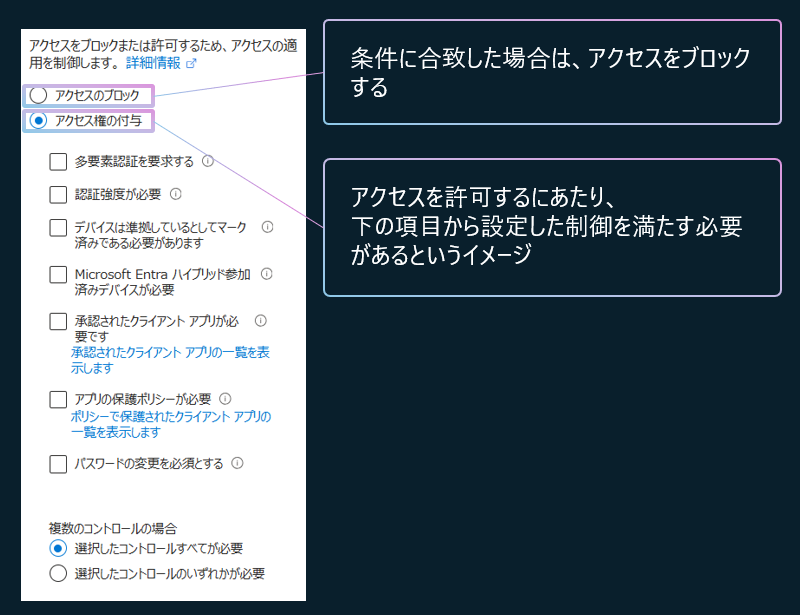

条件付きアクセスは、ポリシーが適用される条件を満たした場合に、アクセスをブロックもしくは制御するためのものあり、条件を満たしたものを許可するというものではありません。ファイアーウォールのルールとは異なり、既定ですべてブロックがあり、そのうえで一部を許可するというイメージではない点に注意ください。ID とパスワードという最低限の認証を突破した後に、条件に合うものに追加の制御 (もしくはブロック) を適用するというイメージです。

改めて、「アクセスを許可する」というものではなく、「特定の条件を満たした場合に制御が適用される (条件を満たさなかった場合は制御が適用されない)」というイメージになります。

詳細は以下の記事もご覧ください:

- [条件付きアクセスの基本的な考え方 | Japan Azure Identity Support Blog](https://jpazureid.github.io/blog/azure-active-directory/conditional-access-basic/)  
- [改めて知る Microsoft Entra 条件付きアクセス | Japan Azure Identity Support Blog](https://jpazureid.github.io/blog/azure-active-directory/review-ca/)

### 条件付きアクセスの考え方のポイント 2

条件付きアクセスが制御の対象とするのは、「アプリケーション」ではなく「リソース」へのアクセスです。ここで言う「リソース」というのは、Entra ID と連携して動作している Web アプリケーション (Salesforce や自社開発のWeb アプリケーションなど) や、PC 上で動作するクライアント アプリケーションがクラウド上からデータを取得する際のアクセス先 (Web API) とお考え下さい。

例えば Outlook を Windows 上で利用して、Microsoft 365 の E メールを利用している場合、ユーザーは単に Outlook にサインインしているだけと思うはずですが、実際にはインターネット (Microsoft 365) 上から Email のデータを取得してくるにあたり Exchange Online の Web API を利用しています。Outlook は Exchange Online というクラウド上の "リソース" を使用しており、この Exchange Online が条件付きアクセスの適用対象となります。このため、条件付きアクセスの設定画面では、Outlook というリソースは出てきません。

他にも例えば、ユーザーが Windows 上で Teams のネイティブ アプリにアクセスしたとします。この時、ユーザーは Teams のネイティブ アプリにだけアクセスしているわけではありません。実際は、Teams のクラウド側の Web サービスに加え、SharePoint Online、Exchange Online、Microsoft Planner という複数の Web API にアクセスをしています。つまり、Teams のクライアントは、それが使用するデータのもととなっている複数のクラウド上の ”リソース” にアクセスしています。Teams はこれらリソースの一つでもアクセスができないと (条件付きアクセスでブロックされると)、正常に動作しません。

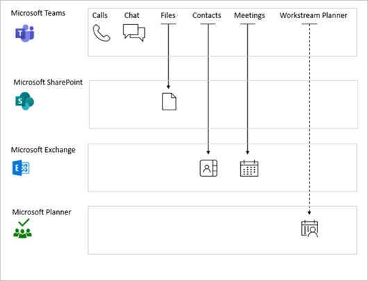

このようにユーザーがサインインしているアプリが、別のクラウド上の Web API (リソース) を呼び出すということは一般的であり、これはサービスの依存関係とも呼ばれます。条件付きアクセスを利用する際に意識するべき依存関係については [条件付きアクセスのサービスの依存関係](https://learn.microsoft.com/ja-jp/entra/identity/conditional-access/service-dependencies) に解説されていますのでご覧ください。

そのほかの条件付きアクセスの動作の仕組みやよくある質問に関しては [Azure AD の条件付きアクセスに関する Q&A](https://jpazureid.github.io/blog/azure-active-directory/qanda-conditional-access/) の記事もご覧ください。  

## 条件付きアクセスポリシーの作成

条件付きアクセス ポリシーにて設定可能な値の概要は以下のとおりです。まず、条件について以下に概要をおまとめしました。条件付きアクセス ポリシーでは、まず大きく適用対象のユーザーと適用対象のリソースを選択する必要があります。これらに加えて、さらにネットワークの場所やクライアント OS の種類など細かく適用条件を選択することが可能です。

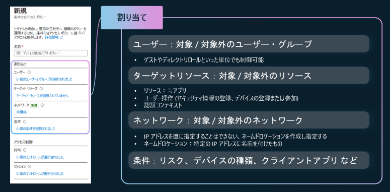

上記の囲まれた部分の構成が終わったら、次にその条件に合致したときにどのような制御を適用するかを決めます。それが以下の画面です。

条件に合致したときにアクセスを許可する場合、許可に際して適用される制御の内容を選択します。例えば、条件に合致したときに多要素認証を求めたい場合は「多要素認証を要求する」にチェックを付けます。

なお、条件に合致したときにセッションに対しても制御を適用することが可能です。例えば、サインインの頻度という制御を適用すると、8 時間毎に再認証をユーザーに求めるということも可能です (頻繁な再認証はセキュリティをむしろ低下させるため推奨しておりません)。

各設定値の詳細は [条件付きアクセス ポリシーの構築](https://learn.microsoft.com/ja-jp/entra/identity/conditional-access/concept-conditional-access-policies) の公開情報もご覧ください。

## よくあるお問い合わせの例

これまでの説明をもとに、条件付きアクセス ポリシーの理解向上に役立ついくつかのお問い合わせ例をご紹介いたします。

- 基本編 1: 場所やデバイスの状態をもとに制御したい
- 基本編 2: ポリシーを構成したが思ったように適用されない
- 中級編 3: 「デバイスは準拠しているとしてマーク済みである必要があります」の制御を適用した状態で Intune の新規デバイス登録は可能か
- 中級編 4: Teams 以外のすべてのアプリをブロックしているのに Teams にアクセスできない

### 基本編 1: 場所やデバイスの状態をもとに制御したい

以下のようなお問い合わせがあったとします。

> 以下を満たす条件付きアクセスポリシーを作成したい。
> 
> <シナリオ A>  
> 社外からの Office 365 へのアクセスは準拠済みのデバイスのみに制限したい
> 
> <シナリオ B>
> Android / iOS に対しては指定した IP アドレスの範囲からしかアクセスを許可しない  

これらの場合、ポリシーの構成としては、すべてのネットワークの場所に対して「準拠済みのデバイスを要求する」もしくは「アクセスをブロックする」と構成して、ポリシーの対象外の場所に「社内」や「指定した IP アドレスの範囲」を指定します。各シナリオを言い換えると以下のようになります。

<シナリオ A>  
全ての場所ですべてのユーザーに対し、Office 365 にアクセスする際は準拠済みのデバイスを必要とするが、社内はその対象外とする。

<シナリオ B>  
Android / iOS に対してはすべての場所 (指定した IP アドレスの範囲はその対象外) ですべてのユーザーとアプリに対してアクセスをブロックする。

これらを実際のポリシーの構成に落とし込むと以下のようになります。このように、要望されているシナリオを条件付きアクセス ポリシーの構成に合うように少し変換して構成ください。

<シナリオ A の設定例>

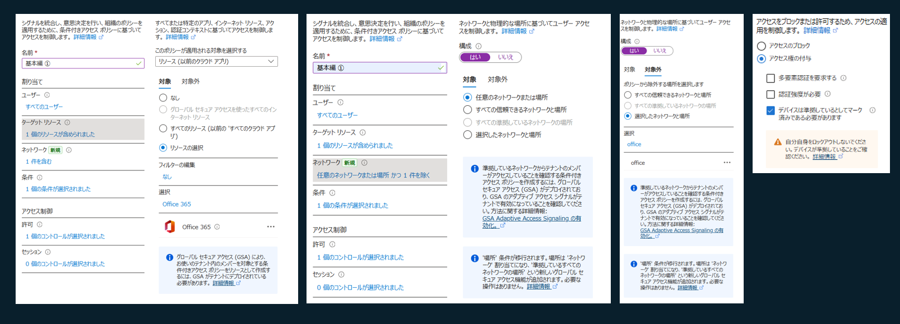

<シナリオ B の設定例>

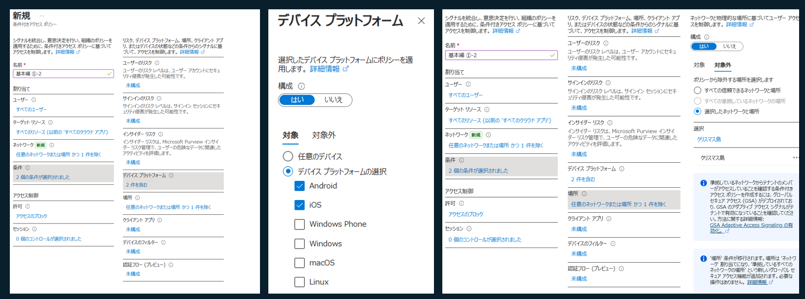

### 基本編 2: ポリシーを構成したが思ったように適用されない

以下のようなお問い合わせがあったとします。

> 以下条件付きアクセスポリシーを設定をしたが、適用されない。オフィス以外の場所からのアクセスはブロックしたい。
> 
> 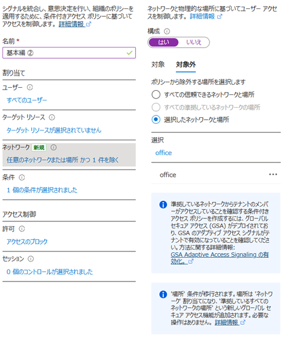  

ターゲット リソースが指定されていないため、何もポリシーの対象となっておらず機能しません。以下は割り当てをするときに必ず指定する必要があるものです:

- ユーザー
- ターゲットリソース

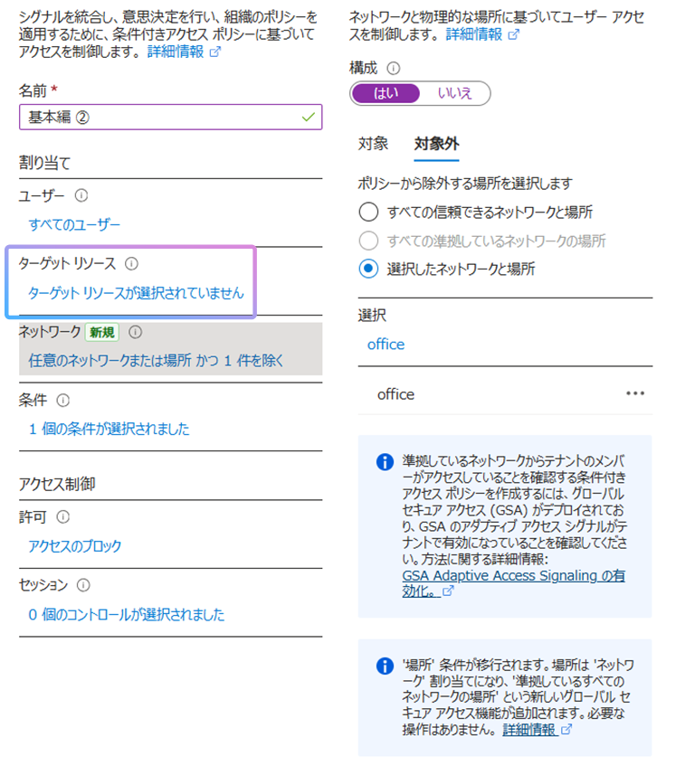

前述のとおり、条件付きアクセスは、条件に合ったものに対して制御を適用するというものですので、ポリシーが適用される条件についてはすべて指定するようにご注意ください。

### 中級編 3: 「デバイスは準拠しているとしてマーク済みである必要があります」の制御を適用した状態で Intune の新規デバイス登録は可能か

以下のようなお問い合わせがあったとします。

> 条件付きアクセスにて、「デバイスは準拠しているとしてマーク済みである必要があります」の制御を適用された状態にしました。新しいデバイスの Intune 登録は可能でしょうか。
> 
>   

このお客様は、条件付きアクセスにて「デバイスは準拠しているとしてマーク済みである必要があります」の制御を適用にした際に、これから Intune 登録しようとしているデバイスはこの条件を満たせない (登録しようとしているその時点ではデバイスはまだ非準拠である) ため、新規の Intune 登録がブロックされるのではないかと懸念してこのようなお問い合わせをされました。

このシナリオは条件付きアクセスで考慮されており、Bootstrap シナリオと呼ばれます。この Bootstrap シナリオに当たる以下の場合は、条件付きアクセス ポリシー適用の対象となるユーザーとリソースを設定していても、制御が適用されません:

- Device registration
- Intune Management Setup
- Intune Check-In
- Multi-Factor Auth Connector
- (一覧は公開されていないため、上記の他にもある可能性あり)

この時、条件付きアクセス ポリシーとしては、制御が適用されないという結果になりますので、サインイン ログ上は、条件付きアクセス ポリシーの適用が失敗したと表示される場合があります。しかしながら、これは想定された動作であるため心配いただく必要はありません。

詳細は [準拠しているデバイス、ハイブリッド参加済みデバイス、または MFA を必須にする](https://learn.microsoft.com/ja-jp/entra/identity/conditional-access/policy-alt-all-users-compliant-hybrid-or-mfa) の公開情報もご覧ください。

### 中級編 4: Teams 以外のすべてのアプリをブロックしているのに Teams にアクセスできない

以下のようなお問い合わせがあったとします。

> Teams 以外のすべてのアプリをブロックし、Teams はポリシーの対象外としている。しかし、Teams にアクセスできないのはなぜでしょうか。
> 
> 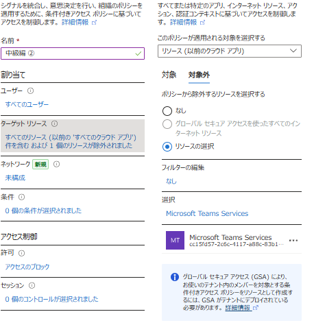  

Microsoft Entra 条件付きアクセスのサービス依存関係が原因です。前述のとおり、Teams にアクセスするためには、Microsoft SharePoint Online や Microsoft Exchange Online のリソースにアクセスする必要があります。しかし、このシナリオでは Teams のみがポリシーの対象外であり、Microsoft SharePoint Online や Microsoft Exchange Online は条件付きアクセス ポリシーの適用対象となります。このため、Teams アプリが使用しているリソースがブロックされる状態であり、結果的に Teams にもアクセスできません。

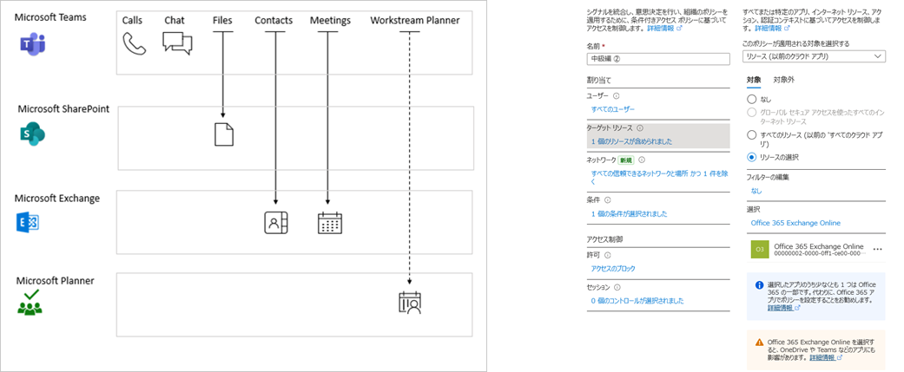

Teams のみをユーザーに利用させたいというお客様は多くいらっしゃいますが、Teams のこのような性質により、Teams のみユーザーに利用させるということは極めて困難です。条件付きアクセス ポリシーの観点では、Microsoft SharePoint Online や Microsoft Exchange Online も条件付きアクセスポリシーで許可いただく必要があります。結果としてユーザーは Outlook や SharePoint Online にもアクセスが可能となります。弊社としてはこういった依存関係を考慮して、条件付きアクセスポリシーの対象および対象外としては Office 365 の利用をお勧めしています。

詳細は [条件付きアクセスのサービスの依存関係](https://learn.microsoft.com/ja-jp/entra/identity/conditional-access/service-dependencies) の公開情報もご覧ください。

## サインイン ログを見るときのポイント

条件付きアクセスに起因してサインインがブロックされた場合、その概要がサインイン画面に表示されます。この時、「詳細」をクリックするか、画面右下の ... をクリックすると、エラーの詳細を確認可能です。サインイン時のエラー画面にて表示される以下の情報を控えてサインイン ログを検索すると詳細な情報を得ることが出来ます。

- 要求 ID (Request ID): 各サインインの ID
- 相関 ID (Correlation ID): 一連のサインインを束ねた ID
- Timestamp: サインインした時刻
- アプリ名: アクセス先のアプリ

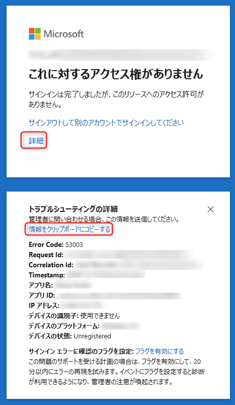

Entra ID のサインイン ログを確認するには以下の手順を実施ください。

1. Azure Portal  (https://portal.azure.com) にアクセスします。
2. 管理者アカウントでサインインします。
3. [Microsoft Entra ID] > [サインイン ログ] に移動します。

適当なサインイン ログの内容をクリックすると、以下のように情報が表示されます。[基本情報] タブにその概要が表示されます。ここでで注目したい値は以下のとおりです。

- 要求 ID (Request ID): 各サインインの ID
- 相関 ID (Correlation ID): 一連のサインインを束ねた ID
- Timestamp: サインインした時刻
- リソース名: アクセス先のリソース
- リソース ID: アクセス先のリソースの ID
- ユーザー: サインインしたユーザーの UPN

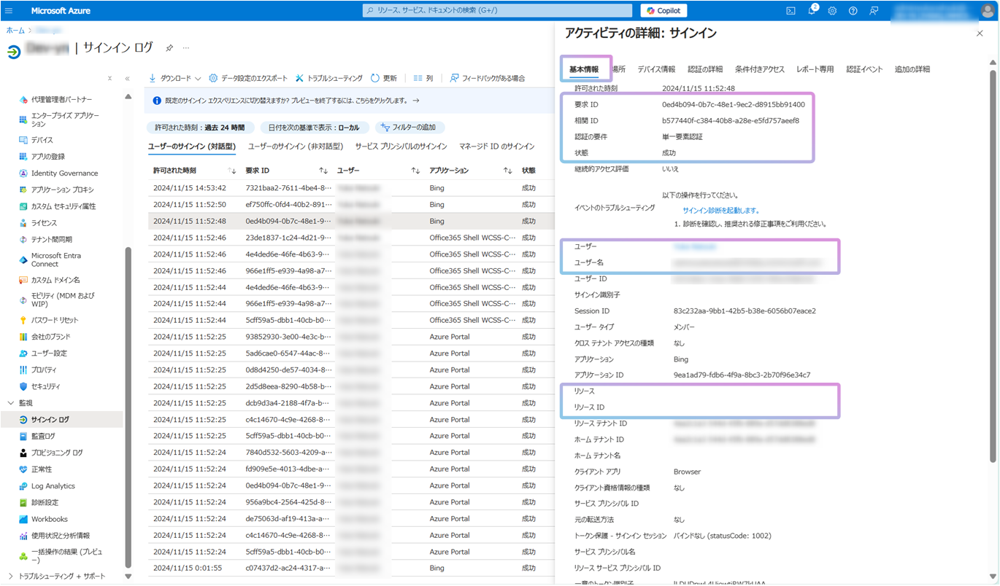

[条件付きアクセス] タブでは以下の内容などを確認することが可能です。ポリシーの適用が思ったように行われない場合は、この画面を見て各ポリシーの適用状況をご確認ください。

- どの条件付きアクセスポリシーが適用されたか
- どの条件に合致したのか
- どの制御が適用されたのか

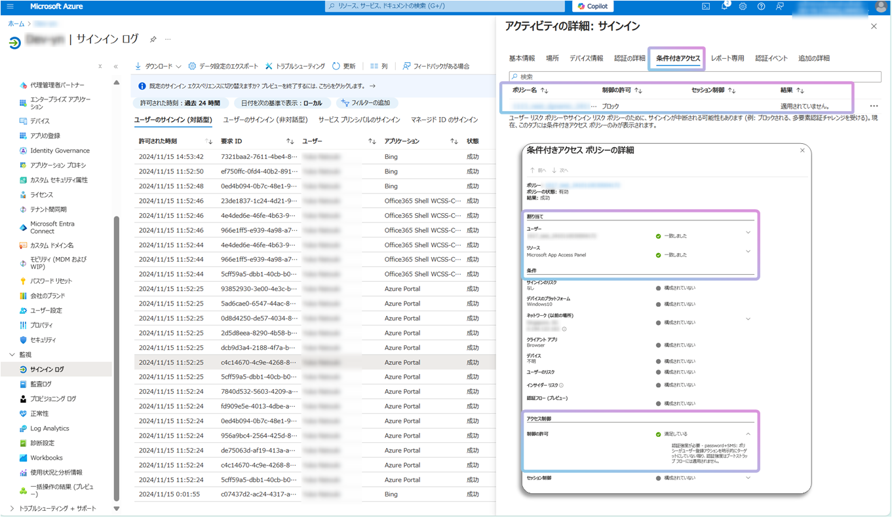

## まとめ

今回の初学者向けシリーズ第 1 弾では条件付きアクセスについて解説しました。特にご注目いただきたい点をまとめると以下のとおりです。

- アクセス権の付与ではなく、特定の条件を満たした場合に制御が適用される (条件を満たさなかった場合は制御が適用されない) というイメージである
- 条件付きアクセスでの制御の対象はユーザーの目の前で動いているアプリではなく、クラウド上の ”リソース” である
- ユーザーの目の前で動いているアプリがどのクラウド "リソース" を利用しているかを意識することでポリシーの構成をスムーズに行うことが可能である
   
# 参考になる資料

上記内容をご覧いただけましたら、是非以下の資料についてもご覧ください。

ブログ  

- [Azure AD の条件付きアクセスに関する Q&A | Japan Azure Identity Support Blog](https://jpazureid.github.io/blog/azure-active-directory/qanda-conditional-access/)
- [条件付きアクセスの基本的な考え方 | Japan Azure Identity Support Blog](https://jpazureid.github.io/blog/azure-active-directory/conditional-access-basic/)
- [改めて知る Microsoft Entra 条件付きアクセス | Japan Azure Identity Support Blog](https://jpazureid.github.io/blog/azure-active-directory/review-ca/)
- [「現時点ではこれにはアクセスできません」 エラーについて | Japan Azure Identity Support Blog](https://jpazureid.github.io/blog/azure-active-directory/conditional-cannot-access-rightnow/)

公開情報  

- [Microsoft Entra ID の条件付きアクセスとは - Microsoft Entra ID | Microsoft Learn](https://learn.microsoft.com/ja-jp/entra/identity/conditional-access/overview)
- [Microsoft Entra の条件付きアクセスのデプロイを計画する - Microsoft Entra ID | Microsoft Learn](https://learn.microsoft.com/ja-jp/entra/identity/conditional-access/plan-conditional-access)
- [条件付きアクセス ポリシーの構築 - Microsoft Entra ID | Microsoft Learn](https://learn.microsoft.com/ja-jp/entra/identity/conditional-access/concept-conditional-access-policies)
- [条件付きアクセスのサービスの依存関係 - Microsoft Entra ID | Microsoft Learn](https://learn.microsoft.com/ja-jp/entra/identity/conditional-access/service-dependencies)
