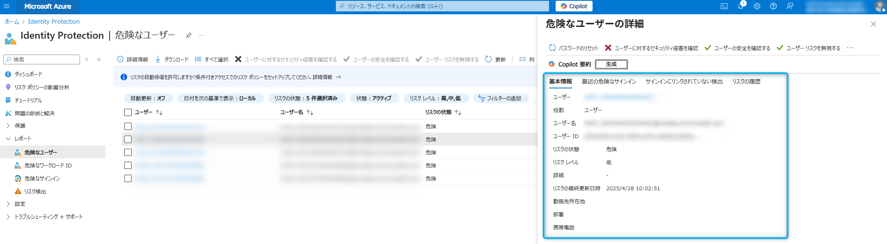
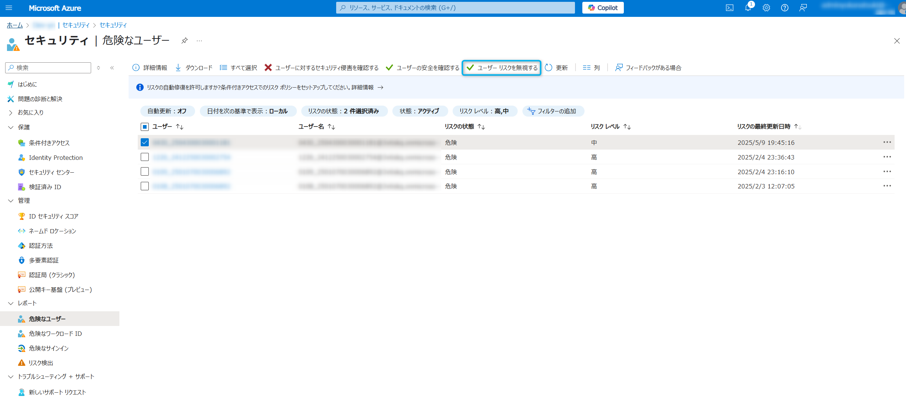

# Entra ID 初学者向けシリーズ第 2 弾 - ID Protection 入門 - その 2: リスクの検出/確認/対応

こんにちは、Azure Identity サポート チームの 夏木 です。

この度、Microsoft Entra サポート チームより、最近 Entra の利用を始めたお客様を対象に初学者向けのブログ シリーズを作成しております。本記事は、その Entra ID 初学者向けシリーズの第 2 弾「ID Protection 入門」の「その 2: リスクの検出/確認/対応」です。

**本記事の対象者**

- Entra P2 ライセンスの購入を検討中のお客様
- Microsoft Entra ID Protection とは何か知りたい方
- リスクの検出、調査、修復の方法を知りたい方
- よくある使用シナリオについて知りたい方

**記事概要**

Entra ID 初学者向けシリーズの第 2 弾「ID Protection 入門」では、全部で以下の 3 つの記事を用意しています。

1. [その 1: ID Protection とは](./starter-series-id-protection-1.md)
2. その 2: リスクの検出/確認/対応 (この記事)
3. [その 3: リスクベースのポリシーで自動的に管理](./starter-series-id-protection-3.md)

本記事「その 2: リスクの検出/確認/対応」では、Microsoft Entra ID Protection を初めて学習/導入する方を対象に、Azure ポータルや Microsoft Entra 管理センターにてリスクを確認する方法とリスク対応の方法について解説します。また、典型的な使用シナリオと実際にお試しいただけるサンプルも紹介していますので、是非一緒に手を動かしてみてください。IT 管理者の方々にとって日々の運用に役立ちましたら嬉しいです！

---

## ID Protection を使ってリスクを確認して調査および修復する

ここでは実際に ID Protection の画面を見て、検出されたリスクを確認し、その調査と修復を手動で行う流れを見ていきます。詳細については、以下の公開情報もご覧ください。  

- [Microsoft Entra ID Protection でリスクを調査する - Microsoft Entra ID Protection | Microsoft Learn](https://learn.microsoft.com/ja-jp/entra/id-protection/howto-identity-protection-investigate-risk)  
- [リスクを修復してユーザーをブロック解除する - Microsoft Entra ID Protection | Microsoft Learn](https://learn.microsoft.com/ja-jp/entra/id-protection/howto-identity-protection-remediate-unblock)

ここでは管理者がすべて手動でレポートを確認し、リスクを調査して修復する流れを示しますが、このような手動での対応はリスクの発生から対応 (修復) までに時間を要することが一般的です。つまり、アカウントの侵害 (リスク) が生じた後に、対処 (リスクの修復) が完了するまでに、攻撃者に対してより多くの活動時間を与えてしまうということになります。

攻撃者は AI を用いてアカウントの侵害と、その後の内部工作、情報漏洩などを非常に速いスピードで行うことが想定されます。この場合、人による手動での対応では間に合いません。弊社ではこのような手動での対応ではなく、[その 3: リスクベースのポリシーで自動的に管理](./starter-series-id-protection-3.md) で紹介する条件付きアクセス ポリシーと連携した自動修復の仕組みを強くお勧めいたします。

### 検出されたリスクの確認

検出されたリスクを確認するには、Azure ポータルもしくは、Microsoft Entra 管理センターを利用します。Azure ポータル (https://portal.azure.com) にアクセスしたら、画面上部の検索ボックスに ID Protection と入力して、Microsoft Entra ID Protection を開きます。

それぞれの項目の説明は以下のとおりです。

- 危険なサインイン: リスクがあると判断されたサインインが一覧表示されます。
- 危険なユーザー: アカウントが侵害されたリスクがあるとみなされたすべてのユーザーが一覧表示されます。
- 危険なワークロード ID: アカウントが侵害されたリスクがあるとみなされたすべてのワークロード ID が一覧表示されます。
- リスク検出: 検出されたリスクの一覧を確認できます。

まずは上記のページをお客様のテナントでも確認いただき、どのようなリスクが検出されているか、どのようなユーザーやワークロード ID に対してリスクが上がっているかをご確認ください。リスク レベルが高のものや、侵害された際の影響が大きいアカウント (管理者アカウントや、役員のアカウントなど) が一覧に出ていないか確認することをお勧めします。

### リスクの調査 

リスクの一覧をながめて、高リスクのアカウントや役員のアカウントなど、今すぐに対処したほうがよさそうなものが確認できたら、これらに対して調査をしていきます。各項目をクリックすることで、ユーザー ID の詳細や、オフィスの場所、最近の危険なサインイン、サインインにリンクされていない検出、リスク履歴などの情報が表示されます。これらの情報を確認するとともに、必要に応じて実際のユーザーに聞き取り調査を行うことで、そのサインインやユーザーが本当にリスクのあるものかどうかを確認するという流れです。

例えば、あり得ない移動のリスクが検出されたユーザーがいた場合に、そのユーザーが Azure VM を普段利用しない海外のリージョンに構築し、そこからサインインを試行したという場合があります。この場合は、ユーザーが意図したサインインであるため、実質的なリスクはありません。この場合は、ユーザーにその確認を取ったうえで、リスクはないと判断します。反対に、ヒアリングの結果、ユーザーがそのような操作をしていないのに、海外から突然のサインインがあったということであれば、それはアカウント侵害の可能性が高いと判断できます。

> [!NOTE]
> リスクの詳細を含めてすべての情報を確認できるのは、P2 ライセンスを持つお客様のみです。P1 ライセンス以下をお持ちのお客様は、詳細を確認できず、一部のリスクが表示されないなどします。

### リスクの修復
        
上記のように、ユーザーへのヒアリングを含めてアカウントが侵害されている (ユーザーの意図しないサインインが何者かにより成功した) と判断した場合は、そのリスクの修復を行います。この場合まずは **\[ユーザーが侵害されたことを確認する\]** のボタンを選択します。

このボタンを押すと、ID Protection は、ユーザー リスクを高に設定します。管理者がユーザーの侵害を確認したというようにマークするボタンです。ID Protection はこれを学習し、修復手順が取られるまで、サインインは危険とみなされます。

次に、ユーザーが侵害されたことを確認したら、以下の対応を取ります。

- \[パスワードのリセット\]: これを選択すると、ユーザーにはパスワード変更が求められ、加えてユーザーの現在のセッションが取り消されます。ユーザーは再認証が必要となります。
- \[ユーザーのブロック\]: これを選択すると、ユーザーのサインインがブロックされます。明らかにアカウントが乗っ取られ、これ以上の被害拡大を防ぐという意味で、アカウントをいったん利用停止にしたい場合はこちらを使います。

上記二つのいずれかの対応で、取り急ぎそのアカウントによる被害の拡大を防ぐことができます。ユーザーをブロックした後、再度そのアカウントを利用したいということであれば、パスワードをリセットして、ブロックを解除するという対応を取ります。

もし確認の結果、アカウントが実は侵害されておらず、誤検知 (偽陽性 - false positive) であった場合は、管理者により以下の対応を取ることが可能です。

- \[ユーザーの安全を確認する\]: このボタンを押すと、対象のリスクを誤検知として扱います。ユーザーのリスクと検出が削除され、ID Protection はこの結果を考慮して、再度学習モードに入ります。
- \[ユーザー リスクを無視する\]: このボタンは、リスクが検出されたが、実質的には無害であり、一旦このリスクを無視したい場合に使用します。例えば、検証のために侵入テストを行い、リスクが検出された (実際にリスクは検出されたが、そこに悪意がない) 場合にこのボタンを押下します。この結果は学習されないため、今後も同様のリスクが検知されます。

> [!NOTE]
> \[ユーザーの安全を確認する\] および \[ユーザー リスクを無視する\] の対応を取った場合、リスクの状態は "危険" から "安全であるとの確認済み" および "破棄済み" に、リスク レベルはいずれも "-" に変更されます。危険なユーザー レポートではリスク レベルのフィルターを未選択にすることで確認いただけます。

他にも、[Microsoft 365 Defender で調査する] というボタンがありますが、こちらは、お客様が M365 Defender をご利用の場合にぜひご利用ください。

> [!IMPORTANT]
> リスクが検出された際に、お客様によっては弊社サポートにお問い合わせいただき、リスクの詳細について相談いただくことが多くございます。この場合、お問い合わせ前に、まずはすぐにでも対象のアカウントのパスワード リセットやブロックを実施ください。弊社に問い合わせ中に、攻撃者によるアカウント侵害が継続し、被害が拡大している可能性があります。また Entra ID サポートチームではそのリスクの内容や一般的な対応方法について支援はいたしますが、そのリスクが本当に攻撃者によるものなのか、アカウントが侵害されたのかを確認することは致しかねます。そのようなご質問は外部のセキュリティ ベンダーか、弊社が提供する特別な診断サービスの利用を検討ください。

## リスクの 検出/確認/対応 を実際に試してみましょう

このセクションでは、Tor ブラウザーを使用して「匿名 IP アドレスからのアクセス (Tor ブラウザーなどの接続元を隠蔽するツールを利用してサインインされた)」のリスクを発生させ、Azure ポータルまたは Microsot Entra 管理センターより、リスクの確認および対応を実施する流れをシミュレーションする方法を紹介します。

### Step1. 疑似的にリスクを発生させる

1. [Tor ブラウザー](https://www.torproject.org/download/) とテスト アカウントを用意します。
2. Tor Browser を使用して、[My Apps](https://myapps.microsoft.com) に移動します。
3. テスト アカウントの資格情報を入力してサインインします。

### Step2. リスクをポータル上で確認する

10 分から 15 分ほどでレポートに表示され、詳細情報を確認できるようになります。

### Step3. リスクへの対応を実施する

実施したいリスクへの対応を選択します。

## リスクの自動修復およびリスク ポリシーの導入

ここまで手動でのリスク確認や修復について説明してきましたが、改めまして、この方法は人力によるものであり、現在の自動化や AI を使った攻撃にはスピードが追い付かず対応できません。そこで弊社では、**P2 ライセンスの機能である [リスクベースの条件付きアクセス ポリシー](https://learn.microsoft.com/ja-jp/entra/id-protection/howto-identity-protection-configure-risk-policies) を有効にすることを強くお勧めしています**。この機能を利用することで、検出されたリスクに対して、より強力な認証方法をすぐに要求したり、検出されたリスク レベルに基づいて安全にパスワード リセットを実施させたりすることができます。つまり、**リスクが検出されたら、人力による対処ではなく、システムが自動的にそれに対応し、ユーザーの操作を起点にしてリスクをすぐさま修復するということが可能になります**。

リスク ポリシーの詳細については、初学者向けシリーズ第 2 弾の 3 つ目の記事「その 3: リスクベースのポリシーで自動的に管理」にてご紹介します。

## まとめ

今回の初学者向けシリーズ第 2 弾の「その 2:リスクの検出/確認/対応」について解説しました。特にご注目いただきたい点をまとめると以下のとおりです。

- Azure ポータルや Microsoft Entra 管理センターにて検出されたリスクの一覧を確認することが可能です。
- 検出された各リスクを選択することで詳細情報も確認することができます。
- 確認されたリスクに対して、パスワードのリセットやユーザーのブロックなどの対応をすることが可能です。
