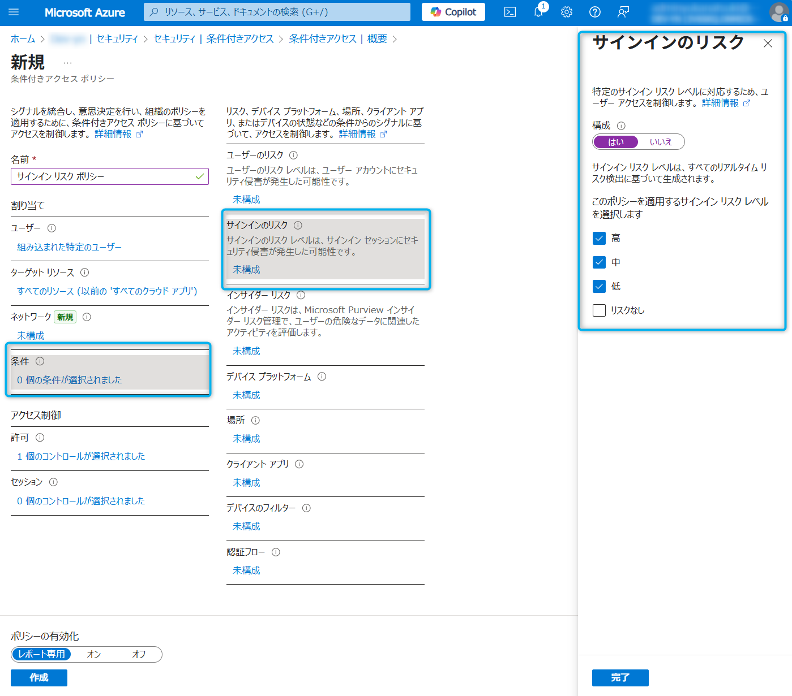
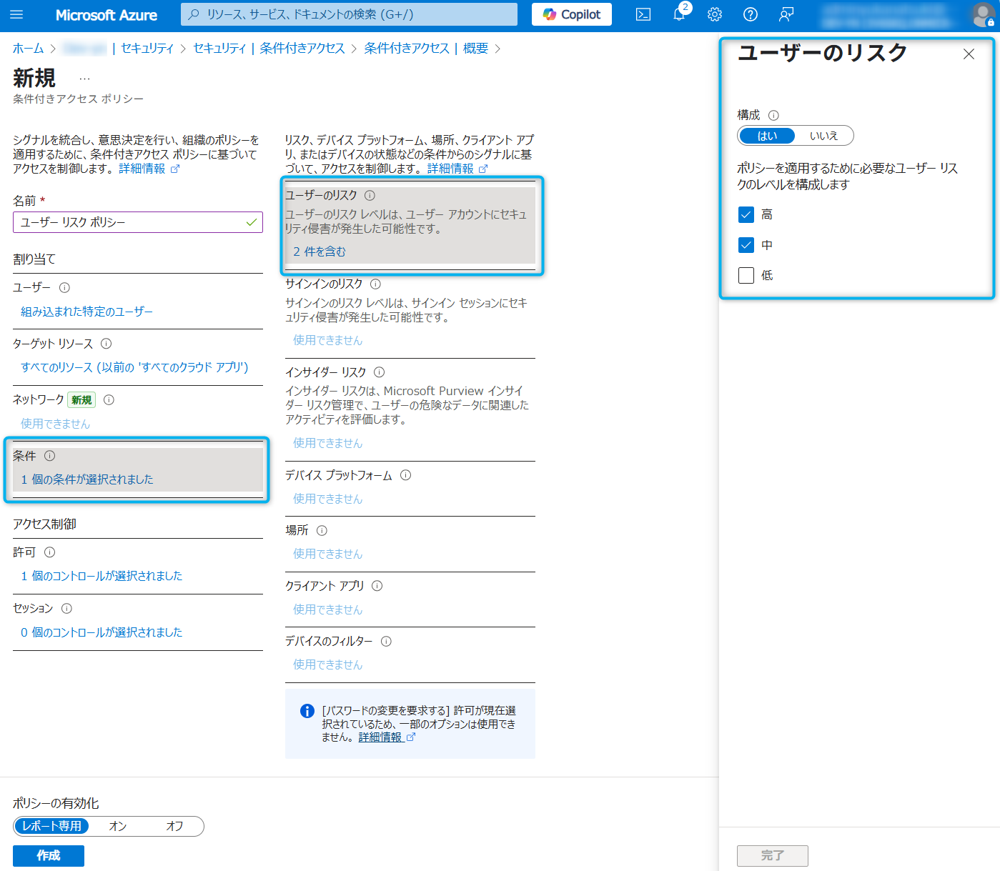

# Entra ID 初学者向けシリーズ第 2 弾 - ID Protection 入門  - #3 リスクベースのポリシーで自動的に管理

こんにちは、Azure Identity サポート チームの 夏木 です。

この度、Microsoft Entra サポート チームより、最近 Entra の利用を始めたお客様を対象に初学者向けのブログ シリーズを作成しております。本記事は、その Entra ID 初学者向けシリーズの第 2 弾「ID Protection 入門」です。

**本記事の対象者**

- Entra P2 ライセンスの購入を検討中のお客様
- Microsoft Entra ID Protection とは何か知りたい方
- リスクの検出、調査、修復の方法を知りたい方
- よくある使用シナリオについて知りたい方

**記事概要**

Entra ID 初学者向けシリーズの第 2 弾「ID Protection 入門」では、全部で以下の 3 つの記事を用意しています。

- #1 ID Protection とは
- #2 リスクの検出 / 確認 / 対応
- #3 リスクベースのポリシーで自動的に管理

本記事「#3 リスクベースのポリシーで自動的に管理」では、Microsoft Entra ID Protection を初めて学習/導入する方を対象に、ID Protection と条件付きアクセスを使用して、自動的にリスクの対応や修復を可能にする方法について解説します。また、実際にお試しいただけるサンプルも紹介していますので、是非一緒に手を動かしてみてください。
IT 管理者の方々にとって日々の運用に役立ちましたら嬉しいです！

---

# リスクの自動修復およびリスク ポリシーの導入

初学者向けシリーズ第 2 弾の 2 つ目の記事「#2 リスクの検出 / 確認 / 対応」では、手動でのリスク確認や修復について説明してきましたが、この方法は人力によるものであり、現在の自動化や AI を使った攻撃にはスピードが追い付かず対応できません。そこで弊社では、**P2 ライセンスの機能である [リスクベースの条件付きアクセス ポリシー](https://learn.microsoft.com/ja-jp/entra/id-protection/howto-identity-protection-configure-risk-policies)を有効にすることを強くお勧めしています。この機能を利用することで、検出されたリスクに対して、より強力な認証方法をすぐに要求したり、検出されたリスク レベルに基づいて安全にパスワード リセットを実施させたりすることができます。つまり、リスクが検出されたら、人力による対処ではなく、システムが自動的にそれに対応し、ユーザーの操作を起点にしてリスクをすぐさま修復するということが可能になります。**

全てのセキュリティ侵害に対応できるわけではありませんが、管理者がリスクを確認して調査し修復するという時間のかかる作業を自動化し、お客様環境を安全に保つという意味で非常に強力な仕組みです。このため、P2 ライセンスをお持ちのお客様は是非この機能をご利用ください。全ユーザー分の P2 ライセンスがないというお客様も多いと思いますので、その場合は一部の重要なアカウントのみこの機能を利用するということもご検討ください。

## リスクベースのポリシーの概要

リスクベースのポリシーを設定することで、ユーザーが自分のサインイン リスクとユーザー リスクを自己修復できるようになります。自己修復というのは、ユーザーのサインイン時に多要素認証が求められ、それを突破するとセキュリティで保護されたパスワード変更などの必要な対応が要求されて、それをユーザーが完了すると、その完了をもってリスクが自動的に対応済みとしてマークされるというものです。この自動修復が完了すると、一度リスクが検出されても、「修復済み」の状態として報告されます。

Microsoft より推奨されているリスク ポリシーの制御は以下となります。

**サインイン リスクのポリシー**  
サインイン リスク レベルが中または高のときは Microsoft Entra 多要素認証を要求します。多要素認証を突破させることで、そのユーザーが正規のユーザーであることを確認します。多要素認証を突破することで、サインイン リスクが修復されます。リスク レベルに関係なく、サインイン リスクを自己修復する唯一の方法は、多要素認証を成功させることです。

**ユーザー リスクのポリシー**  
ユーザーのリスク レベルが高のときは、セキュリティで保護されたパスワード変更を要求します。このパスワード変更に際して多要素認証の実施が求められます。ユーザーが新しいパスワードを作成してリスクを修復するためには、リスク レベルに関係なく、セルフサービス パスワード リセットを使用したセキュリティで保護されたパスワード変更が必要です。

リスクベースの条件付きアクセス ポリシーの具体的な設定方法については、以下の公開情報をご確認ください:
[リスク ポリシー - Microsoft Entra ID Protection | Microsoft Learn](https://learn.microsoft.com/ja-jp/entra/id-protection/howto-identity-protection-configure-risk-policies#user-risk-policy-in-conditional-access)

## リスクベースのポリシーの作成方法

条件付きアクセスにて、サインイン リスクのポリシーとユーザー リスクのポリシーを設定することが可能です。もともとこれらは ID Protection の画面上で作成できましたが、現在は条件付きアクセス ポリシーとして作成することが推奨されています。

ポリシーは以下の項目より作成いただけます。

1. [Azure Portal](https://portal.azure.com) にアクセスし、管理者アカウントでサインインします。
2. [ Microsoft Entra ID ] > [セキュリティ] > [条件付きアクセス] に移動します。
3. [ + 新しいポリシーの作成] を選択します。

サインイン リスク ポリシーを作成するには以下のようにします。ここでは、指定したユーザーに対して、リスクレベル 高、中、低 のサインインのリスクを検知したときに多要素認証を求める条件付きアクセス ポリシーを作成しています。

ユーザー リスク ポリシーを作成するには以下のようにします。ここでは、指定したユーザーに対して、リスクレベル 高、中 のユーザーのリスクを検知したときにパスワードの変更を求める条件付きアクセス ポリシーを作成しています。

# まとめ

今回の初学者向けシリーズ第 2 弾の 3 つ目の記事では「#3 リスクベースのポリシーで自動的に管理」について解説しました。特にご注目いただきたい点をまとめると以下のとおりです。

- リスク ポリシーを使用することで、リスクが検出されたときに、人力による対処を待たずに、システムが自動的にリスクをすぐさま修復することが可能になります
- リスク ポリシーにて設定したリスクが検出されている場合、ユーザーのサインイン時に多要素認証やパスワード変更などの必要な対応が要求されます。その要件をユーザーが完了することでリスクが[修復された]と表示されます
- 条件付きアクセスの条件にて「ユーザー リスク」や「サインイン リスク」を選択することで、リスク ポリシーを作成できます
