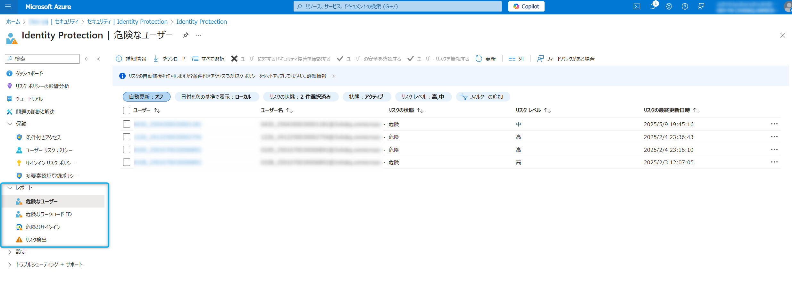

# Entra ID 初学者向けシリーズ第 2 弾 - ID Protection 入門

こんにちは、Azure Identity サポート チームの 夏木 です。

Microsoft Entra サポート チームより、最近 Entra の利用を始めたお客様を対象に初学者向けのブログ シリーズを作成しております。本記事は、その Entra ID 初学者向けシリーズの第 2 弾「ID Protection 入門」です。

**本記事の対象者**

- Entra P2 ライセンスの購入を検討中のお客様
- Microsoft Entra ID Protection とは何か知りたい方
- リスクの検出、調査、修復の方法を知りたい方
- よくある使用シナリオについて知りたい方

**記事概要**

本記事では、Microsoft Entra ID Protection を初めて学習/導入する方を対象に、基礎的な概念や設定方法を分かりやすく解説します。また、現場でよくある質問や課題を例に、典型的な使用シナリオも紹介します。IT 管理者の方々にとって日々の運用に役立ちましたら嬉しいです！

---

# 1. ID Protection とは

Microsoft Entra ID Protection は、ユーザー ID に対して発生する様々な危険な挙動を動的に検知して、その調査と修復を支援する機能です。ここで言う危険な挙動は ID Protection では「リスク」と呼ばれ、例えば以下のようなものが挙げられます。

- 匿名 IP アドレスからのアクセス (Tor ブラウザーなどの接続元を隠蔽するツールを利用してサインインされた) 
- あり得ない移動 (先ほどまで日本にいたのに直後に他の国からサインインが行われた)
- 漏洩した資格情報 (インターネット上にユーザーの ID とパスワードのペアが漏洩した)

Microsoft Entra ID は、ユーザーによるサインインをパスワードや MFA で保護していますが、正しいパスワードが提示されたとしても、その操作が行わる前の背景や文脈によっては、それが正規ユーザーによるものかどうかの判断が難しくなります。例えば、インターネット上にユーザーの ID とパスワードのペアが漏洩した場合、ID Protection はそれを検知して「漏洩した資格情報」のリスクをアラートして上げます。この場合、パスワードはすでに不特定多数の手にわたっているという状況のため、Microsoft Entra ID は正しいパスワードを受け取ったとしても、パスワードを提示した人物が正規のユーザーかどうかを正確に判断できない状態と言えます。

他にも、先ほどまで日本にいたユーザーが直後に突如他の国からサインインしてきた場合は、あり得ない移動が生じたということになります。これは、ユーザーが普段日本にいる状況で、突然攻撃者が他の国からアクセスしてきたと考えるのが妥当です。この場合、他の国から正しいパスワードが提示されたとしても、明らかに危険なサインインであるため、何らかの対応を取るべきです。このように何らかのリスクが生じている場合は、正しいパスワードによるサインインであってもそれをブロックしたり、MFA を追加で求めるということが必要です。

ID Protection はこのように、ユーザーのパスワードなどを検証するだけでは判断ができない、より多くの文脈や背景情報を考慮して、サインインやユーザーの安全性 (リスク) をチェックする機能とお考え下さい。加えて、そのリスクの調査や修復についても画面上で簡単にできるようになっています。

また、ID Protection が検出したリスクは、以下のツールと連携させることが可能です。**特に条件付きアクセスとの連携が ID Protection を利用する上で非常に重要**となりますので、後程解説していきます。

- 条件付きアクセス：リスクの情報をもとにアクセス制御を適用することが可能
- セキュリティ情報イベント管理 (SIEM) ツール：リスクの情報をもとにさらなる調査や関連付けなどが可能

>[!NOTE]
>ID Protection を完全に活用いただくには、P2 ライセンスが必要です。P1 ライセンス以下をお持ちのお客様は、一部の機能のみご利用いただけます。ライセンス要件については以下のドキュメントをご覧ください。

[Microsoft Entra ID 保護とは - Microsoft Entra ID Protection | Microsoft Learn](https://learn.microsoft.com/ja-jp/entra/id-protection/overview-identity-protection)

## ID Protection を利用する上で理解いただきたいポイント

細かい機能の解説に入る前に、ID Protection を利用する上でご理解いただきたい概念の部分をここで解説していきます。詳細は公開ドキュメントにもございますが、できる限りかみ砕いて説明していきます。

詳細な解説や、その他に検出可能なリスクの一覧については以下の公開情報をご覧ください。

- [Microsoft Entra ID 保護のリスクとは - Microsoft Entra ID Protection | Microsoft Learn](https://learn.microsoft.com/ja-jp/entra/id-protection/concept-identity-protection-risks#risk-detections-mapped-to-riskeventtype)
- [Microsoft Entra ID 保護を使ったワークロード ID のセキュリティ保護 - Microsoft Entra ID Protection | Microsoft Learn](https://learn.microsoft.com/ja-jp/entra/id-protection/concept-workload-identity-risk#workload-identity-risk-detections)

### リスクにはレベルがある

これまでに説明してきたリスクに関し、ID Protection ではリスクを低、中、高の 3 つのレベルに分類しています。ID Protection は、普段のユーザーのサインイン傾向や Entra ID 全体の様々な高レベルのリスクは、かなりの高い確率でアカウントが侵害されている (乗っ取られている) 状態であるとお考え下さい。低レベルのリスクについては、ID Protection が異常を検知したものの、アカウントが侵害されているとまでは確信がないという状況を示します。

リスクは機械学習アルゴリズムによって計算されレベルが算出されます。算出されたレベルが高いものから優先順位を上げて対応することがおすすめです。高レベルのリスクから始め、次に中レベルのリスクに対処していく流れです。

>[!NOTE]
> リスクがなぜ検出されたのか、またそのレベルがなぜそのような評価になったのかということについて、弊社サポートにお問い合わせいただいたとしても、詳細をお答えすることはできかねます。リスクは様々な状況を考慮して算出されるため、弊社からその検出や評価の詳細についてお答えすることはできないことをご了承ください。

### リスクはオンラインとオフラインの 2 つのタイミングで検出される

次に、これらのリスクは以下の二つのタイミングで検出されます。

- リアルタイム
- オフライン

リアルタイムな検出は、ユーザーによるサインイン処理の実行中に行われます。例えば、攻撃者が Tor ブラウザーなど接続元を隠蔽するツールを利用して、ユーザーになりすましてサインインを成功させたとします。この場合、ID Protection はサインイン処理の実行中に、アクセス元の IP アドレスを評価し、その IP アドレスが匿名 IP アドレスであると判断します。これにより、サインイン処理の実行中にリアルタイムでリスクを検出します。このように、サインイン処理の実行中のタイミングで検出されるのがリアルタイムな検出です。

一方で、 ID Protection はサインインとは別に様々な情報収集や分析を常に行っており、リアルタイムなサインイン処理とは別のタイミングでリスクが検出されると、それがオフラインの検知として報告されます。例えば、インターネット上にユーザーの ID とパスワードのペアが漏洩すると、ID Protection がそれをリスクとして検知しますが、これはユーザーのサインインとは独立したタイミングで行われますので、オフラインの検知に当たります。オフラインの検知では、攻撃者の活動や正当なユーザーへの影響をより精査して検出ができるため、リアルタイムの検出と組み合わせることで、より信頼性の高い検出が可能となります。ユーザーがサインインの操作をしていなくても、リスクが検出されることがあるということにご注意ください。

### リスクはサインインの成功やサインイン後のユーザー操作に対して検出される

ID Protection における「リスク」は、実際にサインインが成功した場合、もしくはサインインした後のユーザーが実際にその操作を実施した際に検出されるという点にご注意ください。例えば、攻撃者が Tor ブラウザーなど接続元を隠蔽するツールを利用して、お客様のユーザーになりすましてサインインを試みたとします。この時に攻撃者は結局正しいパスワードを提示できず、サインインに失敗したとします。この場合、お客様テナントは攻撃は受けたことにはなりますが、攻撃は失敗している状況のため、ID Protection は「匿名 IP アドレス」のリスクを検知することはありません。

同様に、普段はユーザーが日本にいる状況で、突然攻撃者が他の国からアクセスしてきた状況でも、他の国からのサインインが失敗すれば ID Protection は「あり得ない移動」のリスクを検出しません。お客様テナントに対して、パスワード スプレー攻撃 (よくあるパスワードをテナント内の多数のユーザーに一斉に試していく攻撃) が実施された際も、その攻撃がすべて失敗すれば「パスワード スプレー」のリスクは検出されません。

反対に、パスワード スプレー攻撃によりお客様テナントのユーザーが犠牲となった (攻撃者によるサインインを実際に許してしまった) 場合は、「パスワード スプレー」のリスクが検出されます。このように、ID Protection でリスクが検出されるのは、実際にサインインが成功してしまった状況 (もしくはすでにその可能性がある) を意味しているとご理解ください。

よくある誤解として、自社のテナントが狙われている (攻撃されている) のになぜリスクが検出されないのかというものがあります。これは上述のとおり、仮に攻撃 (正規ではないユーザーによるサインインの試行) を受けていても、実際にサインインは成功しておらず、お客様のテナントとユーザーは影響を受けていないと判断されているからです (よかったですね！)

お客様テナントを含め、Microsoft Entra ID は普段から様々な攻撃にさらされており、そういった未成功の攻撃までを全てリスクとして扱うと、膨大な数のリスクがお客様に対して提示されることとなりますので、ID Protection ではそのような検出およびレポートはしておりません。そういった未成功のサインイン試行については、サインイン ログから傾向をご確認ください。

# 2. ID Protection を使ってリスクを確認して調査および修復する

ここでは実際に ID Protection の画面を見て、検出されたリスクを確認し、その調査と修復を手動で行う流れを見ていきます。詳細については、以下の公開情報もご覧ください。

[Microsoft Entra ID Protection でリスクを調査する - Microsoft Entra ID Protection | Microsoft Learn](https://learn.microsoft.com/ja-jp/entra/id-protection/howto-identity-protection-investigate-risk)  
[リスクを修復してユーザーをブロック解除する - Microsoft Entra ID Protection | Microsoft Learn](https://learn.microsoft.com/ja-jp/entra/id-protection/howto-identity-protection-remediate-unblock)

なお、ここでは管理者がすべて手動でレポートを確認し、リスクを調査して修復する流れを示しますが、このような手動での対応はリスクの発生から対応 (修復) までに時間を要することが一般的です。つまり、アカウントの侵害 (リスク) が生じた後に、対処 (リスクの修復) が完了するまでに、攻撃者に対してより多くの活動時間を与えてしまうということになります。

攻撃者は AI を用いてアカウントの侵害と、その後の内部工作、情報漏洩などを非常に速いスピードで行うことが想定されます。この場合、人による手動での対応では間に合いません。弊社ではこのような手動での対応ではなく、後述する条件付きアクセス ポリシーと連携した自動修復の仕組みを強くお勧めいたします。

## 検出されたリスクの確認

検出されたリスクを確認するには、以下の画面を開きます。

それぞれの項目の説明は以下のとおりです。

- リスク検出: 検出されたリスクの一覧を確認できます。
- 危険なサインイン: リスクがあると判断されたサインインが一覧表示されます。
- 危険なユーザー: アカウントが侵害されたリスクがあるとみなされたすべてのユーザーが一覧表示されます。
- 危険なワークロード ID: アカウントが侵害されたリスクがあるとみなされたすべてのワークロード ID が一覧表示されます。

まずは上記のページをお客様のテナントでも確認いただき、どのようなリスクが検出されているか、どのようなユーザーやワークロード ID に対してリスクが上がっているかをご確認ください。リスク レベルが高のものや、侵害された際の影響が大きいアカウント (管理者アカウントや、役員のアカウントなど) が一覧に出ていないか確認することをお勧めします。

## リスクの調査 

リスクを確認して、高リスクのアカウントや、役員のアカウントなど、今すぐに対処したほうがよさそうなものが確認できたら、これらに対して調査をしていきます。各項目をクリックすることで、ユーザー ID の詳細や、オフィスの場所、最近の危険なサインイン、サインインにリンクされていない検出、リスク履歴などの情報が表示されます。これらの情報を確認するとともに、必要に応じて実際のユーザーに聞き取り調査を行うことで、そのサインインやユーザーが本当にリスクのあるものかどうかを確認するという流れです。

例えば、あり得ない移動のリスクが検出されたユーザーがいた場合に、例えばそのユーザーが Azure VM を普段利用しない海外のリージョンに構築し、そこからサインインを試行したという場合があります。この場合は、ユーザーが意図したサインインであるため、実質的なリスクはありません。この場合は、ユーザーにその確認を取ったうえで、リスクはないと判断します。反対に、ヒアリングの結果、ユーザーがそのような操作をしていないのに、海外から突然のサインインがあったということであれば、それはアカウント侵害の可能性が高いと判断できます。

> [!NOTE]
> リスクの詳細を含めてすべての情報を確認できるのは、P2 ライセンスを持つお客様のみです。P1 ライセンス以下をお持ちのお客様は、詳細を確認できなかったり、すべてのリスクが表示されないなどします。

## リスクの修復
        
上記のように、ユーザーへのヒアリングを含めてアカウントが侵害されている (ユーザーの意図しないサインインが何者かにより成功した) と判断した場合は、そのリスクの修復を行います。この場合、まずは以下のボタンを選択します。

- ユーザーが侵害されたことを確認する : こちらのボタンを押すと、ID Protection は、ユーザー リスクを高に設定します。管理者がユーザーの侵害を確認したというようにマークするボタンです。修復手順が取られるまで、サインインは危険とみなされます。

次に、ユーザーが侵害されたことを確認したら、次に以下の対応を取ります。

- パスワードのリセット : これを選択すると、ユーザーにはパスワード変更が求められ、加えて、ユーザーの現在のセッションが取り消されます。ユーザーは再認証が必要となります。
- ユーザーのブロック : これを選択すると、ユーザーのサインインがブロックされます。明らかにアカウントが乗っ取られ、これ以上の被害拡大を防ぐという意味で、アカウントをいったん利用停止にしたい場合はこちらを使います。

上記二つのいずれかの対応で、取り急ぎそのアカウントによる被害の拡大を防ぐことができます。ユーザーをブロックした後、再度そのアカウントを利用したいということであれば、パスワードをリセットして、ブロックを解除するという対応を取ります。

もし確認の結果、アカウントが実は侵害されておらず、誤検知 (偽陽性 - false positive) であった場合は、管理者により以下の対応を取ることが可能です。

- ユーザーの安全を確認する : このボタンを押すと、対象のリスクを誤検知として扱います。ユーザーのリスクと検出が削除され、ID Protection はこの結果を考慮して、再度学習モードに入ります。
- ユーザー リスクを無視する : このボタンは、リスクが検出されたが、実質的には無害であり、一旦このリスクを無視したい場合に使用します。例えば、検証のために侵入テストを行い、リスクが検出された (実際にリスクは検出されたが、そこに悪意がない) 場合にこのボタンを押下します。この結果は学習されないため、今後も同様のリスクが検知されます。

> [!NOTE]
> ユーザーの安全を確認する、およびユーザー　リスクを無視する の対応を取った場合、リスクの状態は "危険" から "安全であるとの確認済み" および "破棄済み" に、リスク レベルはいずれも "-" に変更されます。危険なユーザー レポートではリスク レベルのフィルターを未選択にすることで確認いただけます。

他にも、[Microsoft 365 Defender で調査する] というボタンがありますが、こちらは、お客様が M365 Defender をご利用の場合にぜひご利用ください。

> [!IMPORTANT]
> リスクが検出された際に、お客様によっては弊社サポートにお問い合わせいただき、そのリスクが本当に攻撃者によるものなのか、アカウントは侵害されたのか確認してほしいとご相談いただくことが多くございます。この場合、お問い合わせ前に、まずはすぐにでも対象のアカウントのパスワードリセットやアカウントのブロックを実施ください。弊社にお問い合わせいただいている間に、攻撃者によるアカウント侵害が継続し、被害が拡大している可能性があります。

## リスクの自動修復およびリスク ポリシーの導入

ここまで手動でのリスク確認や修復について説明してきましたが、改めまして、この方法は人力によるものであり、現在の自動化や AI を使った攻撃にはスピードが追い付かず対応できません。そこで弊社では、**P2 ライセンスの機能である [リスクベースの条件付きアクセス ポリシー](https://learn.microsoft.com/ja-jp/entra/id-protection/howto-identity-protection-configure-risk-policies)を有効にすることを強くお勧めしています。この機能を利用することで、検出されたリスクに対して、より強力な認証方法をすぐに要求したり、検出されたリスク レベルに基づいて安全にパスワード リセットを実施させたりすることができます。つまり、リスクが検出されたら、人力による対処ではなく、システムが自動的にそれに対応し、ユーザーの操作を起点にしてリスクをすぐさま修復するということが可能になります。**

全てのセキュリティ侵害に対応できるわけではありませんが、管理者がリスクを確認して調査し修復するという時間のかかる作業を自動化し、お客様環境を安全に保つという意味で非常に強力な仕組みです。このため、P2 ライセンスをお持ちのお客様は是非この機能をご利用ください。全ユーザー分の P2 ライセンスがないというお客様も多いと思いますので、その場合は一部の重要なアカウントのみこの機能を利用するということもご検討ください。

### リスクベースのポリシーの概要

リスクベースのポリシーを設定することで、ユーザーが自分のサインイン リスクとユーザー リスクを自己修復できるようになります。自己修復というのは、ユーザーのサインイン時に多要素認証が求められ、それを突破するとセキュリティで保護されたパスワード変更などの必要な対応が要求されて、それをユーザーが完了すると、その完了をもってリスクが自動的に対応済みとしてマークされるというものです。この自動修復が完了すると、一度リスクが検出されても、「修復済み」の状態として報告されます。

Microsoft より推奨されているリスク ポリシーの制御は以下となります。

**サインイン リスクのポリシー**
サインイン リスク レベルが中または高のときは Microsoft Entra 多要素認証を要求します。多要素認証を突破させることで、そのユーザーが正規のユーザーであることを確認します。多要素認証を突破することで、サインイン リスクが修復されます。リスク レベルに関係なく、サインイン リスクを自己修復する唯一の方法は、多要素認証を成功させることです。

**ユーザー リスクのポリシー**
ユーザーのリスク レベルが高のときは、セキュリティで保護されたパスワード変更を要求します。このパスワード変更に際して多要素認証の実施が求められます。ユーザーが新しいパスワードを作成してリスクを修復するためには、リスク レベルに関係なく、セルフサービス パスワード リセットを使用したセキュリティで保護されたパスワード変更が必要です。

リスクベースの条件付きアクセス ポリシーの具体的な設定方法については、以下の公開情報をご確認ください:  
[リスク ポリシー - Microsoft Entra ID Protection | Microsoft Learn](https://learn.microsoft.com/ja-jp/entra/id-protection/howto-identity-protection-configure-risk-policies#user-risk-policy-in-conditional-access)

### リスクベースのポリシーの作成方法

条件付きアクセスにて、サインイン リスクのポリシーとユーザー リスクのポリシーを設定することが可能です。もともとこれらは ID Protection の画面上で作成できましたが、現在は条件付きアクセス ポリシーとして作成することが推奨されています。

サインイン リスク ポリシーを作成するには以下のようにします。ここでは、指定したユーザーに対して、リスクレベル 高、中、低 のサインインのリスクを検知したときに多要素認証を求める条件付きアクセス ポリシーを作成しています。

ユーザー リスク ポリシーを作成するには以下のようにします。ここでは、指定したユーザーに対して、リスクレベル 高、中 のユーザーのリスクを検知したときにパスワードの変更を求める条件付きアクセス ポリシーを作成しています。

# まとめ

今回の初学者向けシリーズ第 2 弾では ID Protection について解説しました。特にご注目いただきたい点をまとめると以下のとおりです。

- ID Protection は、ユーザーのサインインに潜むリスクを動的に検出し、調査・修復を支援するセキュリティ機能です。
- リスクは「リアルタイム」と「オフライン」の 2 つのタイミングで検出され、リスクレベル（低・中・高）に応じた対応が求められます。
- 「リスクベースの条件付きアクセス ポリシー」により、リスクの自動修復が可能となり、より迅速かつ安全な運用が実現できます。
