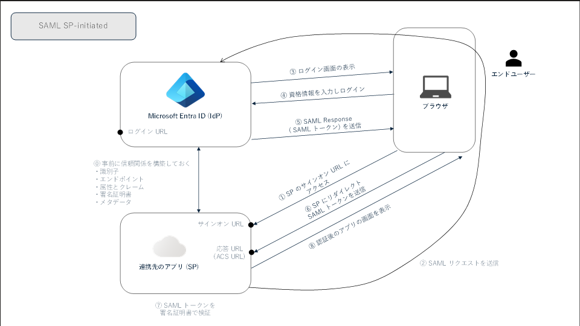
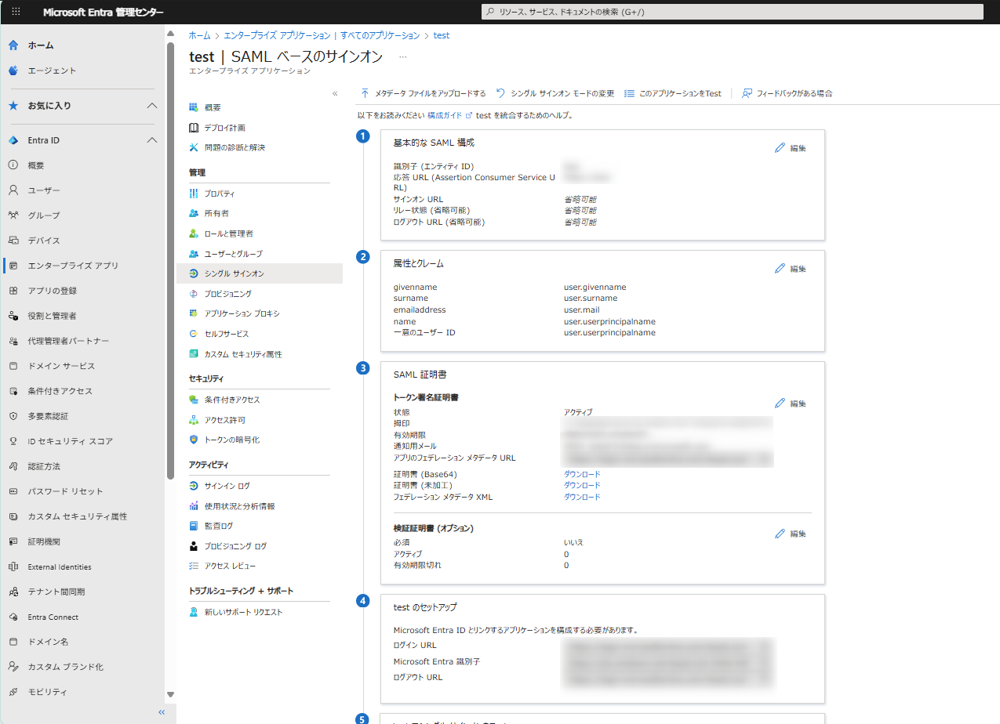

# Entra ID 初学者向けシリーズ第 4 弾 - SAML 2.0 入門 

こんにちは、Azure Identity サポート チームの 夏木 です。Microsoft Entra サポート チームより、最近 Entra の利用を始めたお客様を対象に、初学者向けのブログ シリーズを作成しております。本記事はその Entra ID 初学者向けシリーズの第 4 弾「SAML 2.0 入門」です。

**本記事の対象者**

- SAML 連携とは何か知りたい方
- アプリと Entra ID の連携を検討中のお客様
- Entra ID での SAML による SSO の設定方法を知りたい方

**記事概要**

SAML を使用して Microsoft Entra ID と外部アプリケーションを連携させる際、管理者の方からよくいただく質問として以下のようなものがあります。

- SAML で SSO を実現したいとき Microsoft Entra ID ではどのような設定をすればよいのか？
- アプリからどういった情報をもらえばよいのか？

この記事では、SAML 連携に必要な Microsoft Entra ID 側の主要な設定項目と、アプリ側から確認すべき情報を分かりやすく整理しました。IT 管理者の方々にとって日々の運用に役立ちましたら嬉しいです！

---

## SAML の概要と利用場面

SAML (Security Assertion Markup Language) は、異なる組織間において認証の結果や認証した ID に関わる情報を交換するための仕組みです。この仕組みを利用することで、IdP (Entra ID) に一度サインインすることで、その結果をもとに Entra ID と連携する外部アプリケーションに対してもアクセスが可能になります。SAML は認証連携プロトコルのひとつです。

SAML では、ブラウザーが実行されているクライアントに加えて、以下の二つの要素が登場します。

**IdP (Identity Provider):**

- Microsoft Entra ID など、認証処理を担うプラットフォームを指します。
- 後述する SP から SAML の要求を受け取ります。
- 認証処理が完了すると SP に対して SAML 応答 (アサーション) を発行します。

**SP (Service Provider):**

- ユーザーが利用したいと考えているサービス (アプリ) を指します。
- IdP に対して SAML の要求を送ります。
- IdP から SAML 応答 (アサーション) を受け取ります。

SAML を用いた認証連携のフローは SP-initiated と IdP-initiated の 2 パターンがあります。

SP-initiated は、連携先のアプリ (SP) からスタートするフローであり、以下の図のような流れとなります。

0. 前提として、IdP 側で証明書を発行し、その公開鍵を SP 側に登録しておきます。
1. ユーザーが SP のサインオン URL にアクセスします。
2. SP がユーザーを IdP へ誘導し、IdP に SAML 要求を提示します。
3. IdP は認証画面をユーザーに表示します。
4. ユーザーが資格情報を入力し、IdP へのサインインが完了します。
5. IdP は SAML 応答 (SAML アサーション) をブラウザーを経由して SP (連携先のアプリ) に提示します。
6. SP は受け取った SAML トークンを事前に共有された署名証明書で検証します。
7. 検証が成功すると、SP はブラウザーとの認証セッションを確立し、SP へのシングル サインオンが完了します。

IdP-initiated は、上記 2. で SP-initiated が生成していた SAML 要求なしに、ユーザーが IdP 上で操作することで、IdP をスタート地点として SP に対して SAML 応答を生成するフローです。

## SAML を用いた SSO 設定時の Microsoft Entra ID 側の各設定項目

SAML 連携を実施するときに必要な Microsoft Entra ID 側の主要な設定項目と、アプリ側から確認すべき情報は以下となります。

Microsoft Entra 管理センター (entra.microsoft.com) > Entra ID > エンタープライズ アプリ > 該当のアプリ > 管理 - シングル サインオン

### 基本的な SAML の構成

この個所では、SAML での認証連携を行うにあたり最低限必要な識別子や URL の情報を構成します。

**識別子 (エンティティ ID)**

IdP (Entra ID) がアプリケーションを特定するための一意な ID をここに指定します。テナント内で一意である必要があります。一つの Entra ID テナント内に同じアプリケーションを複数登録してそれぞれ SAML 連携したい場合は、識別子 (エンティティ ID) を複数発行いただく必要があります。

**応答 URL (Assertion Consumer Service URL)**

IdP (Entra ID) が SAML 応答を発行した後に、それを送信する先のアプリケーションの URL をここに指定します。ユーザーが IdP へのサインインを完了すると、この応答 URL に対して誘導され、その流れの中で SAML 応答がアプリに提示されます。つまり、アプリケーションが SAML 応答を受け取る URL を指定します。

**サインオン URL**

SP (Service Provider) によって開始されるシングル サインオン フローにおいて、ユーザーがアプリにサインインするためのサインイン URL を指定します。SP-Initiated の SAML 連携の場合にのみ必要であり、入力しなかった場合は IdP-initiated の SAML フローとして動作します。

**リレー状態 (省略可能)**

認証が完了した後にユーザーをリダイレクトする場所などの情報をアプリケーションに指示するためにこの値が利用されます。SAML 連携を実施するときにアプリ側から指示がある場合にこの値を指定ください。

**ログアウト URL (省略可能)**

SAML ログアウト応答をアプリケーションに返すために使用される URL です。SAML 連携を実施するときにアプリ側から指示がある場合にこの値を指定ください。

### 属性とクレーム

SAML 応答には IdP (Entra ID) で認証を完了したユーザーの情報 (UPN やユーザー名など) が埋め込まれます。SP 側は SAML 応答に含まれるユーザー情報を読み取って、どのユーザーが IdP (Entra ID) で認証を完了したかを判断し、様々な処理を行います。この「属性とクレーム」の個所では、SAML 応答にどのようなユーザー情報を埋め込むかを指定します。設定可能な項目に関しましては、以下の公開情報もご覧ください。

[SAML トークン クレームをカスタマイズする - Microsoft identity platform | Microsoft Learn](https://learn.microsoft.com/azure/active-directory/develop/active-directory-saml-claims-customization)

SAML 連携時に必ず必要となるのは Name ID (名前識別子) 属性です。Name ID 属性には IdP (Entra ID) で認証を完了したユーザーの識別子が埋め込まれれます。この Name ID (名前識別子) 属性には、さまざまな形式が用意されており、アプリによっては適切に構成することが必要です。SAML 連携を構成する際に、Entra ID が既定でどの「名前識別子の形式」を利用すべきかアプリ側から指示があるはずですので、その指示に合わせて指定ください。指示がない場合は、念のためアプリ側に確認することをおすすめします。

**「一意のユーザー識別子 (名前 ID)」の中にある「名前識別子の形式」**

「名前識別子の形式」は Name ID (名前識別子) がどのような形式であるかを指定する箇所です。SAML 連携を構成する際に、アプリ側から指示があるはずですので、その指示に合わせて指定ください。

> [!NOTE]
> 「名前識別子の形式」が未指定であっても、アプリが SAML 要求の中でその形式を明示していればその形式が利用されます。つまり、アプリから Microsoft Entra ID へ送られる SAML 要求の中で形式が指定されている場合は、SAML 要求の中で指定された「名前識別子の形式」に従って、Entra ID は SAML 応答を生成します。この場合、「属性とクレーム」にて「名前識別子の形式」を指定していても、SAML 要求の中で指定された形式が優先されます。
>
> 一方で、アプリから Microsoft Entra ID へ送られる SAML 要求において、「名前識別子の形式」が指定されていない場合は、「属性とクレーム」の個所にて設定する「一意のユーザー ID」の「名前識別子の形式」に指定した形式で、SAML 応答が作成されます。このため、SAML 応答に意図した値が反映されているか念のため確認ください。

### SAML 証明書

SAML を用いた認証連携において使用する証明書の情報が表示されます。ここで表示される情報をアプリ側に連携することが必要です。

**SAML トークン署名証明書**

SAML トークン署名証明書は Entra ID が SAML 応答に署名する際に利用されます。この署名処理は証明書の秘密鍵を使って行われます。画面上では、その証明書の状態と拇印を確認いただけます。[ダウンロード] ボタンからは、SAML トークン署名証明書の「公開鍵を含んだ証明書」をダウンロード可能です。「秘密鍵を含んだ証明書」は Entra ID が厳密に管理しており、ダウンロードすることはできません。

「公開鍵を含んだ証明書」のダウンロードについては、以下の形式をご利用いただけます。以下のうち、フェデレーション メタデータ XML には証明書の情報に加えて、SAML 認証連携の構成に必要な情報がまとめて含まれていますので、アプリ側が対応していればこちらをご利用ください。

- 証明書 (Base64)
- 証明書 (未加工)
- フェデレーション メタデータ XML

また 「アプリのフェデレーション メタデータ URL」は、フェデレーション メタデータ XML をダウンロードできる URL です。SAML 連携を構成する際に SP が IdP (Entra ID) からメタデータを自動取得したい場合にこの URL を使用します。アプリ側がこの URL を利用できる場合、例えば、Entra ID 側で SAML 用のトークン署名証明書を更新した際に、SP 側から自動でその更新情報を取得するということが可能になります。アプリ側がそのような方式に対応している場合は、この「アプリのフェデレーション メタデータ URL」をご利用ください。

署名証明書の更新に関してはこちらのブログも参照ください: [Azure AD における SAML 署名証明書を更新する | Japan Azure Identity Support Blog](https://jpazureid.github.io/blog/azure-active-directory/how-to-update-samlsigningcertificate/)

**検証証明書 (オプション)**

検証証明書はアプリが署名付きの SAML 要求を利用している場合に構成します。アプリがそのような構成を要望している場合は、こちらの構成を実施ください。アプリ側から特段の指定がない場合はこちらの構成は不要です。

詳細の設定方法はこちらの公開情報をご覧ください: [署名付き SAML 認証要求を適用する - Microsoft Entra ID | Microsoft Learn](https://learn.microsoft.com/ja-jp/entra/identity/enterprise-apps/howto-enforce-signed-saml-authentication)

### テストのセットアップ

表示されている情報をお手元に控え、アプリ側に構成ください。これら URL をどこに構成すべきかについては、アプリの開発元にお問い合わせをいただけますと幸いです。

**ログイン URL**

アプリが Entra ID に対して SAML 連携を開始する際に使用する URL です。アプリはこの指定された URL に対して SAML 要求を送信する必要があります。アプリ側で、IdP (Entra ID) 側のログイン URL を指定する箇所がある場合はこちらの URL を指定ください。

**Microsoft Entra 識別子**

Microsoft Entra ID ( IdP ) を識別するための一意の識別子です。この値を利用するかどうかはアプリ側に依存します。

**ログアウト URL**

ユーザーがアプリからログアウトする際に、IdP (Entra ID) にもログアウト要求を送る場合があります。そのような場合に、SAML ログアウト要求を送る宛先がこの URL です。アプリ側で、IdP (Entra ID) 側のログアウト URL を指定する箇所がある場合はこちらの URL を指定ください。

## まとめ

Microsoft Entra ID 上で SAML 連携を構成する際には、基本的に以下の情報をアプリ側に確認ください。情報がアプリ側から得られましたら、それらの情報をもとに Entra 管理センター上で構成を実施いただければと思います。

- 識別子 (エンティティ ID)
- 応答 URL (Assertion Consumer Service URL)
- サインオン URL
- アプリが受け取りたい属性とクレームおよびそれらの形式

アプリ側から得られた情報がどの項目に対応するかわからない場合は、サポート リクエストの中で支援することももちろん可能です。その際は、アプリの名前やアプリ側から得られた情報などを添えて弊社までお問い合わせください。

## 参考となる公開情報

今回の初学者向けシリーズ第 4 弾では「SAML 2.0 連携」について解説しました。SAML トークンの詳細や各アプリのチュートリアルについては以下の公開情報も参考になりましたら嬉しいです。

- [SAML リクエスト / SAML トークンの詳細：シングル サインオン SAML プロトコル - Microsoft identity platform | Microsoft Learn](https://learn.microsoft.com/azure/active-directory/develop/single-sign-on-saml-protocol)
- [各アプリと Microsoft Entra ID を統合するためのチュートリアル：Microsoft Entra ID の SaaS アプリ構成ガイド - Microsoft Entra ID | Microsoft Learn](https://learn.microsoft.com/azure/active-directory/saas-apps/tutorial-list)
