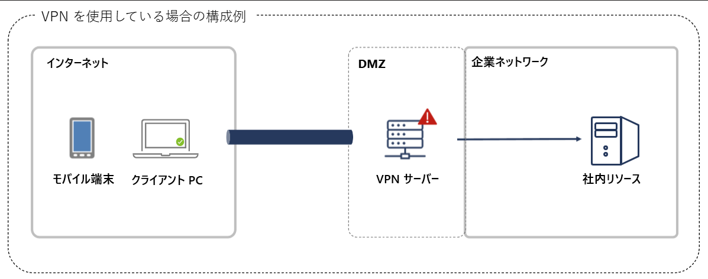
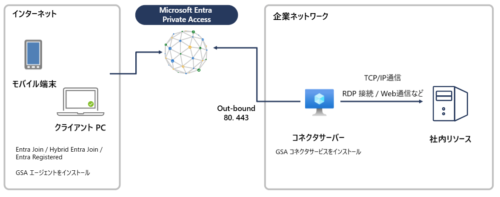
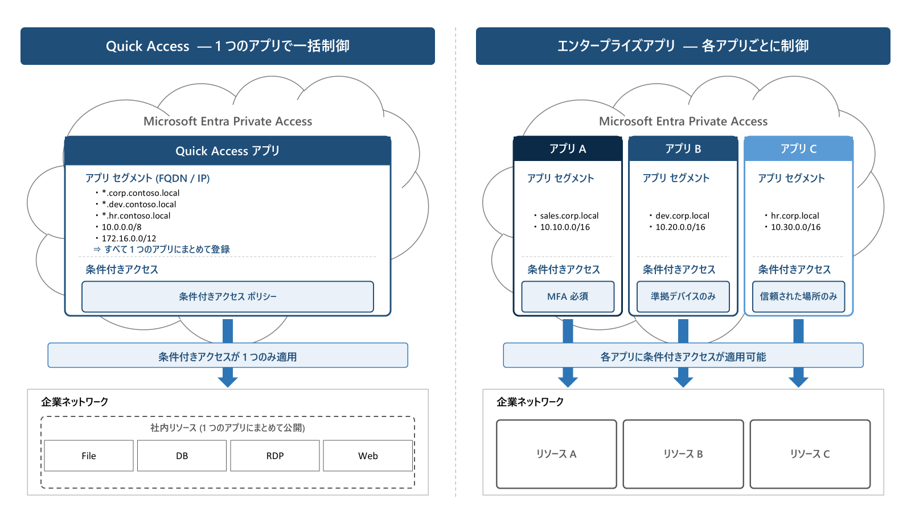

# Entra ID 初学者向けシリーズ第 5 弾 - Microsoft Entra Private Access 入門

こんにちは、Azure Identity サポート チームの 夏木 です。Microsoft Entra サポート チームより、最近 Entra の利用を始めたお客様を対象に、初学者向けのブログ シリーズを作成しております。本記事はその Entra ID 初学者向けシリーズの「Microsoft Entra Private Access 入門」です。

## 本記事の対象者

- Microsoft Entra Private Access の基本を理解したい方
- Microsoft Entra Private Access をこれから導入する方
- ゼロ トラストに関心がある情報システム部門やソリューション アーキテクトの方

## 記事概要

本記事では、Microsoft Entra Private Access を中心に、基本的な仕組みから構成方法、よくあるお問い合わせの事例を通じて実践的な知識をお伝えします。IT 管理者の方々にとって日々の運用に役立ちましたら嬉しいです！

---

## Global Secure Access の全体像

### Global Secure Access とは

従来のネットワーク セキュリティは、オフィスの境界にファイアウォールを設置し、社内ネットワークを信頼するという「境界型セキュリティ」の考え方に基づいていました。一方で、「最小特権の原則」「明示的な検証」「侵害を前提とする」という 3 つの原則に基づく**ゼロトラスト**が注目されるようになっています。

Global Secure Access (GSA) は、この**ゼロ トラスト**に基づいて設計された、Microsoft Entra の管理センターに統合されたネットワーク セキュリティ ソリューションです。「誰が・どのデバイスから・どのような状態でアクセスしているか」という ID 情報をもとに、クラウド上でアクセス制御を行います。

GSA は、社内のオンプレミス リソースへのセキュアなアクセスを提供する **Microsoft Entra Private Access** と、インターネットや SaaS アプリへのアクセスを制御・保護する **Microsoft Entra Internet Access** の 2 つのサービスの総称です。

本記事では、VPN の代替としても注目されている **Microsoft Entra Private Access** にフォーカスして解説します。

> 参考: [Global Secure Access とは | Microsoft Learn](https://learn.microsoft.com/ja-jp/entra/global-secure-access/overview-what-is-global-secure-access)

---

## Microsoft Entra Private Access の基本

### Microsoft Entra Private Access とは

VPN を使用している環境でのセキュリティ インシデントについて、耳にしたこともあるのではないでしょうか。オンプレミスの VPN ゲートウェイを利用する VPN は、その VPN ゲートウェイに含まれる管理者がまだ修正できていない脆弱性に対してのゼロデイ攻撃などのリスクが指摘されています。また、VPN はネットワーク境界の防御となっており、一度侵入されると社内ネットワークでの横断 (ラテラル ムーブメント) が容易であるなどのリスクがあるため、VPN に代わるセキュアなアクセス手段が求められています。Global Secure Access は、Microsoft が提供する Security Service Edge (SSE) ソリューションであり、そのうちの Microsoft Entra Private Access (以降 Private Access ) は、ゼロ トラストの原則に基づいた、社内リソースへのセキュアなネットワーク アクセス制御を実現するサービスです。
従来の VPN では、主に IP アドレス ベースでのアクセス制御となっておりましたが、Private Access ではアプリケーション単位でアクセスを制御でき、ゼロ トラストの原則に基づいたきめ細かなアクセス管理を実現します。

#### VPN を使用している場合の社内リソースへのアクセス例



従来の VPN 構成では、DMZ 上に VPN ゲートウェイを設置し、外部からの接続を受け入れるためにファイアウォールにて外部から VPN ゲートウェイへのインバウンド ポートを開放する必要があります。このインバウンド ポートは攻撃者にとっても入口となるため、VPN サーバーの脆弱性を突いた不正アクセスの攻撃対象面 (Attack Surface) となります。

従来の VPN に対して、Private Access の主な特長は以下のとおりです。

- **ゼロ トラスト ネットワーク アクセス (ZTNA)**: ユーザー ID、デバイスの状態など様々なシグナルに基づいてアクセスを制御
- **アプリケーション単位のアクセス制御**: 社内ネットワーク全体ではなく、特定のリソースだけにアクセスを許可
- **インバウンド ポート不要**: コネクタはアウトバウンド接続のみで動作するため、ファイアウォールのインバウンド ポートを開放する必要がない
- **条件付きアクセスとの統合**: Entra ID の条件付きアクセスをそのまま社内アプリにも適用可能

これらの特長により、リモート ユーザーは従来の VPN を使わずに社内リソースへセキュアにアクセスできるようになります。

### Microsoft Entra Private Access の仕組み

Private Access のアーキテクチャは、以下のコンポーネントで構成されます。



**通信の流れ:**

1. ユーザーのクライアント PC やモバイル端末 (Microsoft Entra joined / Microsoft Entra hybrid joined / Microsoft Entra registered) に **GSA クライアント**がインストールされています
2. ユーザーが社内リソースにアクセスすると、GSA クライアントがトラフィックをキャプチャし、**Microsoft の SSE (Security Service Edge)** にトンネリングします
3. SSE で認証・認可 (条件付きアクセス ポリシーの評価を含む) が行われます
4. 認可されたトラフィックは、企業ネットワーク内に設置された**コネクタ サーバー** (Private Network Connector) を経由して社内リソースに到達します
5. コネクタ サーバーは**アウトバウンド (ポート 80, 443)** のみで Microsoft のクラウド サービスと通信するため、**インバウンド ポートの開放は不要**です

### Private Access の構成の詳細

#### Quick Access と Global Secure Access アプリの使い分け



Private Access では、社内リソースへのアクセスを構成する方法として 2 つのアプローチがあります。

##### a. Quick Access (クイック アクセス)

Quick Access は、Private Access を素早く導入するためのシンプルな構成方法です。保護対象となる FQDN、IP アドレス、IP 範囲をまとめて 1 つのアプリケーションとして登録します。

- **用途**: VPN の置き換えとして、まず広く社内リソースへのアクセスを提供したい場合
- **特徴**: 1 つのエンタープライズ アプリとして管理され、すべてのリソースに対して同じアクセス ポリシーが適用される
- **推奨場面**: PoC (概念実証) や初期導入段階

##### b. Global Secure Access アプリ (エンタープライズ アプリ)

Global Secure Access アプリは、リソースごとに個別のエンタープライズ アプリケーションを作成し、より**きめ細かなアクセス制御**を実現します。

- **用途**: リソースごとに異なるアクセス ポリシーを適用したい場合
- **特徴**: リソースごとに異なる条件付きアクセス ポリシーを構成可能
- **推奨場面**: 本番環境への段階的な展開、異なるセキュリティ要件を持つアプリの管理

> 参考: [Microsoft Entra Private Access について | Microsoft Learn](https://learn.microsoft.com/ja-jp/entra/global-secure-access/concept-private-access)

#### Private Network Connector (コネクタ) について

Private Access を利用するには、企業ネットワーク内に**コネクタ サーバー**を設置し、**Private Network Connector** ソフトウェアをインストールする必要があります。コネクタは Microsoft のクラウド サービスとの間のアウトバウンド接続を確立し、社内リソースへの通信を中継します。

**コネクタ グループの概念:**

コネクタは**コネクタ グループ**にまとめて管理します。コネクタ グループを使用することで、以下のような構成が可能です。

- 環境ごとにコネクタを分離 (開発環境 / 本番環境)
- 地理的に近いコネクタを通じてリソースにアクセスさせ、パフォーマンスを最適化
- 高可用性のために複数のコネクタ サーバーを同じグループに配置

コネクタは Microsoft Entra 管理センターからダウンロードし、インストールします。
詳細は後述の構成手順をご参照ください。

> 参考: [プライベート ネットワーク コネクタの構成方法 | Microsoft Learn](https://learn.microsoft.com/ja-jp/entra/global-secure-access/how-to-configure-connectors)

---

## Private Access の構成手順

Private Access を構成するための大まかな手順は以下のとおりです。

### ライセンス要件

Microsoft Entra Private Access を利用するには、以下のライセンスが必要です。

- **Microsoft Entra Private Access** 単体ライセンス、または **Microsoft Entra Suite** ライセンス
- 上記に加えて、ユーザーに **Microsoft Entra ID P1** または **P2** ライセンスが必要です

詳細は [Global Secure Access とは - ライセンスの概要 | Microsoft Learn](https://learn.microsoft.com/ja-jp/entra/global-secure-access/overview-what-is-global-secure-access#licensing-overview) をご確認ください。

### 必要なロール

Private Access の構成・運用には、実施するタスクに応じて以下のロールが必要です。最小特権の原則に従い、必要なロールのみを割り当てることが推奨されています。

| タスク | 必要なロール (最小権限) |
| --- | --- |
| Private Access の構成 (Quick Access、コネクタ、アプリ セグメント) | **アプリケーション管理者** |
| トラフィック転送プロファイルの管理 | **Global Secure Access 管理者** |
| ユーザーとグループの割り当て | **アプリケーション管理者** |
| 条件付きアクセス ポリシーの作成・管理 | **条件付きアクセス管理者** |
| トラフィック ログの確認 (読み取り専用) | **Global Secure Access ログ リーダー** |

なお、Global Secure Access 管理者ロールだけでは Private Access の構成やユーザー割り当てはできません。Private Access を構成するにはアプリケーション管理者ロールが必要です。

> 参考: [Global Secure Access の組み込みロール | Microsoft Learn](https://learn.microsoft.com/ja-jp/entra/global-secure-access/reference-role-based-permissions)

### 手順 1: Private Network Connector の設置

1. 企業ネットワーク内にコネクタ用の Windows Server を準備します
2. Microsoft Entra 管理センター > **Global Secure Access** > **接続** > **コネクタ** からコネクタ ソフトウェアをダウンロードします
3. コネクタ サーバー上でインストーラーを実行し、テナントの資格情報で登録します
4. 管理センター上でコネクタが **Active** ステータスで表示されることを確認します

### 手順 2: Private Access トラフィック転送プロファイルの有効化

1. Microsoft Entra 管理センター > **Global Secure Access** > **接続** > **トラフィック転送** に移動します
2. **Private Access プロファイル** のチェックボックスを選択して有効化します
3. ユーザーとグループの割り当てを行います 

### 手順 3: Quick Access またはアプリケーション セグメントの構成

Quick Access や Global Secure Access アプリに登録する FQDN / IP / ポートは、アクセスしたい**社内リソース側の情報**です。

| 設定項目 | 設定する値 |
| --- | --- |
| **FQDN** | アクセスしたい社内サーバーのホスト名 |
| **IP アドレス** | アクセスしたい社内サーバーの IP (範囲指定も可) |
| **ポート** | そのリソースが使用するプロトコルのポート番号 (445, 80, 3389 など) |

**Quick Access の場合:**

1. Microsoft Entra 管理センター > **Global Secure Access** > **アプリケーション** > **Quick Access** に移動します
2. 社内リソースの FQDN、IP アドレス、または IP 範囲を追加します
3. ユーザーとグループを割り当てます

**Global Secure Access アプリの場合:**

1. Microsoft Entra 管理センター > **Global Secure Access** > **アプリケーション** > **エンタープライズ アプリケーション** で新しいアプリを作成します
2. アプリケーション セグメント (FQDN、IP、ポート) を追加します
3. コネクタ グループを割り当てます
4. ユーザーとグループを割り当てます
5. 必要に応じて条件付きアクセス ポリシーを構成します

### 手順 4: GSA クライアントのインストール

1. クライアント端末に GSA クライアントをインストールします。インストール手順の詳細は以下の公開情報をご参照ください。(ご利用の OS の公開情報を参照ください)
   - [Windows 用 Global Secure Access クライアント | Microsoft Learn](https://learn.microsoft.com/ja-jp/entra/global-secure-access/how-to-install-windows-client)
2. インストール後、タスク トレイの GSA クライアント アイコンが「接続済み」と表示されることを確認します

### 手順 5: 動作確認

1. クライアント端末にて GSA クライアントのアイコンを右クリック > **詳細な診断** > **転送プロファイル** を開きます
2. Private Access のルールが表示されていることを確認します
3. 社内リソースにアクセスできることをテストします

> 参考: [チュートリアル: Private Access トラフィック転送を有効にする | Microsoft Learn](https://learn.microsoft.com/ja-jp/entra/global-secure-access/tutorial-private-access-enable-traffic-forwarding)  
> 参考: [チュートリアル: Private Network Connector のセットアップ | Microsoft Learn](https://learn.microsoft.com/ja-jp/entra/global-secure-access/tutorial-private-access-connector-setup)

---

## よくあるお問い合わせの例

これまでの説明をもとに、GSA (特に Private Access) に関するよくあるお問い合わせ例をご紹介します。

### Q1: アプリケーション プロキシと Private Access の違い

> 既に Microsoft Entra アプリケーション プロキシを使用していますが、Private Access との違いは何ですか？

アプリケーション プロキシと Private Access は、どちらも **Private Network Connector** を使用して社内リソースへのアクセスを提供しますが、対応するプロトコルやアクセス方法に違いがあります。

| 比較項目 | アプリケーション プロキシ | Private Access |
| --- | --- | --- |
| **主な用途** | Web アプリの外部公開 (B2B ゲスト アクセス含む) | 社内リソースへの ZTNA アクセス |
| **アクセス方法** | 外部 URL 経由でアクセス | 社内の FQDN / IP をそのまま使用 |
| **クライアント PC で準備するもの** | 不要 (ブラウザーのみで利用可能) | GSA クライアントが必要 |
| **使用するコネクタ** | Private Network Connector | Private Network Connector |
| **対応プロトコル** | HTTP / HTTPS (Web アプリのみ) | すべての TCP / UDP |

### Q2: Private Access を導入したいが、既存の VPN と共存できるか

> Private Access を段階的に導入したいのですが、既存の VPN と GSA クライアントは同じ端末で共存できますか？

**はい、共存可能です。** GSA クライアントは、VPN 接続とは異なり、**LWF (Lightweight Filter) ドライバー** を使用してトラフィックをキャプチャします。このため、VPN クライアントと GSA クライアントを同じ端末上で共存させることができます。

段階的な導入として、以下のような進め方が可能です。

1. まず GSA クライアントをパイロット ユーザーの端末にインストール
2. Private Access で一部のアプリのみを構成
3. VPN 経由でアクセスしていたアプリを徐々に Private Access に移行
4. すべてのアプリの移行が完了したら VPN を廃止

> 参考: [Global Secure Access クライアントの概要 | Microsoft Learn](https://learn.microsoft.com/ja-jp/entra/global-secure-access/concept-clients)

### Q3: コネクタ サーバーは何台必要か

> Private Access を本番環境で利用する場合、コネクタ サーバーは最低何台必要ですか？

機能上は **1 台**のコネクタ サーバーで動作しますが、本番環境では**高可用性**のため、同一のコネクタ グループに **2 台以上**のコネクタ サーバーを配置することを強く推奨します。

コネクタ サーバーの台数を検討する際のポイントは以下のとおりです。

- **高可用性**: 1 台のサーバーが停止した場合でもアクセスを維持するため、最低 2 台を推奨
- **パフォーマンス**: 同時接続ユーザー数やトラフィック量に応じて台数を増やす
- **地理的分散**: 拠点が分散している場合、各拠点にコネクタを配置しコネクタ グループで管理

### Q4: Private Access を構成したがアクセスできない

> Private Access を構成しましたが、クライアント端末から社内リソースにアクセスできません。

この場合、以下のポイントを順に切り分け確認してください。

1. **コネクタの状態**: Microsoft Entra 管理センターでコネクタが **Active** になっているか
2. **コネクタからリソースへの接続**: コネクタ サーバーから対象の社内リソースに直接アクセスできるか (DNS 解決を含む)
3. **ユーザーの割り当て**: Private Access のトラフィック転送プロファイルと Quick Access アプリの両方にユーザーが割り当てられているか
4. **GSA クライアントの状態**: タスク トレイの GSA アイコンが「接続済み」になっているか
5. **転送プロファイルの反映**: GSA クライアントの詳細な診断で Private Access ルールが表示されているか (反映に最大 5 分程度かかることがあります)

### Q5: 条件付きアクセスで Private Access アプリのアクセスを制御したい

> 特定の社内アプリには MFA を要求し、それ以外の社内アプリにはデバイスの準拠を要求したい。

この場合は **Global Secure Access アプリ**を使用し、リソースごとに別々のエンタープライズ アプリケーションを作成してください。Quick Access では、すべてのリソースに対して同一のポリシーしか適用できません。

構成例:

```text
[MFA を要求するアプリ]
  └── エンタープライズ アプリ A: 社内人事システム (FQDN: hr.corp.contoso.com)
      └── 条件付きアクセス ポリシー: すべてのユーザーに MFA を要求

[デバイスの準拠を要求するアプリ]
  └── エンタープライズ アプリ B: 社内ファイル サーバー (IP: 10.0.1.0/24)
      └── 条件付きアクセス ポリシー: 準拠済みデバイスを要求
```

Global Secure Access アプリを使用することで、条件付きアクセスの柔軟な制御が可能になります。

> 参考: [Global Secure Access アプリケーションを使用したアプリごとのアクセスの構成方法 | Microsoft Learn](https://learn.microsoft.com/ja-jp/entra/global-secure-access/how-to-configure-per-app-access)

---

## トラフィック ログを見るときのポイント

GSA を通過したトラフィックは、**トラフィック ログ**で確認できます。アクセスの問題をトラブルシューティングする際に非常に役立ちます。

### トラフィック ログの確認手順

1. Microsoft Entra 管理センター ([https://entra.microsoft.com](https://entra.microsoft.com)) にサインインします
2. **Global Secure Access** > **監視** > **トラフィック ログ** に移動します
3. フィルターを使用して、特定のユーザー、宛先、アクションなどで絞り込みます

### トラフィック ログで確認すべき項目

| 項目 | 説明 |
| --- | --- |
| **ユーザー プリンシパル名** | トラフィックを発生させたユーザー |
| **ソース IP** | クライアントの IP アドレス |
| **宛先 FQDN / IP** | アクセス先のリソース |
| **アクション** | 許可 (Allowed) またはブロック (Blocked) |
| **トランスポート プロトコル** | TCP / UDP |
| **受信バイト / 送信バイト** | 通信量 |

### GSA クライアント側の診断

クライアント端末側でも、GSA クライアントの**詳細な診断**機能を使用して問題を調査できます。

1. タスク トレイの GSA アイコンを右クリック > **詳細な診断** を選択
2. **転送プロファイル** タブ: 現在適用されているルールの一覧を確認
3. **正常性チェック** タブ: クライアントの接続状態やプロファイルの最終チェック日時を確認

---

## まとめ

今回の初学者向けシリーズでは、Global Secure Access (GSA) について、特に Microsoft Entra Private Access を中心に解説しました。特にご注目いただきたい点をまとめると以下のとおりです。

- **Global Secure Access は Microsoft の SSE ソリューション**であり、Private Access (社内リソース向け) と Internet Access (インターネット向け) の 2 つのサービスで構成される
- **Private Access は VPN に代わるリモート アクセス手段として使用でき**、ゼロ トラスト ネットワーク アクセス (ZTNA) の考え方に基づいて、アプリ単位のアクセス制御を実現する
- **Private Network Connector** を企業ネットワーク内に設置し、アウトバウンド接続のみでクラウド サービスと通信するため、インバウンド ポートの開放が不要
- **Quick Access** は導入初期のシンプルな構成に、**Global Secure Access アプリ**は本番環境できめ細かなアクセス制御に適している
- **条件付きアクセスとの統合**により、デバイスの準拠状態、MFA の要求など、ID ベースの高度なアクセス制御を社内アプリにも適用可能

---

※ 本情報の内容 (リンク先などを含む) は、作成日時点でのものであり、予告なく変更される場合があります。
