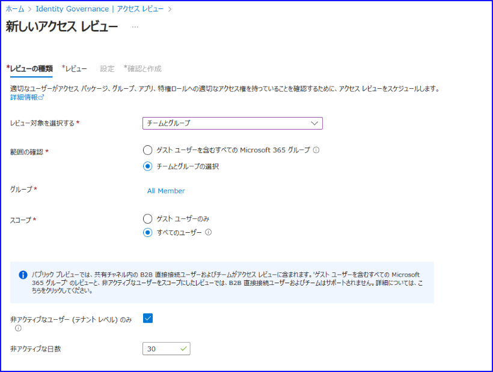
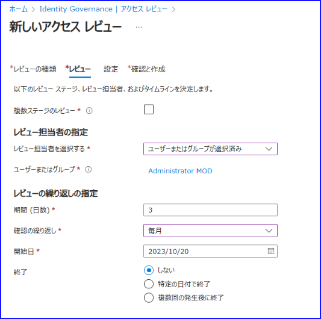
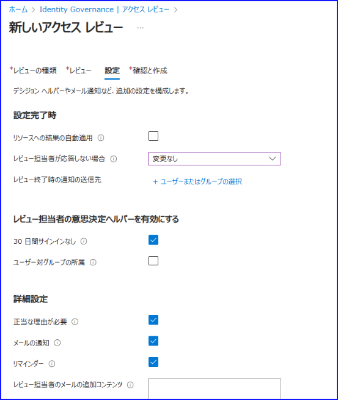
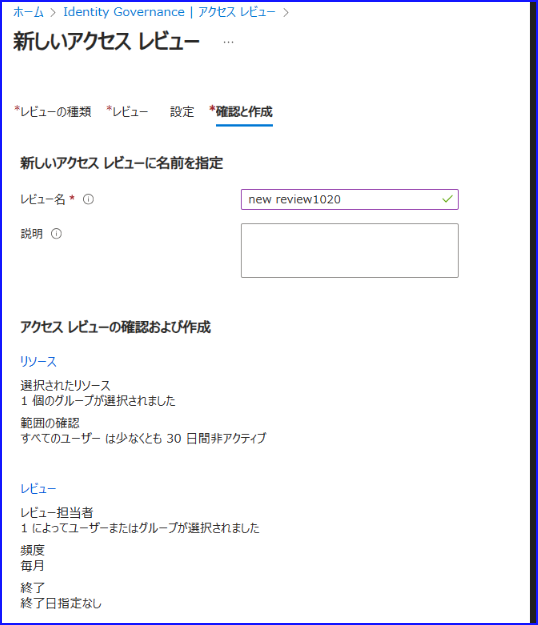
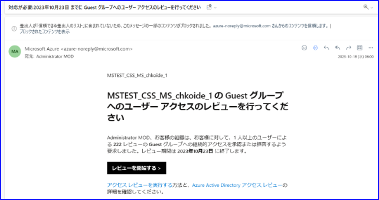
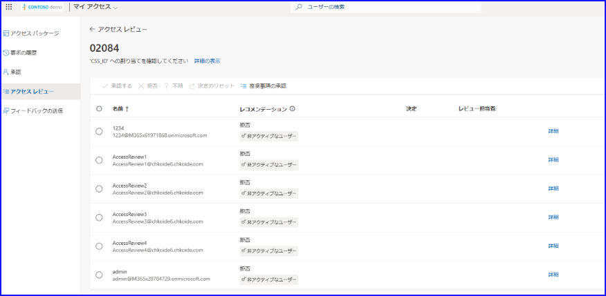
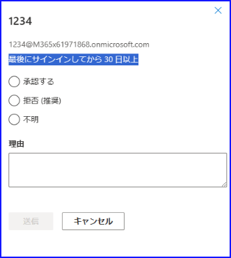
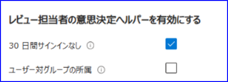

# Microsoft Entra ID Governance のアクセス レビューを用いて非アクティブなユーザーの棚卸をする方法

こんにちは！ Azure ID チームの小出です。

本記事は、2023 年 10 月 10 日に公開された [Step-by-Step Guide to Identify Inactive Users by using Microsoft Entra ID Governance Access Reviews](https://techcommunity.microsoft.com/t5/microsoft-entra-azure-ad-blog/step-by-step-guide-to-identify-inactive-users-by-using-microsoft/ba-p/3944705) をもとに、日本語に分かりやすくおまとめした記事となります。
ご不明点などございましたら、お気軽にサポートまでお問い合わせください。

---

まず、[CIS Control V8 Safe guard 5.3](https://www.cisecurity.org/controls/cis-controls-navigator) によると、利用されていないアカウントについては 45 日経過をもって削除するか無効化することが推奨されています。この推奨事項は、[Azure Security Benchmark v3 PA-4 Control](https://learn.microsoft.com/ja-jp/security/benchmark/azure/security-controls-v3-privileged-access#pa-4-review-and-reconcile-user-access-regularly) にも沿ったもので、ユーザー アクセスを定期的にレビューすることが推奨されています。以下の NIST の資料も併せてご参照ください。
 
[NIST SP 800-53 Revision 5 Moderate Baseline - AC-2(3) Control](https://nvlpubs.nist.gov/nistpubs/SpecialPublications/NIST.SP.800-53r5.pdf)
 
日本語では、以前ゲストの棚卸方法として [ゲスト ユーザーの棚卸をする方法](https://jpazureid.github.io/blog/azure-active-directory/GuestUser-Inventory/) を案内しておりますので、今回はゲストにかかわらず、アクセス レビューを利用して非アクティブなユーザーを抽出および検出する方法について案内いたします。また、以前は Azure ポータルでの手順を案内しておりますが、今回は新しく利用できるようになった Entra 管理センターを利用して設定を行います。

## Microsoft Entra 管理センターでのアクセス レビューの作成方法

1. Entra 管理センターを開き、[Identity Governance] 内のアクセス レビューをクリックします。新しいアクセス レビューをクリックし新規レビューの作成を開始します。

    

2. 下記のようにそれぞれ選択します。

    | 項目	| 設定 | 
    | :--- | :--- | 
    | レビュー対象を選択する | チームとグループ |
    | 範囲の確認 | チームとグループの選択 | 
    | グループ | レビュー対象にしたいグループを選択し指定してください | 
    | スコープ | すべてのユーザー | 
    | ★ 非アクティブなユーザー（テナント レベル）のみ | チェックをオンにします | 
    | ★  非アクティブな日数 | 既定は 30 日です | 

    ★  がついている項目を指定するためには、 Azure AD Premium P2 ライセンスでも不十分であり、Microsoft Entra ID Governance の購入が必要です。

    

3. レビュー担当者と頻度を決定します。設定は環境に応じて任意に実施いただければと存じますが、1 回きりのレビューではなく毎月や毎年などの継続レビューにすると、定期的にレビューを行えます。

    

4. レビューが完了した時の設定を指定します。こちらも設定は任意ですが、よく設定いただく項目としては、下記がございます。

    | 項目	| 設定 | 
    | :--- | ---: | 
    | リソースへの結果の自動適用 | チェックをオンにします | 
    | 30 日間サインインなし | チェックをオンにします | 

    

5. レビューに名前を付けて作成します。

    

6. レビュー担当者に下記のようなメールが届くので、リンクをクリックして開始します。

    

7. 下記画面にて、承認・拒否を決定してレビューを実施します。

    

    各ユーザーをクリックすると、推奨事項の詳細メッセージを確認することも可能です。

    
    
### 補足: 非アクティブなユーザーに関するライセンスについて

上記手順にて ★ がついている項目を指定するためには、 Azure AD Premium P2 ライセンスでは不足する旨を案内しました。こちらの設定を行う場合、Microsoft Entra ID Governance のライセンスを購入いただく必要があります。

この ★ がついているチェックをオンにすると、レビューの対象として画面に表示されるユーザーが、非アクティブなユーザーのみとなります。直近サインインのあるユーザーは、グループのメンバーでもレビューの対象とはなりません。

| 項目	| 設定 |
| :--- | :--- | 
| ★ 非アクティブなユーザー（テナント レベル）のみ | チェックをオンにします | 
| ★ 非アクティブな日数 | 既定は 30 日です | 

新しいライセンスを購入するのが難しい場合、レビューの対象者自体を絞り込むことはできませんが、代わりに下記設定を Azure AD Premium P2 にて利用可能です。そのため、下記チェックボックスをオンにし、推奨事項の項目を確認しながら、全ユーザーのレビューを実施いただけますと幸いです。

