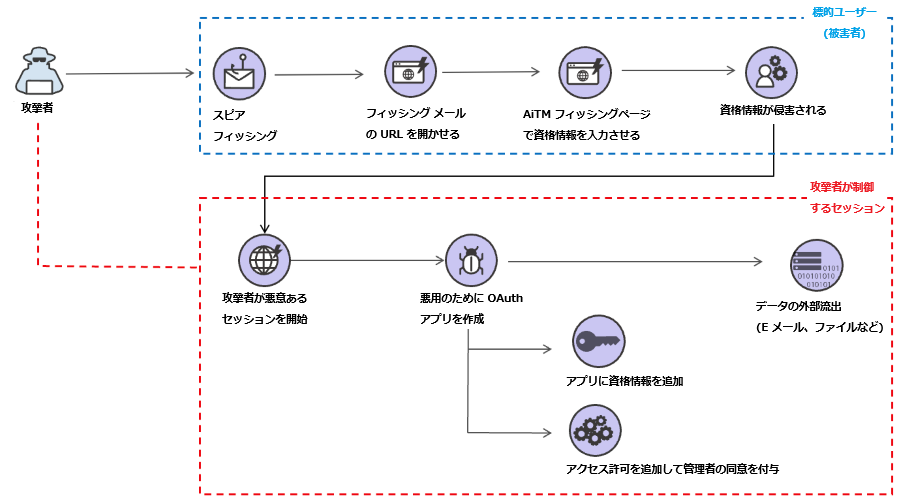
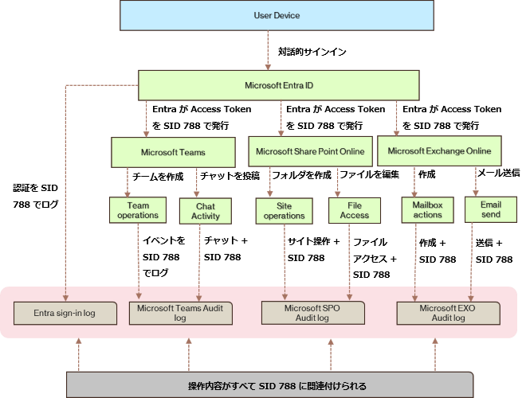
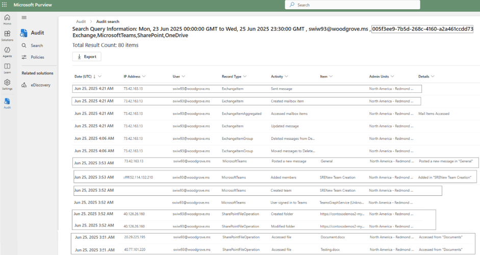
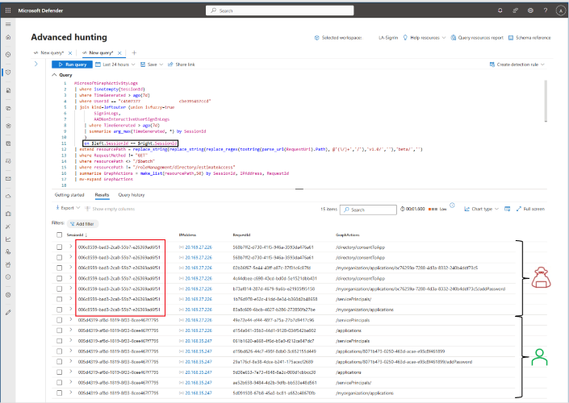

# 紐づけ可能なトークンの識別子を用いて ID にまつわる脅威の検出と対応を強化

## 紐づけ可能なトークン識別子の機能が一般提供となり様々な Microsoft 365 および Microsoft Graph ワークロードにわたってユーザー セッションを追跡して調査できるようになりました

本日、特定の認証イベントをもとに、ワークロード全体でユーザーのセッションを追跡できる紐づけ可能なトークン識別子の機能の一般提供を発表いたします。この機能により、インシデント対応と異常検知がより良く実現可能となり、リモート フィッシングやマルウェア攻撃などの脅威が軽減されることを期待しています。紐づけ可能なトークンの識別子は、以下で使用できるようになりました。

- Microsoft Entra サインイン ログ
- Microsoft Exchange Online 監査ログ
- Microsoft Graph アクティビティ ログ
- Microsoft Teams 監査ログ
- Microsoft SharePoint Online 監査ログ

Microsoft Security Research が調査した事例 (**図 A** を参照) では、攻撃者が [Adversary](https://jpazureid.github.io/blog/azure-active-directory/defeating-adversary-in-the-middle-phishing-attacks/) in the Middle (AiTM) の手法を使用して、フィッシング耐性のない認証方法を利用したユーザーから資格情報を盗みとっていました。攻撃者は資格情報を得た後に新しいセッションを開始し、Microsoft Graph へのアクセスを得ました。そのうえで、それ以降も攻撃を続けること、ならびにデータを流出させることを目的として Microsoft Graph でアプリケーションを作成しました。

これまで、ID に関わる攻撃の調査を行うセキュリティの担当チームでは、このような攻撃を追跡するために様々なレポートを組み合わせて分析するなどしていましたが、多くの場合、その精度は決して高くないものでした。この度、一意の紐づけ可能なトークン識別子を用いることで、侵害された資格情報を用いて開始された悪意のあるセッションをそれぞれ特定し、正規のセッションと区別できるようになりました。これにより、Microsoft Graph などのサービス全体で攻撃者の活動を正確に追跡できるようになり、分析を行う担当チームの調査と解決にかかる時間が短縮されることにつながります。

通常、見慣れないデバイスからの悪意のある活動はリモート フィッシング攻撃を示唆しますが、信頼できるデバイスからの不審な活動は、多くの場合ローカルでのマルウェア感染を示唆します。

ほとんどのアプリケーション ログは、デバイスまたはセッションの文脈を含まず、識別できるのはユーザー アカウントの情報のみです。紐づけ可能なトークン識別子の機能を用いると、デバイスのセッション情報を追加で考慮可能になり、デバイスの活動を推測するにあたり IP アドレスなどのノイズの多い情報に依存する必要がなくなります。侵害されたデバイスまたはセッションが特定できれば、セキュリティの運用チームがそのセッションの動きに特に着目して分析できるため、攻撃者の活動をより正確に判断できます。

## フロー図

以下の図では、紐づけ可能なトークン識別子が様々なログでどのように実装されているかをご覧いただけます。紐づけ可能なトークン識別子は、セッション ID というプロパティで実装されています。ここでは、ユーザーが認証し、そのあとに Microsoft 365 サービス全体で様々な活動を行っている (Teams での共同作業、SharePoint Online サイトへのアクセス、Exchange Online からのメールボックス データの取得など) 様子を示しています。

セッション ID は最初の認証処理で生成され、そのデバイスからアクセスされるワークロードで使用される後続のすべての認証トークンに埋め込まれます。これらのワークロードは、ユーザー ID とセッション ID の両方をログに記録しますので、ユーザーの活動と特定のセッションを正確に紐づけることが可能になります。

ユーザーのセッション ID を含んだ Entra サインイン ログの例を次に示します。セッション ID で 1 つセッションを選んだら、その特定のセッション ID ですべてのワークロードに対するアクティビティを追跡いただけます。

上記の Entra サインイン ログのセッション ID について、Teams、SharePoint Online、Exchange Online でのユーザーの行動に基づいて、ワークロード側の監査ログをフィルターした画面を次に示します。

攻撃は複雑で複数の領域を標的にすることが多く、ID に関する知見をセキュリティ チームと共有することは非常に重要です。Microsoft Defender XDR (以下) では、認証要求を Microsoft Graph の操作内容に紐づけられるようになっており、セキュリティの運用チームはセッション ID を使用して悪意のある行動を追跡できるようになりました。これにより、攻撃パターンを特定し、将来の脅威に対してカスタムの検出ロジックを作成することも可能になります。

その他の様々な使用シナリオや、紐づけ可能な識別子を調査や関連付けで活用するワークブックについては、[紐づけ可能な識別子](https://learn.microsoft.com/ja-jp/entra/identity/authentication/how-to-authentication-track-linkable-identifiers#linkable-identifiers-in-microsoft-teams-audit-logs) の公開ドキュメントを参照ください。

-- Eric Sachs

Contributor: Alex Kolmann, Senior Security Researcher, Microsoft
