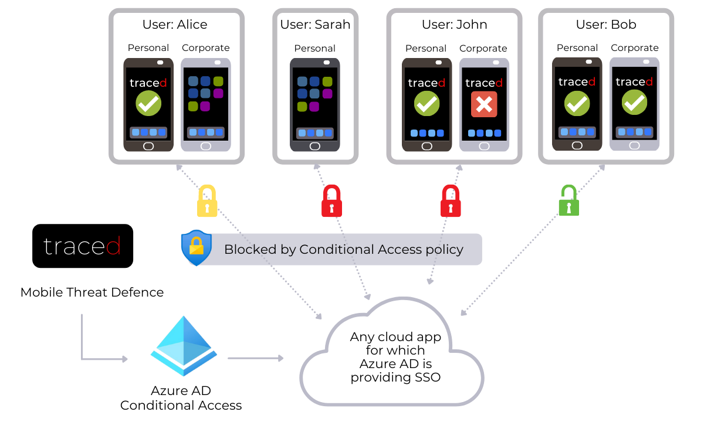
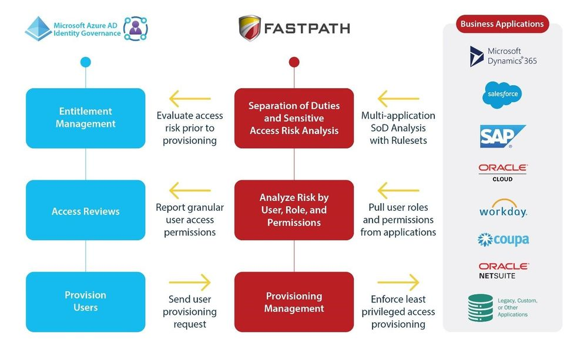
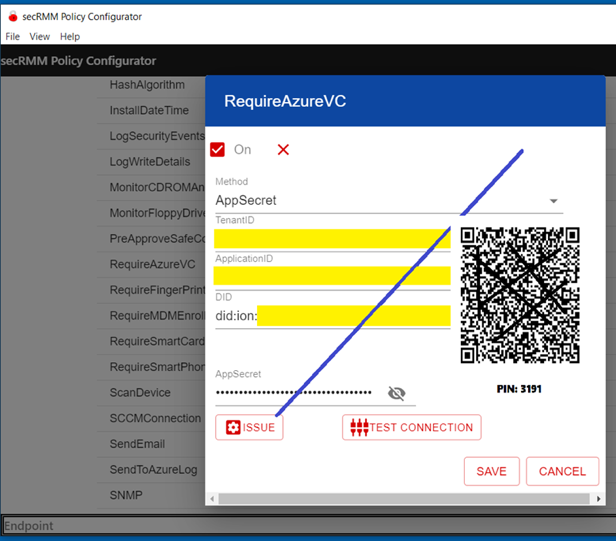

# 新たな Azure AD パートナーとの統合でセキュリティ体制を強化

こんにちは、Azure Identity サポート チームの 村上 です。

本記事は、2022 年 5 月 9 日に米国の Azure Active Directory Identity Blog で公開された [Strengthen your security posture with new Azure AD partner integrations](https://techcommunity.microsoft.com/t5/azure-active-directory-identity/strengthen-your-security-posture-with-new-azure-ad-partner/ba-p/2810642) を意訳したものになります。ご不明点等ございましたらサポート チームまでお問い合わせください。

---

本日は、新たな [Azure Active Directory](https://azure.microsoft.com/ja-jp/services/active-directory/) (Azure AD) 製品の統合ソリューションをご紹介します。これらのソリューションは、Azure AD の機能を活用することで、ID へのアクセス、ガバナンス、および認証を合理化し、企業全体にわたる [ゼロ トラスト](https://www.microsoft.com/ja-jp/sec（（urity/business/zero-trust) セキュリティを強化するのに役立ちます。以下では、パートナー各社が弊社チームと連携して取り組んできた最新の統合ソリューションをご紹介します。

## Traced は Azure AD と統合しモバイル脅威の防御を強化

2022 年には、自宅、ジム、空港、ホテル、ライド シェアなど、事実上どのような場所でも仕事ができるようになりました。社内ネットワークとは異なり境界のない環境も保護するために、Azure AD は、プライバシーに特化したモバイル脅威対策 (MTD) のプロバイダーである [Traced](https://traced.app/integration-with-azure-ad/) とシームレスに統合されるようになりました。Azure AD の条件付きアクセスを使ってゼロ トラスト セキュリティを実施することにより、Traced のお客様は、危険なデバイスや信頼されていないモバイル デバイスから、Microsoft 365 アプリや何千もの Azure AD ギャラリー アプリへのアクセスを自動的に制限することができるようになりました。

[Trustd MTD の統合](https://traced.app/trustd-mtd/) は、デバイスの状態を確認し、会社のリソースへのアクセスをユーザー レベルで制限します。つまり、デバイスが社内のセキュリティ運用部門 (Security Operation Center) によって認識または管理されていない場合でも、デバイスは保護された状態となります。このように Traced 社は、信頼できるモバイル デバイスにのみマイクロソフトのクラウド アプリケーションへのアクセスを提供し、ポリシーを強制する場所として機能します。また、Traced のディープ ラーニング エンジンにより、悪意のあるアプリを発見したり、分析と対応に重要な情報が得られたりなどします。この新しい Traced との統合により、お客様はコンプライアンスを達成し、ユーザーのモバイル デバイスから発生する脅威を軽減することができます。

## Saviynt は Azure AD と双方向でユーザー リスクを共有  

ID ガバナンスのプロバイダーである [Saviynt ](https://saviynt.com/) は、[Enterprise Identity Cloud (EIC)](https://saviynt.com/enterprise-identity-cloud/) と Azure AD の統合を拡大し、Azure AD P2 ライセンス利用者向けに双方向のユーザー リスク共有を提供するようになりました。マイクロソフトの顧客およびパートナーは、EIC にて Microsoft Graph API を使用して、サインイン リスクやユーザー リンク検出など、Azure AD Identity Protection から取得したユーザー リスクを検証するガバナンス ワークフローを構築できるようになりました。 

Saviynt 社の EIC と Azure AD Identity Protection の統合により、ID 主導の信頼の数値化が自動化に行えるようになり、お客様では以下のことが可能になります。 
 
- プラットフォームとアプリケーションにまたがるリスクの高い ID の確認
- Azure AD Identity Protection と Saviynt 社の EIC プラットフォームから、ID と資産のリスク シグナルを集約
- 管理者と資産の所有者が迷うことなくアクセス要求を承認または拒否可能に
- リスクの高い ID を継続的に監視し、アクセス漏れを防止してリスクにさらされる可能性を低減
- ID の継続的なアクセス レビューにより、不正アクセスを排除し、リスク ベースのセキュリティ ポリシーを適用

また、Saviynt 社は、EIC およびクラウド特権アクセス管理 (PAM) ソリューションを通じて Saviynt 社が判断したリスクに基づいて、Azure AD でユーザーを高リスクとしてフラグ付けすることができます。こうすることで、お客様は [ユーザー リスク ベース](https://docs.microsoft.com/ja-jp/azure/active-directory/conditional-access/howto-conditional-access-policy-risk-user) および [サインイン リスク ベース](https://docs.microsoft.com/ja-jp/azure/active-directory/conditional-access/howto-conditional-access-policy-risk) の条件付きアクセスで保護しながら、リスクの高いユーザー アクセスをブロックしたり、追加アクションを実行することができます。

## Fastpath はユーザー アクセス解析と Azure AD Identity Governance を統合  

脅威が常に外部からやってくるわけではないことは、システム管理者やセキュリティ専門家の間ではよく知られています。多くの場合、金融詐欺は、財務、ERP (Enterprise Resource Planning)、およびその他のビジネス アプリケーション内で不適切なアクセスを持つ組織内の個人によって実行されます。監査法人や規制機関からも、過剰なアクセスによるリスクはますます厳しく問われるようになっています。

マイクロソフトは、ビジネス アプリにおいて既存のアクセス権を持つユーザーによるリスクなど、こうした内部の脅威から組織を保護するために、[Fastpath](https://www.gofastpath.com/) と提携しました。Fastpath は、Microsoft Dynamics 365、Salesforce、SAP、Zuora、Intacct、Acumatica、Peoplesoft など、多くのビジネス アプリケーションにおけるユーザー アクセスと職務分離 ([SOD](https://techcommunity.microsoft.com/t5/azure-active-directory-identity/ensure-compliance-using-separation-of-duties-checks-in-access/ba-p/2466939)) リスクの追跡、レビュー、承認、軽減を支援するクラウド型のリスクおよびコンプライアンス管理プラットフォームです。
 
Fastpath は、これらの業務アプリと連携する同社の Access Risk Monitor を、Microsoft Graph API を通じて [Azure AD Identity Governance](https://docs.microsoft.com/ja-jp/azure/active-directory/governance/identity-governance-overview) とも連携させています。これにより、Azure AD の顧客は、[Azure AD と Fastpath を使用して](https://www.gofastpath.com/blog/fastpath-integrates-with-azure-ad-identity-governance-for-improved-security)、ユーザーがプロビジョニングされる前にアクセス上のリスクを特定し解決することができるようになります。Fastpath は、Azure AD [エンタイトルメント管理](https://docs.microsoft.com/ja-jp/azure/active-directory/governance/entitlement-management-overview) のアクセス パッケージに関連するアプリケーションを分析し、それらのアプリケーション内の職務分離やその他のアクセス違反の可能性を特定します。 

さらに、Azure AD エンタイトルメント管理を使用すると、ユーザーが不適切なアクセスを持っているかどうか、または職務分離の競合を解決するために是正措置を講じる必要があるかどうかを確認することができます。このような精査により、管理者は、ユーザーが職務を遂行するために必要な最小限のアクセスのみを許可するよう保証することができます。Azure AD と Fastpath 社の統合は、自動プロビジョニング ワークフローやアクセス レビュー、アクセス認証においてきめ細かなアクセス レポートを確認するため、幅広いエンタープライズのセキュリティを実現するうえで重要な役割を果たすことになります。

## Squadra Technologies、Thales、HID Global、Yubico との統合により認証を強化 

[Squadra Technologies](https://www.squadratechnologies.com/) の新しい [Security Removable Media Manager (secRMM)](https://azuremarketplace.microsoft.com/en-us/marketplace/apps/SquadraTechnologies.SquadrasecRMMOMSsolution?tab=Overview) は、USB メモリなどのリムーバブル ストレージ デバイスの安全な認証を可能にします。誰かが USB メモリなどのリムーバブル ストレージ デバイスを差し込むと、Squandra の secRMM が、その人のデジタル ウォレットとして機能する [Microsoft Authenticator](https://www.microsoft.com/ja-jp/security/mobile-authenticator-app) を使用して QR コードをスキャンするよう促します。その後、Squadra の secRMM は、デバイスのプロパティ、ユーザー、ファイル、プログラムに基づいて、外部ストレージ メディアへの書き込みの承認、または書き込み権限を有効にします。 

最近リリースされた [Azure AD の証明書ベース認証 (CBA)](https://docs.microsoft.com/ja-jp/azure/active-directory/authentication/concept-certificate-based-authentication) により、組織は認証に [Thales IDPrime スマート カード](https://cpl.thalesgroup.com/access-management/idprime-md-pki-smart-cards) と USB トークン、[SafeNet Authentication Client（SAC）](https://cpl.thalesgroup.com/access-management/security-applications/authentication-client-token-management) を使用できるようになりました。また、スマート カード/トークンや証明書のライフサイクル管理には、Thales 社の資格情報管理システムである [vSEC](https://cpl.thalesgroup.com/access-management/vsec-cms-secure-device-management) を使用することもできます。
 
HID Global 社は、[Crescendo® スマート カード](https://www.hidglobal.com/products/cards-and-credentials/crescendo) とセキュリティ キーを使用して、Azure AD の証明書ベースの認証 (CBA) をお客様に提供しています。Azure AD CBA の統合により、HID 社の [WorkforceID™ Digital Credential Manager](https://www.hidglobal.com/solutions/identity-access-management/physical-identity-access-management/workforceid-digital-credential-manager) による資格情報の一元管理が可能となり、ユーザー体験と保護強化のバランスを取りながらセキュリティに対して包括的なアプローチが取れるようになります。

Yubico 社は、連邦政府が従業員、サプライヤー、パートナーに対してフィッシング耐性のある認証を導入することを求める大統領令 14028 と [国家安全保障指令 8](https://www.whitehouse.gov/briefing-room/presidential-actions/2022/01/19/memorandum-on-improving-the-cybersecurity-of-national-security-department-of-defense-and-intelligence-community-systems/) をサポートするために Azure AD を採用し、同社の [YubiKey](https://www.youtube.com/watch?v=QNwihkspJS0) でクラウド ネイティブ認証を提供を開始しました。YubiKey を用いれば、BYOD (Bring-Your-Own-Device)、在宅勤務、フロント ワーカーなど、どこからでも指一本で安全にログインすることができます。 

## Ultimate Kronos Group (UKG) から Azure AD へ従業員データを自動的にプロビジョニング

[UKG Pro](https://marketplace.ukg.com/en-US/apps/368607/ukg-pro-for-microsoft-azure-active-directory/resources) のお客様は、Azure AD による従業員データのプロビジョニングと管理を自動化できるようになりました。Microsoft Graph を利用した新しいユーザー プロビジョニング機能により、業務ワークフローと人事ワークフローとの間で、よりスムーズな従業員体験を構築できるようになりました。UKG Pro のユーザーは、以下のことが可能になります。

- Azure AD で UKG Pro にアクセスできる人を制御
- ユーザーが Azure AD アカウントで UKG Pro に自動的にサインイン
- Azure ポータルで一元的にアカウントを管理

UKG Pro と Azure AD 統合の詳細については [こちら](https://www.youtube.com/watch?v=cu_HvXts-BQ&feature=youtu.be) をご覧ください。

## 新しい Azure AD アプリケーション ギャラリーの統合  

[Azure AD アプリ ギャラリー](https://www.youtube.com/watch?v=MHXm6Jwozm0) は、[シングル サインオン (SSO)](https://www.youtube.com/watch?v=7SU5S0WtNNk) と [自動化されたユーザー プロビジョニング](https://www.youtube.com/watch?v=k2_fk7BY8Ow) を簡単に導入・設定することができる何千ものアプリのカタログです。このほど、アプリ ギャラリーに以下が追加されました。

## 今後の展開 

Azure AD は、リソースへのアクセスを保護し、すべての ID を一元的に管理することで、ユーザーの生産性を維持するとともに、スムーズなユーザー体験を提供します。私たちは、常にお客様の声に耳を傾け、パートナーと協力して、お客様のニーズを満たす新しい統合を作成しています。今後数ヶ月の間に、弊社の ID ソリューションの可能性をさらに広げるような情報を紹介予定です。
