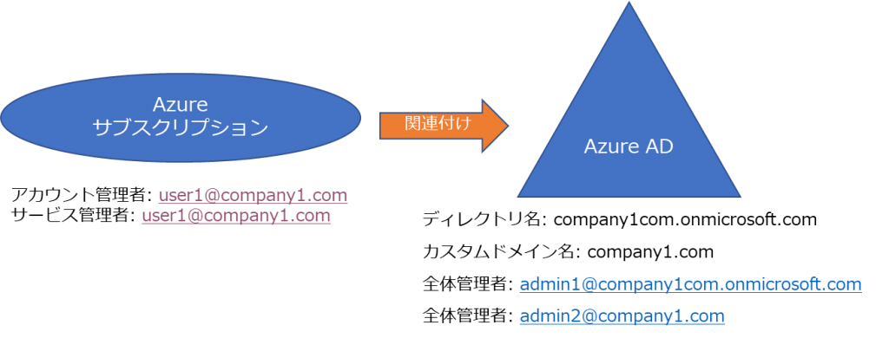
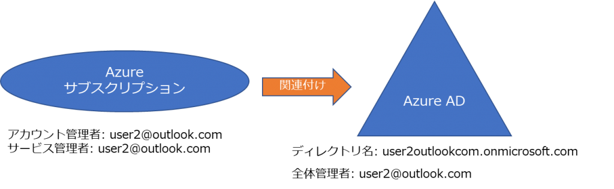

> 本記事は Technet Blog の更新停止に伴い https://blogs.technet.microsoft.com/jpazureid/2017/11/04/azure-subscription-azuread-admin/ の内容を移行したものです。
> 元の記事の最新の更新情報については、本内容をご参照ください。

# Azure サブスクリプションと Azure AD の管理者

こんにちは、 Azure ID サポートチームの三浦です。

今回は混乱することが多い Azure のサブスクリプションと Azure Active Directory (Azure AD) の関係、それぞれの管理者について紹介します。

## Azure サブスクリプションと Azure AD の関係

まず、 Azure サブスクリプションと Azure AD の関係ですが、 Azure のサブスクリプションに Azure AD が含まれているというイメージを持たれている方もいるかもしれませんが、以下の図のようなイメージは間違いです。

正しくは Azure サブスクリプションと Azure AD には包含関係は無く、独立しています。Azure サブスクリプションは必ず 1 つの Azure AD に関連付けられています (*注1) ので、両者の関係性は次のような図になります。

上の図では 2 つのサブスクリプションが Office 365 を利用中の同一の Azure AD に関連づけられている例です。この例では Office 365 で利用しているアカウント情報を Azure のサブスクリプションも参照し、サブスクリプションへのアクセス権限の付与などにもそのまま利用します。

> 注 1: 関連付けのことを “信頼しています” という表現を使用する場合もあります。この関連付けを変更するためには、サブスクリプションのアカウント管理者を別の Azure AD のユーザーに譲渡する作業、もしくはディレクトリの切り替えの作業が必要です。Azure AD に関連づけられた Azure のサブスクリプションは 1 つの場合もありますし、3 つ以上の場合もあります。また、 Office 365 を利用中の Azure AD に関連付けることもできれば、そうではないケースもあります。

1 つの Azure サブスクリプションが複数の Azure AD を指定することはできません。Azure サブスクリプションが参照する Azure AD は必ず 1 つです。

## Azure サブスクリプションの管理者

Azure サブスクリプションの管理者については Microsoft Azure の各種アカウント権限について にそれぞれ説明があります。少し補足すると Azure クラシック ポータル時代にはアカウント管理者、サービス管理者、共同管理者という 3 つの役割しかありませんでした。

現在の Azure 新ポータルでも、それぞれの管理者は有効ですが、それに加えてサブスクリプション単位ではなく、リソース毎に閲覧、あるいは編集が可能なユーザーを柔軟に設定できる仕組み (RBAC = Role Based Access Control ロールベースのアクセス制御 *注2) が設定できます。サブスクリプションに対して所有者というロールを割り当てれば、従来のクラシック ポータルでの共同管理者相当になります。この RBAC の設定では Azure サブスクリプションが関連付けられた Azure AD のアカウント情報が利用されます。

> 注 2: Azure ポータルで RBAC の設定を行う場合には Access Control (IAM) からおこないます。 IAM は Identity and Access Management の略です。

## Azure AD の管理者

Azure AD でも Azure サブスクリプションの場合と同様に様々な役割があり、その詳細は Azure Active Directory での管理者ロールの割り当て で確認できます。代表的なものとして全体管理者 (Global Administrator) がありますが、この役割をもつアカウントは Azure AD のディレクトリに対してすべての権限を持ちます。

なお、各 Azure AD ディレクトリ (テナント) は独立していますので、ある Azure AD で全体管理者になっていても別の Azure AD の全体管理者になるわけではありません。例えば company1com.onmicrosoft.com という Azure AD ディレクトリの全体管理者は company2com.onmicrosoft.com の全体管理者ではありません。ただ、 B2B の機能で company2com.onmicrosoft.com から招待を受け、更にこのディレクトリの全体管理者の権限の付与を受けることは可能です。

## Azure サブスクリプションの管理者と Azure AD の管理者

Azure サブスクリプションと Azure AD はそれぞれ独立したものです。

管理者についてもそれぞれ独立していますので Azure サブスクリプションの管理者であっても Azure AD の全体管理者でなければ、 Azure AD の管理 (ユーザー追加、削除など) はできません。同様に Azure AD の全体管理者であっても、必ずしも紐づく Azure サブスクリプションの管理者ではありません。

例えば次のような関係を考えてみましょう。

company1 という会社ではすでに Azure AD を保持しており、その Azure AD のディレクトリ名は company1com.onmicrosoft.com です。この Azure AD にはカスタムドメインとして company1.com というドメイン名が紐づけられています (*注3)。以下の図では user1@company1.com というアカウントが Azure のサブスクリプションを作成した状態での関係を示しています。

user1@company1.com というアカウントは Azure のサブスクリプションのアカウント管理者でありサービス管理者です。そのため、サブスクリプション内のすべての権限を持ちます。例えばこのサブスクリプション内で仮想マシンを作成したり、仮想ネットワークを設定したりすることができます。しかし、関連づけられている Azure AD に対しては user1 は管理者権限を持ちません。Azure AD に対して管理者権限を必要とする作業を実施する場合には admin1@company1com.onmicrosoft.com または admin2@company1.com という全体管理者に、作業を依頼するか、あるいは自身に Azure AD の権限を与えてくれるように依頼する必要があります。

別のパターンを考えてみます。

ここでは Microsoft アカウントの user2@outlook.com を指定して Azure サブスクリプションを作成しています。この例の outlook.com のように企業に紐づかない Microsoft アカウントを利用して Azure サブスクリプションを作成した場合など、サブスクリプション作成時に利用したアカウントが所属する Azure AD が無い場合には、新規で Azure AD ディレクトリが自動的に作成されます。この場合、特に役割の追加作業をしていなくても Azure サブスクリプションのアカウント管理者 = Azure AD の全体管理者になります。

この場合でも以下のようにサブスクリプションに別のアカウント user3@outlook.com を所有者として追加した場合には、このアカウントは Azure AD の管理者ではありませんので、もしそのアカウントにも権限を付与したいのであれば user2@outlook.com が、 user3@outlook.com を全体管理者にする作業が必要です。

> 注 3: Azure AD では必ず設定される xxxxx.onmicrosoft.com というドメイン名に加えてカスタムドメイン名を追加することができます。カスタムドメイン名を追加するためには、そのドメインに対して権限を持っている (ドメインのゾーンをインターネットで名前解決でき、そのゾーンを管理している) 必要があります。詳しくはこちらのサイトを参照ください。

## おわりに

今回は混乱しやすい Azure サブスクリプションと Azure AD の関係についてご紹介しました。いろいろな管理者が存在していますが、その管理者が Azure サブスクリプションの管理者なのか Azure AD の管理者なのかということを意識するとわかりやすくなると思います。

文中でも一部触れていますが、参考となる公開情報を紹介しまして、今回は以上とします。

Microsoft Azure の各種アカウント権限について  
https://blogs.msdn.microsoft.com/dsazurejp/2013/10/02/303/

Azure サブスクリプションを Azure Active Directory に関連付ける方法  
https://docs.microsoft.com/ja-jp/azure/active-directory/active-directory-how-subscriptions-associated-directory

Azure Active Directory での管理者ロールの割り当て  
https://docs.microsoft.com/ja-jp/azure/active-directory/active-directory-assign-admin-roles-azure-portal

クイック スタート: カスタム ドメイン名を Azure Active Directory に追加する  
https://docs.microsoft.com/ja-jp/azure/active-directory/add-custom-domain