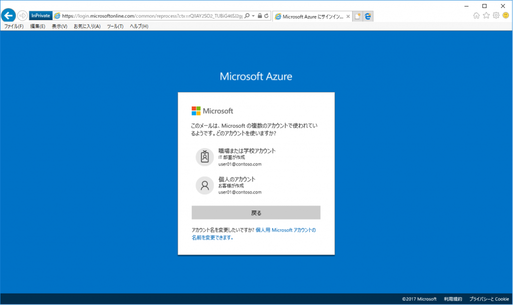
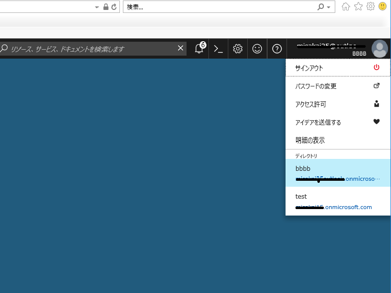

> 本記事は Technet Blog の更新停止に伴い https://blogs.technet.microsoft.com/jpazureid/2017/11/21/subscription-azuread/ の内容を移行したものです。
> 元の記事の最新の更新情報については、本内容をご参照ください。

# サブスクリプションが見えない

こんにちは、Azure & Identity サポート チームの坂井です。

今回は サブスクリプションの管理者権限を持っているユーザーにも関わらず、Azure ポータル 上でサブスクリプションやリソースが見えない場合の確認ポイントについて説明します。

確認ポイントとしては、2 点あります。

- サブスクリプションの権限を付与したユーザーでログインしていない
- サブスクリプションが紐づいている、Azure AD を選択していない

## **サブスクリプションの権限を付与したユーザーでログインしていない**

ユーザーによっては、同じユーザー名で「Microsoft アカウント」と「職場または学校アカウント」の両方に登録されています。

これは会社で利用しているアカウントを Microsoft アカウントとして登録しているケースが当てはまります。(* 現在は新規で職場または学校アカウントとして登録されているアカウントを Microsoft アカウントとしても登録することはできなくなっています。詳しくは[リンク](https://blogs.technet.microsoft.com/mssvrpmj/2016/09/30/azuread-%E3%81%A8-microsoft-%E3%82%A2%E3%82%AB%E3%82%A6%E3%83%B3%E3%83%88%E3%81%AE%E9%87%8D%E8%A4%87%E5%95%8F%E9%A1%8C%E3%81%AB%E5%AF%BE%E3%81%99%E3%82%8B%E5%8F%96%E3%82%8A%E7%B5%84%E3%81%BF/)を参照ください)

同じユーザー名であっても Microsoft アカウントと職場または学校アカウントは別物で、サブスクリプションの権限が割り当たっているユーザーもどちらかの種類のユーザーになります。

例えば、Azure AD に職場または学校アカウントの user01@contoso.com が登録されている状況でそのユーザーにサブスクリプションの権限を付与した場合、下記のように Microsoft アカウントは同じユーザー名であるもののサブスクリプションの権限を所有していないことになります。

よって、Azure ポータル にログインする際に下記のように、2 種類のアカウントが表示される場合には、サブスクリプションの権限を割り当てた種類のアカウントを選択してログインする必要があります。

## **サブスクリプションが紐づいている、Azure AD を選択していない**

サブスクリプション は必ず 1 つの Azure AD に関連付けられます。そのため、サブスクリプションが見えるようになる条件として、そのサブスクリプションが関連付いている Azure AD に所属している必要があります。

また、それと同時に Azure ポータルログイン後に適切な Azure AD を選択している必要があります。B2B の機能などを利用して、複数の Azure AD に所属しているユーザーについては、Azure ポータル 上で Azure AD の切り替え操作が行うことが可能です。(Azure ポータルにログイン後、右上のユーザー名の表示されるところをクリックすると、複数の Azure AD に所属している場合は下記のように表示されます。)

## まとめ

繰り返しになりますが、 Azure ポータルにサインインしたときに Azure サブスクリプションを利用することができないというときには以下の 2 点についてまず確認しましょう。

- サインイン時に適切なアカウントを選択しているか: Azure ポータルサインイン時に、「個人のアカウント」または 「職場または学校アカウント」の選択肢が表示される場合は、サブスクリプションの権限を付与したアカウントでサインインする必要があります。

- 適切な Azure AD を選択しているか: Azure ポータルサインイン後、サブスクリプションが関連付いている、Azure AD を選択する必要があります。

上記内容が少しでも皆様の参考となりますと幸いです。
